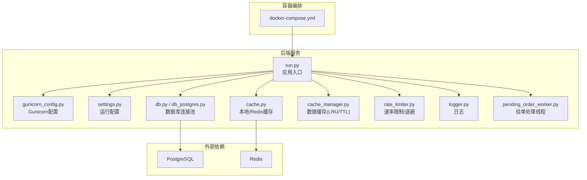
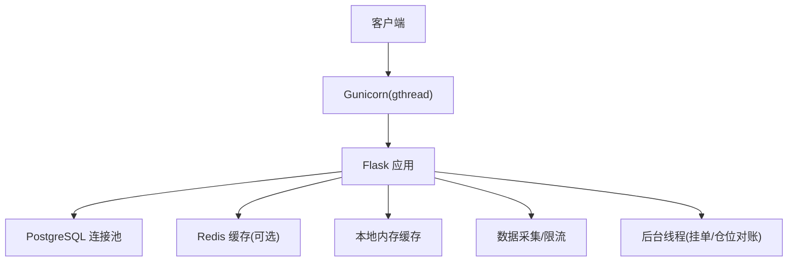
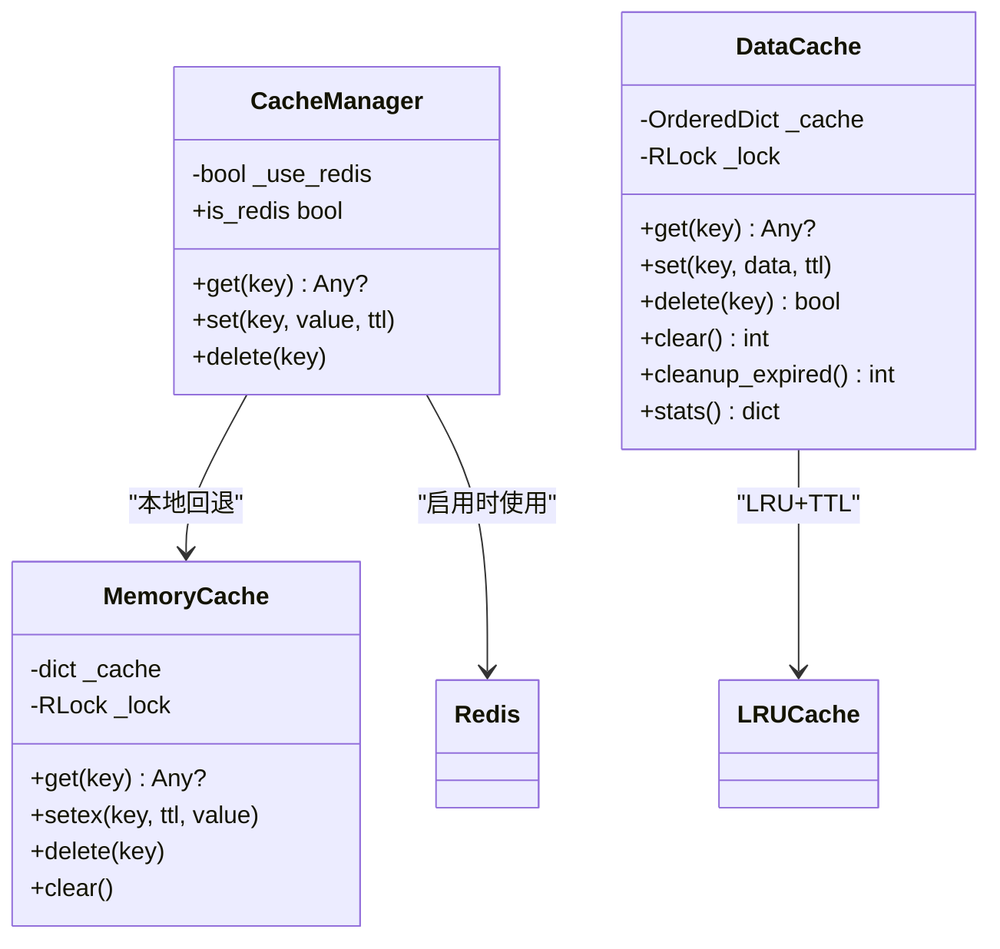
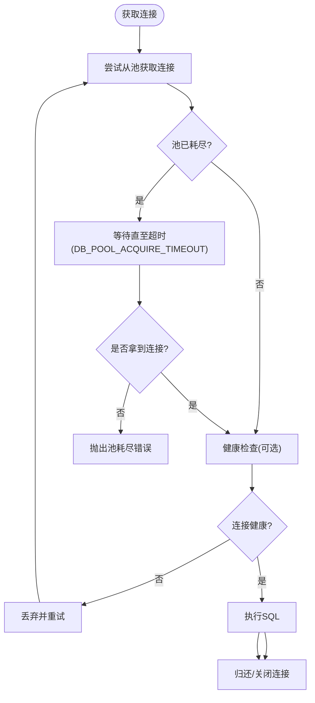
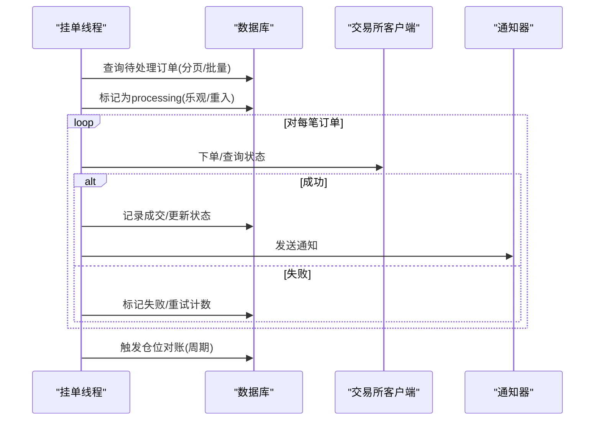
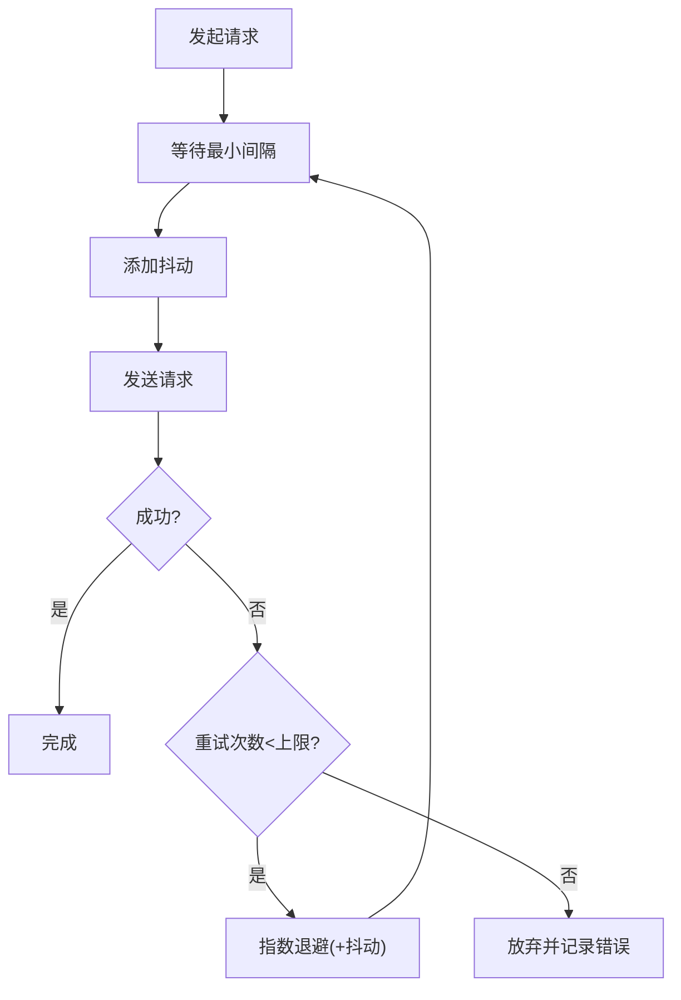
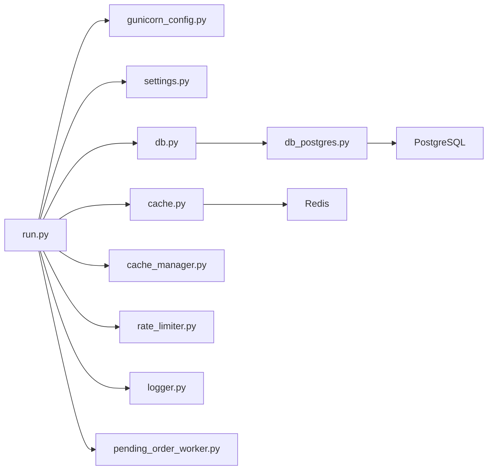

# 性能优化策略

<cite>
**本文引用的文件**
- [run.py](file://backend_api_python/run.py)
- [gunicorn_config.py](file://backend_api_python/gunicorn_config.py)
- [cache.py](file://backend_api_python/app/utils/cache.py)
- [cache_manager.py](file://backend_api_python/app/data_sources/cache_manager.py)
- [rate_limiter.py](file://backend_api_python/app/data_sources/rate_limiter.py)
- [db.py](file://backend_api_python/app/utils/db.py)
- [db_postgres.py](file://backend_api_python/app/utils/db_postgres.py)
- [settings.py](file://backend_api_python/app/config/settings.py)
- [database.py](file://backend_api_python/app/config/database.py)
- [logger.py](file://backend_api_python/app/utils/logger.py)
- [docker-compose.yml](file://docker-compose.yml)
- [pending_order_worker.py](file://backend_api_python/app/services/pending_order_worker.py)
</cite>

## 目录
1. [简介](#简介)
2. [项目结构](#项目结构)
3. [核心组件](#核心组件)
4. [架构总览](#架构总览)
5. [详细组件分析](#详细组件分析)
6. [依赖分析](#依赖分析)
7. [性能考量](#性能考量)
8. [故障排查指南](#故障排查指南)
9. [结论](#结论)
10. [附录](#附录)

## 简介
本文件面向QuantDinger后端的性能优化，系统化梳理性能瓶颈识别方法、缓存与数据库优化、并发与异步处理、负载均衡、监控与告警、以及大规模部署的资源调度与成本控制策略。文档以仓库现有实现为基础，结合可扩展的最佳实践，帮助读者在保障稳定性的同时提升吞吐与响应质量。

## 项目结构
后端采用Python/Flask + Gunicorn部署模型，配合PostgreSQL连接池与可选Redis缓存层；数据采集侧通过速率限制与指数退避增强抗封禁能力；后台任务通过线程池与轮询实现低耦合的异步执行。

图示来源
- [docker-compose.yml:1-172](file://docker-compose.yml#L1-L172)
- [run.py:1-134](file://backend_api_python/run.py#L1-L134)
- [gunicorn_config.py:1-36](file://backend_api_python/gunicorn_config.py#L1-L36)
- [settings.py:1-99](file://backend_api_python/app/config/settings.py#L1-L99)
- [db.py:1-66](file://backend_api_python/app/utils/db.py#L1-L66)
- [db_postgres.py:1-508](file://backend_api_python/app/utils/db_postgres.py#L1-L508)
- [cache.py:1-129](file://backend_api_python/app/utils/cache.py#L1-L129)
- [cache_manager.py:1-233](file://backend_api_python/app/data_sources/cache_manager.py#L1-L233)
- [rate_limiter.py:1-273](file://backend_api_python/app/data_sources/rate_limiter.py#L1-L273)
- [logger.py:1-63](file://backend_api_python/app/utils/logger.py#L1-L63)
- [pending_order_worker.py:1-800](file://backend_api_python/app/services/pending_order_worker.py#L1-L800)

章节来源
- [docker-compose.yml:1-172](file://docker-compose.yml#L1-L172)
- [run.py:1-134](file://backend_api_python/run.py#L1-L134)

## 核心组件
- 应用入口与启动：负责加载环境变量、代理设置、安全密钥校验，并启动Gunicorn或开发服务器。
- 并发与线程：Gunicorn使用gthread工作模式，单进程内多线程处理I/O密集型请求；后台线程在每个worker进程中独立启动。
- 数据库连接池：PostgreSQL连接池支持最小/最大连接数、获取超时、健康检查等参数，避免“连接池耗尽”。
- 缓存层：本地内存缓存作为默认，Redis仅在显式启用时使用；另有针对市场数据的LRU+TTL缓存。
- 速率限制与退避：针对不同上游数据源提供限流器与指数退避，降低封禁风险。
- 日志与可观测性：统一日志格式与文件滚动，过滤噪声日志，便于定位问题。
- 异步任务：挂单处理线程周期拉取并批量处理订单，支持位置对账与自动停止策略。

章节来源
- [run.py:104-134](file://backend_api_python/run.py#L104-L134)
- [gunicorn_config.py:10-36](file://backend_api_python/gunicorn_config.py#L10-L36)
- [db_postgres.py:107-161](file://backend_api_python/app/utils/db_postgres.py#L107-L161)
- [cache.py:49-129](file://backend_api_python/app/utils/cache.py#L49-L129)
- [cache_manager.py:44-175](file://backend_api_python/app/data_sources/cache_manager.py#L44-L175)
- [rate_limiter.py:109-231](file://backend_api_python/app/data_sources/rate_limiter.py#L109-L231)
- [logger.py:9-48](file://backend_api_python/app/utils/logger.py#L9-L48)
- [pending_order_worker.py:52-98](file://backend_api_python/app/services/pending_order_worker.py#L52-L98)

## 架构总览
后端通过Gunicorn承载请求，数据库连接池统一管理连接，缓存层在本地与Redis间切换；数据采集遵循速率限制与退避策略；后台线程负责挂单与仓位对账，确保交易一致性。

图示来源
- [gunicorn_config.py:10-36](file://backend_api_python/gunicorn_config.py#L10-L36)
- [db_postgres.py:107-161](file://backend_api_python/app/utils/db_postgres.py#L107-L161)
- [cache.py:71-98](file://backend_api_python/app/utils/cache.py#L71-L98)
- [rate_limiter.py:109-164](file://backend_api_python/app/data_sources/rate_limiter.py#L109-L164)
- [pending_order_worker.py:52-98](file://backend_api_python/app/services/pending_order_worker.py#L52-L98)

## 详细组件分析

### 缓存策略
- 本地优先：默认使用内存缓存，避免跨网络开销；当启用缓存且Redis可用时，自动降级为Redis。
- 数据缓存：针对实时行情、K线、股票信息分别设置TTL与容量上限，采用LRU淘汰策略，线程安全。
- 缓存统计：提供命中/未命中统计与命中率计算，便于评估缓存效果。

图示来源
- [cache.py:49-129](file://backend_api_python/app/utils/cache.py#L49-L129)
- [cache_manager.py:44-175](file://backend_api_python/app/data_sources/cache_manager.py#L44-L175)

章节来源
- [cache.py:17-47](file://backend_api_python/app/utils/cache.py#L17-L47)
- [cache_manager.py:27-42](file://backend_api_python/app/data_sources/cache_manager.py#L27-L42)
- [cache_manager.py:160-174](file://backend_api_python/app/data_sources/cache_manager.py#L160-L174)

### 数据库查询优化与连接池
- 连接池参数：最小/最大连接数、获取超时、健康检查可调，默认满足约50并发场景。
- 获取策略：当池耗尽时等待至超时，期间进行轻量健康检查，避免立即失败。
- SQL兼容：占位符转换与INSERT兼容逻辑，减少迁移成本。
- 关闭策略：请求结束归还连接，异常时丢弃断连，防止污染池。

图示来源
- [db_postgres.py:184-234](file://backend_api_python/app/utils/db_postgres.py#L184-L234)
- [db_postgres.py:415-451](file://backend_api_python/app/utils/db_postgres.py#L415-L451)

章节来源
- [db_postgres.py:53-56](file://backend_api_python/app/utils/db_postgres.py#L53-L56)
- [db_postgres.py:107-161](file://backend_api_python/app/utils/db_postgres.py#L107-L161)
- [db.py:19-31](file://backend_api_python/app/utils/db.py#L19-L31)

### 并发处理与异步任务
- Gunicorn并发：单进程多线程（gthread），适合I/O密集型；可通过环境变量调整worker数量与线程数。
- 后台线程：挂单处理线程周期拉取并批量处理订单，支持位置对账与自动停止策略，避免重复执行。
- 线程安全：缓存与数据库操作均采用锁保护，避免竞态。

图示来源
- [pending_order_worker.py:99-122](file://backend_api_python/app/services/pending_order_worker.py#L99-L122)
- [pending_order_worker.py:752-799](file://backend_api_python/app/services/pending_order_worker.py#L752-L799)

章节来源
- [gunicorn_config.py:14-28](file://backend_api_python/gunicorn_config.py#L14-L28)
- [pending_order_worker.py:52-98](file://backend_api_python/app/services/pending_order_worker.py#L52-L98)

### 速率限制与退避（数据采集）
- 随机抖动与最小间隔：保证请求间隔不小于设定值，并引入抖动降低被检测概率。
- 指数退避：失败重试按指数增长延迟，上限保护，避免雪崩。
- 按源限流：为不同上游提供专用限流器，兼顾效率与合规。

图示来源
- [rate_limiter.py:135-159](file://backend_api_python/app/data_sources/rate_limiter.py#L135-L159)
- [rate_limiter.py:194-231](file://backend_api_python/app/data_sources/rate_limiter.py#L194-L231)

章节来源
- [rate_limiter.py:28-47](file://backend_api_python/app/data_sources/rate_limiter.py#L28-L47)
- [rate_limiter.py:238-257](file://backend_api_python/app/data_sources/rate_limiter.py#L238-L257)

### 内存管理与日志
- 日志级别与过滤：减少噪声日志输出，保留关键模块的详细日志，便于定位问题。
- 文件滚动：按大小滚动，避免磁盘占用过大。
- 启动时安全检查：生产环境强制更换默认密钥，避免安全漏洞。

章节来源
- [logger.py:9-48](file://backend_api_python/app/utils/logger.py#L9-L48)
- [run.py:109-120](file://backend_api_python/run.py#L109-L120)

## 依赖分析
- 组件耦合：缓存与数据库模块解耦于业务路由；速率限制独立于数据采集模块；后台线程通过数据库接口与外部交易所交互。
- 外部依赖：PostgreSQL连接池与Redis缓存为可插拔组件；Docker Compose提供一键部署与健康检查。
- 潜在循环：当前实现未见循环导入；注意在新增模块时避免跨模块循环依赖。

图示来源
- [run.py:96-101](file://backend_api_python/run.py#L96-L101)
- [db.py:19-25](file://backend_api_python/app/utils/db.py#L19-L25)
- [cache.py:71-98](file://backend_api_python/app/utils/cache.py#L71-L98)
- [cache_manager.py:181-216](file://backend_api_python/app/data_sources/cache_manager.py#L181-L216)
- [rate_limiter.py:109-164](file://backend_api_python/app/data_sources/rate_limiter.py#L109-L164)
- [logger.py:9-48](file://backend_api_python/app/utils/logger.py#L9-L48)
- [pending_order_worker.py:52-98](file://backend_api_python/app/services/pending_order_worker.py#L52-L98)

章节来源
- [docker-compose.yml:25-132](file://docker-compose.yml#L25-L132)

## 性能考量
- 缓存策略
  - 本地缓存优先，Redis仅在明确启用时使用，避免不必要的网络往返。
  - 针对高频数据（如K线、实时行情）设置合理TTL与容量，结合LRU淘汰，降低冷数据占用。
  - 通过缓存统计（命中/未命中）持续评估命中率，动态调整TTL与容量。
- 数据库优化
  - 合理设置连接池参数（最小/最大连接、获取超时、健康检查），避免池耗尽与长事务。
  - 批量处理订单与批量查询，减少往返次数；必要时使用索引与只读副本。
  - 使用上下文管理器确保连接正确归还，异常时丢弃断连。
- 并发与异步
  - Gunicorn使用gthread模型，适合I/O密集型；根据CPU核数与请求特征调整worker与threads。
  - 后台线程采用周期轮询与批量处理，避免高并发下的竞争与重复执行。
- 速率限制与退避
  - 针对上游数据源设置差异化限流器，结合指数退避，平衡吞吐与稳定性。
- 日志与监控
  - 统一日志格式与滚动策略，保留关键模块日志以便快速定位。
  - 结合容器健康检查与外部监控系统，建立告警机制。

[本节为通用指导，无需列出章节来源]

## 故障排查指南
- 连接池耗尽
  - 现象：出现“池耗尽”相关错误。
  - 处理：提升DB_POOL_MAX或缩短长事务；检查慢查询与未释放连接。
- Redis不可用
  - 现象：启用缓存但Redis不可达，自动回退到本地缓存。
  - 处理：确认Redis可达性与凭据；若本地模式，可忽略Redis。
- 后台线程异常
  - 现象：挂单处理失败或仓位对账异常。
  - 处理：查看日志中错误堆栈；检查交易所鉴权与网络；必要时重启线程。
- 日志过多/过大
  - 现象：日志文件过大或噪声过多。
  - 处理：调整日志级别与过滤；增大滚动阈值或增加备份份数。

章节来源
- [db_postgres.py:204-210](file://backend_api_python/app/utils/db_postgres.py#L204-L210)
- [cache.py:94-98](file://backend_api_python/app/utils/cache.py#L94-L98)
- [pending_order_worker.py:95-97](file://backend_api_python/app/services/pending_order_worker.py#L95-L97)
- [logger.py:35-48](file://backend_api_python/app/utils/logger.py#L35-L48)

## 结论
QuantDinger在缓存、数据库连接池、速率限制与后台线程方面具备良好的性能基础。通过合理配置与持续观测，可在保证稳定性的同时显著提升吞吐与响应质量。建议在生产环境中启用Redis缓存、调优连接池与并发参数，并结合监控与告警体系实现闭环运维。

[本节为总结，无需列出章节来源]

## 附录
- 部署与资源调度
  - Docker Compose提供一键部署，包含PostgreSQL与Redis；可根据并发需求调整worker与线程数。
  - PostgreSQL通过max_connections与shared_buffers参数预留扩容空间。
- 成本控制
  - 本地缓存优先可降低云Redis成本；按需启用缓存与限流，避免过度资源消耗。
  - 合理设置日志滚动与保留策略，控制存储成本。

章节来源
- [docker-compose.yml:29-58](file://docker-compose.yml#L29-L58)
- [docker-compose.yml:63-77](file://docker-compose.yml#L63-L77)
- [docker-compose.yml:81-132](file://docker-compose.yml#L81-L132)
- [gunicorn_config.py:14-28](file://backend_api_python/gunicorn_config.py#L14-L28)
- [db_postgres.py:53-56](file://backend_api_python/app/utils/db_postgres.py#L53-L56)