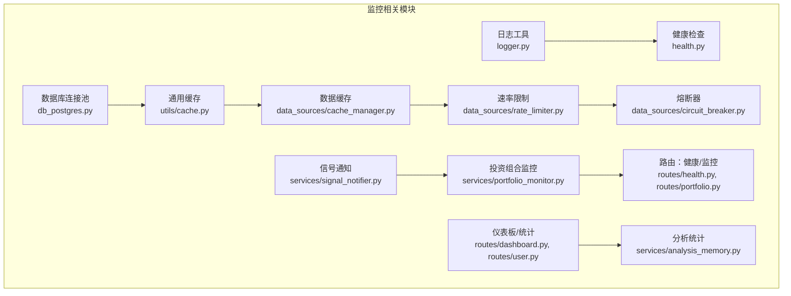
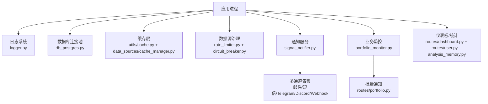
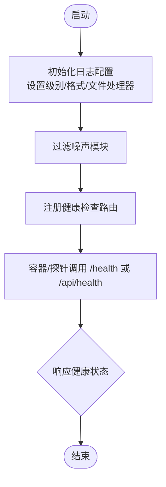
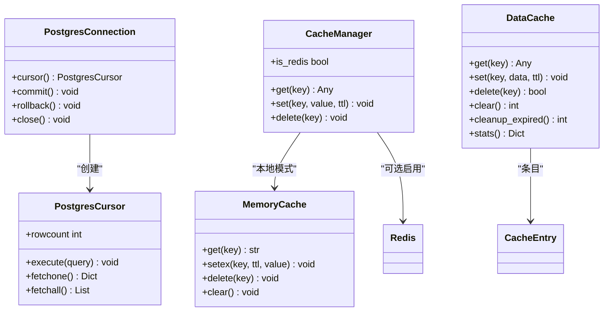
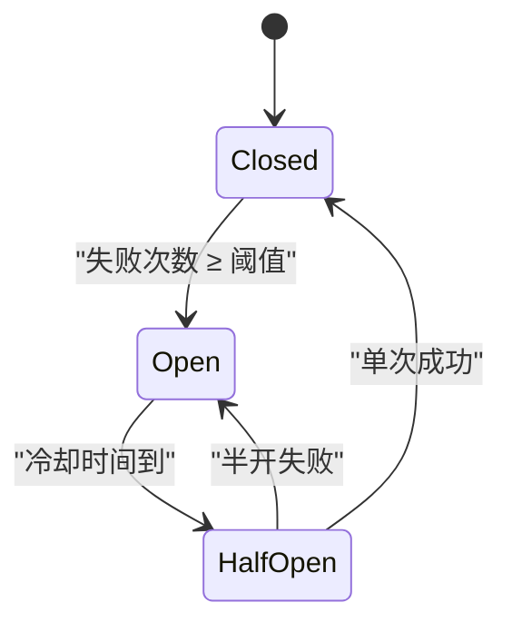
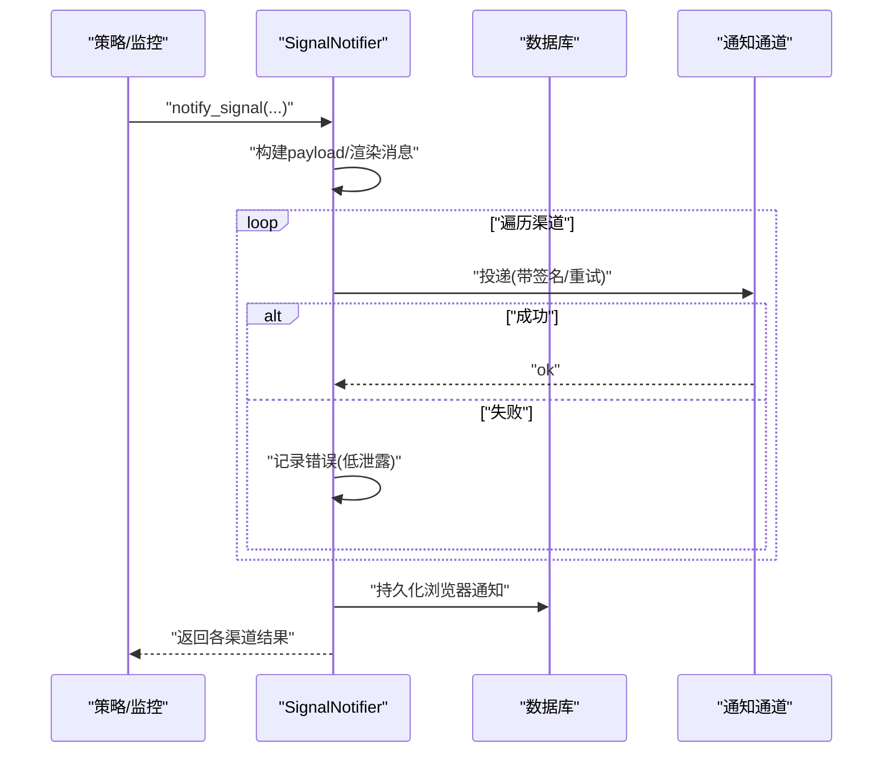
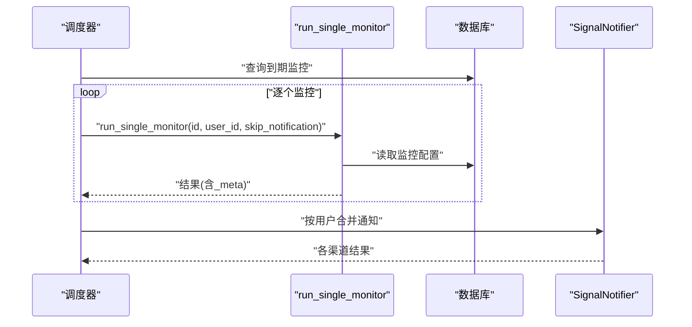
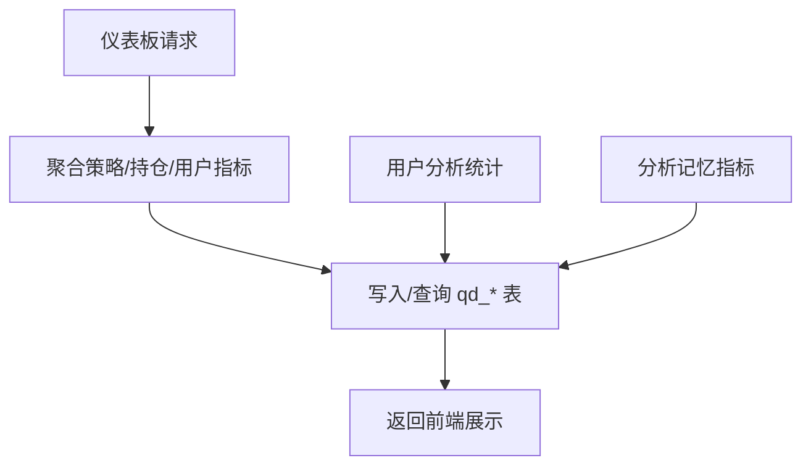
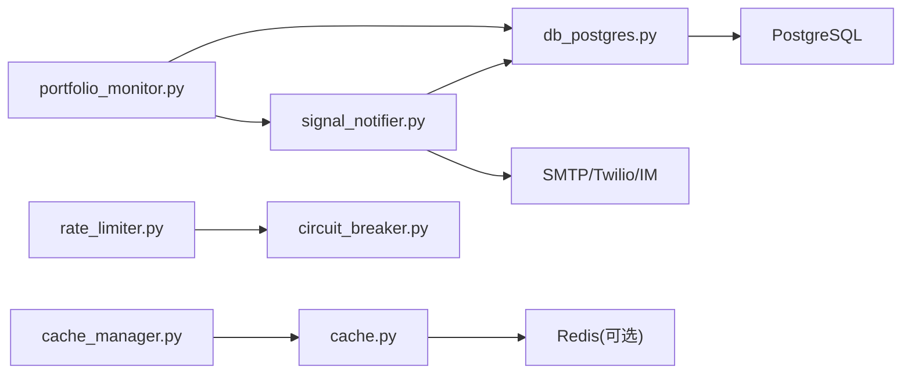

# 监控体系

<cite>
**本文引用的文件**
- [backend_api_python/app/utils/logger.py](file://backend_api_python/app/utils/logger.py)
- [backend_api_python/app/utils/db_postgres.py](file://backend_api_python/app/utils/db_postgres.py)
- [backend_api_python/app/utils/cache.py](file://backend_api_python/app/utils/cache.py)
- [backend_api_python/app/data_sources/cache_manager.py](file://backend_api_python/app/data_sources/cache_manager.py)
- [backend_api_python/app/data_sources/rate_limiter.py](file://backend_api_python/app/data_sources/rate_limiter.py)
- [backend_api_python/app/data_sources/circuit_breaker.py](file://backend_api_python/app/data_sources/circuit_breaker.py)
- [backend_api_python/app/services/signal_notifier.py](file://backend_api_python/app/services/signal_notifier.py)
- [backend_api_python/app/services/portfolio_monitor.py](file://backend_api_python/app/services/portfolio_monitor.py)
- [backend_api_python/app/routes/health.py](file://backend_api_python/app/routes/health.py)
- [backend_api_python/app/routes/portfolio.py](file://backend_api_python/app/routes/portfolio.py)
- [backend_api_python/app/routes/dashboard.py](file://backend_api_python/app/routes/dashboard.py)
- [backend_api_python/app/routes/user.py](file://backend_api_python/app/routes/user.py)
- [backend_api_python/app/services/analysis_memory.py](file://backend_api_python/app/services/analysis_memory.py)
- [frontend/railway.json](file://frontend/railway.json)
</cite>

## 目录
1. [简介](#简介)
2. [项目结构](#项目结构)
3. [核心组件](#核心组件)
4. [架构总览](#架构总览)
5. [详细组件分析](#详细组件分析)
6. [依赖分析](#依赖分析)
7. [性能考量](#性能考量)
8. [故障排查指南](#故障排查指南)
9. [结论](#结论)
10. [附录](#附录)

## 简介
本文件面向QuantDinger项目的监控体系，系统化阐述其监控架构、指标采集与告警机制设计，覆盖日志管理、性能监控、业务监控、分布式追踪与链路监控、用户体验监控、监控仪表板与可视化、智能告警、监控数据存储与分析、报表生成以及监控策略、阈值设定与故障自愈自动化等主题。文档以代码为依据，结合流程图与类图，帮助开发者与运维人员快速理解并优化监控体系。

## 项目结构
后端采用Flask蓝图组织路由，监控相关能力主要分布在以下模块：
- 日志与健康检查：日志工具、健康检查路由
- 数据层与缓存：PostgreSQL连接池、本地/Redis缓存、数据缓存管理
- 数据源治理：速率限制、熔断器、缓存统计
- 通知与告警：信号通知服务、组合通知发送
- 业务监控：投资组合监控、仪表板与用户分析统计
- 健康与部署：容器健康检查配置

**图表来源**
- [backend_api_python/app/utils/logger.py:1-63](file://backend_api_python/app/utils/logger.py#L1-L63)
- [backend_api_python/app/routes/health.py:1-34](file://backend_api_python/app/routes/health.py#L1-L34)
- [backend_api_python/app/utils/db_postgres.py:1-424](file://backend_api_python/app/utils/db_postgres.py#L1-L424)
- [backend_api_python/app/utils/cache.py:1-128](file://backend_api_python/app/utils/cache.py#L1-L128)
- [backend_api_python/app/data_sources/cache_manager.py:1-233](file://backend_api_python/app/data_sources/cache_manager.py#L1-L233)
- [backend_api_python/app/data_sources/rate_limiter.py:1-273](file://backend_api_python/app/data_sources/rate_limiter.py#L1-L273)
- [backend_api_python/app/data_sources/circuit_breaker.py:1-175](file://backend_api_python/app/data_sources/circuit_breaker.py#L1-L175)
- [backend_api_python/app/services/signal_notifier.py:1-912](file://backend_api_python/app/services/signal_notifier.py#L1-L912)
- [backend_api_python/app/services/portfolio_monitor.py:1239-1728](file://backend_api_python/app/services/portfolio_monitor.py#L1239-L1728)
- [backend_api_python/app/routes/health.py:1-34](file://backend_api_python/app/routes/health.py#L1-L34)
- [backend_api_python/app/routes/portfolio.py:656-782](file://backend_api_python/app/routes/portfolio.py#L656-L782)
- [backend_api_python/app/routes/dashboard.py:331-359](file://backend_api_python/app/routes/dashboard.py#L331-L359)
- [backend_api_python/app/routes/user.py:1687-1716](file://backend_api_python/app/routes/user.py#L1687-L1716)
- [backend_api_python/app/services/analysis_memory.py:895-927](file://backend_api_python/app/services/analysis_memory.py#L895-L927)

**章节来源**
- [backend_api_python/app/utils/logger.py:1-63](file://backend_api_python/app/utils/logger.py#L1-L63)
- [backend_api_python/app/routes/health.py:1-34](file://backend_api_python/app/routes/health.py#L1-L34)

## 核心组件
- 日志与健康检查：统一日志配置、过滤噪声、文件轮转；健康检查路由提供运行态检测
- 数据层与缓存：PostgreSQL连接池与健康检查、超时等待；本地/Redis缓存与降级；数据缓存（TTL/LRU）
- 数据源治理：速率限制与指数退避重试；熔断器状态机（闭合/开放/半开）
- 通知与告警：多通道通知（浏览器、Webhook、Discord、Telegram、邮件、短信），带签名与重试
- 业务监控：投资组合监控任务调度与批量通知；仪表板聚合统计与用户分析报表
- 部署与可观测性：容器健康检查路径与重启策略

**章节来源**
- [backend_api_python/app/utils/db_postgres.py:107-235](file://backend_api_python/app/utils/db_postgres.py#L107-L235)
- [backend_api_python/app/utils/cache.py:49-128](file://backend_api_python/app/utils/cache.py#L49-L128)
- [backend_api_python/app/data_sources/cache_manager.py:44-175](file://backend_api_python/app/data_sources/cache_manager.py#L44-L175)
- [backend_api_python/app/data_sources/rate_limiter.py:109-164](file://backend_api_python/app/data_sources/rate_limiter.py#L109-L164)
- [backend_api_python/app/data_sources/circuit_breaker.py:31-158](file://backend_api_python/app/data_sources/circuit_breaker.py#L31-L158)
- [backend_api_python/app/services/signal_notifier.py:130-284](file://backend_api_python/app/services/signal_notifier.py#L130-L284)
- [backend_api_python/app/services/portfolio_monitor.py:1239-1728](file://backend_api_python/app/services/portfolio_monitor.py#L1239-L1728)
- [backend_api_python/app/routes/health.py:10-34](file://backend_api_python/app/routes/health.py#L10-L34)
- [frontend/railway.json:1-13](file://frontend/railway.json#L1-L13)

## 架构总览
监控体系围绕“数据采集—处理—存储—告警—可视化”闭环构建，关键节点如下：
- 数据采集：日志、数据库连接池、缓存命中率、通知通道、业务指标
- 处理：速率限制与熔断器保障上游稳定；通知服务统一渲染与投递
- 存储：PostgreSQL持久化监控与业务数据；本地/Redis缓存加速读取
- 告警：基于阈值与规则的智能告警（邮件/短信/IM/Webhook）
- 可视化：仪表板聚合统计、用户分析报表

**图表来源**
- [backend_api_python/app/utils/logger.py:9-48](file://backend_api_python/app/utils/logger.py#L9-L48)
- [backend_api_python/app/utils/db_postgres.py:107-235](file://backend_api_python/app/utils/db_postgres.py#L107-L235)
- [backend_api_python/app/utils/cache.py:49-128](file://backend_api_python/app/utils/cache.py#L49-L128)
- [backend_api_python/app/data_sources/cache_manager.py:44-175](file://backend_api_python/app/data_sources/cache_manager.py#L44-L175)
- [backend_api_python/app/data_sources/rate_limiter.py:109-164](file://backend_api_python/app/data_sources/rate_limiter.py#L109-L164)
- [backend_api_python/app/data_sources/circuit_breaker.py:31-158](file://backend_api_python/app/data_sources/circuit_breaker.py#L31-L158)
- [backend_api_python/app/services/signal_notifier.py:130-284](file://backend_api_python/app/services/signal_notifier.py#L130-L284)
- [backend_api_python/app/services/portfolio_monitor.py:1239-1728](file://backend_api_python/app/services/portfolio_monitor.py#L1239-L1728)
- [backend_api_python/app/routes/portfolio.py:656-782](file://backend_api_python/app/routes/portfolio.py#L656-L782)
- [backend_api_python/app/routes/dashboard.py:331-359](file://backend_api_python/app/routes/dashboard.py#L331-L359)
- [backend_api_python/app/routes/user.py:1687-1716](file://backend_api_python/app/routes/user.py#L1687-L1716)
- [backend_api_python/app/services/analysis_memory.py:895-927](file://backend_api_python/app/services/analysis_memory.py#L895-L927)

## 详细组件分析

### 日志管理与健康检查
- 日志配置：支持环境变量控制级别、格式化输出、文件轮转、噪声过滤（如特定子模块）
- 健康检查：提供应用元信息、健康状态与兼容探针路径，便于容器编排与反向代理探测

**图表来源**
- [backend_api_python/app/utils/logger.py:9-48](file://backend_api_python/app/utils/logger.py#L9-L48)
- [backend_api_python/app/routes/health.py:10-34](file://backend_api_python/app/routes/health.py#L10-L34)

**章节来源**
- [backend_api_python/app/utils/logger.py:1-63](file://backend_api_python/app/utils/logger.py#L1-L63)
- [backend_api_python/app/routes/health.py:1-34](file://backend_api_python/app/routes/health.py#L1-L34)

### 数据库连接池与缓存
- 连接池：线程安全连接池、健康检查、超时等待与回退、选项参数透传
- 通用缓存：本地内存缓存优先，Redis可选启用，降级友好
- 数据缓存：TTL/LRU，统计命中率，按数据类型分区管理

**图表来源**
- [backend_api_python/app/utils/db_postgres.py:384-424](file://backend_api_python/app/utils/db_postgres.py#L384-L424)
- [backend_api_python/app/utils/cache.py:49-128](file://backend_api_python/app/utils/cache.py#L49-L128)
- [backend_api_python/app/data_sources/cache_manager.py:27-175](file://backend_api_python/app/data_sources/cache_manager.py#L27-L175)

**章节来源**
- [backend_api_python/app/utils/db_postgres.py:107-235](file://backend_api_python/app/utils/db_postgres.py#L107-L235)
- [backend_api_python/app/utils/cache.py:49-128](file://backend_api_python/app/utils/cache.py#L49-L128)
- [backend_api_python/app/data_sources/cache_manager.py:44-175](file://backend_api_python/app/data_sources/cache_manager.py#L44-L175)

### 数据源治理：速率限制与熔断器
- 速率限制：最小间隔+随机抖动，记录最近请求时间，保证请求节奏
- 指数退避重试：装饰器封装，支持异常类型、最大次数、最大延迟与抖动
- 熔断器：三态状态机，失败阈值触发熔断，冷却后半开试探，成功恢复

**图表来源**
- [backend_api_python/app/data_sources/circuit_breaker.py:24-158](file://backend_api_python/app/data_sources/circuit_breaker.py#L24-L158)

**章节来源**
- [backend_api_python/app/data_sources/rate_limiter.py:109-164](file://backend_api_python/app/data_sources/rate_limiter.py#L109-L164)
- [backend_api_python/app/data_sources/rate_limiter.py:170-231](file://backend_api_python/app/data_sources/rate_limiter.py#L170-L231)
- [backend_api_python/app/data_sources/circuit_breaker.py:31-158](file://backend_api_python/app/data_sources/circuit_breaker.py#L31-L158)

### 通知与告警：多通道与智能投递
- 通知渠道：浏览器内提示、Webhook、Discord、Telegram、邮件、短信（Twilio）
- 渲染与签名：统一消息体构建、HTML/纯文本渲染、可选签名头（时间戳+HMAC）
- 重试与降级：HTTP 429/5xx自动重试；Webhook/Discord失败保留高信噪日志
- 配置来源：用户侧目标优先，公共服务配置（SMTP/Twilio）

**图表来源**
- [backend_api_python/app/services/signal_notifier.py:171-284](file://backend_api_python/app/services/signal_notifier.py#L171-L284)
- [backend_api_python/app/services/signal_notifier.py:540-629](file://backend_api_python/app/services/signal_notifier.py#L540-L629)
- [backend_api_python/app/services/signal_notifier.py:630-704](file://backend_api_python/app/services/signal_notifier.py#L630-L704)
- [backend_api_python/app/services/signal_notifier.py:706-740](file://backend_api_python/app/services/signal_notifier.py#L706-L740)
- [backend_api_python/app/services/signal_notifier.py:741-786](file://backend_api_python/app/services/signal_notifier.py#L741-L786)
- [backend_api_python/app/services/signal_notifier.py:787-800](file://backend_api_python/app/services/signal_notifier.py#L787-L800)

**章节来源**
- [backend_api_python/app/services/signal_notifier.py:130-284](file://backend_api_python/app/services/signal_notifier.py#L130-L284)

### 投资组合监控与批量告警
- 单次监控执行：加载配置、运行、产出结果与元信息
- 批量调度：周期扫描到期监控，逐个执行并聚合结果
- 组合通知：按用户维度合并通知，降低通道压力

**图表来源**
- [backend_api_python/app/services/portfolio_monitor.py:1239-1278](file://backend_api_python/app/services/portfolio_monitor.py#L1239-L1278)
- [backend_api_python/app/services/portfolio_monitor.py:1701-1728](file://backend_api_python/app/services/portfolio_monitor.py#L1701-L1728)
- [backend_api_python/app/routes/portfolio.py:656-782](file://backend_api_python/app/routes/portfolio.py#L656-L782)

**章节来源**
- [backend_api_python/app/services/portfolio_monitor.py:1239-1728](file://backend_api_python/app/services/portfolio_monitor.py#L1239-L1728)
- [backend_api_python/app/routes/portfolio.py:656-782](file://backend_api_python/app/routes/portfolio.py#L656-L782)

### 业务监控：仪表板与报表
- 仪表板聚合：策略数量、AI策略占比、持仓概览等
- 用户分析统计：分析任务计数、符号/市场去重、时间范围聚合
- 分析记忆：准确率、平均回报、满意度、决策分布等指标

**图表来源**
- [backend_api_python/app/routes/dashboard.py:331-359](file://backend_api_python/app/routes/dashboard.py#L331-L359)
- [backend_api_python/app/routes/user.py:1687-1716](file://backend_api_python/app/routes/user.py#L1687-L1716)
- [backend_api_python/app/services/analysis_memory.py:895-927](file://backend_api_python/app/services/analysis_memory.py#L895-L927)

**章节来源**
- [backend_api_python/app/routes/dashboard.py:331-359](file://backend_api_python/app/routes/dashboard.py#L331-L359)
- [backend_api_python/app/routes/user.py:1687-1716](file://backend_api_python/app/routes/user.py#L1687-L1716)
- [backend_api_python/app/services/analysis_memory.py:895-927](file://backend_api_python/app/services/analysis_memory.py#L895-L927)

## 依赖分析
- 组件耦合：通知服务依赖数据库与外部HTTP服务；监控调度依赖数据库与通知服务；缓存与数据缓存相互协作
- 外部依赖：PostgreSQL、Redis、SMTP/Twilio、Telegram/Discord API、Webhook端点
- 潜在风险：通知通道失败、数据库连接池耗尽、缓存不可用、上游数据源不稳定

**图表来源**
- [backend_api_python/app/services/signal_notifier.py:1-912](file://backend_api_python/app/services/signal_notifier.py#L1-L912)
- [backend_api_python/app/services/portfolio_monitor.py:1239-1728](file://backend_api_python/app/services/portfolio_monitor.py#L1239-L1728)
- [backend_api_python/app/utils/db_postgres.py:107-235](file://backend_api_python/app/utils/db_postgres.py#L107-L235)
- [backend_api_python/app/utils/cache.py:49-128](file://backend_api_python/app/utils/cache.py#L49-L128)
- [backend_api_python/app/data_sources/cache_manager.py:44-175](file://backend_api_python/app/data_sources/cache_manager.py#L44-L175)
- [backend_api_python/app/data_sources/rate_limiter.py:109-164](file://backend_api_python/app/data_sources/rate_limiter.py#L109-L164)
- [backend_api_python/app/data_sources/circuit_breaker.py:31-158](file://backend_api_python/app/data_sources/circuit_breaker.py#L31-L158)

**章节来源**
- [backend_api_python/app/services/signal_notifier.py:1-912](file://backend_api_python/app/services/signal_notifier.py#L1-L912)
- [backend_api_python/app/services/portfolio_monitor.py:1239-1728](file://backend_api_python/app/services/portfolio_monitor.py#L1239-L1728)
- [backend_api_python/app/utils/db_postgres.py:107-235](file://backend_api_python/app/utils/db_postgres.py#L107-L235)
- [backend_api_python/app/utils/cache.py:49-128](file://backend_api_python/app/utils/cache.py#L49-L128)
- [backend_api_python/app/data_sources/cache_manager.py:44-175](file://backend_api_python/app/data_sources/cache_manager.py#L44-L175)
- [backend_api_python/app/data_sources/rate_limiter.py:109-164](file://backend_api_python/app/data_sources/rate_limiter.py#L109-L164)
- [backend_api_python/app/data_sources/circuit_breaker.py:31-158](file://backend_api_python/app/data_sources/circuit_breaker.py#L31-L158)

## 性能考量
- 连接池与等待：连接池健康检查与超时等待，避免瞬时拥塞导致请求失败
- 缓存策略：TTL/LRU降低上游压力；命中率统计指导容量与TTL调优
- 速率限制与退避：平滑请求节奏，避免触发上游限流
- 熔断器：失败快速隔离，冷却后半开试探，降低雪崩效应
- 通知重试：对临时性错误进行有限重试，提升送达率

[本节为通用性能建议，无需具体文件引用]

## 故障排查指南
- 健康检查：确认探针路径与返回状态
- 日志：查看应用日志与通知错误日志，定位通道失败原因
- 数据库：关注连接池耗尽告警与慢查询
- 缓存：检查命中率与容量，必要时调整TTL或启用Redis
- 通知：核对SMTP/Twilio/IM令牌配置，查看重试与签名头
- 监控调度：检查到期监控列表与批量通知聚合逻辑

**章节来源**
- [backend_api_python/app/routes/health.py:10-34](file://backend_api_python/app/routes/health.py#L10-L34)
- [backend_api_python/app/utils/logger.py:1-63](file://backend_api_python/app/utils/logger.py#L1-L63)
- [backend_api_python/app/utils/db_postgres.py:184-235](file://backend_api_python/app/utils/db_postgres.py#L184-L235)
- [backend_api_python/app/utils/cache.py:100-128](file://backend_api_python/app/utils/cache.py#L100-L128)
- [backend_api_python/app/services/signal_notifier.py:273-284](file://backend_api_python/app/services/signal_notifier.py#L273-L284)
- [backend_api_python/app/services/portfolio_monitor.py:1701-1728](file://backend_api_python/app/services/portfolio_monitor.py#L1701-L1728)

## 结论
QuantDinger的监控体系以日志与健康检查为基础，通过数据库连接池、缓存与数据源治理保障稳定性，借助通知服务实现多通道智能告警，并以仪表板与报表支撑业务观测。建议持续完善阈值策略、告警分级与自动化处置流程，结合缓存与连接池指标优化系统弹性。

[本节为总结性内容，无需具体文件引用]

## 附录
- 容器健康检查：容器健康检查路径与重启策略配置
- 文档与参考：通知渠道配置文档（Telegram/SMS等）

**章节来源**
- [frontend/railway.json:1-13](file://frontend/railway.json#L1-L13)