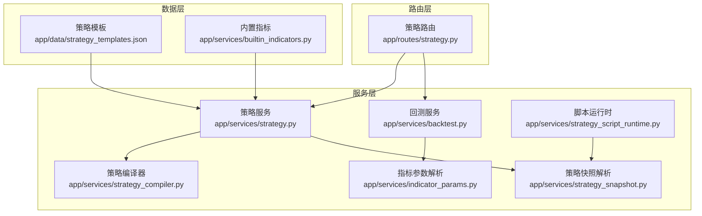
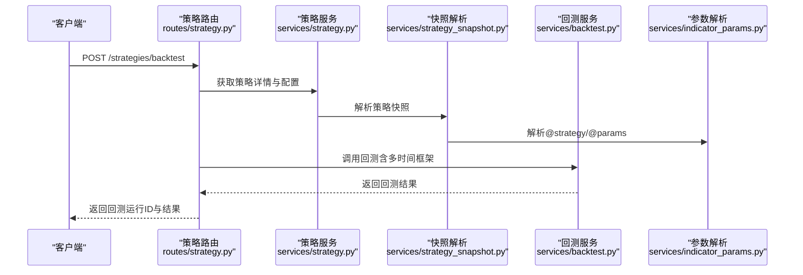
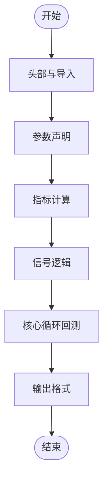
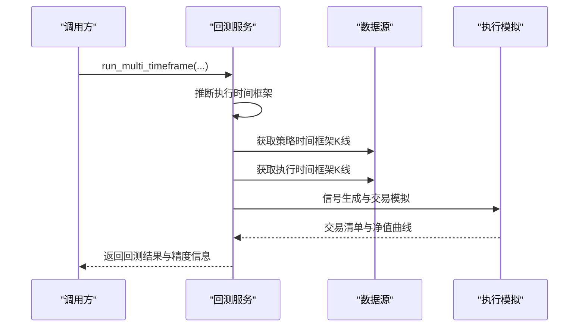
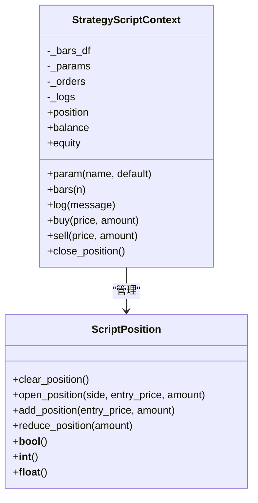
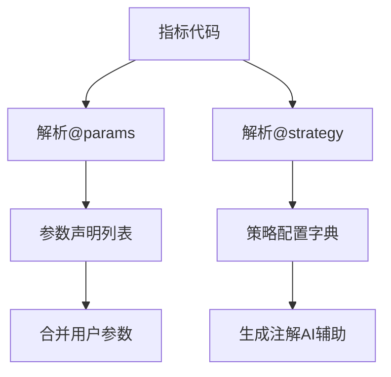
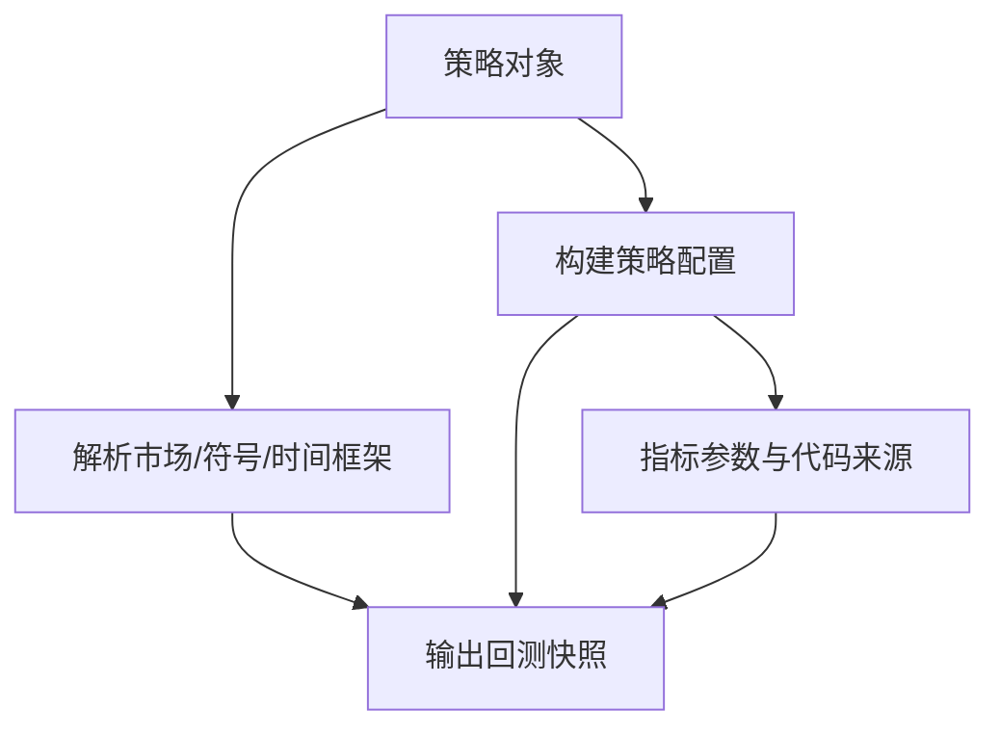
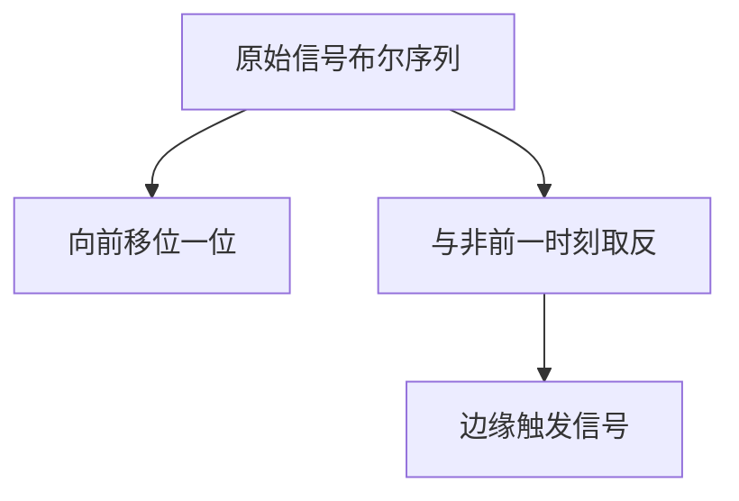
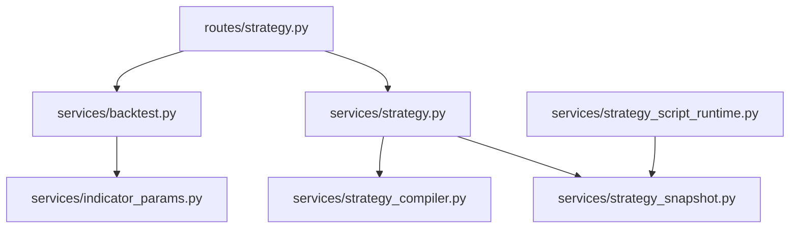

# IndicatorStrategy开发指南

<cite>
**本文档引用的文件**
- [strategy.py](file://backend_api_python/app/services/strategy.py)
- [strategy_compiler.py](file://backend_api_python/app/services/strategy_compiler.py)
- [builtin_indicators.py](file://backend_api_python/app/services/builtin_indicators.py)
- [strategy.py](file://backend_api_python/app/routes/strategy.py)
- [strategy_templates.json](file://backend_api_python/app/data/strategy_templates.json)
- [backtest.py](file://backend_api_python/app/services/backtest.py)
- [strategy_script_runtime.py](file://backend_api_python/app/services/strategy_script_runtime.py)
- [indicator_params.py](file://backend_api_python/app/services/indicator_params.py)
- [strategy_snapshot.py](file://backend_api_python/app/services/strategy_snapshot.py)
- [dual_ma_with_params.py](file://docs/examples/dual_ma_with_params.py)
- [multi_indicator_composite.py](file://docs/examples/multi_indicator_composite.py)
- [cross_sectional_momentum_rsi.py](file://docs/examples/cross_sectional_momentum_rsi.py)
</cite>

## 目录
1. [简介](#简介)
2. [项目结构](#项目结构)
3. [核心组件](#核心组件)
4. [架构总览](#架构总览)
5. [详细组件分析](#详细组件分析)
6. [依赖关系分析](#依赖关系分析)
7. [性能考虑](#性能考虑)
8. [故障排除指南](#故障排除指南)
9. [结论](#结论)
10. [附录](#附录)

## 简介
本指南面向QuantDinger平台的IndicatorStrategy（指标策略）开发者，系统阐述从元数据定义、参数声明、默认配置设置，到指标计算、信号生成、图表输出的标准实现方法。文档同时覆盖趋势跟踪、均值回归、动量策略等经典策略的实现要点，解释信号生成的布尔逻辑、边缘触发机制与回测语义，并提供参数优化、代码质量与性能优化的最佳实践。

## 项目结构
QuantDinger后端采用模块化设计，围绕策略生命周期提供服务层与路由层支撑：
- 服务层负责策略编译、回测、脚本运行时、参数解析与快照解析
- 路由层提供策略的创建、批量操作、回测执行与历史查询
- 数据层包含策略模板与内置示例指标，便于快速导入与学习

**图表来源**
- [strategy.py:1-200](file://backend_api_python/app/routes/strategy.py#L1-L200)
- [strategy.py:1-200](file://backend_api_python/app/services/strategy.py#L1-L200)
- [strategy_compiler.py:1-120](file://backend_api_python/app/services/strategy_compiler.py#L1-L120)
- [backtest.py:1-120](file://backend_api_python/app/services/backtest.py#L1-L120)
- [strategy_script_runtime.py:1-80](file://backend_api_python/app/services/strategy_script_runtime.py#L1-L80)
- [indicator_params.py:1-80](file://backend_api_python/app/services/indicator_params.py#L1-L80)
- [strategy_templates.json:1-60](file://backend_api_python/app/data/strategy_templates.json#L1-L60)
- [builtin_indicators.py:1-60](file://backend_api_python/app/services/builtin_indicators.py#L1-L60)

**章节来源**
- [strategy.py:1-200](file://backend_api_python/app/routes/strategy.py#L1-L200)
- [strategy.py:1-200](file://backend_api_python/app/services/strategy.py#L1-L200)
- [strategy_compiler.py:1-120](file://backend_api_python/app/services/strategy_compiler.py#L1-L120)
- [backtest.py:1-120](file://backend_api_python/app/services/backtest.py#L1-L120)
- [strategy_script_runtime.py:1-80](file://backend_api_python/app/services/strategy_script_runtime.py#L1-L80)
- [indicator_params.py:1-80](file://backend_api_python/app/services/indicator_params.py#L1-L80)
- [strategy_templates.json:1-60](file://backend_api_python/app/data/strategy_templates.json#L1-L60)
- [builtin_indicators.py:1-60](file://backend_api_python/app/services/builtin_indicators.py#L1-L60)

## 核心组件
- 策略服务（StrategyService）：提供策略查询、批量操作、连接测试、策略类型解析与显示信息构建等能力
- 策略编译器（StrategyCompiler）：将策略配置编译为可执行的Python代码，包含参数、指标计算、信号逻辑与输出格式
- 回测服务（BacktestService）：提供单/多时间框架回测、执行精度推断、交易模拟与结果持久化
- 脚本运行时（StrategyScriptContext）：为脚本策略提供安全的执行上下文，支持参数、订单与日志
- 指标参数解析（IndicatorParamsParser/StrategyConfigParser）：解析@strategy与@params注解，生成策略配置与参数声明
- 策略快照解析（StrategySnapshotResolver）：将存储的策略配置解析为回测可用的快照

**章节来源**
- [strategy.py:14-120](file://backend_api_python/app/services/strategy.py#L14-L120)
- [strategy_compiler.py:4-60](file://backend_api_python/app/services/strategy_compiler.py#L4-L60)
- [backtest.py:64-120](file://backend_api_python/app/services/backtest.py#L64-L120)
- [strategy_script_runtime.py:114-191](file://backend_api_python/app/services/strategy_script_runtime.py#L114-L191)
- [indicator_params.py:26-120](file://backend_api_python/app/services/indicator_params.py#L26-L120)
- [strategy_snapshot.py:7-120](file://backend_api_python/app/services/strategy_snapshot.py#L7-L120)

## 架构总览
下图展示了从策略路由到回测执行的关键交互路径，以及各组件之间的依赖关系。

**图表来源**
- [strategy.py:329-441](file://backend_api_python/app/routes/strategy.py#L329-L441)
- [strategy.py:611-625](file://backend_api_python/app/services/strategy.py#L611-L625)
- [strategy_snapshot.py:116-220](file://backend_api_python/app/services/strategy_snapshot.py#L116-L220)
- [backtest.py:444-668](file://backend_api_python/app/services/backtest.py#L444-L668)
- [indicator_params.py:26-120](file://backend_api_python/app/services/indicator_params.py#L26-L120)

**章节来源**
- [strategy.py:329-441](file://backend_api_python/app/routes/strategy.py#L329-L441)
- [strategy_snapshot.py:116-220](file://backend_api_python/app/services/strategy_snapshot.py#L116-L220)
- [backtest.py:444-668](file://backend_api_python/app/services/backtest.py#L444-L668)
- [indicator_params.py:26-120](file://backend_api_python/app/services/indicator_params.py#L26-L120)

## 详细组件分析

### 策略编译器（StrategyCompiler）
策略编译器负责将策略配置转化为可执行的Python代码，包含五个阶段：
- 头部与导入：生成基础导入与辅助函数
- 参数声明：解析位置管理、金字塔加仓与风控参数
- 指标计算：根据规则生成各类技术指标（如EMA、RSI、MACD、布林带、KDJ、超趋势等）
- 信号逻辑：根据指标与运算符生成买入/卖出信号
- 核心循环：实现回测中的开仓、加仓、止盈止损与平仓逻辑
- 输出格式：生成图表绘制配置与信号标注

**图表来源**
- [strategy_compiler.py:5-35](file://backend_api_python/app/services/strategy_compiler.py#L5-L35)
- [strategy_compiler.py:37-84](file://backend_api_python/app/services/strategy_compiler.py#L37-L84)
- [strategy_compiler.py:86-222](file://backend_api_python/app/services/strategy_compiler.py#L86-L222)
- [strategy_compiler.py:224-376](file://backend_api_python/app/services/strategy_compiler.py#L224-L376)
- [strategy_compiler.py:378-566](file://backend_api_python/app/services/strategy_compiler.py#L378-L566)
- [strategy_compiler.py:567-689](file://backend_api_python/app/services/strategy_compiler.py#L567-L689)

**章节来源**
- [strategy_compiler.py:1-689](file://backend_api_python/app/services/strategy_compiler.py#L1-L689)

### 回测服务（BacktestService）
回测服务提供多时间框架回测能力，支持高精度1分钟与5分钟回测，并在满足条件时自动降级到标准回测。其关键特性包括：
- 执行时间框架推断：根据回测日期范围自动选择1分钟或5分钟精度
- 交易模拟：基于信号与执行时间框架进行精确模拟
- 结果持久化：将回测结果与交易明细写入数据库
- 指标计算：计算总收益、年化收益、胜率、总交易数等指标

**图表来源**
- [backtest.py:170-225](file://backend_api_python/app/services/backtest.py#L170-L225)
- [backtest.py:444-668](file://backend_api_python/app/services/backtest.py#L444-L668)

**章节来源**
- [backtest.py:64-120](file://backend_api_python/app/services/backtest.py#L64-L120)
- [backtest.py:170-225](file://backend_api_python/app/services/backtest.py#L170-L225)
- [backtest.py:444-668](file://backend_api_python/app/services/backtest.py#L444-L668)

### 脚本运行时（StrategyScriptContext）
脚本运行时为脚本策略提供安全的执行环境，支持：
- 参数读取：通过ctx.param(name, default)读取参数
- K线访问：通过ctx.bars(n)获取最近n根K线
- 订单意图：ctx.buy/ctx.sell/ctx.close_position记录订单
- 位置管理：内部维护头寸状态与方向

**图表来源**
- [strategy_script_runtime.py:114-191](file://backend_api_python/app/services/strategy_script_runtime.py#L114-L191)
- [strategy_script_runtime.py:17-125](file://backend_api_python/app/services/strategy_script_runtime.py#L17-L125)

**章节来源**
- [strategy_script_runtime.py:1-191](file://backend_api_python/app/services/strategy_script_runtime.py#L1-L191)

### 指标参数解析（IndicatorParamsParser/StrategyConfigParser）
- @param注解解析：从指标代码中提取参数声明，支持int、float、bool、str类型
- @strategy注解解析：提取策略默认配置，包括止损、止盈、入场比例、追踪止损与交易方向等
- 参数合并：将声明参数与用户传参合并，生成最终执行参数

**图表来源**
- [indicator_params.py:119-216](file://backend_api_python/app/services/indicator_params.py#L119-L216)
- [indicator_params.py:26-102](file://backend_api_python/app/services/indicator_params.py#L26-L102)

**章节来源**
- [indicator_params.py:119-216](file://backend_api_python/app/services/indicator_params.py#L119-L216)
- [indicator_params.py:26-102](file://backend_api_python/app/services/indicator_params.py#L26-L102)

### 策略快照解析（StrategySnapshotResolver）
将存储的策略配置解析为回测可用的快照，包括：
- 市场、符号、时间框架、初始资本、杠杆、佣金、滑点、交易方向
- 策略配置（风控、仓位、加减仓规则、执行时机）
- 指标参数与代码来源

**图表来源**
- [strategy_snapshot.py:116-220](file://backend_api_python/app/services/strategy_snapshot.py#L116-L220)

**章节来源**
- [strategy_snapshot.py:1-220](file://backend_api_python/app/services/strategy_snapshot.py#L1-L220)

### 经典策略实现示例

#### 趋势跟踪策略（双均线交叉）
- 参数声明：短期/长期均线周期
- 默认策略配置：止损、止盈、入场比例、交易方向
- 指标计算：计算两条均线
- 信号生成：均线金叉/死叉，使用边缘触发避免重复开仓
- 图表输出：均线与买卖标记

参考示例文件路径：
- [dual_ma_with_params.py:1-64](file://docs/examples/dual_ma_with_params.py#L1-L64)

**章节来源**
- [dual_ma_with_params.py:1-64](file://docs/examples/dual_ma_with_params.py#L1-L64)

#### 均值回归策略（RSI超卖/超买）
- 参数声明：RSI周期、超卖/超买阈值
- 指标计算：RSI指标
- 信号生成：RSI超卖反弹做多，超买回落做空
- 图表输出：RSI与买卖标记

参考示例文件路径：
- [dual_ma_with_params.py:1-64](file://docs/examples/dual_ma_with_params.py#L1-L64)

#### 动量策略（MACD柱穿越零轴）
- 指标计算：MACD线、信号线与柱状图
- 信号生成：柱状图由负转正做多，由正转负做空
- 图表输出：MACD与柱状图

参考示例文件路径：
- [multi_indicator_composite.py:1-109](file://docs/examples/multi_indicator_composite.py#L1-L109)

#### 多指标组合策略
- 参数声明：均线周期、RSI周期与阈值、是否使用MACD/成交量过滤
- 指标计算：均线、RSI、MACD与成交量均线
- 信号生成：组合条件并通过边缘触发稳定信号
- 图表输出：多指标叠加与买卖标记

参考示例文件路径：
- [multi_indicator_composite.py:1-109](file://docs/examples/multi_indicator_composite.py#L1-L109)

**章节来源**
- [dual_ma_with_params.py:1-64](file://docs/examples/dual_ma_with_params.py#L1-L64)
- [multi_indicator_composite.py:1-109](file://docs/examples/multi_indicator_composite.py#L1-L109)

### 信号生成与边缘触发机制
- 原始信号：基于指标条件生成布尔序列（如金叉、死叉、超买/超卖）
- 边缘触发：通过与前一时刻取反，确保仅在信号首次出现时触发，避免重复开仓
- 回测语义：回测引擎以“下一根K线开盘价”为默认执行时机，支持“同根K线收盘”等变体

**图表来源**
- [multi_indicator_composite.py:87-89](file://docs/examples/multi_indicator_composite.py#L87-L89)
- [dual_ma_with_params.py:41-46](file://docs/examples/dual_ma_with_params.py#L41-L46)

**章节来源**
- [multi_indicator_composite.py:87-89](file://docs/examples/multi_indicator_composite.py#L87-L89)
- [dual_ma_with_params.py:41-46](file://docs/examples/dual_ma_with_params.py#L41-L46)

### 回测语义与执行假设
- 执行时间框架：1分钟或5分钟，依据回测日期跨度自动选择
- 信号与执行：策略时间框架生成信号，执行时间框架进行精确模拟
- 执行假设：支持追踪止损、止盈、金字塔加仓等高级规则

**章节来源**
- [backtest.py:170-225](file://backend_api_python/app/services/backtest.py#L170-L225)
- [backtest.py:444-668](file://backend_api_python/app/services/backtest.py#L444-L668)

## 依赖关系分析
- 路由层依赖策略服务与回测服务
- 策略服务依赖快照解析与编译器
- 回测服务依赖参数解析与数据源
- 脚本运行时与策略快照解析共同支撑脚本策略执行

**图表来源**
- [strategy.py:1-80](file://backend_api_python/app/routes/strategy.py#L1-L80)
- [strategy.py:1-80](file://backend_api_python/app/services/strategy.py#L1-L80)
- [strategy_compiler.py:1-40](file://backend_api_python/app/services/strategy_compiler.py#L1-L40)
- [backtest.py:1-40](file://backend_api_python/app/services/backtest.py#L1-L40)
- [strategy_script_runtime.py:1-40](file://backend_api_python/app/services/strategy_script_runtime.py#L1-L40)
- [strategy_snapshot.py:1-40](file://backend_api_python/app/services/strategy_snapshot.py#L1-L40)
- [indicator_params.py:1-40](file://backend_api_python/app/services/indicator_params.py#L1-L40)

**章节来源**
- [strategy.py:1-80](file://backend_api_python/app/routes/strategy.py#L1-L80)
- [strategy.py:1-80](file://backend_api_python/app/services/strategy.py#L1-L80)
- [strategy_compiler.py:1-40](file://backend_api_python/app/services/strategy_compiler.py#L1-L40)
- [backtest.py:1-40](file://backend_api_python/app/services/backtest.py#L1-L40)
- [strategy_script_runtime.py:1-40](file://backend_api_python/app/services/strategy_script_runtime.py#L1-L40)
- [strategy_snapshot.py:1-40](file://backend_api_python/app/services/strategy_snapshot.py#L1-L40)
- [indicator_params.py:1-40](file://backend_api_python/app/services/indicator_params.py#L1-L40)

## 性能考虑
- 多时间框架回测：在满足条件时启用1分钟/5分钟高精度回测，超出范围自动降级
- 缓存机制：K线数据缓存减少重复拉取，提升回测效率
- 执行精度推断：根据回测跨度自动选择最优执行时间框架，兼顾性能与精度
- 代码质量检查：通过注解与静态分析降低运行时错误，减少调试成本

**章节来源**
- [backtest.py:25-61](file://backend_api_python/app/services/backtest.py#L25-L61)
- [backtest.py:170-225](file://backend_api_python/app/services/backtest.py#L170-L225)
- [strategy.py:45-64](file://backend_api_python/app/routes/strategy.py#L45-L64)

## 故障排除指南
- 空代码与语法错误：路由层提供代码质量检查，缺失必要函数或语法错误将被明确提示
- 运行时错误：脚本策略编译失败会返回详细错误信息
- 回测失败：回测服务会持久化失败记录，便于定位问题
- 参数与配置：@strategy与@params注解解析严格校验类型与范围，确保回测一致性

**章节来源**
- [strategy.py:45-121](file://backend_api_python/app/routes/strategy.py#L45-L121)
- [strategy.py:67-121](file://backend_api_python/app/routes/strategy.py#L67-L121)
- [backtest.py:233-342](file://backend_api_python/app/services/backtest.py#L233-L342)
- [indicator_params.py:26-102](file://backend_api_python/app/services/indicator_params.py#L26-L102)

## 结论
本指南系统梳理了QuantDinger平台IndicatorStrategy的开发流程与实现细节，从元数据与参数声明到指标计算、信号生成与图表输出，再到回测执行与性能优化。通过策略编译器、回测服务与参数解析等核心组件的协同工作，开发者可以高效地构建稳健的策略并进行高质量的回测验证。

## 附录

### 策略模板与内置示例
- 策略模板：提供多种经典策略的默认参数与难度分类，便于快速导入
- 内置指标：包含RSI、双均线、MACD、布林带等示例，可直接用于学习与二次开发

**章节来源**
- [strategy_templates.json:1-191](file://backend_api_python/app/data/strategy_templates.json#L1-L191)
- [builtin_indicators.py:17-185](file://backend_api_python/app/services/builtin_indicators.py#L17-L185)

### 截面策略参考
- 截面策略示例展示了多标的评分与排序思路，适用于研究场景，当前平台尚未接入主策略回测/实盘链路

**章节来源**
- [cross_sectional_momentum_rsi.py:1-71](file://docs/examples/cross_sectional_momentum_rsi.py#L1-L71)