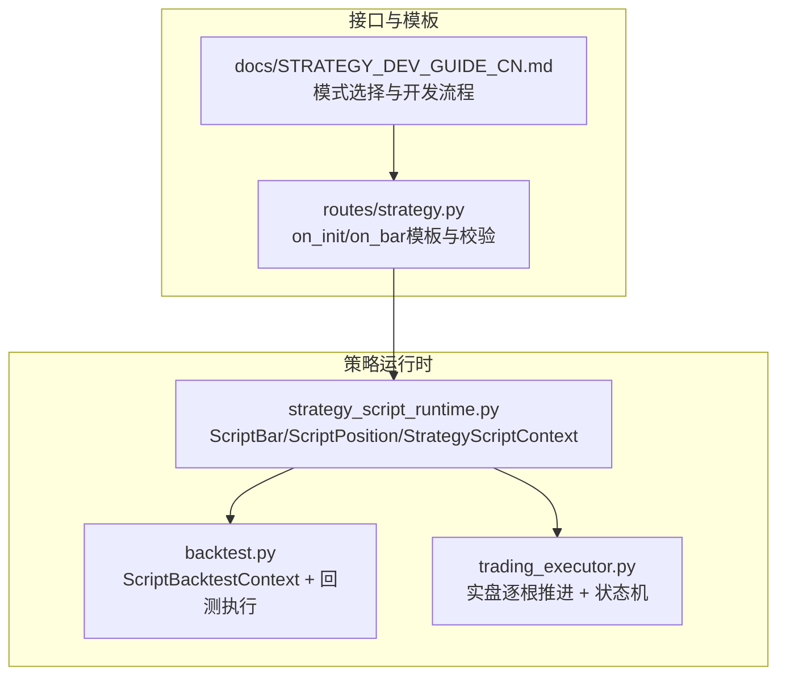
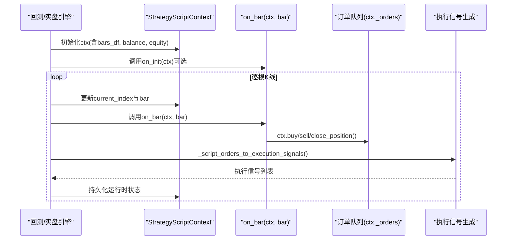
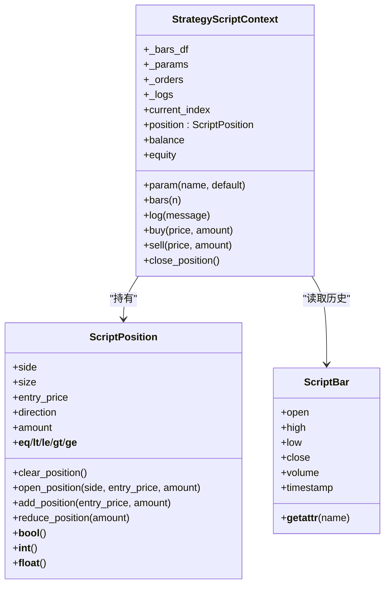
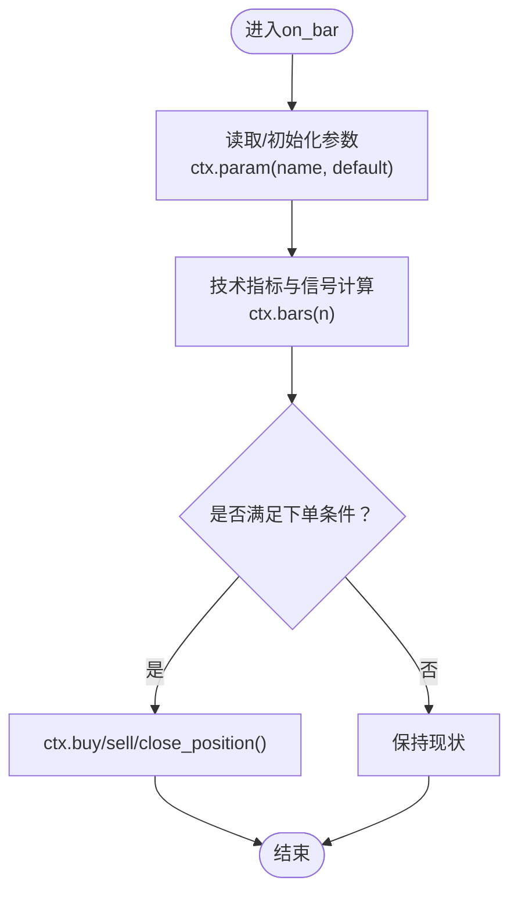
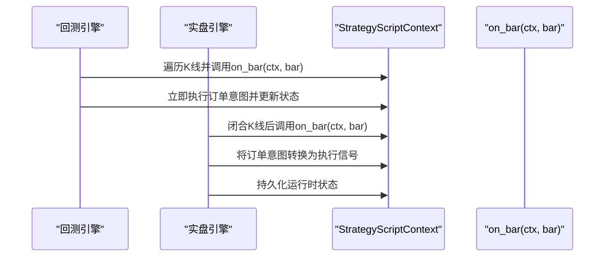
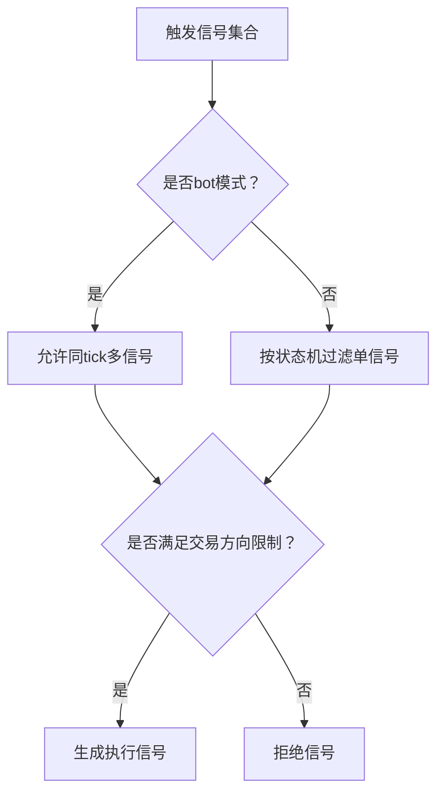
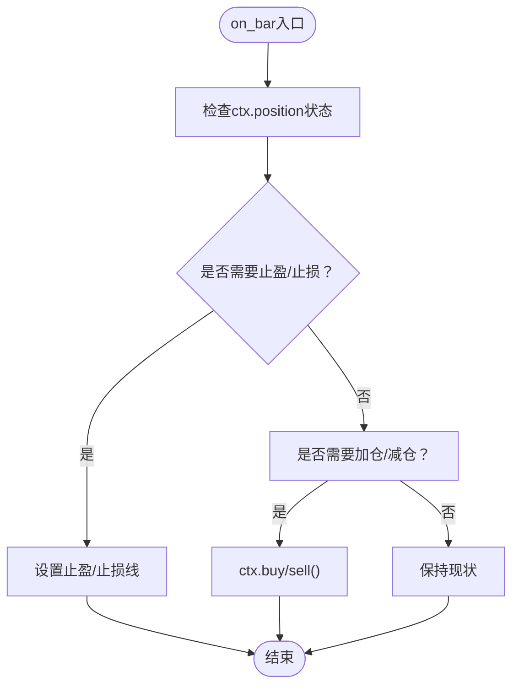
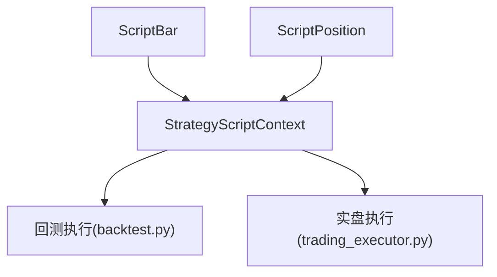

# ScriptStrategy开发指南

<cite>
**本文档引用的文件**
- [strategy_script_runtime.py](file://backend_api_python/app/services/strategy_script_runtime.py)
- [backtest.py](file://backend_api_python/app/services/backtest.py)
- [trading_executor.py](file://backend_api_python/app/services/trading_executor.py)
- [strategy.py](file://backend_api_python/app/routes/strategy.py)
- [STRATEGY_DEV_GUIDE_CN.md](file://docs/STRATEGY_DEV_GUIDE_CN.md)
</cite>

## 目录
1. [简介](#简介)
2. [项目结构](#项目结构)
3. [核心组件](#核心组件)
4. [架构总览](#架构总览)
5. [详细组件分析](#详细组件分析)
6. [依赖关系分析](#依赖关系分析)
7. [性能考虑](#性能考虑)
8. [故障排除指南](#故障排除指南)
9. [结论](#结论)
10. [附录](#附录)

## 简介
本指南面向QuantDinger平台的ScriptStrategy开发，系统阐述其运行时架构、事件驱动机制、ctx上下文API、on_init与on_bar实现规范，以及在回测与实盘之间的差异处理。文档还提供动态止盈止损、分批加减仓、状态机执行等复杂逻辑的实现思路与最佳实践，并对比bot模式与普通模式的差异。

## 项目结构
围绕ScriptStrategy的核心代码主要分布在以下模块：
- 运行时与上下文：strategy_script_runtime.py
- 回测执行：backtest.py
- 实盘执行与状态机：trading_executor.py
- API与模板提示：routes/strategy.py
- 开发指南与模式选择：docs/STRATEGY_DEV_GUIDE_CN.md

**图示来源**
- [strategy_script_runtime.py:114-191](file://backend_api_python/app/services/strategy_script_runtime.py#L114-L191)
- [backtest.py:2142-2272](file://backend_api_python/app/services/backtest.py#L2142-L2272)
- [trading_executor.py:734-788](file://backend_api_python/app/services/trading_executor.py#L734-L788)
- [strategy.py:1750-1773](file://backend_api_python/app/routes/strategy.py#L1750-L1773)
- [STRATEGY_DEV_GUIDE_CN.md:1-200](file://docs/STRATEGY_DEV_GUIDE_CN.md#L1-L200)

**章节来源**
- [strategy_script_runtime.py:114-191](file://backend_api_python/app/services/strategy_script_runtime.py#L114-L191)
- [backtest.py:2142-2272](file://backend_api_python/app/services/backtest.py#L2142-L2272)
- [trading_executor.py:734-788](file://backend_api_python/app/services/trading_executor.py#L734-L788)
- [strategy.py:1750-1773](file://backend_api_python/app/routes/strategy.py#L1750-L1773)
- [STRATEGY_DEV_GUIDE_CN.md:1-200](file://docs/STRATEGY_DEV_GUIDE_CN.md#L1-L200)

## 核心组件
- ScriptBar：封装K线字段，支持属性与字典两种访问方式，便于在on_bar中读取开盘、最高、最低、收盘、成交量与时间戳。
- ScriptPosition：封装持仓状态，支持清仓、开仓、加仓、减仓与方向性比较，提供side/size/entry_price/direction/amount等字段。
- StrategyScriptContext：策略运行时上下文，提供参数存储、订单队列、日志记录、历史K线访问、下单接口与余额/权益字段。
- 编译器：将用户脚本编译为可执行环境，提取on_init与on_bar，确保最小安全沙盒。

**章节来源**
- [strategy_script_runtime.py:17-112](file://backend_api_python/app/services/strategy_script_runtime.py#L17-L112)
- [strategy_script_runtime.py:114-158](file://backend_api_python/app/services/strategy_script_runtime.py#L114-L158)
- [strategy_script_runtime.py:159-191](file://backend_api_python/app/services/strategy_script_runtime.py#L159-L191)

## 架构总览
ScriptStrategy采用事件驱动架构：回测阶段逐根遍历K线，实时盘阶段按K线闭合推进。每次回调on_bar时，策略通过ctx发出订单意图，引擎将其转换为执行信号并持久化运行时状态。

**图示来源**
- [backtest.py:2184-2272](file://backend_api_python/app/services/backtest.py#L2184-L2272)
- [trading_executor.py:734-788](file://backend_api_python/app/services/trading_executor.py#L734-L788)
- [strategy_script_runtime.py:114-158](file://backend_api_python/app/services/strategy_script_runtime.py#L114-L158)

## 详细组件分析

### 运行时上下文与API（ctx）
- 参数与状态
  - ctx.param(name, default)：读取/初始化策略参数，保证首次调用时赋默认值。
  - ctx.current_index：当前K线索引。
  - ctx.position：ScriptPosition，支持数值比较与字典字段访问。
  - ctx.balance / ctx.equity：账户余额与权益。
- 历史K线
  - ctx.bars(n)：返回最近N根K线（ScriptBar列表），便于技术指标计算。
- 订单意图
  - ctx.buy(price, amount) / ctx.sell(price, amount)：提交限价或市价订单意图。
  - ctx.close_position()：平仓当前全部头寸。
- 日志
  - ctx.log(message)：记录调试信息，便于回溯与监控。

**图示来源**
- [strategy_script_runtime.py:17-112](file://backend_api_python/app/services/strategy_script_runtime.py#L17-L112)
- [strategy_script_runtime.py:114-158](file://backend_api_python/app/services/strategy_script_runtime.py#L114-L158)

**章节来源**
- [strategy_script_runtime.py:114-158](file://backend_api_python/app/services/strategy_script_runtime.py#L114-L158)
- [strategy.py:1750-1773](file://backend_api_python/app/routes/strategy.py#L1750-L1773)

### on_init与on_bar实现要求
- on_init(ctx)：可选，用于初始化参数、状态与默认值。建议使用ctx.param(name, default)统一读取默认参数。
- on_bar(ctx, bar)：必填，每根K线被闭合后调用。在此编写核心交易逻辑，通过ctx发出订单意图。
- 编译与校验：脚本需通过编译器校验，确保存在可调用的on_bar，可选的on_init会被安全执行。

**图示来源**
- [strategy_script_runtime.py:159-191](file://backend_api_python/app/services/strategy_script_runtime.py#L159-L191)
- [backtest.py:2184-2208](file://backend_api_python/app/services/backtest.py#L2184-L2208)

**章节来源**
- [strategy_script_runtime.py:159-191](file://backend_api_python/app/services/strategy_script_runtime.py#L159-L191)
- [backtest.py:2184-2208](file://backend_api_python/app/services/backtest.py#L2184-L2208)
- [strategy.py:1750-1773](file://backend_api_python/app/routes/strategy.py#L1750-L1773)

### 回测与实盘差异
- 回测：逐根K线推进，on_bar在每根K线闭合时触发，订单意图立即生效并模拟成交。
- 实盘：按K线闭合推进，引擎将ctx订单意图转换为执行信号，考虑交易方向、市场类型、资金与杠杆等因素，最终生成真实委托。

**图示来源**
- [backtest.py:2214-2272](file://backend_api_python/app/services/backtest.py#L2214-L2272)
- [trading_executor.py:734-788](file://backend_api_python/app/services/trading_executor.py#L734-L788)

**章节来源**
- [backtest.py:2214-2272](file://backend_api_python/app/services/backtest.py#L2214-L2272)
- [trading_executor.py:734-788](file://backend_api_python/app/services/trading_executor.py#L734-L788)

### bot模式与普通模式
- bot模式：允许在同一tick内多次状态转换（如网格部分止盈/跨档反向），执行优先级与状态机规则更灵活。
- 普通模式：每根K线最多执行一个信号，遵循严格的“平仓优先、方向受限”原则。
- 市场类型限制：现货市场不支持做空信号，引擎会拒绝相关信号。

**图示来源**
- [trading_executor.py:1418-1439](file://backend_api_python/app/services/trading_executor.py#L1418-L1439)
- [trading_executor.py:2612-2616](file://backend_api_python/app/services/trading_executor.py#L2612-L2616)

**章节来源**
- [trading_executor.py:1418-1439](file://backend_api_python/app/services/trading_executor.py#L1418-L1439)
- [trading_executor.py:2612-2616](file://backend_api_python/app/services/trading_executor.py#L2612-L2616)

### 动态止盈止损与分批加减仓
- 动态止盈止损：在on_bar中根据当前持仓与市场走势动态设置止盈止损线，结合ctx.bars(n)与技术指标实现。
- 分批加减仓：通过ctx.position的状态判断当前方向与规模，在满足条件时调用ctx.buy/sell进行加仓或减仓。
- 状态机执行：在bot模式下，同一tick可能产生多个状态转换，需注意信号优先级与冲突处理。

**图示来源**
- [strategy_script_runtime.py:25-112](file://backend_api_python/app/services/strategy_script_runtime.py#L25-L112)
- [backtest.py:2227-2272](file://backend_api_python/app/services/backtest.py#L2227-L2272)

**章节来源**
- [strategy_script_runtime.py:25-112](file://backend_api_python/app/services/strategy_script_runtime.py#L25-L112)
- [backtest.py:2227-2272](file://backend_api_python/app/services/backtest.py#L2227-L2272)

### 运行时状态管理与订单执行最佳实践
- 参数初始化：使用ctx.param(name, default)集中管理默认参数，避免硬编码。
- 订单意图与执行分离：在on_bar中只负责发出订单意图，不直接操作外部系统。
- 状态持久化：引擎会在每根K线闭合后持久化运行时状态，确保重启后可恢复。
- 风险控制：结合止损、止盈与仓位管理，避免单一信号导致过度暴露。

**章节来源**
- [strategy_script_runtime.py:127-130](file://backend_api_python/app/services/strategy_script_runtime.py#L127-L130)
- [trading_executor.py:764-788](file://backend_api_python/app/services/trading_executor.py#L764-L788)

## 依赖关系分析
- StrategyScriptContext依赖ScriptBar与ScriptPosition，提供统一的策略运行时接口。
- 回测与实盘共享相同的ctx行为，确保脚本在两种环境下的一致性。
- 引擎在实盘模式下引入状态机与信号过滤，增强bot模式下的灵活性与安全性。

**图示来源**
- [strategy_script_runtime.py:17-112](file://backend_api_python/app/services/strategy_script_runtime.py#L17-L112)
- [strategy_script_runtime.py:114-158](file://backend_api_python/app/services/strategy_script_runtime.py#L114-L158)
- [backtest.py:2142-2272](file://backend_api_python/app/services/backtest.py#L2142-L2272)
- [trading_executor.py:734-788](file://backend_api_python/app/services/trading_executor.py#L734-L788)

**章节来源**
- [strategy_script_runtime.py:17-112](file://backend_api_python/app/services/strategy_script_runtime.py#L17-L112)
- [strategy_script_runtime.py:114-158](file://backend_api_python/app/services/strategy_script_runtime.py#L114-L158)
- [backtest.py:2142-2272](file://backend_api_python/app/services/backtest.py#L2142-L2272)
- [trading_executor.py:734-788](file://backend_api_python/app/services/trading_executor.py#L734-L788)

## 性能考虑
- 避免在on_bar中进行昂贵的计算或I/O操作，优先使用ctx.bars(n)与轻量级指标。
- 合理使用ctx.param缓存参数，减少重复计算。
- 在bot模式下，注意同tick多信号的处理成本，避免不必要的多次状态切换。

## 故障排除指南
- 脚本编译失败：确认脚本包含可调用的on_bar，必要时提供on_init。
- 订单未执行：检查交易方向限制（如现货不支持做空）、AI过滤器与状态机规则。
- 状态异常：核对运行时状态持久化逻辑，确保重启后状态正确恢复。

**章节来源**
- [strategy_script_runtime.py:159-191](file://backend_api_python/app/services/strategy_script_runtime.py#L159-L191)
- [trading_executor.py:2612-2616](file://backend_api_python/app/services/trading_executor.py#L2612-L2616)

## 结论
ScriptStrategy通过清晰的事件驱动模型与统一的ctx API，为复杂交易逻辑提供了强大的运行时支撑。开发者应在回测与实盘之间保持一致的逻辑设计，利用bot模式与状态机实现更灵活的执行策略，并通过参数化与状态持久化确保策略的可维护性与可复现性。

## 附录
- 模式选择与开发流程：参见开发指南，明确何时采用ScriptStrategy而非IndicatorStrategy。
- API参考：on_init/on_bar模板与校验规则，确保脚本符合平台约束。

**章节来源**
- [STRATEGY_DEV_GUIDE_CN.md:1-200](file://docs/STRATEGY_DEV_GUIDE_CN.md#L1-L200)
- [strategy.py:1750-1773](file://backend_api_python/app/routes/strategy.py#L1750-L1773)