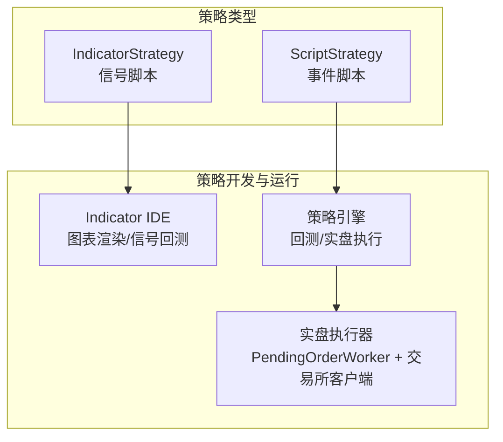
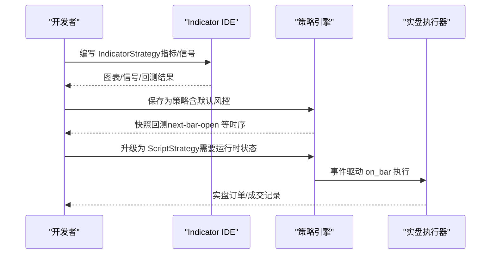
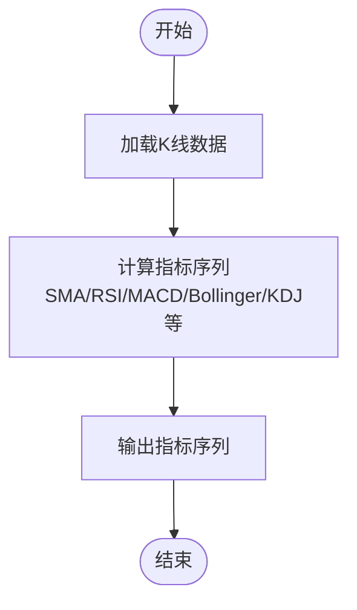
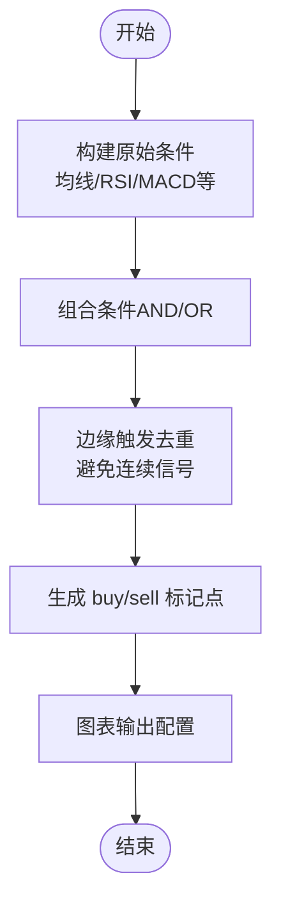
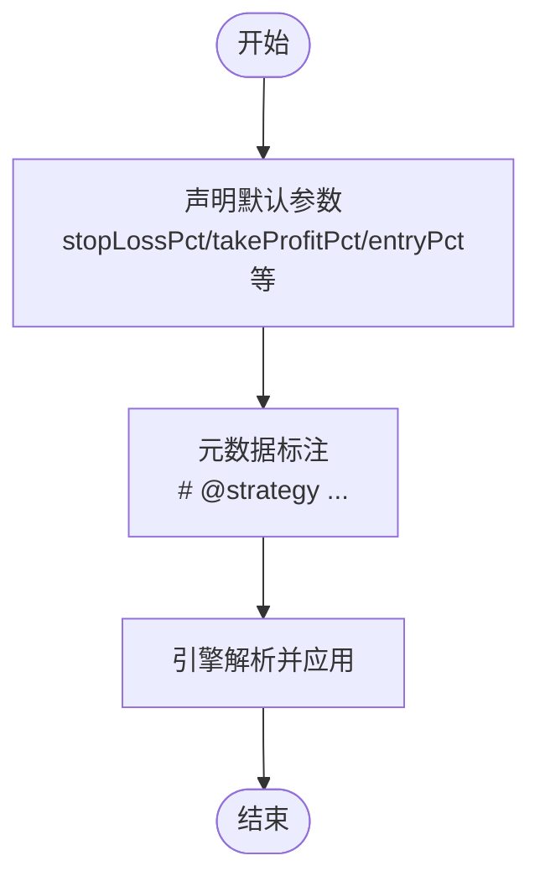
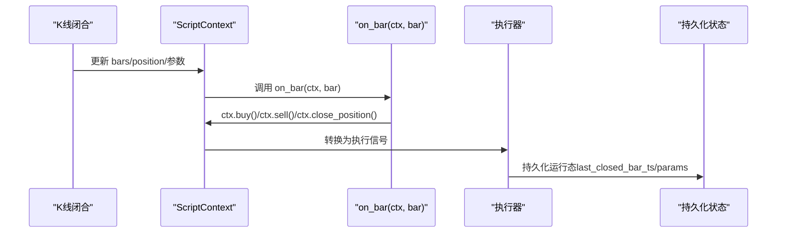
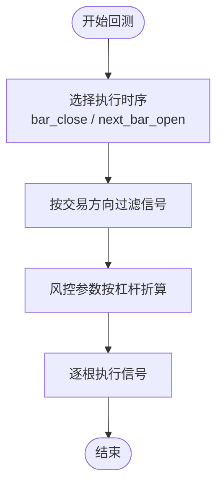
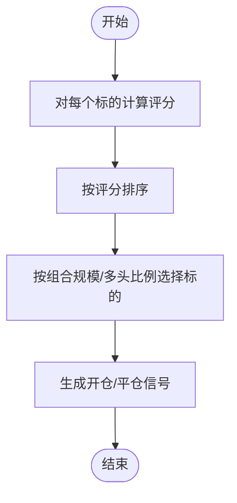
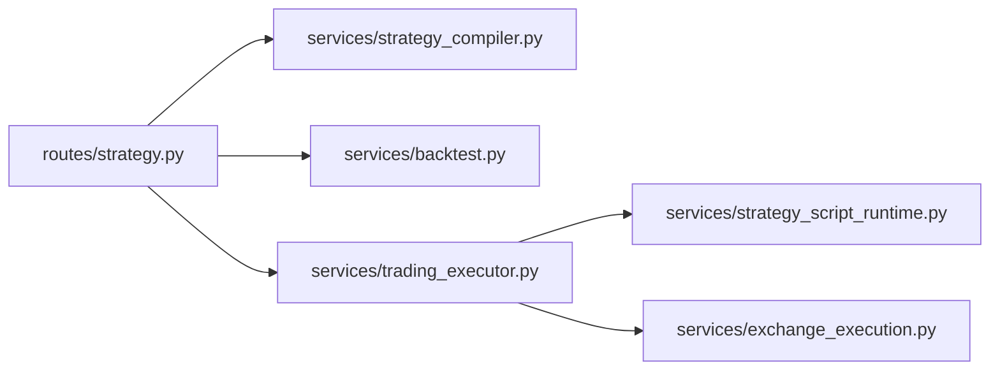

# 策略开发心智模型

<cite>
**本文引用的文件**
- [STRATEGY_DEV_GUIDE_CN.md](file://docs/STRATEGY_DEV_GUIDE_CN.md)
- [STRATEGY_DEV_GUIDE.md](file://docs/STRATEGY_DEV_GUIDE.md)
- [dual_ma_with_params.py](file://docs/examples/dual_ma_with_params.py)
- [multi_indicator_composite.py](file://docs/examples/multi_indicator_composite.py)
- [cross_sectional_momentum_rsi.py](file://docs/examples/cross_sectional_momentum_rsi.py)
- [strategy.py](file://backend_api_python/app/routes/strategy.py)
- [strategy_compiler.py](file://backend_api_python/app/services/strategy_compiler.py)
- [strategy_script_runtime.py](file://backend_api_python/app/services/strategy_script_runtime.py)
- [trading_executor.py](file://backend_api_python/app/services/trading_executor.py)
- [backtest.py](file://backend_api_python/app/services/backtest.py)
- [exchange_execution.py](file://backend_api_python/app/services/exchange_execution.py)
</cite>

## 目录
1. [引言](#引言)
2. [项目结构](#项目结构)
3. [核心组件](#核心组件)
4. [架构总览](#架构总览)
5. [详细组件分析](#详细组件分析)
6. [依赖分析](#依赖分析)
7. [性能考虑](#性能考虑)
8. [故障排查指南](#故障排查指南)
9. [结论](#结论)
10. [附录](#附录)

## 引言
本文件面向策略开发者，旨在帮助建立“策略开发心智模型”。围绕 IndicatorStrategy 与 ScriptStrategy 两种开发模式，阐明它们的核心差异、适用场景与选择原则；梳理分层架构理念（指标层、信号层、风险配置层）与职责划分；给出将复杂交易逻辑分解为清晰层次的方法论与最佳实践，并总结常见陷阱与规避策略。

## 项目结构
QuantDinger 提供两类策略开发路径：
- IndicatorStrategy：基于 DataFrame 的指标/信号脚本，适合图表渲染、信号型回测与策略原型验证。
- ScriptStrategy：基于 on_init/on_bar 的事件驱动脚本，适合需要运行时状态、动态风控与执行节奏控制的策略。

[无图表来源——该图为概念性结构示意]

## 核心组件
- 指标层：计算均线、RSI、ATR、布林带、过滤条件等技术指标序列。
- 信号层：生成布尔型 buy/sell 信号，表达“何时入场/出场”。
- 风险默认配置层：通过元数据声明默认风控参数（如止损、止盈、跟踪止损、入场占比等），表达“引擎如何默认控风险”。

上述三层必须分离，避免将“信号逻辑”“风控参数”“执行节奏”混杂在同一段代码中。

**章节来源**
- [STRATEGY_DEV_GUIDE_CN.md:1-1270](file://docs/STRATEGY_DEV_GUIDE_CN.md#L1-L1270)
- [STRATEGY_DEV_GUIDE.md:50-1270](file://docs/STRATEGY_DEV_GUIDE.md#L50-L1270)

## 架构总览
策略从“想法”到“回测/实盘”的整体流程如下：

**图表来源**
- [strategy.py:329-441](file://backend_api_python/app/routes/strategy.py#L329-L441)
- [backtest.py:3690-3714](file://backend_api_python/app/services/backtest.py#L3690-L3714)
- [trading_executor.py:790-800](file://backend_api_python/app/services/trading_executor.py#L790-L800)

**章节来源**
- [strategy.py:329-441](file://backend_api_python/app/routes/strategy.py#L329-L441)
- [backtest.py:3690-3714](file://backend_api_python/app/services/backtest.py#L3690-L3714)
- [trading_executor.py:790-800](file://backend_api_python/app/services/trading_executor.py#L790-L800)

## 详细组件分析

### 指标层（Indicator Layer）
- 职责：计算技术指标序列（均线、RSI、ATR、布林带、MACD、KDJ 等），为信号层提供基础数据。
- 特点：纯函数式、可复用、可叠加到图表；不涉及仓位、止盈止损、执行节奏。
- 示例：多指标组合策略中，分别计算 SMA、RSI、MACD、成交量均线，形成原始条件集合。

**图表来源**
- [multi_indicator_composite.py:47-66](file://docs/examples/multi_indicator_composite.py#L47-L66)

**章节来源**
- [multi_indicator_composite.py:1-109](file://docs/examples/multi_indicator_composite.py#L1-L109)

### 信号层（Signal Layer）
- 职责：基于指标层结果生成 buy/sell 信号，表达“何时入场/出场”。
- 关键点：使用边缘触发（去重连续信号），避免重复下单；支持 next-bar-open 等执行时序。
- 示例：双均线策略中，通过短期均线上穿/下穿长期均线生成金叉/死叉信号。

**图表来源**
- [dual_ma_with_params.py:68-89](file://docs/examples/dual_ma_with_params.py#L68-L89)

**章节来源**
- [dual_ma_with_params.py:1-64](file://docs/examples/dual_ma_with_params.py#L1-L64)

### 风险默认配置层（Risk Defaults Layer）
- 职责：通过元数据声明默认风控参数（止损、止盈、跟踪止损、入场占比、交易方向等），由引擎在回测/实盘中应用。
- 关键点：杠杆属于产品配置，不应出现在指标脚本中；默认风控与信号逻辑解耦。
- 示例：双均线策略与多指标组合策略中的 # @strategy 默认参数。

**图表来源**
- [dual_ma_with_params.py:24-33](file://docs/examples/dual_ma_with_params.py#L24-L33)
- [multi_indicator_composite.py:26-33](file://docs/examples/multi_indicator_composite.py#L26-L33)

**章节来源**
- [dual_ma_with_params.py:24-33](file://docs/examples/dual_ma_with_params.py#L24-L33)
- [multi_indicator_composite.py:26-33](file://docs/examples/multi_indicator_composite.py#L26-L33)

### ScriptStrategy 事件驱动执行
- 职责：在 on_bar 中读取 ctx.position、bars、param，按 bar 逐根执行，发出 buy/sell/close_position 等动作。
- 适用场景：需要运行时状态、动态止盈止损、分批加仓/减仓、冷却期、机器人式执行策略。
- 与回测对齐：ScriptBacktestContext 与 TradingExecutor 的 on_bar 行为保持一致。

**图表来源**
- [strategy_script_runtime.py:114-191](file://backend_api_python/app/services/strategy_script_runtime.py#L114-L191)
- [trading_executor.py:734-788](file://backend_api_python/app/services/trading_executor.py#L734-L788)

**章节来源**
- [strategy_script_runtime.py:1-191](file://backend_api_python/app/services/strategy_script_runtime.py#L1-L191)
- [trading_executor.py:734-788](file://backend_api_python/app/services/trading_executor.py#L734-L788)

### 回测与执行时序
- 回测时序：支持 bar_close 与 next_bar_open 等执行时序，避免前瞻偏差；根据 trade_direction 过滤多/空信号。
- 风控转换：将“百分比风控”按杠杆折算为价格阈值，支持跟踪止损激活/回调。

**图表来源**
- [backtest.py:2551-2578](file://backend_api_python/app/services/backtest.py#L2551-L2578)
- [backtest.py:3690-3714](file://backend_api_python/app/services/backtest.py#L3690-L3714)

**章节来源**
- [backtest.py:2551-2578](file://backend_api_python/app/services/backtest.py#L2551-L2578)
- [backtest.py:3690-3714](file://backend_api_python/app/services/backtest.py#L3690-L3714)

### 截面策略（Cross-Sectional）
- 职责：对多个标的打分、排序、择时建仓/平仓，生成跨时间维度的交易信号。
- 适用场景：多资产轮动、动量/反转因子组合。
- 注意：当前平台文档明确 cross_sectional 不在主策略快照回测/实盘链路内，示例用于研究参考。

**图表来源**
- [cross_sectional_momentum_rsi.py:15-71](file://docs/examples/cross_sectional_momentum_rsi.py#L15-L71)

**章节来源**
- [cross_sectional_momentum_rsi.py:1-71](file://docs/examples/cross_sectional_momentum_rsi.py#L1-L71)

## 依赖分析
- 路由层负责策略生命周期管理、回测发起与历史查询。
- 编译器将配置转化为 IndicatorStrategy 脚本，支撑可视化/参数化策略生成。
- 运行时层提供 ScriptStrategy 的安全执行环境与上下文封装。
- 执行器负责将脚本订单转换为执行信号，并与实盘链路对接。
- 回测服务负责信号队列构建、执行时序与风控参数转换。

**图表来源**
- [strategy.py:1-800](file://backend_api_python/app/routes/strategy.py#L1-L800)
- [strategy_compiler.py:1-689](file://backend_api_python/app/services/strategy_compiler.py#L1-L689)
- [strategy_script_runtime.py:1-191](file://backend_api_python/app/services/strategy_script_runtime.py#L1-L191)
- [trading_executor.py:1-800](file://backend_api_python/app/services/trading_executor.py#L1-L800)
- [backtest.py:893-2010](file://backend_api_python/app/services/backtest.py#L893-L2010)
- [exchange_execution.py:1-150](file://backend_api_python/app/services/exchange_execution.py#L1-L150)

**章节来源**
- [strategy.py:1-800](file://backend_api_python/app/routes/strategy.py#L1-L800)
- [strategy_compiler.py:1-689](file://backend_api_python/app/services/strategy_compiler.py#L1-L689)
- [strategy_script_runtime.py:1-191](file://backend_api_python/app/services/strategy_script_runtime.py#L1-L191)
- [trading_executor.py:1-800](file://backend_api_python/app/services/trading_executor.py#L1-L800)
- [backtest.py:893-2010](file://backend_api_python/app/services/backtest.py#L893-L2010)
- [exchange_execution.py:1-150](file://backend_api_python/app/services/exchange_execution.py#L1-L150)

## 性能考虑
- 回测时序与风控参数转换：在回测阶段将百分比风控按杠杆折算，避免每根 K 线重复计算。
- 执行去重：同一根蜡烛的重复信号在策略线程内进行去重，减少重复下单压力。
- 线程与资源：策略线程上限与资源监控，防止 OOM 与线程耗尽。
- 数据访问：K 线服务带缓存，降低频繁 IO 压力。

[本节为通用指导，无需具体文件引用]

## 故障排查指南
- 代码质量检查：缺失 on_init/on_bar、未声明参数默认值、未产生交易意图等提示，需按提示修复。
- 语法错误：编译器报错会包含行号与消息，定位修正。
- 运行时错误：脚本编译与执行失败会抛出异常，需检查 ctx.param、ctx.buy/sell/close_position 等调用。
- 执行器状态：若策略无法启动，检查线程上限与资源状态；查看最近一次启动失败原因。
- 风控与执行：确认执行时序（bar_close vs next_bar_open）、交易方向过滤、杠杆折算是否正确。

**章节来源**
- [strategy.py:67-122](file://backend_api_python/app/routes/strategy.py#L67-L122)
- [strategy.py:124-228](file://backend_api_python/app/routes/strategy.py#L124-L228)
- [trading_executor.py:395-456](file://backend_api_python/app/services/trading_executor.py#L395-L456)

## 结论
- 优先使用 IndicatorStrategy 原型化想法、验证信号与回测语义，再根据是否需要运行时状态决定是否升级为 ScriptStrategy。
- 将指标层、信号层、风险默认配置层严格分离，避免逻辑耦合与维护困难。
- 在回测与实盘中保持一致的执行时序与风控处理，确保策略一致性与可移植性。
- 遵循最佳实践，规避常见陷阱，逐步完善策略的鲁棒性与可扩展性。

[本节为总结性内容，无需具体文件引用]

## 附录

### 选择原则速查
- 仅需信号与图表：IndicatorStrategy
- 需要运行时状态/动态风控/机器人式执行：ScriptStrategy
- 信号稳定且默认风控足够：保留 IndicatorStrategy
- 需要冷却期/分批止盈/加仓/减仓：升级为 ScriptStrategy

**章节来源**
- [STRATEGY_DEV_GUIDE_CN.md:75-91](file://docs/STRATEGY_DEV_GUIDE_CN.md#L75-L91)
- [STRATEGY_DEV_GUIDE.md:75-84](file://docs/STRATEGY_DEV_GUIDE.md#L75-L84)

### 开发流程建议
- 先用 IndicatorStrategy 原型化
- 验证图表、信号密度与 next-bar-open 回测语义
- 补充 # @param 与 # @strategy 元数据
- 明确退出是“信号负责”还是“引擎负责”
- 保存策略后从持久化记录跑回测
- 仅在确需运行时仓位管理时迁移到 ScriptStrategy
- 配置/凭证/市场语义验证后再进入模拟/实盘

**章节来源**
- [STRATEGY_DEV_GUIDE_CN.md:1260-1269](file://docs/STRATEGY_DEV_GUIDE_CN.md#L1260-L1269)
- [STRATEGY_DEV_GUIDE.md:1260-1269](file://docs/STRATEGY_DEV_GUIDE.md#L1260-L1269)