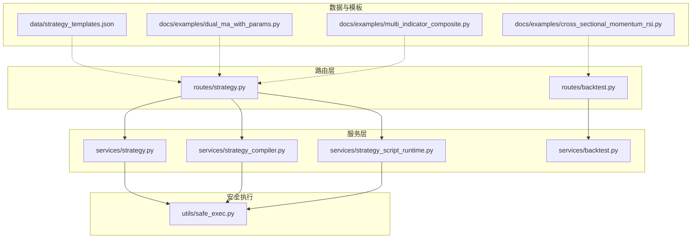
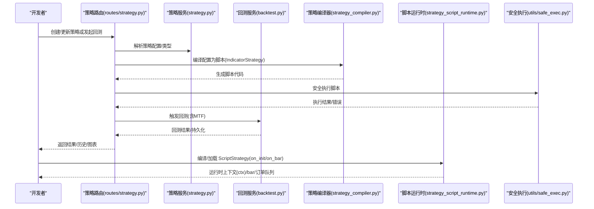
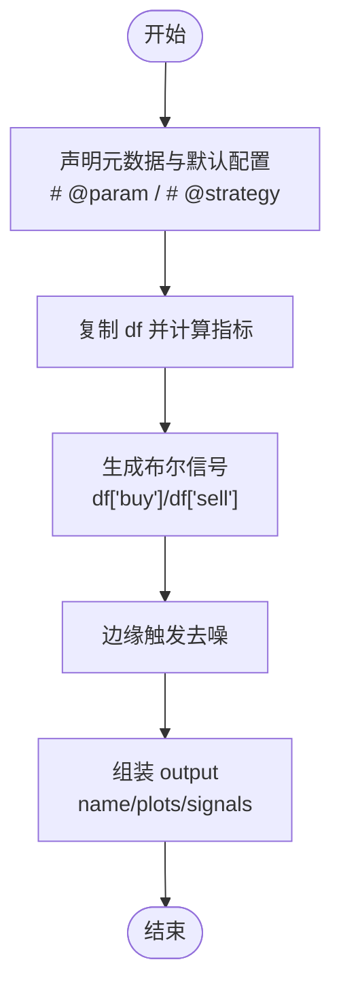
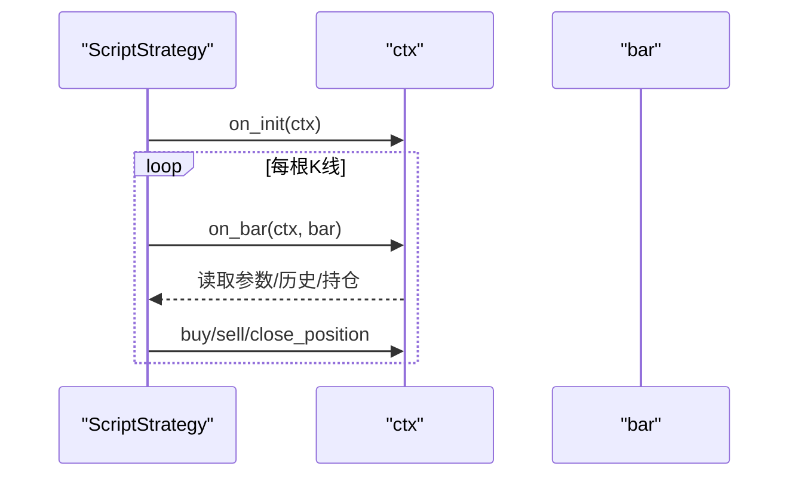
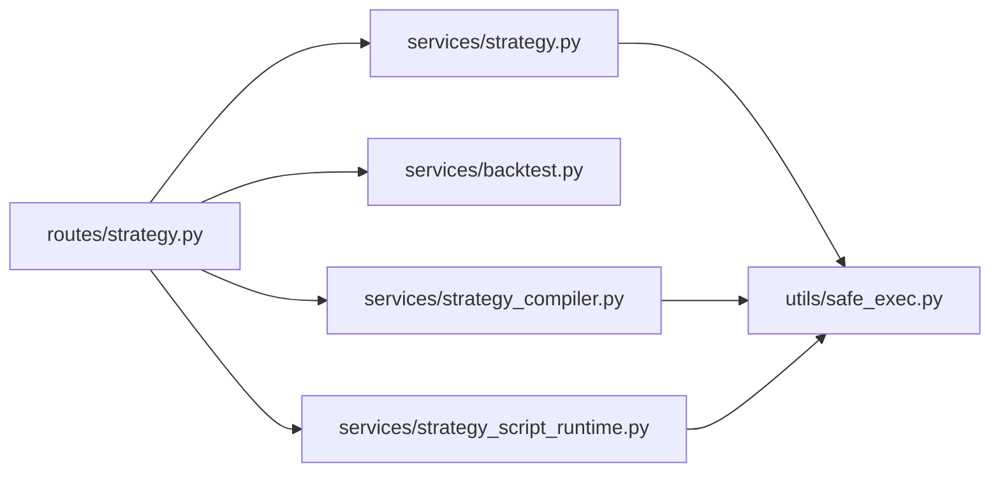

# 策略开发最佳实践

<cite>
**本文引用的文件**
- [strategy.py](file://backend_api_python/app/routes/strategy.py)
- [backtest.py](file://backend_api_python/app/services/backtest.py)
- [strategy.py](file://backend_api_python/app/services/strategy.py)
- [strategy_compiler.py](file://backend_api_python/app/services/strategy_compiler.py)
- [strategy_script_runtime.py](file://backend_api_python/app/services/strategy_script_runtime.py)
- [strategy_templates.json](file://backend_api_python/app/data/strategy_templates.json)
- [dual_ma_with_params.py](file://docs/examples/dual_ma_with_params.py)
- [multi_indicator_composite.py](file://docs/examples/multi_indicator_composite.py)
- [cross_sectional_momentum_rsi.py](file://docs/examples/cross_sectional_momentum_rsi.py)
- [STRATEGY_DEV_GUIDE_CN.md](file://docs/STRATEGY_DEV_GUIDE_CN.md)
- [safe_exec.py](file://backend_api_python/app/utils/safe_exec.py)
</cite>

## 目录
1. [引言](#引言)
2. [项目结构](#项目结构)
3. [核心组件](#核心组件)
4. [架构总览](#架构总览)
5. [详细组件分析](#详细组件分析)
6. [依赖分析](#依赖分析)
7. [性能考量](#性能考量)
8. [故障排查指南](#故障排查指南)
9. [结论](#结论)
10. [附录](#附录)

## 引言
本技术文档面向策略开发者，系统阐述 QuantDinger 的策略开发最佳实践，聚焦两类开发模式：IndicatorStrategy（基于 DataFrame 的指标/信号脚本）与 ScriptStrategy（基于 on_init/on_bar 的事件驱动脚本）。文档覆盖心智模型、分层架构、代码组织、参数声明与默认配置、信号生成与图表输出、经典策略示例、调试与测试、性能优化与内存管理、并发处理等主题，帮助开发者构建可回测、可落地的高质量策略。

## 项目结构
QuantDinger 的策略开发与运行涉及后端服务、路由层、回测引擎、脚本运行时、模板与示例、以及安全执行工具。关键目录与文件如下：
- 路由层：提供策略 CRUD、回测、历史查询等 API
- 服务层：策略服务、回测服务、脚本编译器、脚本运行时
- 数据与模板：策略模板 JSON、示例脚本
- 安全执行：沙箱与超时控制

**图表来源**
- [strategy.py:1-200](file://backend_api_python/app/routes/strategy.py#L1-L200)
- [backtest.py:1-200](file://backend_api_python/app/services/backtest.py#L1-L200)
- [strategy.py:1-200](file://backend_api_python/app/services/strategy.py#L1-L200)
- [strategy_compiler.py:1-120](file://backend_api_python/app/services/strategy_compiler.py#L1-L120)
- [strategy_script_runtime.py:1-120](file://backend_api_python/app/services/strategy_script_runtime.py#L1-L120)
- [strategy_templates.json:1-120](file://backend_api_python/app/data/strategy_templates.json#L1-L120)
- [dual_ma_with_params.py:1-64](file://docs/examples/dual_ma_with_params.py#L1-L64)
- [multi_indicator_composite.py:1-109](file://docs/examples/multi_indicator_composite.py#L1-L109)
- [cross_sectional_momentum_rsi.py:1-71](file://docs/examples/cross_sectional_momentum_rsi.py#L1-L71)
- [safe_exec.py:1-120](file://backend_api_python/app/utils/safe_exec.py#L1-L120)

**章节来源**
- [strategy.py:1-200](file://backend_api_python/app/routes/strategy.py#L1-L200)
- [backtest.py:1-200](file://backend_api_python/app/services/backtest.py#L1-L200)
- [strategy.py:1-200](file://backend_api_python/app/services/strategy.py#L1-L200)
- [strategy_compiler.py:1-120](file://backend_api_python/app/services/strategy_compiler.py#L1-L120)
- [strategy_script_runtime.py:1-120](file://backend_api_python/app/services/strategy_script_runtime.py#L1-L120)
- [strategy_templates.json:1-120](file://backend_api_python/app/data/strategy_templates.json#L1-L120)
- [dual_ma_with_params.py:1-64](file://docs/examples/dual_ma_with_params.py#L1-L64)
- [multi_indicator_composite.py:1-109](file://docs/examples/multi_indicator_composite.py#L1-L109)
- [cross_sectional_momentum_rsi.py:1-71](file://docs/examples/cross_sectional_momentum_rsi.py#L1-L71)
- [safe_exec.py:1-120](file://backend_api_python/app/utils/safe_exec.py#L1-L120)

## 核心组件
- 策略路由与服务
  - 路由层提供策略的创建、批量启停、回测、历史查询、交易记录查询等功能
  - 策略服务负责策略类型判定、运行中策略查询、交易配置解析与显示、数据库交互等
- 回测服务
  - 提供标准回测与多时间框架回测（MTF），支持缓存、精度信息、持久化
- 策略编译器
  - 将配置 JSON 编译为可执行的 Python 脚本，生成指标、信号、核心循环与输出
- 脚本运行时
  - 提供 ScriptStrategy 的运行时上下文（ctx）、bar 封装、位置对象、订单队列等
- 安全执行工具
  - 构建受限内置集、白名单导入模块、超时与内存限制、子进程隔离

**章节来源**
- [strategy.py:295-714](file://backend_api_python/app/routes/strategy.py#L295-L714)
- [strategy.py:14-120](file://backend_api_python/app/services/strategy.py#L14-L120)
- [backtest.py:64-142](file://backend_api_python/app/services/backtest.py#L64-L142)
- [strategy_compiler.py:4-35](file://backend_api_python/app/services/strategy_compiler.py#L4-L35)
- [strategy_script_runtime.py:16-191](file://backend_api_python/app/services/strategy_script_runtime.py#L16-L191)
- [safe_exec.py:24-93](file://backend_api_python/app/utils/safe_exec.py#L24-L93)

## 架构总览
策略开发与执行的端到端流程如下：

**图表来源**
- [strategy.py:295-714](file://backend_api_python/app/routes/strategy.py#L295-L714)
- [strategy.py:14-120](file://backend_api_python/app/services/strategy.py#L14-L120)
- [backtest.py:64-142](file://backend_api_python/app/services/backtest.py#L64-L142)
- [strategy_compiler.py:4-35](file://backend_api_python/app/services/strategy_compiler.py#L4-L35)
- [strategy_script_runtime.py:159-191](file://backend_api_python/app/services/strategy_script_runtime.py#L159-L191)
- [safe_exec.py:157-244](file://backend_api_python/app/utils/safe_exec.py#L157-L244)

## 详细组件分析

### 心智模型与分层架构
- 心智模型
  - 将策略拆分为三层：指标层（均线、RSI、ATR、布林带等）、信号层（df['buy']/df['sell']）、风险默认配置层（# @strategy）
  - 明确“进出场由谁负责”：信号层负责“何时进出场”，# @strategy 负责“默认风险与仓位”
- 分层边界
  - IndicatorStrategy：适合信号型回测与图表渲染
  - ScriptStrategy：适合有状态、动态风控、分批加减仓、bot 执行

**章节来源**
- [STRATEGY_DEV_GUIDE_CN.md:20-73](file://docs/STRATEGY_DEV_GUIDE_CN.md#L20-L73)
- [STRATEGY_DEV_GUIDE_CN.md:57-72](file://docs/STRATEGY_DEV_GUIDE_CN.md#L57-L72)

### IndicatorStrategy 开发流程与最佳实践
- 参数声明与默认配置
  - 使用 # @param 声明可调参数；使用 # @strategy 声明默认风险与仓位
  - 参数通过 params.get(...) 读取，避免硬编码
- 指标层
  - 复制 df，避免原地修改；仅使用允许的内置与模块
- 信号层
  - 生成布尔型 df['buy'] 与 df['sell']，尽量采用边缘触发，避免连续信号
- 图表输出
  - output 包含 name、plots（指标序列）、signals（买卖标记）

**图表来源**
- [STRATEGY_DEV_GUIDE_CN.md:93-296](file://docs/STRATEGY_DEV_GUIDE_CN.md#L93-L296)
- [dual_ma_with_params.py:17-64](file://docs/examples/dual_ma_with_params.py#L17-L64)
- [multi_indicator_composite.py:13-109](file://docs/examples/multi_indicator_composite.py#L13-L109)

**章节来源**
- [STRATEGY_DEV_GUIDE_CN.md:93-296](file://docs/STRATEGY_DEV_GUIDE_CN.md#L93-L296)
- [dual_ma_with_params.py:17-64](file://docs/examples/dual_ma_with_params.py#L17-L64)
- [multi_indicator_composite.py:13-109](file://docs/examples/multi_indicator_composite.py#L13-L109)

### ScriptStrategy 开发流程与最佳实践
- 必需函数
  - on_init(ctx)：初始化或日志
  - on_bar(ctx, bar)：逐根执行的主逻辑
- 可用对象
  - ctx.param(name, default)、ctx.bars(n)、ctx.position、ctx.balance/equity、ctx.log(...)
  - 下单：ctx.buy()/ctx.sell()/ctx.close_position()
- 退出与风控
  - 基于持仓状态动态止损止盈；必要时使用 close_position() 明确全部平仓意图
  - amount 更适合表达下单意图，最终仓位由保存后的策略配置决定

**图表来源**
- [STRATEGY_DEV_GUIDE_CN.md:570-781](file://docs/STRATEGY_DEV_GUIDE_CN.md#L570-L781)
- [strategy_script_runtime.py:114-191](file://backend_api_python/app/services/strategy_script_runtime.py#L114-L191)

**章节来源**
- [STRATEGY_DEV_GUIDE_CN.md:570-781](file://docs/STRATEGY_DEV_GUIDE_CN.md#L570-L781)
- [strategy_script_runtime.py:114-191](file://backend_api_python/app/services/strategy_script_runtime.py#L114-L191)

### 策略模板与示例
- 模板
  - 提供多种策略类别（趋势、均值回归、波动率、网格、被动投资、统计套利、组合轮动等）与默认参数
- 示例
  - 双均线策略、多指标组合策略、截面动量+RSI 示例

**章节来源**
- [strategy_templates.json:1-191](file://backend_api_python/app/data/strategy_templates.json#L1-L191)
- [dual_ma_with_params.py:1-64](file://docs/examples/dual_ma_with_params.py#L1-L64)
- [multi_indicator_composite.py:1-109](file://docs/examples/multi_indicator_composite.py#L1-L109)
- [cross_sectional_momentum_rsi.py:1-71](file://docs/examples/cross_sectional_momentum_rsi.py#L1-L71)

### 回测与持久化
- 回测服务
  - 支持标准回测与多时间框架回测（MTF），具备缓存、精度信息、持久化
- 路由层
  - 提供回测发起、历史查询、运行详情查询
- 存储
  - qd_backtest_runs、qd_backtest_trades、qd_backtest_equity_points 等表结构

**章节来源**
- [backtest.py:64-142](file://backend_api_python/app/services/backtest.py#L64-L142)
- [strategy.py:295-441](file://backend_api_python/app/routes/strategy.py#L295-L441)

### 安全执行与沙箱
- 白名单内置与模块导入
- 超时与内存限制（线程定时器 + 异步异常注入）
- 子进程隔离执行
- 代码安全校验（正则 + AST）

**章节来源**
- [safe_exec.py:24-93](file://backend_api_python/app/utils/safe_exec.py#L24-L93)
- [safe_exec.py:157-244](file://backend_api_python/app/utils/safe_exec.py#L157-L244)
- [safe_exec.py:248-354](file://backend_api_python/app/utils/safe_exec.py#L248-L354)
- [safe_exec.py:358-471](file://backend_api_python/app/utils/safe_exec.py#L358-L471)

## 依赖分析
- 组件耦合
  - 路由层依赖策略服务与回测服务
  - 策略服务依赖安全执行工具与数据库
  - 编译器与脚本运行时依赖安全执行工具
- 外部依赖
  - pandas/numpy、ccxt（交易所访问）、数据库（PostgreSQL）

**图表来源**
- [strategy.py:1-50](file://backend_api_python/app/routes/strategy.py#L1-L50)
- [strategy.py:1-20](file://backend_api_python/app/services/strategy.py#L1-L20)
- [backtest.py:1-20](file://backend_api_python/app/services/backtest.py#L1-L20)
- [strategy_compiler.py:1-10](file://backend_api_python/app/services/strategy_compiler.py#L1-L10)
- [strategy_script_runtime.py:1-15](file://backend_api_python/app/services/strategy_script_runtime.py#L1-L15)
- [safe_exec.py:1-20](file://backend_api_python/app/utils/safe_exec.py#L1-L20)

**章节来源**
- [strategy.py:1-50](file://backend_api_python/app/routes/strategy.py#L1-L50)
- [strategy.py:1-20](file://backend_api_python/app/services/strategy.py#L1-L20)
- [backtest.py:1-20](file://backend_api_python/app/services/backtest.py#L1-L20)
- [strategy_compiler.py:1-10](file://backend_api_python/app/services/strategy_compiler.py#L1-L10)
- [strategy_script_runtime.py:1-15](file://backend_api_python/app/services/strategy_script_runtime.py#L1-L15)
- [safe_exec.py:1-20](file://backend_api_python/app/utils/safe_exec.py#L1-L20)

## 性能考量
- 回测性能
  - 多时间框架回测（MTF）在加密市场启用，1 分钟回测限制天数以控制规模
  - K 线缓存（带 TTL）避免重复拉取
- 内存与安全
  - 沙箱内置与模块白名单，限制 I/O 与危险操作
  - 执行超时与内存上限，防止长时间运行与内存泄漏
- 并发
  - 交换连接测试使用信号量限制并发，避免 CPU 与限流压力

**章节来源**
- [backtest.py:25-82](file://backend_api_python/app/services/backtest.py#L25-L82)
- [safe_exec.py:157-205](file://backend_api_python/app/utils/safe_exec.py#L157-L205)
- [strategy.py:17-19](file://backend_api_python/app/services/strategy.py#L17-L19)

## 故障排查指南
- 代码质量检查
  - 缺少 on_init/on_bar、未声明参数默认值、未发出订单意图等提示
- 安全执行错误
  - 超时、内存不足、危险模式（如 eval/exec/open 等）被拒绝
- 回测范围限制
  - 不同时间框架的最大回测天数限制，超出将报错
- 交易执行与风控
  - 未正确区分“信号退出”与“引擎默认退出”，导致回测/实盘结果不一致

**章节来源**
- [strategy.py:45-122](file://backend_api_python/app/routes/strategy.py#L45-L122)
- [safe_exec.py:358-471](file://backend_api_python/app/utils/safe_exec.py#L358-L471)
- [backtest.py:194-200](file://backend_api_python/app/services/backtest.py#L194-L200)

## 结论
QuantDinger 的策略开发体系以“分层清晰、可回测、可落地”为目标：IndicatorStrategy 专注信号与图表，ScriptStrategy 专注运行时状态与风控。通过参数与默认配置分离、边缘触发信号、安全执行与回测持久化，开发者可以高效迭代策略并稳定落地。建议遵循本文的心智模型与最佳实践，结合模板与示例快速起步，并在调试与性能优化阶段充分利用回测与安全工具。

## 附录
- 经典策略示例路径
  - 双均线策略：[dual_ma_with_params.py:1-64](file://docs/examples/dual_ma_with_params.py#L1-L64)
  - 多指标组合策略：[multi_indicator_composite.py:1-109](file://docs/examples/multi_indicator_composite.py#L1-L109)
  - 截面动量+RSI 示例：[cross_sectional_momentum_rsi.py:1-71](file://docs/examples/cross_sectional_momentum_rsi.py#L1-L71)
- 指南文档
  - [STRATEGY_DEV_GUIDE_CN.md:1-1270](file://docs/STRATEGY_DEV_GUIDE_CN.md#L1-L1270)