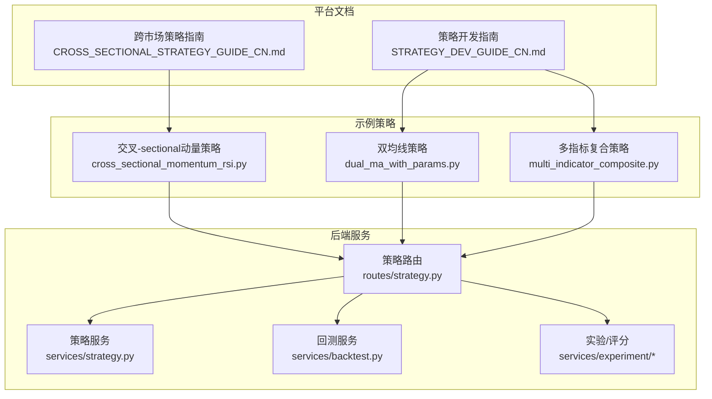
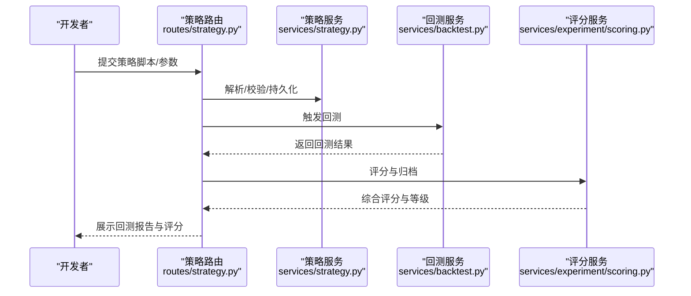
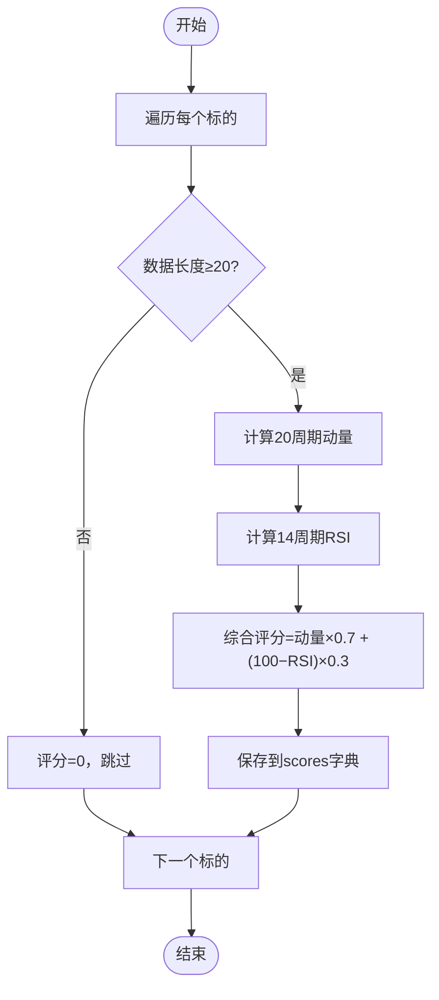
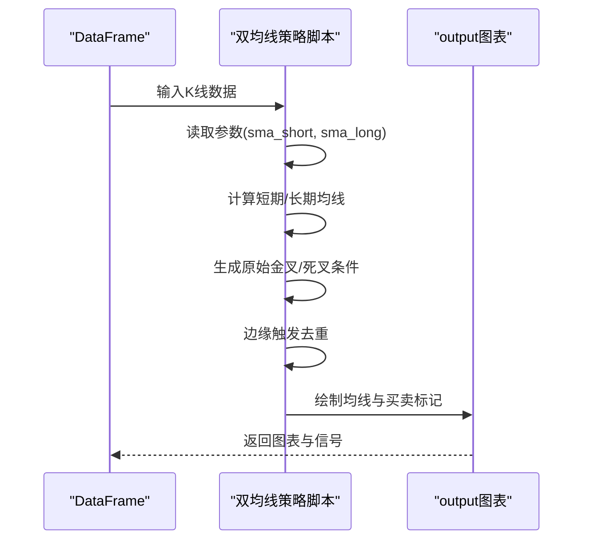
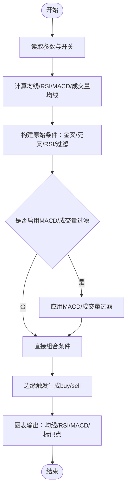
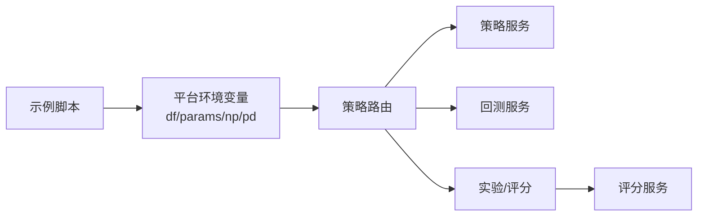
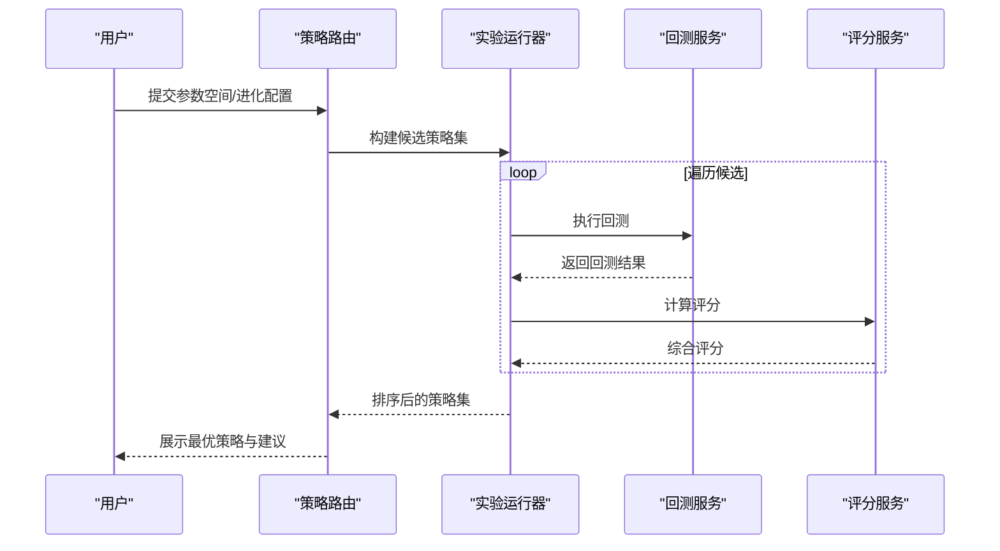

# 策略示例展示

<cite>
**本文引用的文件**
- [cross_sectional_momentum_rsi.py](file://docs/examples/cross_sectional_momentum_rsi.py)
- [dual_ma_with_params.py](file://docs/examples/dual_ma_with_params.py)
- [multi_indicator_composite.py](file://docs/examples/multi_indicator_composite.py)
- [CROSS_SECTIONAL_STRATEGY_GUIDE_CN.md](file://docs/CROSS_SECTIONAL_STRATEGY_GUIDE_CN.md)
- [STRATEGY_DEV_GUIDE_CN.md](file://docs/STRATEGY_DEV_GUIDE_CN.md)
- [strategy.py](file://backend_api_python/app/routes/strategy.py)
- [strategy.py](file://backend_api_python/app/services/strategy.py)
- [backtest.py](file://backend_api_python/app/services/backtest.py)
- [scoring.py](file://backend_api_python/app/services/experiment/scoring.py)
- [evolution.py](file://backend_api_python/app/services/experiment/evolution.py)
- [prompts.py](file://backend_api_python/app/services/experiment/prompts.py)
- [runner.py](file://backend_api_python/app/services/experiment/runner.py)
- [strategy_templates.json](file://backend_api_python/app/data/strategy_templates.json)
</cite>

## 目录
1. [引言](#引言)
2. [项目结构](#项目结构)
3. [核心组件](#核心组件)
4. [架构总览](#架构总览)
5. [详细组件分析](#详细组件分析)
6. [依赖分析](#依赖分析)
7. [性能考量](#性能考量)
8. [故障排查指南](#故障排查指南)
9. [结论](#结论)
10. [附录](#附录)

## 引言
本文件围绕 QuantDinger 的策略示例，系统性解析三个经典策略：交叉-sectional动量策略、双均线策略、多指标复合策略。内容涵盖：
- 实现原理与代码结构
- 参数配置与信号生成逻辑
- 图表输出与可视化
- 性能评估与回测流程
- 参数敏感性分析与策略优化建议
- 基于示例的策略创新路径

## 项目结构
策略示例位于文档目录，策略运行与回测由后端服务支撑，形成“示例脚本 + 平台回测/评分 + API路由”的闭环。

**图表来源**
- [cross_sectional_momentum_rsi.py:1-71](file://docs/examples/cross_sectional_momentum_rsi.py#L1-L71)
- [dual_ma_with_params.py:1-64](file://docs/examples/dual_ma_with_params.py#L1-L64)
- [multi_indicator_composite.py:1-109](file://docs/examples/multi_indicator_composite.py#L1-L109)
- [CROSS_SECTIONAL_STRATEGY_GUIDE_CN.md:1-224](file://docs/CROSS_SECTIONAL_STRATEGY_GUIDE_CN.md#L1-L224)
- [STRATEGY_DEV_GUIDE_CN.md:1-800](file://docs/STRATEGY_DEV_GUIDE_CN.md#L1-L800)
- [strategy.py:1-800](file://backend_api_python/app/routes/strategy.py#L1-L800)
- [strategy.py:1-800](file://backend_api_python/app/services/strategy.py#L1-L800)
- [backtest.py:1-200](file://backend_api_python/app/services/backtest.py#L1-L200)
- [scoring.py:1-116](file://backend_api_python/app/services/experiment/scoring.py#L1-L116)
- [evolution.py:1-47](file://backend_api_python/app/services/experiment/evolution.py#L1-L47)
- [prompts.py:113-149](file://backend_api_python/app/services/experiment/prompts.py#L113-L149)
- [runner.py:356-390](file://backend_api_python/app/services/experiment/runner.py#L356-L390)

**章节来源**
- [cross_sectional_momentum_rsi.py:1-71](file://docs/examples/cross_sectional_momentum_rsi.py#L1-L71)
- [dual_ma_with_params.py:1-64](file://docs/examples/dual_ma_with_params.py#L1-L64)
- [multi_indicator_composite.py:1-109](file://docs/examples/multi_indicator_composite.py#L1-L109)
- [CROSS_SECTIONAL_STRATEGY_GUIDE_CN.md:1-224](file://docs/CROSS_SECTIONAL_STRATEGY_GUIDE_CN.md#L1-L224)
- [STRATEGY_DEV_GUIDE_CN.md:1-800](file://docs/STRATEGY_DEV_GUIDE_CN.md#L1-L800)

## 核心组件
- 示例策略脚本：提供参数声明、信号生成、图表输出与默认风控配置的最小可运行单元。
- 平台文档：指导参数与风控配置、截面策略配置与回测语义。
- 后端服务：提供策略路由、回测执行、评分与实验（参数空间探索）能力。

**章节来源**
- [STRATEGY_DEV_GUIDE_CN.md:93-295](file://docs/STRATEGY_DEV_GUIDE_CN.md#L93-L295)
- [strategy.py:295-441](file://backend_api_python/app/routes/strategy.py#L295-L441)
- [backtest.py:64-200](file://backend_api_python/app/services/backtest.py#L64-L200)
- [scoring.py:10-116](file://backend_api_python/app/services/experiment/scoring.py#L10-L116)

## 架构总览
策略从“示例脚本”出发，经“平台回测/评分/实验”完成验证与优化，最终沉淀为可执行的策略快照。

**图表来源**
- [strategy.py:295-441](file://backend_api_python/app/routes/strategy.py#L295-L441)
- [strategy.py:1-800](file://backend_api_python/app/services/strategy.py#L1-L800)
- [backtest.py:64-200](file://backend_api_python/app/services/backtest.py#L64-L200)
- [scoring.py:23-75](file://backend_api_python/app/services/experiment/scoring.py#L23-L75)

## 详细组件分析

### 交叉-sectional动量策略（截面研究示例）
- 设计思路
  - 对多个标的分别计算动量与RSI反转评分，按综合得分排序，择优做多/做空。
  - 适用于多资产轮动与跨市场择时。
- 关键实现要点
  - 遍历标的，确保数据长度足够后计算20周期动量与14周期RSI。
  - 综合评分=动量×0.7 + (100−RSI)×0.3，体现趋势与反转的平衡。
  - 输出scores字典，可选提供rankings列表。
- 信号与风控
  - 示例脚本未直接生成buy/sell信号，而是提供评分与排序思路，便于后续接入平台的截面策略链路。
- 图表输出
  - 该示例为研究参考，不直接生成output图表。
- 与平台的衔接
  - 截面策略配置与回测链路在平台文档中有专门说明，当前示例更偏向研究用途。

**图表来源**
- [cross_sectional_momentum_rsi.py:26-61](file://docs/examples/cross_sectional_momentum_rsi.py#L26-L61)

**章节来源**
- [cross_sectional_momentum_rsi.py:1-71](file://docs/examples/cross_sectional_momentum_rsi.py#L1-L71)
- [CROSS_SECTIONAL_STRATEGY_GUIDE_CN.md:60-123](file://docs/CROSS_SECTIONAL_STRATEGY_GUIDE_CN.md#L60-L123)

### 双均线策略（参数与风控示例）
- 设计思路
  - 使用短期/长期均线交叉生成买卖信号，配合平台默认风控参数，适合快速验证与演示。
- 关键实现要点
  - 参数声明：短期/长期均线周期，通过params读取。
  - 信号生成：边缘触发（避免连续发信号），使用shift(1)消除重复。
  - 图表输出：绘制均线与买卖标记点。
- 风控配置
  - 默认止损、止盈、入场资金占比、跟踪止损等通过# @strategy声明，便于UI与引擎识别。
- 回测语义
  - 信号按K线收盘确认，下一根K线开盘价成交，避免未来函数。

**图表来源**
- [dual_ma_with_params.py:31-64](file://docs/examples/dual_ma_with_params.py#L31-L64)

**章节来源**
- [dual_ma_with_params.py:1-64](file://docs/examples/dual_ma_with_params.py#L1-L64)
- [STRATEGY_DEV_GUIDE_CN.md:93-295](file://docs/STRATEGY_DEV_GUIDE_CN.md#L93-L295)

### 多指标复合策略（组合过滤示例）
- 设计思路
  - 组合均线、RSI、MACD与成交量过滤，提升信号稳定性与过滤噪声。
- 关键实现要点
  - 参数声明：短期/长期均线、RSI周期与阈值、是否启用MACD/成交量过滤及倍数。
  - 指标计算：RSI、MACD、成交量均线。
  - 原始条件组合：金叉/死叉、RSI超卖/超买、MACD多空、成交量放大。
  - 边缘触发信号：避免连续触发。
  - 图表输出：叠加均线、RSI、MACD与买卖标记点。
- 风控配置
  - 默认止损、止盈、跟踪止损参数通过# @strategy声明，支持双向交易。

**图表来源**
- [multi_indicator_composite.py:35-109](file://docs/examples/multi_indicator_composite.py#L35-L109)

**章节来源**
- [multi_indicator_composite.py:1-109](file://docs/examples/multi_indicator_composite.py#L1-L109)
- [STRATEGY_DEV_GUIDE_CN.md:93-295](file://docs/STRATEGY_DEV_GUIDE_CN.md#L93-L295)

## 依赖分析
- 示例脚本依赖平台提供的df、params、np/pd等环境变量与默认输出结构。
- 平台回测与评分依赖后端服务，后者提供数据缓存、回测执行、结果持久化与评分算法。
- 实验模块支持参数空间探索与AI辅助生成候选策略。

**图表来源**
- [strategy.py:295-441](file://backend_api_python/app/routes/strategy.py#L295-L441)
- [strategy.py:1-800](file://backend_api_python/app/services/strategy.py#L1-L800)
- [backtest.py:64-200](file://backend_api_python/app/services/backtest.py#L64-L200)
- [scoring.py:10-116](file://backend_api_python/app/services/experiment/scoring.py#L10-L116)

**章节来源**
- [strategy.py:295-441](file://backend_api_python/app/routes/strategy.py#L295-L441)
- [backtest.py:64-200](file://backend_api_python/app/services/backtest.py#L64-L200)
- [scoring.py:10-116](file://backend_api_python/app/services/experiment/scoring.py#L10-L116)

## 性能考量
- 回测范围与时频限制
  - 不同时间框架支持的最大回测天数不同，避免过长回测导致性能瓶颈。
- 数据缓存
  - K线缓存按时间窗与最大容量管理，减少重复拉取。
- 评分权重与样本量
  - 评分服务对收益、夏普、最大回撤、胜率、稳定性等维度加权，小样本会扣分。

**章节来源**
- [backtest.py:68-82](file://backend_api_python/app/services/backtest.py#L68-L82)
- [backtest.py:25-62](file://backend_api_python/app/services/backtest.py#L25-L62)
- [scoring.py:13-21](file://backend_api_python/app/services/experiment/scoring.py#L13-L21)
- [scoring.py:59-63](file://backend_api_python/app/services/experiment/scoring.py#L59-L63)

## 故障排查指南
- 策略代码质量
  - 缺少必要函数（如on_bar/on_init）、未声明参数默认值、未检测到订单意图等，都会产生提示或错误。
- 回测执行
  - 回测日期范围超过限制、策略未找到、参数缺失等会导致失败。
- 截面策略
  - 检查cs_strategy_type、symbol_list、调仓频率与指标是否正确填充scores。

**章节来源**
- [strategy.py:45-121](file://backend_api_python/app/routes/strategy.py#L45-L121)
- [strategy.py:329-441](file://backend_api_python/app/routes/strategy.py#L329-L441)
- [CROSS_SECTIONAL_STRATEGY_GUIDE_CN.md:210-224](file://docs/CROSS_SECTIONAL_STRATEGY_GUIDE_CN.md#L210-L224)

## 结论
- 三个示例分别覆盖“截面研究思路”“参数与风控示例”“多因子组合过滤”，体现了从简单到复杂的策略演进路径。
- 平台提供了完善的参数声明、信号生成、图表输出与默认风控机制，便于快速验证与落地。
- 回测与评分体系支持策略性能量化与参数空间探索，为策略优化提供数据支撑。

## 附录

### 策略参数配置清单
- 双均线策略
  - 参数：短期/长期均线周期
  - 风控：止损、止盈、入场资金占比、跟踪止损、交易方向
- 多指标复合策略
  - 参数：短期/长期均线、RSI周期与阈值、是否启用MACD/成交量过滤、成交量倍数
  - 风控：止损、止盈、跟踪止损、激活阈值、交易方向
- 截面策略（研究参考）
  - 评分：动量权重、RSI反转权重
  - 排序：自动或手动指定

**章节来源**
- [dual_ma_with_params.py:21-29](file://docs/examples/dual_ma_with_params.py#L21-L29)
- [multi_indicator_composite.py:16-34](file://docs/examples/multi_indicator_composite.py#L16-L34)
- [cross_sectional_momentum_rsi.py:15-18](file://docs/examples/cross_sectional_momentum_rsi.py#L15-L18)

### 回测与评分流程
- 回测
  - 提交策略与参数，平台解析并执行回测，返回结果与成交明细。
- 评分
  - 基于多因子权重计算综合评分，支持按市场阶段（牛市/熊市/震荡/高波动）调整拟合度。
- 实验
  - 支持网格/随机参数空间探索，AI辅助生成候选策略并排序。

**图表来源**
- [runner.py:356-390](file://backend_api_python/app/services/experiment/runner.py#L356-L390)
- [evolution.py:16-47](file://backend_api_python/app/services/experiment/evolution.py#L16-L47)
- [prompts.py:120-149](file://backend_api_python/app/services/experiment/prompts.py#L120-L149)
- [scoring.py:23-75](file://backend_api_python/app/services/experiment/scoring.py#L23-L75)

**章节来源**
- [runner.py:356-390](file://backend_api_python/app/services/experiment/runner.py#L356-L390)
- [evolution.py:16-47](file://backend_api_python/app/services/experiment/evolution.py#L16-L47)
- [prompts.py:120-149](file://backend_api_python/app/services/experiment/prompts.py#L120-L149)
- [scoring.py:23-75](file://backend_api_python/app/services/experiment/scoring.py#L23-L75)

### 策略模板与一键导入
- 平台提供多种策略模板（如均线交叉、RSI超卖反弹、MACD背离等），可直接导入并调整参数。

**章节来源**
- [strategy_templates.json:1-191](file://backend_api_python/app/data/strategy_templates.json#L1-L191)