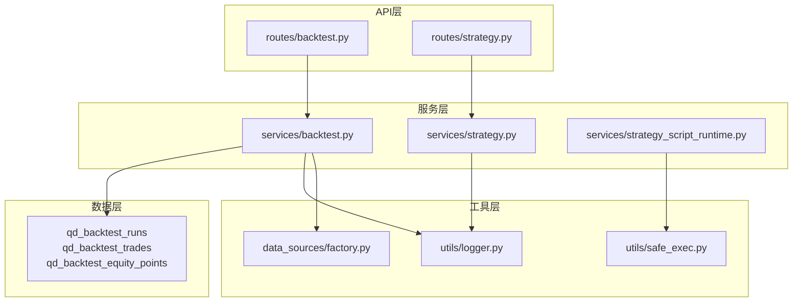
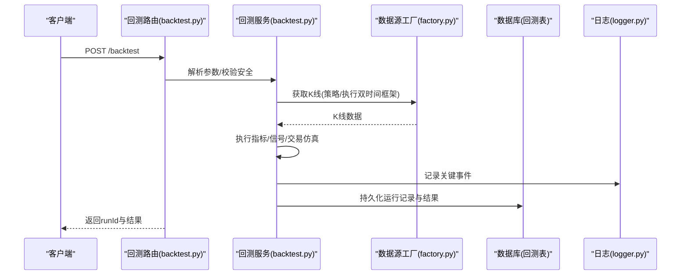
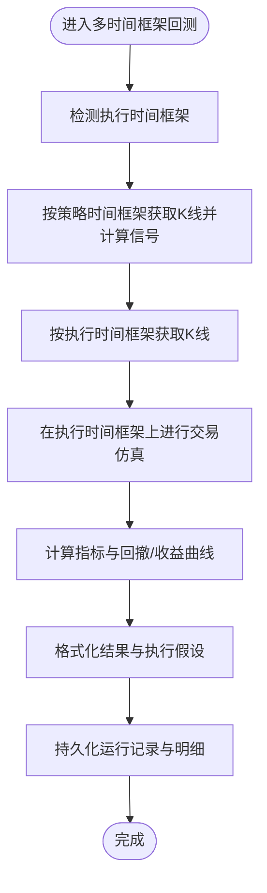
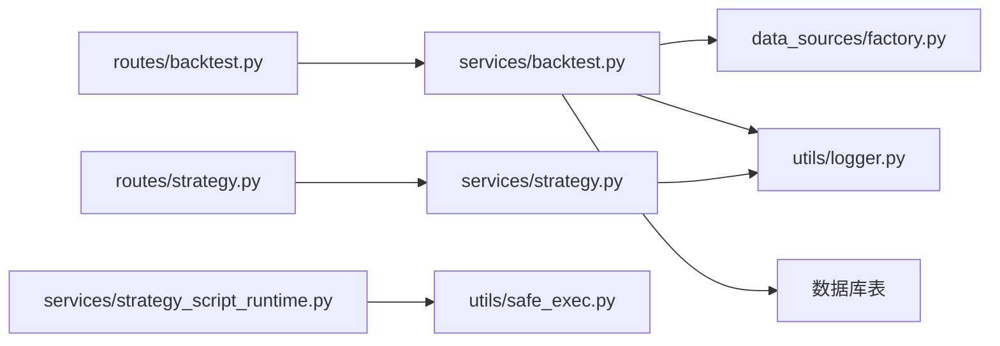

# 策略调试与测试

<cite>
**本文引用的文件**
- [backend_api_python/app/services/backtest.py](file://backend_api_python/app/services/backtest.py)
- [backend_api_python/app/routes/backtest.py](file://backend_api_python/app/routes/backtest.py)
- [backend_api_python/app/services/strategy.py](file://backend_api_python/app/services/strategy.py)
- [backend_api_python/app/routes/strategy.py](file://backend_api_python/app/routes/strategy.py)
- [backend_api_python/app/utils/logger.py](file://backend_api_python/app/utils/logger.py)
- [backend_api_python/app/utils/safe_exec.py](file://backend_api_python/app/utils/safe_exec.py)
- [backend_api_python/app/services/strategy_script_runtime.py](file://backend_api_python/app/services/strategy_script_runtime.py)
- [backend_api_python/app/data_sources/factory.py](file://backend_api_python/app/data_sources/factory.py)
- [backend_api_python/app/utils/strategy_runtime_logs.py](file://backend_api_python/app/utils/strategy_runtime_logs.py)
</cite>

## 目录
1. [引言](#引言)
2. [项目结构](#项目结构)
3. [核心组件](#核心组件)
4. [架构总览](#架构总览)
5. [详细组件分析](#详细组件分析)
6. [依赖分析](#依赖分析)
7. [性能考量](#性能考量)
8. [故障排查指南](#故障排查指南)
9. [结论](#结论)
10. [附录](#附录)

## 引言
本技术指南面向QuantDinger策略开发者与运维人员，系统阐述策略从“原型到生产”的调试、测试与验证流程，覆盖回测引擎、参数调优、性能优化、并发与内存管理、日志与可观测性、以及从策略脚本到实盘执行的完整链路。文档以仓库现有实现为依据，提供可操作的方法论与可视化图示，帮助快速定位问题、稳定迭代策略。

## 项目结构
QuantDinger后端采用Flask蓝图组织API，服务层封装业务逻辑，数据源工厂负责跨市场的K线与报价获取，安全执行工具保障用户脚本沙箱化运行。策略调试与测试的关键路径包括：
- API层：回测路由与策略路由
- 服务层：回测服务、策略服务、脚本运行时
- 工具层：日志、安全执行、数据源工厂
- 数据层：回测运行记录持久化

图表来源
- [backend_api_python/app/routes/backtest.py](file://backend_api_python/app/routes/backtest.py)
- [backend_api_python/app/routes/strategy.py](file://backend_api_python/app/routes/strategy.py)
- [backend_api_python/app/services/backtest.py](file://backend_api_python/app/services/backtest.py)
- [backend_api_python/app/services/strategy.py](file://backend_api_python/app/services/strategy.py)
- [backend_api_python/app/services/strategy_script_runtime.py](file://backend_api_python/app/services/strategy_script_runtime.py)
- [backend_api_python/app/utils/logger.py](file://backend_api_python/app/utils/logger.py)
- [backend_api_python/app/utils/safe_exec.py](file://backend_api_python/app/utils/safe_exec.py)
- [backend_api_python/app/data_sources/factory.py](file://backend_api_python/app/data_sources/factory.py)

章节来源
- [backend_api_python/app/routes/backtest.py](file://backend_api_python/app/routes/backtest.py)
- [backend_api_python/app/routes/strategy.py](file://backend_api_python/app/routes/strategy.py)
- [backend_api_python/app/services/backtest.py](file://backend_api_python/app/services/backtest.py)
- [backend_api_python/app/services/strategy.py](file://backend_api_python/app/services/strategy.py)
- [backend_api_python/app/utils/logger.py](file://backend_api_python/app/utils/logger.py)
- [backend_api_python/app/utils/safe_exec.py](file://backend_api_python/app/utils/safe_exec.py)
- [backend_api_python/app/data_sources/factory.py](file://backend_api_python/app/data_sources/factory.py)

## 核心组件
- 回测服务：提供标准与多时间框架回测、缓存、指标计算、结果持久化与历史查询。
- 策略服务：提供策略生命周期管理、批量启停、连接测试、模板与参数展示等。
- 脚本运行时：对齐回测上下文，支持实盘逐根K线推进，提供参数、订单、日志等能力。
- 安全执行：白名单内置函数、受限import、超时与内存限制、子进程隔离。
- 日志工具：统一日志配置、文件轮转、过滤噪声、策略运行日志落库。

章节来源
- [backend_api_python/app/services/backtest.py](file://backend_api_python/app/services/backtest.py)
- [backend_api_python/app/services/strategy.py](file://backend_api_python/app/services/strategy.py)
- [backend_api_python/app/services/strategy_script_runtime.py](file://backend_api_python/app/services/strategy_script_runtime.py)
- [backend_api_python/app/utils/safe_exec.py](file://backend_api_python/app/utils/safe_exec.py)
- [backend_api_python/app/utils/logger.py](file://backend_api_python/app/utils/logger.py)

## 架构总览
下图展示从API到服务、数据源与数据库的交互，以及策略脚本在回测与实盘中的运行位置。

图表来源
- [backend_api_python/app/routes/backtest.py](file://backend_api_python/app/routes/backtest.py)
- [backend_api_python/app/services/backtest.py](file://backend_api_python/app/services/backtest.py)
- [backend_api_python/app/data_sources/factory.py](file://backend_api_python/app/data_sources/factory.py)
- [backend_api_python/app/utils/logger.py](file://backend_api_python/app/utils/logger.py)

## 详细组件分析

### 回测服务（BacktestService）
- 多时间框架回测：根据回测区间自动选择执行时间框架（1分钟/5分钟），在信号时间框架上生成信号，在执行时间框架上进行精确交易仿真，支持回撤与滑点、杠杆、佣金等假设。
- 指标与信号：支持多种指标与组合条件，输出买入/卖出信号序列，兼容“多信号”与“买卖”两类规范。
- 交易仿真：基于推断K线价格路径（开盘→低点→高点→收盘）确定触发顺序，支持止盈止损、移动止盈、加减仓规则、止盈触发后的平仓。
- 指标计算与结果格式：计算总收益、年化收益、胜率、总交易数、最大回撤、夏普比率、盈亏比等，并格式化为前端可消费的结果。
- 持久化：将回测运行记录、交易明细、净值曲线持久化至数据库，支持历史查询与详情获取。
- 缓存：内置K线内存缓存，按TTL淘汰，减少重复外部API调用。

图表来源
- [backend_api_python/app/services/backtest.py](file://backend_api_python/app/services/backtest.py)

章节来源
- [backend_api_python/app/services/backtest.py](file://backend_api_python/app/services/backtest.py)

### 回测API（routes/backtest.py）
- 提供回测精度信息查询、标准回测、多时间框架回测、历史查询与详情获取。
- 支持参数范围限制（不同时间框架的最大回测天数）、安全校验（策略代码安全扫描）、持久化开关（快速迭代可关闭持久化）。
- 提供AI分析建议接口，基于选定回测运行生成参数调优建议（启发式或LLM）。

章节来源
- [backend_api_python/app/routes/backtest.py](file://backend_api_python/app/routes/backtest.py)

### 策略服务（StrategyService）
- 策略生命周期：运行中策略查询、批量启停、删除、更新状态。
- 交易所连接测试：针对主流交易所与本地终端（IBKR/MT5）进行连通性与私有数据校验，输出友好提示与IP白名单辅助信息。
- 交换对查询：对非CCXT直连交易所通过REST获取交易对清单，对CCXT类通过加载市场数据获取。
- 参数展示：将策略配置转换为前端可读的参数面板（初始资金、方向、网格/马丁格尔等）。

章节来源
- [backend_api_python/app/services/strategy.py](file://backend_api_python/app/services/strategy.py)

### 策略API（routes/strategy.py）
- 提供策略模板、策略列表/详情、策略回测、历史查询、交易与持仓查询、批量启停/删除等。
- 策略代码质量分析：检测必需函数（如on_init/on_bar）、参数声明、下单意图等，给出提示与摘要。
- 回测范围限制：按时间框架限制最大回测天数，避免过长回测导致资源压力。

章节来源
- [backend_api_python/app/routes/strategy.py](file://backend_api_python/app/routes/strategy.py)

### 脚本运行时（strategy_script_runtime.py）
- 对齐回测上下文：提供bars、param、log、buy/sell/close_position等接口，支持实盘按根推进。
- 类型与行为：ScriptBar/ScriptPosition提供安全访问与位置管理，支持加仓/减仓/平仓逻辑。
- 编译与校验：通过安全执行工具编译策略脚本，确保on_bar存在且on_init可选。

章节来源
- [backend_api_python/app/services/strategy_script_runtime.py](file://backend_api_python/app/services/strategy_script_runtime.py)
- [backend_api_python/app/utils/safe_exec.py](file://backend_api_python/app/utils/safe_exec.py)

### 安全执行（safe_exec.py）
- 白名单内置函数与受限import，禁止危险调用与模块导入。
- 超时控制：Unix主进程使用SIGALRM，Windows/非主进程使用Timer+异步异常注入。
- 内存限制：在支持平台设置AS上限，防止内存溢出。
- 子进程隔离：通过多进程执行用户代码，崩溃或死循环不影响主进程。

章节来源
- [backend_api_python/app/utils/safe_exec.py](file://backend_api_python/app/utils/safe_exec.py)

### 日志与策略运行日志（logger.py、strategy_runtime_logs.py）
- 全局日志：统一级别、格式、文件轮转，过滤噪声（如Werkzeug/K线路由），并保留特定服务INFO级别。
- 策略运行日志：将策略运行期间的日志落库（qd_strategy_logs），便于UI查看。

章节来源
- [backend_api_python/app/utils/logger.py](file://backend_api_python/app/utils/logger.py)
- [backend_api_python/app/utils/strategy_runtime_logs.py](file://backend_api_python/app/utils/strategy_runtime_logs.py)

## 依赖分析
- API依赖服务：回测路由依赖回测服务，策略路由依赖策略服务与回测服务。
- 服务依赖工具：回测服务依赖数据源工厂与日志；策略服务依赖日志与部分执行客户端；脚本运行时依赖安全执行工具。
- 数据依赖：回测服务持久化到qd_backtest_runs/qd_backtest_trades/qd_backtest_equity_points。

图表来源
- [backend_api_python/app/routes/backtest.py](file://backend_api_python/app/routes/backtest.py)
- [backend_api_python/app/routes/strategy.py](file://backend_api_python/app/routes/strategy.py)
- [backend_api_python/app/services/backtest.py](file://backend_api_python/app/services/backtest.py)
- [backend_api_python/app/services/strategy.py](file://backend_api_python/app/services/strategy.py)
- [backend_api_python/app/services/strategy_script_runtime.py](file://backend_api_python/app/services/strategy_script_runtime.py)
- [backend_api_python/app/utils/safe_exec.py](file://backend_api_python/app/utils/safe_exec.py)
- [backend_api_python/app/data_sources/factory.py](file://backend_api_python/app/data_sources/factory.py)
- [backend_api_python/app/utils/logger.py](file://backend_api_python/app/utils/logger.py)

章节来源
- [backend_api_python/app/routes/backtest.py](file://backend_api_python/app/routes/backtest.py)
- [backend_api_python/app/routes/strategy.py](file://backend_api_python/app/routes/strategy.py)
- [backend_api_python/app/services/backtest.py](file://backend_api_python/app/services/backtest.py)
- [backend_api_python/app/services/strategy.py](file://backend_api_python/app/services/strategy.py)
- [backend_api_python/app/services/strategy_script_runtime.py](file://backend_api_python/app/services/strategy_script_runtime.py)
- [backend_api_python/app/utils/safe_exec.py](file://backend_api_python/app/utils/safe_exec.py)
- [backend_api_python/app/data_sources/factory.py](file://backend_api_python/app/data_sources/factory.py)
- [backend_api_python/app/utils/logger.py](file://backend_api_python/app/utils/logger.py)

## 性能考量
- 多时间框架回测的执行时间框架选择：根据回测区间自动选择1分钟或5分钟执行时间框架，平衡精度与性能。
- K线缓存：内置内存缓存与TTL淘汰，减少重复拉取，提升回测吞吐。
- 指标与信号生成：尽量使用向量化（pandas/numpy）计算，避免逐行Python循环。
- 持久化批处理：批量插入回测明细与净值点，减少事务开销。
- 并发与限流：策略服务对连接测试使用信号量限制并发，避免外部API限流与CPU压力。
- 资源限制：安全执行设置超时与内存上限，防止策略脚本导致系统资源耗尽。

章节来源
- [backend_api_python/app/services/backtest.py](file://backend_api_python/app/services/backtest.py)
- [backend_api_python/app/utils/safe_exec.py](file://backend_api_python/app/utils/safe_exec.py)
- [backend_api_python/app/services/strategy.py](file://backend_api_python/app/services/strategy.py)

## 故障排查指南
- 回测失败
  - 检查时间范围限制：不同时间框架的最大天数限制，避免超出范围。
  - 检查K线数据：确认数据源工厂能正常获取所需K线，关注市场别名与标准化。
  - 查看回测持久化：确认回测运行记录是否成功写入数据库，错误信息会记录到运行记录中。
- 策略代码安全
  - 使用安全执行工具进行代码扫描与编译，拒绝危险模式与非法导入。
  - 关注超时与内存限制，必要时调整超时阈值或优化策略逻辑。
- 实盘执行
  - 确认策略脚本满足最小要求（定义on_bar，on_init可选），并通过编译校验。
  - 使用脚本运行时的log接口输出关键信息，结合策略运行日志表定位问题。
- 连接测试
  - 对交易所连接测试失败时，参考返回的友好提示（如币安权限、IP白名单、基URL等），逐步核对配置。

章节来源
- [backend_api_python/app/routes/backtest.py](file://backend_api_python/app/routes/backtest.py)
- [backend_api_python/app/services/backtest.py](file://backend_api_python/app/services/backtest.py)
- [backend_api_python/app/utils/safe_exec.py](file://backend_api_python/app/utils/safe_exec.py)
- [backend_api_python/app/services/strategy_script_runtime.py](file://backend_api_python/app/services/strategy_script_runtime.py)
- [backend_api_python/app/utils/strategy_runtime_logs.py](file://backend_api_python/app/utils/strategy_runtime_logs.py)
- [backend_api_python/app/services/strategy.py](file://backend_api_python/app/services/strategy.py)

## 结论
QuantDinger提供了从策略脚本到回测、参数调优、实盘执行的完整闭环。通过安全执行、日志与持久化、多时间框架回测与缓存机制，开发者可以在保证安全与性能的前提下高效迭代策略。建议在开发过程中遵循“先回测、再参数网格、后实盘小规模验证”的流程，并持续利用日志与运行记录进行问题定位与优化。

## 附录
- 调试与测试流程建议
  - 原型阶段：使用回测路由进行快速验证，开启持久化以便复盘。
  - 参数调优：固定信号逻辑，每次只改1-2个参数，对比总收益、最大回撤、夏普比率与交易次数。
  - 多时间框架：在加密货币市场且回测区间较短时启用MTF，提升仿真精度。
  - 并发与资源：对连接测试与回测任务设置合理超时与内存上限，避免资源耗尽。
  - 日志与追踪：充分利用全局日志与策略运行日志，结合回测历史记录进行问题复现。