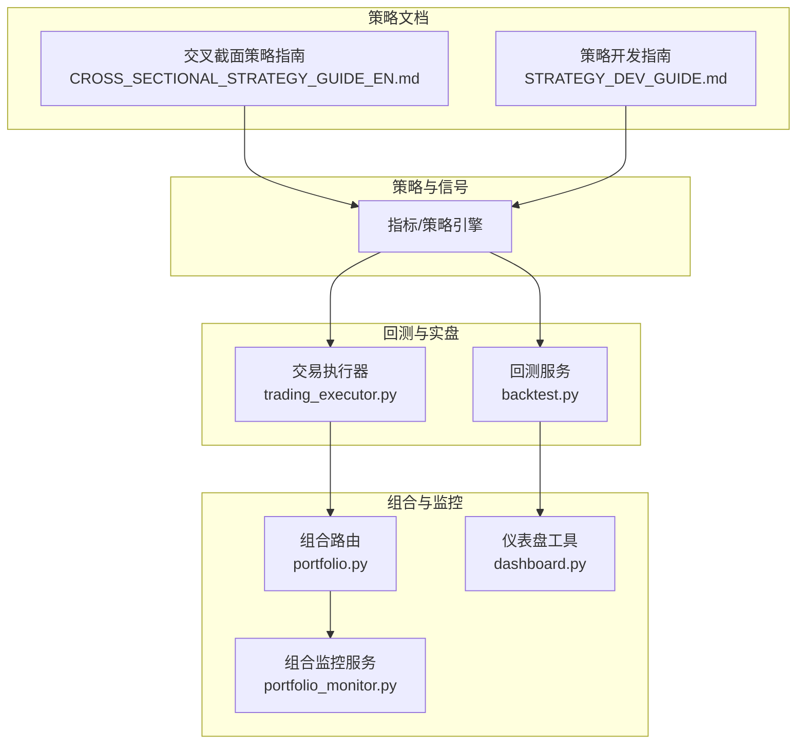
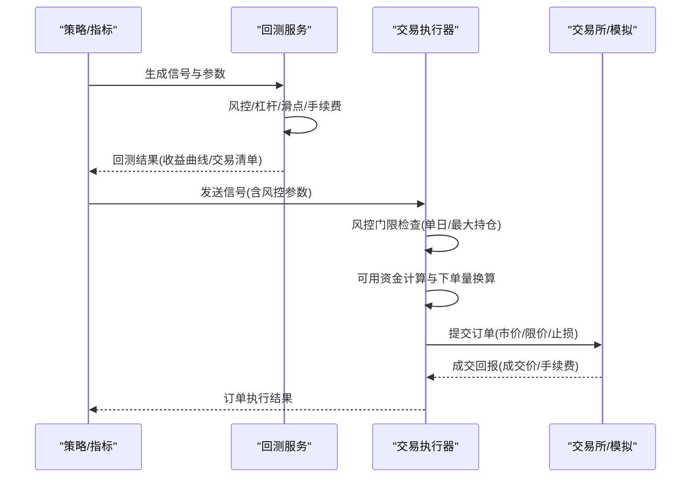
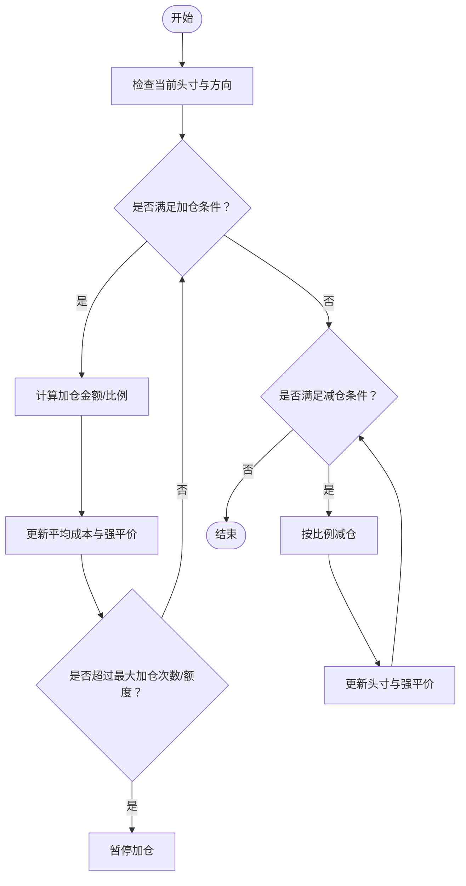
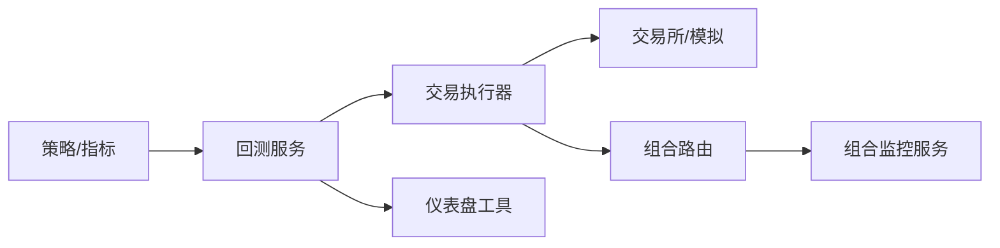

# 仓位管理

<cite>
**本文引用的文件**
- [backtest.py](file://backend_api_python/app/services/backtest.py)
- [trading_executor.py](file://backend_api_python/app/services/trading_executor.py)
- [portfolio.py](file://backend_api_python/app/routes/portfolio.py)
- [portfolio_monitor.py](file://backend_api_python/app/services/portfolio_monitor.py)
- [dashboard.py](file://backend_api_python/app/routes/dashboard.py)
- [CROSS_SECTIONAL_STRATEGY_GUIDE_EN.md](file://docs/CROSS_SECTIONAL_STRATEGY_GUIDE_EN.md)
- [STRATEGY_DEV_GUIDE.md](file://docs/STRATEGY_DEV_GUIDE.md)
</cite>

## 目录
1. [引言](#引言)
2. [项目结构](#项目结构)
3. [核心组件](#核心组件)
4. [架构总览](#架构总览)
5. [详细组件分析](#详细组件分析)
6. [依赖关系分析](#依赖关系分析)
7. [性能考量](#性能考量)
8. [故障排查指南](#故障排查指南)
9. [结论](#结论)
10. [附录](#附录)

## 引言
本文件面向QuantDinger的仓位管理策略，系统化阐述固定比例法、凯利准则、波动率驱动（volatility-based sizing）等仓位分配方法的数学原理与适用场景；文档化资金管理规则（初始资金、单笔最大风险、最大回撤限制、连续亏损容忍度）；解释多品种/多市场的组合策略（相关性分析、分散化、对冲）；给出趋势跟踪中的动态加仓/减仓算法；并提供风险价值（VaR）与压力测试方法，确保在极端市场条件下策略的稳健性。

## 项目结构
围绕仓位管理的关键代码分布在服务层与路由层：
- 回测引擎：负责信号到交易的模拟执行、止盈止损、移动止盈、动态加减仓、保证金与强平阈值计算
- 实盘执行器：负责风控门限（单日最大亏损、最大持仓额）、可用资金计算、下单量与比例换算、市价单滑点与手续费
- 组合与仪表盘：提供PnL计算、组合概览、多市场分布统计
- 交叉截面策略：多标的并行交易、多空头寸平衡、再平衡频率

图表来源
- [backtest.py](file://backend_api_python/app/services/backtest.py)
- [trading_executor.py](file://backend_api_python/app/services/trading_executor.py)
- [portfolio.py](file://backend_api_python/app/routes/portfolio.py)
- [portfolio_monitor.py](file://backend_api_python/app/services/portfolio_monitor.py)
- [dashboard.py](file://backend_api_python/app/routes/dashboard.py)
- [CROSS_SECTIONAL_STRATEGY_GUIDE_EN.md](file://docs/CROSS_SECTIONAL_STRATEGY_GUIDE_EN.md)
- [STRATEGY_DEV_GUIDE.md](file://docs/STRATEGY_DEV_GUIDE.md)

章节来源
- [backtest.py](file://backend_api_python/app/services/backtest.py)
- [trading_executor.py](file://backend_api_python/app/services/trading_executor.py)
- [portfolio.py](file://backend_api_python/app/routes/portfolio.py)
- [portfolio_monitor.py](file://backend_api_python/app/services/portfolio_monitor.py)
- [dashboard.py](file://backend_api_python/app/routes/dashboard.py)
- [CROSS_SECTIONAL_STRATEGY_GUIDE_EN.md](file://docs/CROSS_SECTIONAL_STRATEGY_GUIDE_EN.md)
- [STRATEGY_DEV_GUIDE.md](file://docs/STRATEGY_DEV_GUIDE.md)

## 核心组件
- 回测服务（backtest.py）
  - 支持多方向（多头/空头/双向）模拟
  - 风控参数：固定止损/止盈百分比、移动止盈、尾随激活阈值
  - 动态加仓/减仓：趋势加仓、均值回归加仓、不利价差减仓、趋势减仓
  - 杠杆换算与强平价计算
  - 执行时机：当日K线收盘/次开盘价执行，避免前瞻性偏误
- 交易执行器（trading_executor.py）
  - 风控门限：单日最大亏损、最大持仓额
  - 可用资金计算：基于初始资金、历史头寸与当前价格
  - 下单量换算：spot/futures/margin下不同比例/金额换算
  - 机器人脚本与前端信号对齐
- 组合与仪表盘（portfolio.py、portfolio_monitor.py、dashboard.py）
  - 组合汇总：总成本/市值/PnL/分市场分布
  - PnL计算：按入场价与数量、杠杆与市场类型换算
  - AI监控：价格/盈亏预警、多标的并行分析

章节来源
- [backtest.py](file://backend_api_python/app/services/backtest.py)
- [trading_executor.py](file://backend_api_python/app/services/trading_executor.py)
- [portfolio.py](file://backend_api_python/app/routes/portfolio.py)
- [portfolio_monitor.py](file://backend_api_python/app/services/portfolio_monitor.py)
- [dashboard.py](file://backend_api_python/app/routes/dashboard.py)

## 架构总览
回测与实盘在“信号→风控→下单→成交”的主链路上保持一致的参数语义与执行逻辑，确保策略从回测到实盘的一致性。

图表来源
- [backtest.py](file://backend_api_python/app/services/backtest.py)
- [trading_executor.py](file://backend_api_python/app/services/trading_executor.py)

## 详细组件分析

### 1) 仓位分配方法与数学原理
- 固定比例法（Fixed Fractional）
  - 原理：每次交易按账户净值的固定比例建仓/加仓，典型如固定百分比入场、固定百分比止盈/止损
  - 适用：趋势明确、波动稳定、追求稳定复利增长的策略
  - 在系统中体现为：入场比例（entryPct）与止盈止损（takeProfitPct/stopLossPct）的配置与换算
- 凯利准则（Kelly Criterion）
  - 原理：最优倍投比例 f* = (bp - q)/b，其中b为赔率，p为胜率，q=1-p
  - 适用：可量化胜率与盈亏比的交易系统；需谨慎使用，避免过度杠杆
  - 在系统中体现：可作为动态加仓比例的上限约束，结合回测中的胜率/盈亏比进行校准
- 波动率驱动（Volatility-Based Sizing）
  - 原理：以ATR/历史波动率等衡量目标资产的波动性，按波动率倒数调整头寸规模，使各资产对组合波动贡献均衡
  - 适用：多品种/多市场组合，控制组合整体波动
  - 在系统中体现：可作为组合层面的权重因子，配合相关性矩阵进行分散化

章节来源
- [backtest.py](file://backend_api_python/app/services/backtest.py)
- [trading_executor.py](file://backend_api_python/app/services/trading_executor.py)

### 2) 资金管理规则
- 初始资金（initial_capital）
  - 回测与实盘均以此为基准，用于计算可用资金、动态加仓使用额度
- 单笔最大风险（单次入场风险限额）
  - 建议以固定比例法或波动率法确定单笔最大风险占净值的比例（例如0.01~0.05）
  - 在系统中通过entryPct与滑点/手续费共同决定实际可用头寸
- 最大回撤限制（最大回撤阈值）
  - 建议设置组合层面的最大回撤阈值（如20%~30%），超过阈值暂停交易或降低杠杆
  - 系统支持单日最大亏损门限（max_daily_loss），可在执行器中启用
- 连续亏损容忍度（连续N次亏损后的保护）
  - 建议设置连续亏损次数上限（如3~5次），超过后暂停加仓或提高止损
  - 可在策略层面增加冷却期或降低仓位

章节来源
- [trading_executor.py](file://backend_api_python/app/services/trading_executor.py)
- [backtest.py](file://backend_api_python/app/services/backtest.py)

### 3) 多品种/多市场组合策略
- 相关性分析与分散化
  - 建议在组合层面计算资产间滚动相关系数，构建最小方差/风险平价组合
  - 分散化目标：降低非系统性风险，提升夏普比率
- 对冲机制
  - 可采用跨品种/跨市场对冲（如股指期货对冲股票组合），或利用期权进行静态/动态对冲
- 再平衡与头寸控制
  - 交叉截面策略支持每日/周/月再平衡，维持多空头寸平衡（long_ratio）
  - 实盘中通过max_position门限控制组合总敞口

章节来源
- [CROSS_SECTIONAL_STRATEGY_GUIDE_EN.md](file://docs/CROSS_SECTIONAL_STRATEGY_GUIDE_EN.md)
- [trading_executor.py](file://backend_api_python/app/services/trading_executor.py)

### 4) 仓位调整算法（趋势跟踪中的动态加仓/减仓）
- 趋势加仓（trendAdd）
  - 触发：价格偏离入场价达到预设步进幅度（考虑杠杆换算）
  - 执行：按比例加仓，更新平均成本与强平价
- 均值回归加仓（dcaAdd）
  - 触发：在不利方向上继续加仓（上涨时做空加仓，下跌时做多加仓）
  - 注意：防止深度套牢，应设置最大加仓次数与步进幅度上限
- 不利价差减仓（adverseReduce）
  - 触发：不利方向上价格朝对头寸有利方向回撤一定幅度后减仓
- 趋势减仓（trendReduce）
  - 触发：价格朝有利方向大幅移动后，在回调时减仓锁定利润
- 执行时机与滑点
  - 回测支持“次开盘价执行”以避免前瞻性偏误；实盘下单时考虑滑点与手续费

图表来源
- [backtest.py](file://backend_api_python/app/services/backtest.py)

章节来源
- [backtest.py](file://backend_api_python/app/services/backtest.py)

### 5) 止损/止盈与移动止盈
- 固定止损/止盈：以入场价为基准，按百分比设置SL/TP
- 杠杆换算：系统将用户输入的百分比转换为价格阈值（SL/TP/移动止盈）
- 移动止盈（Trailing Stop）：启用后优先于固定止盈，具备激活阈值与回调幅度
- 尾随策略冲突规则：当移动止盈启用时，固定止盈退出被禁用以避免歧义

章节来源
- [backtest.py](file://backend_api_python/app/services/backtest.py)

### 6) 实盘下单与风控门限
- 可用资金计算：基于初始资金、历史头寸与当前价格，区分spot与futures/margin
- 下单量换算：ratio→数量；机器人脚本可传入绝对金额（USDT），系统自动换算
- 风控门限：
  - 单日最大亏损（max_daily_loss）：超过即阻断新单
  - 最大持仓额（max_position）：超过即阻断新单
- 信号状态机：spot不支持空头，状态机过滤非法信号

章节来源
- [trading_executor.py](file://backend_api_python/app/services/trading_executor.py)

### 7) 组合与仪表盘（PnL与分布）
- 组合汇总：总成本、总市值、总PnL、总PnL百分比、分市场分布
- PnL计算：按入场价×数量，考虑杠杆与市场类型（swap/spot）
- 并行分析：多标的并行AI分析，生成报告与建议

章节来源
- [portfolio.py](file://backend_api_python/app/routes/portfolio.py)
- [portfolio_monitor.py](file://backend_api_python/app/services/portfolio_monitor.py)
- [dashboard.py](file://backend_api_python/app/routes/dashboard.py)

## 依赖关系分析
- 回测服务依赖策略信号与参数配置（risk/position/scale），并输出交易清单与收益曲线
- 交易执行器依赖回测中的风控参数语义，同时引入实盘风控门限
- 组合与仪表盘依赖交易执行器的成交回报与实时价格接口

图表来源
- [backtest.py](file://backend_api_python/app/services/backtest.py)
- [trading_executor.py](file://backend_api_python/app/services/trading_executor.py)
- [portfolio.py](file://backend_api_python/app/routes/portfolio.py)
- [portfolio_monitor.py](file://backend_api_python/app/services/portfolio_monitor.py)
- [dashboard.py](file://backend_api_python/app/routes/dashboard.py)

章节来源
- [backtest.py](file://backend_api_python/app/services/backtest.py)
- [trading_executor.py](file://backend_api_python/app/services/trading_executor.py)
- [portfolio.py](file://backend_api_python/app/routes/portfolio.py)
- [portfolio_monitor.py](file://backend_api_python/app/services/portfolio_monitor.py)
- [dashboard.py](file://backend_api_python/app/routes/dashboard.py)

## 性能考量
- 回测执行时间窗：根据时间框架与日期跨度自动选择1分钟或5分钟精度，兼顾性能与精度
- 多线程与并发：组合监控支持并行分析，受工作线程数与API限流控制
- 滑点与手续费：在回测与实盘中统一纳入成本，避免高估收益
- 动态加仓次数与步进幅度：应设置上限，避免过度摊低与放大回撤

章节来源
- [backtest.py](file://backend_api_python/app/services/backtest.py)
- [portfolio_monitor.py](file://backend_api_python/app/services/portfolio_monitor.py)

## 故障排查指南
- 回测未产生交易
  - 检查信号格式与执行时机（bar_close vs next_bar_open）
  - 检查trade_direction限制（long/short/both）
- 实盘下单被拒
  - 检查max_daily_loss/max_position门限
  - 检查spot不支持空头
  - 检查可用资金是否足够覆盖滑点与手续费
- 组合PnL异常
  - 检查entry_price/quantity/杠杆与市场类型（swap/spot）换算
  - 检查多头/空头方向与符号

章节来源
- [backtest.py](file://backend_api_python/app/services/backtest.py)
- [trading_executor.py](file://backend_api_python/app/services/trading_executor.py)
- [dashboard.py](file://backend_api_python/app/routes/dashboard.py)

## 结论
QuantDinger在回测与实盘两端提供了完善的仓位管理能力：固定比例法与波动率驱动的组合应用、凯利准则的参数校准、多市场的分散化与对冲、趋势跟踪中的动态加减仓、以及单日/总敞口风控。通过统一的参数语义与执行逻辑，策略能够在不同市场环境下稳健运行，并通过仪表盘与AI监控持续优化。

## 附录

### A. 关键参数定义与换算
- 入场比例（entryPct）：0~1之间，支持0~100输入（自动归一）
- 止损/止盈（stopLossPct/takeProfitPct）：按杠杆换算为价格阈值
- 动态加仓/减仓（trendAdd/dcaAdd/trendReduce/adverseReduce）：步进幅度与加仓比例，受最大次数限制
- 执行时机（signalTiming）：bar_close/next_bar_open，避免前瞻性偏误

章节来源
- [backtest.py](file://backend_api_python/app/services/backtest.py)
- [STRATEGY_DEV_GUIDE.md](file://docs/STRATEGY_DEV_GUIDE.md)

### B. 交叉截面策略要点
- 多标的并行交易、自动排名与再平衡
- long_ratio控制多空平衡，portfolio_size控制总头寸数量
- 支持daily/weekly/monthly再平衡频率

章节来源
- [CROSS_SECTIONAL_STRATEGY_GUIDE_EN.md](file://docs/CROSS_SECTIONAL_STRATEGY_GUIDE_EN.md)