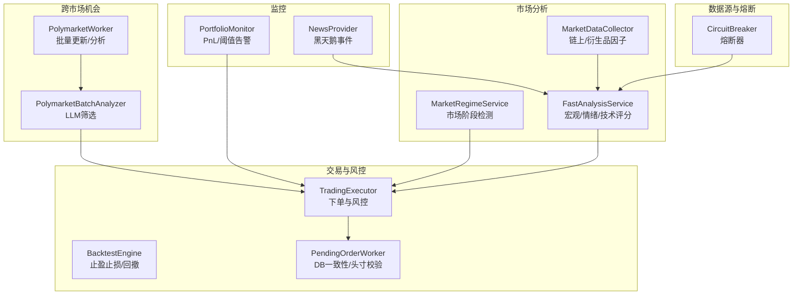
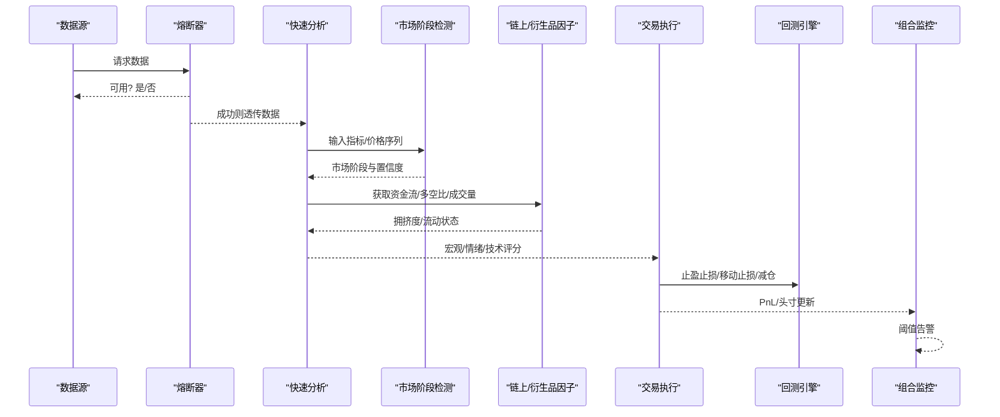
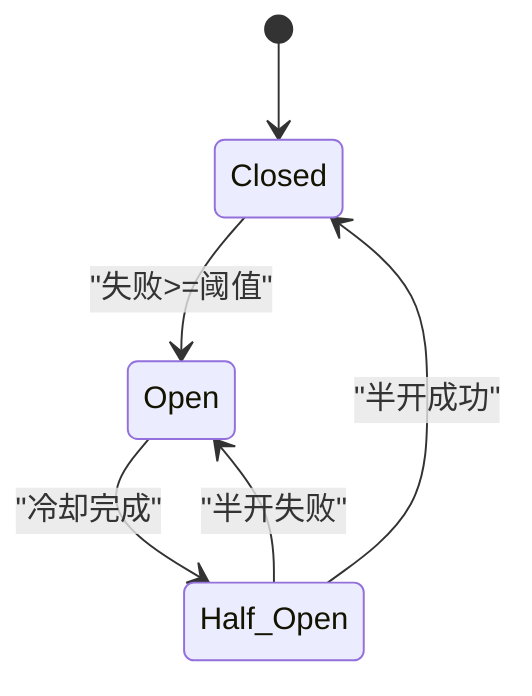
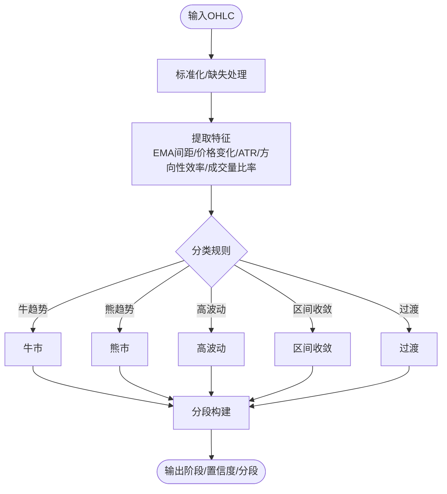
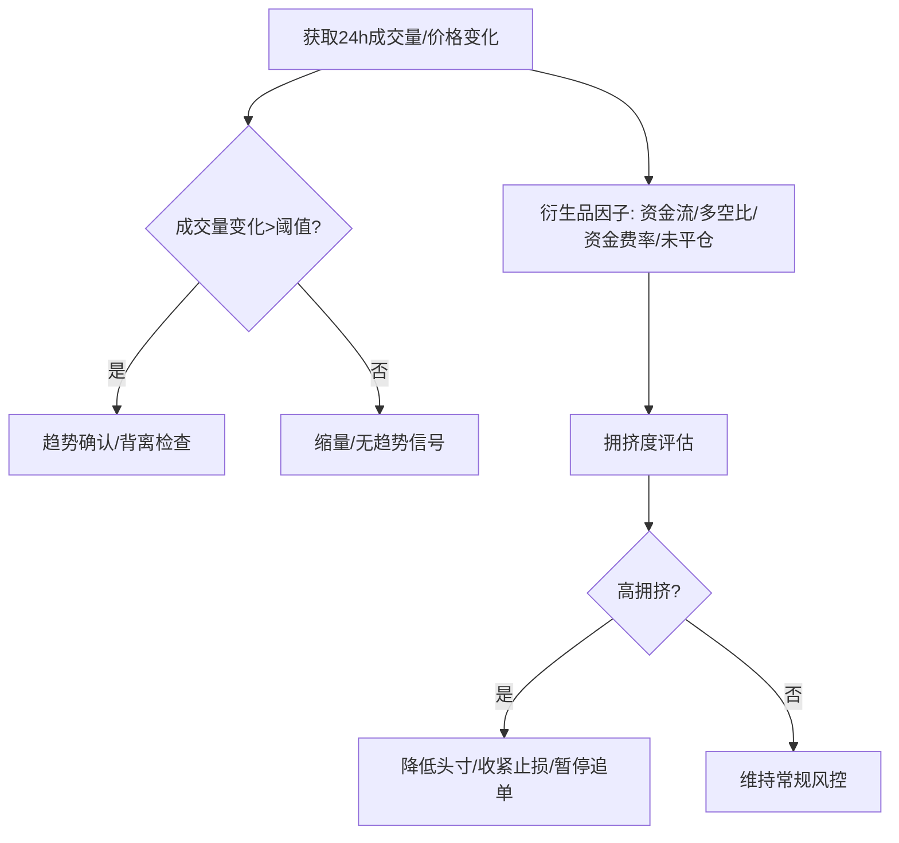
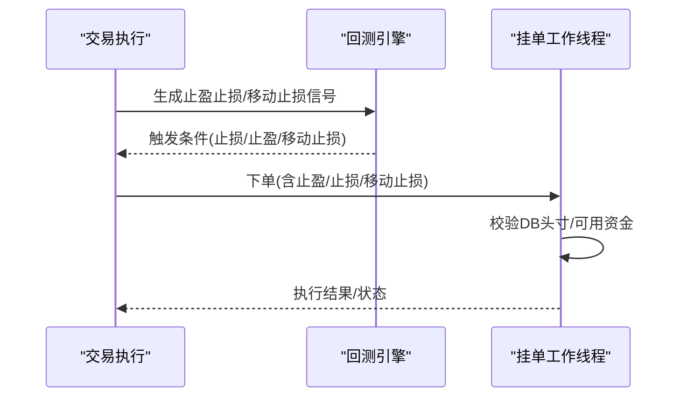
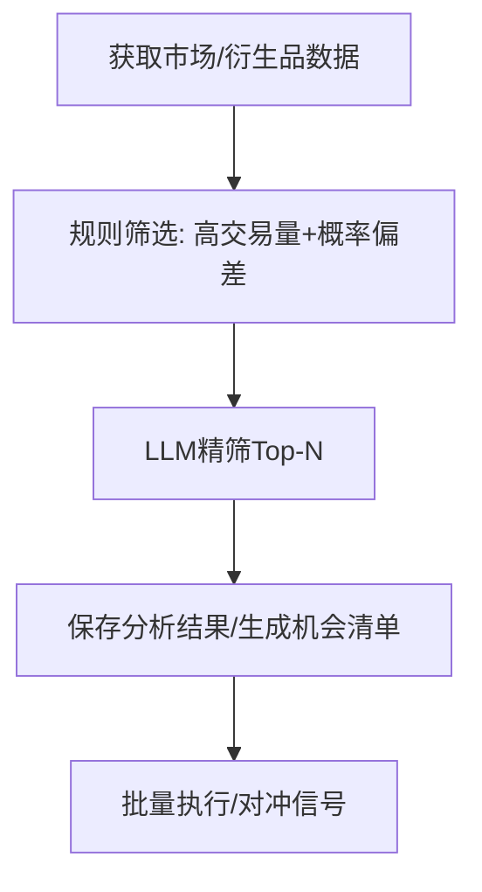
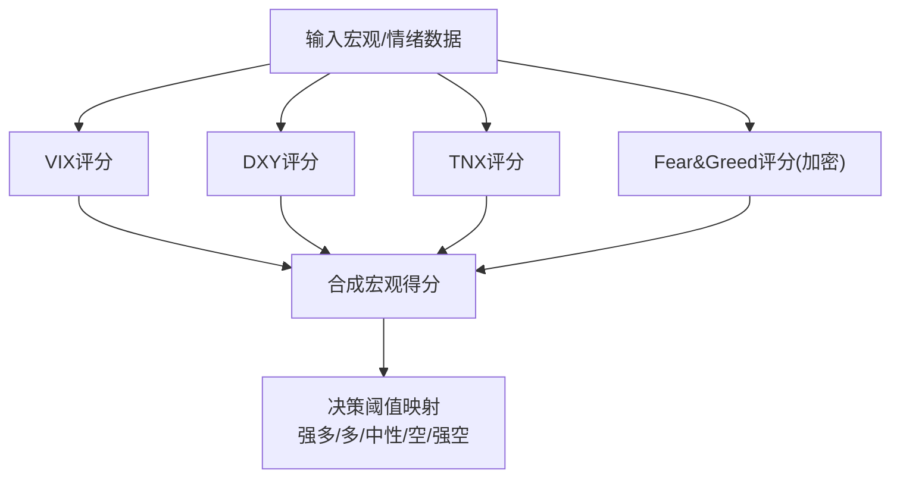
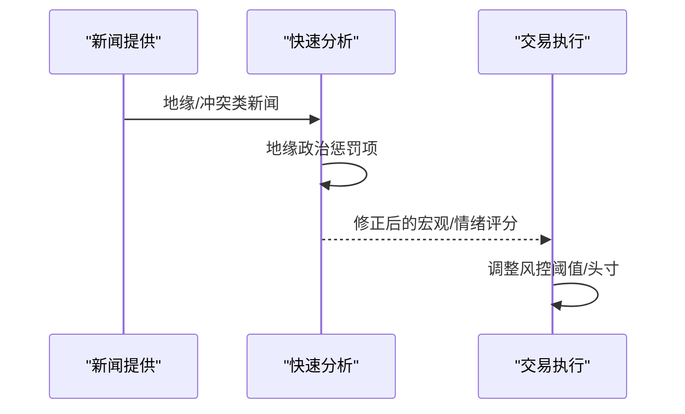
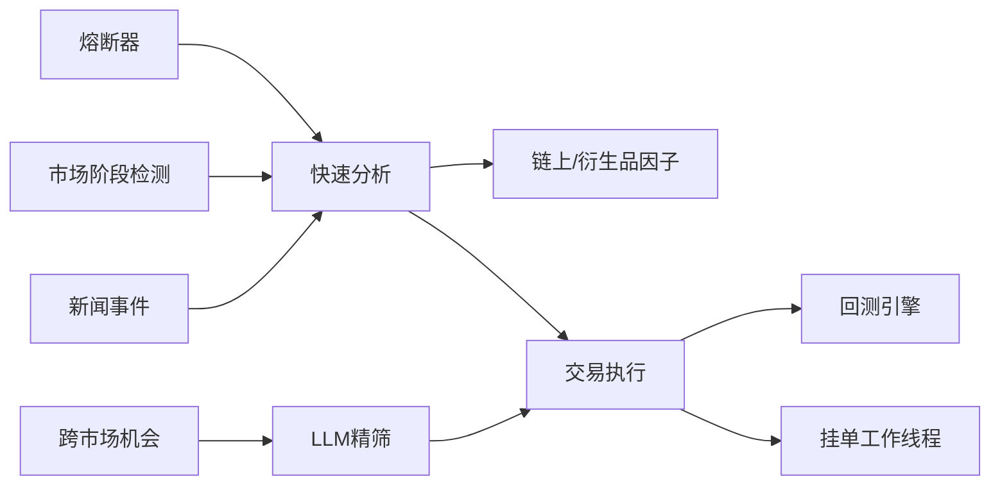

# 市场风险控制

<cite>
**本文引用的文件**
- [circuit_breaker.py](file://backend_api_python/app/data_sources/circuit_breaker.py)
- [regime.py](file://backend_api_python/app/services/experiment/regime.py)
- [fast_analysis.py](file://backend_api_python/app/services/fast_analysis.py)
- [market_data_collector.py](file://backend_api_python/app/services/market_data_collector.py)
- [polymarket_worker.py](file://backend_api_python/app/services/polymarket_worker.py)
- [polymarket_batch_analyzer.py](file://backend_api_python/app/services/polymarket_batch_analyzer.py)
- [trading_executor.py](file://backend_api_python/app/services/trading_executor.py)
- [backtest.py](file://backend_api_python/app/services/backtest.py)
- [strategy_templates.json](file://backend_api_python/app/data/strategy_templates.json)
- [strategy.py](file://backend_api_python/app/services/strategy.py)
- [pending_order_worker.py](file://backend_api_python/app/services/pending_order_worker.py)
- [portfolio_monitor.py](file://backend_api_python/app/services/portfolio_monitor.py)
- [news.py](file://backend_api_python/app/data_providers/news.py)
</cite>

## 目录
1. [引言](#引言)
2. [项目结构](#项目结构)
3. [核心组件](#核心组件)
4. [架构总览](#架构总览)
5. [详细组件分析](#详细组件分析)
6. [依赖分析](#依赖分析)
7. [性能考量](#性能考量)
8. [故障排查指南](#故障排查指南)
9. [结论](#结论)
10. [附录](#附录)

## 引言
本文件面向QuantDinger的市场风险控制机制，系统化阐述熔断机制、涨跌停板限制、价格波动控制、流动性风险控制、跨市场对冲策略、市场状态识别、黑天鹅预警与极端条件保护，以及交易成本与风控的平衡策略。文档以代码为依据，结合流程图与类图，帮助开发者与策略工程师快速理解并扩展风控体系。

## 项目结构
QuantDinger后端采用分层与功能域划分：数据源层负责外部接口与熔断器；服务层承载风控、回测、市场分析与交易执行；路由与工具层提供配置、日志与通用能力。与市场风险控制直接相关的模块包括：
- 数据源与熔断器：circuit_breaker.py
- 市场状态识别：experiment/regime.py、fast_analysis.py
- 流动性与拥挤度分析：market_data_collector.py、fast_analysis.py
- 交易执行与风控：trading_executor.py、backtest.py、pending_order_worker.py
- 跨市场与衍生品机会：polymarket_worker.py、polymarket_batch_analyzer.py
- 组合监控与告警：portfolio_monitor.py
- 黑天鹅与新闻事件：news.py

图表来源
- [circuit_breaker.py:31-174](file://backend_api_python/app/data_sources/circuit_breaker.py#L31-L174)
- [regime.py:21-170](file://backend_api_python/app/services/experiment/regime.py#L21-L170)
- [fast_analysis.py:2300-2600](file://backend_api_python/app/services/fast_analysis.py#L2300-L2600)
- [market_data_collector.py:1534-1632](file://backend_api_python/app/services/market_data_collector.py#L1534-L1632)
- [polymarket_worker.py:17-183](file://backend_api_python/app/services/polymarket_worker.py#L17-L183)
- [polymarket_batch_analyzer.py:41-75](file://backend_api_python/app/services/polymarket_batch_analyzer.py#L41-L75)
- [trading_executor.py:2600-2800](file://backend_api_python/app/services/trading_executor.py#L2600-L2800)
- [backtest.py:1059-2671](file://backend_api_python/app/services/backtest.py#L1059-L2671)
- [pending_order_worker.py:1240-1269](file://backend_api_python/app/services/pending_order_worker.py#L1240-L1269)
- [portfolio_monitor.py:1-200](file://backend_api_python/app/services/portfolio_monitor.py#L1-L200)
- [news.py:98-130](file://backend_api_python/app/data_providers/news.py#L98-L130)

章节来源
- [circuit_breaker.py:1-175](file://backend_api_python/app/data_sources/circuit_breaker.py#L1-L175)
- [regime.py:1-170](file://backend_api_python/app/services/experiment/regime.py#L1-L170)
- [fast_analysis.py:2300-2600](file://backend_api_python/app/services/fast_analysis.py#L2300-L2600)
- [market_data_collector.py:1500-1700](file://backend_api_python/app/services/market_data_collector.py#L1500-L1700)
- [polymarket_worker.py:1-183](file://backend_api_python/app/services/polymarket_worker.py#L1-L183)
- [polymarket_batch_analyzer.py:41-75](file://backend_api_python/app/services/polymarket_batch_analyzer.py#L41-L75)
- [trading_executor.py:2600-2800](file://backend_api_python/app/services/trading_executor.py#L2600-L2800)
- [backtest.py:1059-2671](file://backend_api_python/app/services/backtest.py#L1059-L2671)
- [pending_order_worker.py:1240-1269](file://backend_api_python/app/services/pending_order_worker.py#L1240-L1269)
- [portfolio_monitor.py:1-200](file://backend_api_python/app/services/portfolio_monitor.py#L1-L200)
- [news.py:98-130](file://backend_api_python/app/data_providers/news.py#L98-L130)

## 核心组件
- 熔断器（CircuitBreaker）：对数据源失败进行熔断/冷却/半开试探，避免雪崩式重试。
- 市场阶段检测（MarketRegimeService）：基于EMA、ATR、成交量等特征识别牛市、熊市、震荡、高波动与过渡期。
- 宏观与情绪评分（FastAnalysisService）：综合VIX、DXY、TNX、Fear&Greed与新闻地缘政治情绪，输出中性/偏多/偏空评分。
- 流动性与拥挤度（MarketDataCollector/FastAnalysis）：衍生品拥挤度（squeeze risk）、多空比、资金流、成交量变化等。
- 交易执行与风控（TradingExecutor/Backtest）：最大单日亏损、最大头寸、止盈止损、移动止损、减仓与全平逻辑。
- 跨市场机会（PolymarketWorker/BatchAnalyzer）：规则筛选+LLM精筛，降低LLM调用成本，识别跨市场套利机会。
- 组合监控（PortfolioMonitor）：PnL阈值与价格阈值告警，支持多渠道通知。
- 黑天鹅事件（NewsProvider）：事件发布与影响模拟，辅助风控阈值调整。

章节来源
- [circuit_breaker.py:31-174](file://backend_api_python/app/data_sources/circuit_breaker.py#L31-L174)
- [regime.py:21-170](file://backend_api_python/app/services/experiment/regime.py#L21-L170)
- [fast_analysis.py:2300-2600](file://backend_api_python/app/services/fast_analysis.py#L2300-L2600)
- [market_data_collector.py:1534-1632](file://backend_api_python/app/services/market_data_collector.py#L1534-L1632)
- [trading_executor.py:2600-2800](file://backend_api_python/app/services/trading_executor.py#L2600-L2800)
- [backtest.py:1059-2671](file://backend_api_python/app/services/backtest.py#L1059-L2671)
- [polymarket_worker.py:84-154](file://backend_api_python/app/services/polymarket_worker.py#L84-L154)
- [polymarket_batch_analyzer.py:41-75](file://backend_api_python/app/services/polymarket_batch_analyzer.py#L41-L75)
- [portfolio_monitor.py:1-200](file://backend_api_python/app/services/portfolio_monitor.py#L1-L200)
- [news.py:98-130](file://backend_api_python/app/data_providers/news.py#L98-L130)

## 架构总览
下图展示从数据源到风控执行的关键路径，强调熔断、市场状态、流动性与交易执行之间的交互。

图表来源
- [circuit_breaker.py:67-100](file://backend_api_python/app/data_sources/circuit_breaker.py#L67-L100)
- [regime.py:54-75](file://backend_api_python/app/services/experiment/regime.py#L54-L75)
- [fast_analysis.py:2300-2600](file://backend_api_python/app/services/fast_analysis.py#L2300-L2600)
- [market_data_collector.py:1534-1632](file://backend_api_python/app/services/market_data_collector.py#L1534-L1632)
- [trading_executor.py:2600-2800](file://backend_api_python/app/services/trading_executor.py#L2600-L2800)
- [backtest.py:1059-2671](file://backend_api_python/app/services/backtest.py#L1059-L2671)
- [portfolio_monitor.py:1-200](file://backend_api_python/app/services/portfolio_monitor.py#L1-L200)

## 详细组件分析

### 熔断机制
- 状态机：Closed（正常）→ Open（熔断）→ Half-Open（试探）→ Closed/ Open。
- 策略：连续失败达到阈值进入熔断；冷却时间后进入半开，单次成功恢复，失败继续熔断。
- 实时熔断器：失败阈值较低、冷却时间适中，适用于高频行情数据源。

图表来源
- [circuit_breaker.py:24-100](file://backend_api_python/app/data_sources/circuit_breaker.py#L24-L100)

章节来源
- [circuit_breaker.py:31-174](file://backend_api_python/app/data_sources/circuit_breaker.py#L31-L174)

### 市场状态识别（牛市/熊市/震荡/高波动/过渡）
- 特征提取：EMA间距、价格变化、真实波幅、ATR占比、方向性效率、成交量比率。
- 分类规则：
  - 牛/熊趋势：EMA间距与方向性效率高且价格变化显著；
  - 高波动：波动率或ATR较高；
  - 区间收敛：EMA间距与效率低且ATR低；
  - 过渡：其他情况。
- 支持按时间片段分段输出，便于动态策略切换。

图表来源
- [regime.py:77-170](file://backend_api_python/app/services/experiment/regime.py#L77-L170)

章节来源
- [regime.py:21-170](file://backend_api_python/app/services/experiment/regime.py#L21-L170)

### 流动性风险控制（最小成交量过滤、买卖价差监控、市场深度分析）
- 最小成交量过滤：通过成交量变化与24h变化率识别“放量/缩量”状态，作为趋势确认或背离信号。
- 买卖价差与深度：宏观与衍生品因子中包含资金流、多空比、资金费率与未平仓量变化，用于衡量拥挤度与潜在冲击成本。
- 熔断器与数据质量：当数据源失败时熔断，避免在异常情况下继续下单。

图表来源
- [fast_analysis.py:2344-2361](file://backend_api_python/app/services/fast_analysis.py#L2344-L2361)
- [market_data_collector.py:1576-1603](file://backend_api_python/app/services/market_data_collector.py#L1576-L1603)

章节来源
- [fast_analysis.py:2300-2600](file://backend_api_python/app/services/fast_analysis.py#L2300-L2600)
- [market_data_collector.py:1534-1632](file://backend_api_python/app/services/market_data_collector.py#L1534-L1632)

### 价格波动控制与止损止盈
- 固定止盈止损与移动止损：回测引擎支持固定止盈止损与移动止损，优先级为止损>移动止损>止盈。
- 交易执行中的风控：最大单日亏损、最大头寸、可用资金计算与下单量控制，Bot脚本与前端入口的头寸对齐。
- 头寸校验与DB一致性：挂单工作线程在执行前检查DB中已有头寸，避免超头寸与重复平仓。

图表来源
- [backtest.py:1059-2671](file://backend_api_python/app/services/backtest.py#L1059-L2671)
- [trading_executor.py:2600-2800](file://backend_api_python/app/services/trading_executor.py#L2600-L2800)
- [pending_order_worker.py:1240-1269](file://backend_api_python/app/services/pending_order_worker.py#L1240-L1269)

章节来源
- [backtest.py:1059-2671](file://backend_api_python/app/services/backtest.py#L1059-L2671)
- [trading_executor.py:2600-2800](file://backend_api_python/app/services/trading_executor.py#L2600-L2800)
- [pending_order_worker.py:1240-1269](file://backend_api_python/app/services/pending_order_worker.py#L1240-L1269)

### 跨市场风险对冲策略
- 相关性套利/统计套利/配对交易：策略模板中包含配对交易，默认参数包含时间框架、入场/出场z-score与标的对。
- Polymarket机会识别：先规则筛选（高交易量+概率偏差），再对Top-N调用LLM精筛，降低Token消耗。
- 批量执行与并行：跨市场信号生成后并行执行，提高效率。

图表来源
- [polymarket_worker.py:112-147](file://backend_api_python/app/services/polymarket_worker.py#L112-L147)
- [polymarket_batch_analyzer.py:41-75](file://backend_api_python/app/services/polymarket_batch_analyzer.py#L41-L75)
- [strategy_templates.json:153-171](file://backend_api_python/app/data/strategy_templates.json#L153-L171)
- [strategy.py:982-1005](file://backend_api_python/app/services/strategy.py#L982-L1005)

章节来源
- [polymarket_worker.py:1-183](file://backend_api_python/app/services/polymarket_worker.py#L1-L183)
- [polymarket_batch_analyzer.py:41-75](file://backend_api_python/app/services/polymarket_batch_analyzer.py#L41-L75)
- [strategy_templates.json:153-171](file://backend_api_python/app/data/strategy_templates.json#L153-L171)
- [strategy.py:982-1005](file://backend_api_python/app/services/strategy.py#L982-L1005)

### 市场状态识别算法（正常/恐慌/贪婪/震荡）
- 宏观评分：VIX（恐慌）、DXY（美元走强/走弱）、TNX（利率变化）对不同市场影响分级。
- 恐惧/贪婪指数：针对加密市场，极端贪婪/恐惧给出偏空/偏多的微调。
- 技术趋势识别：基于移动平均趋势判断“趋势/震荡”。

图表来源
- [fast_analysis.py:2432-2542](file://backend_api_python/app/services/fast_analysis.py#L2432-L2542)
- [fast_analysis.py:2544-2551](file://backend_api_python/app/services/fast_analysis.py#L2544-L2551)

章节来源
- [fast_analysis.py:2432-2551](file://backend_api_python/app/services/fast_analysis.py#L2432-L2551)

### 黑天鹅事件预警与极端市场条件保护
- 新闻事件：事件发布与影响模拟，支持随机扰动与影响方向（高于/低于预期）。
- 风险评估：宏观与情绪评分对地缘政治事件进行惩罚性扣分，避免过度乐观。
- 保护机制：熔断器避免异常数据源导致的错误下单；回测/实盘止损保护账户安全。

图表来源
- [news.py:98-130](file://backend_api_python/app/data_providers/news.py#L98-L130)
- [fast_analysis.py:2369-2431](file://backend_api_python/app/services/fast_analysis.py#L2369-L2431)
- [circuit_breaker.py:116-137](file://backend_api_python/app/data_sources/circuit_breaker.py#L116-L137)

章节来源
- [news.py:98-130](file://backend_api_python/app/data_providers/news.py#L98-L130)
- [fast_analysis.py:2369-2431](file://backend_api_python/app/services/fast_analysis.py#L2369-L2431)
- [circuit_breaker.py:116-137](file://backend_api_python/app/data_sources/circuit_breaker.py#L116-L137)

### 交易成本与风险平衡策略
- 止损优先：止损优先于移动止损与止盈，防止深度回撤。
- 移动止损回调：在利润回撤达到设定比例时触发平仓，兼顾保护与利润保留。
- 资金管理：可用资金=初始资本-当前头寸价值，按杠杆与市价计算下单量，Bot脚本与前端入口对齐下单比例。
- 交易成本：回测中计入手续费，实盘由交易所费率决定，策略侧尽量降低滑点与频繁交易带来的成本侵蚀。

章节来源
- [backtest.py:1059-2671](file://backend_api_python/app/services/backtest.py#L1059-L2671)
- [trading_executor.py:2684-2724](file://backend_api_python/app/services/trading_executor.py#L2684-L2724)

## 依赖分析
- 组件耦合：
  - 熔断器独立于业务，被数据源与分析模块复用。
  - 市场阶段检测与快速分析相互依赖，前者提供阶段标签，后者提供评分与信号。
  - 交易执行依赖回测与DB一致性校验，确保风控与下单顺序正确。
  - 跨市场机会识别依赖规则筛选与LLM精筛，降低Token消耗。
- 外部依赖：
  - 宏观与衍生品数据源（资金流、多空比、资金费率、未平仓量）。
  - 新闻与地缘政治事件数据源。
  - 交易所API（手续费、杠杆、头寸与价格）。

图表来源
- [circuit_breaker.py:31-174](file://backend_api_python/app/data_sources/circuit_breaker.py#L31-L174)
- [regime.py:21-170](file://backend_api_python/app/services/experiment/regime.py#L21-L170)
- [fast_analysis.py:2300-2600](file://backend_api_python/app/services/fast_analysis.py#L2300-L2600)
- [market_data_collector.py:1534-1632](file://backend_api_python/app/services/market_data_collector.py#L1534-L1632)
- [polymarket_worker.py:17-183](file://backend_api_python/app/services/polymarket_worker.py#L17-L183)
- [polymarket_batch_analyzer.py:41-75](file://backend_api_python/app/services/polymarket_batch_analyzer.py#L41-L75)
- [trading_executor.py:2600-2800](file://backend_api_python/app/services/trading_executor.py#L2600-L2800)
- [backtest.py:1059-2671](file://backend_api_python/app/services/backtest.py#L1059-L2671)
- [pending_order_worker.py:1240-1269](file://backend_api_python/app/services/pending_order_worker.py#L1240-L1269)
- [news.py:98-130](file://backend_api_python/app/data_providers/news.py#L98-L130)

## 性能考量
- 并行与批处理：跨市场机会识别采用规则筛选+Top-N LLM精筛，减少LLM调用次数；挂单执行采用线程池并行。
- 缓存与去重：分析结果按(市场,符号)去重，避免重复调用LLM；分析缓存时间可配置。
- 熔断与退避：熔断器在失败后退避，降低抖动与资源浪费。
- 计算复杂度：阶段检测与评分均为O(n)特征提取与阈值判定，适合实时流式处理。

## 故障排查指南
- 熔断器问题：检查失败计数、最后错误与冷却时间；必要时重置熔断器状态。
- 交易被拒：检查最大单日亏损、最大头寸、可用资金与方向限制；确认AI入口过滤与状态机。
- 头寸不一致：核对挂单工作线程DB查询与实际头寸，避免超头寸或重复平仓。
- 回测异常：检查止损/止盈/移动止损触发顺序与滑点、手续费设置；确认最高/最低价序列与激活阈值。

章节来源
- [circuit_breaker.py:138-174](file://backend_api_python/app/data_sources/circuit_breaker.py#L138-L174)
- [trading_executor.py:2660-2682](file://backend_api_python/app/services/trading_executor.py#L2660-L2682)
- [pending_order_worker.py:1240-1269](file://backend_api_python/app/services/pending_order_worker.py#L1240-L1269)
- [backtest.py:1059-2671](file://backend_api_python/app/services/backtest.py#L1059-L2671)

## 结论
QuantDinger通过熔断器、市场阶段检测、宏观与情绪评分、流动性与拥挤度因子、严格的止损止盈与移动止损、跨市场机会识别与并行执行，构建了覆盖数据质量、市场状态、流动性与交易执行的全链路风控体系。配合组合监控与黑天鹅事件预警，能够在极端条件下提供保护与恢复能力。建议在生产环境中结合实盘表现持续优化阈值与参数，并强化外部数据源的熔断与降级策略。

## 附录
- 风控关键参数建议（示例）
  - 熔断器：失败阈值=2，冷却=3分钟，半开尝试=1次。
  - 单日最大亏损：按账户规模设定百分比上限。
  - 最大头寸：按保证金与杠杆计算，避免过度集中。
  - 止损/止盈：固定止损优先，移动止损回调比例与激活阈值按波动率自适应。
  - 跨市场套利：规则筛选Top-N再LLM精筛，降低Token消耗。