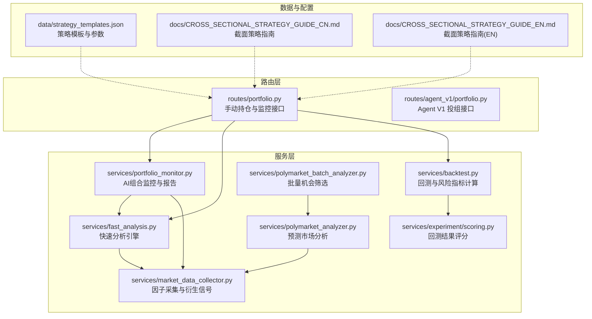
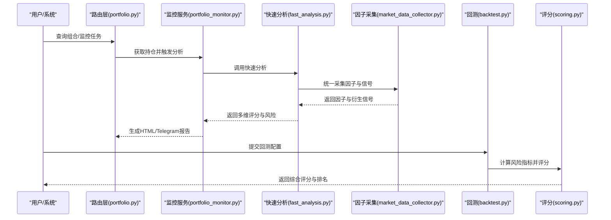
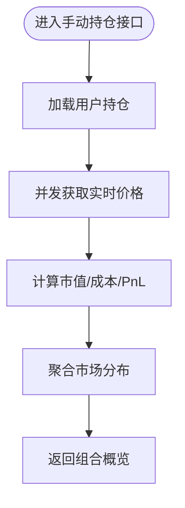
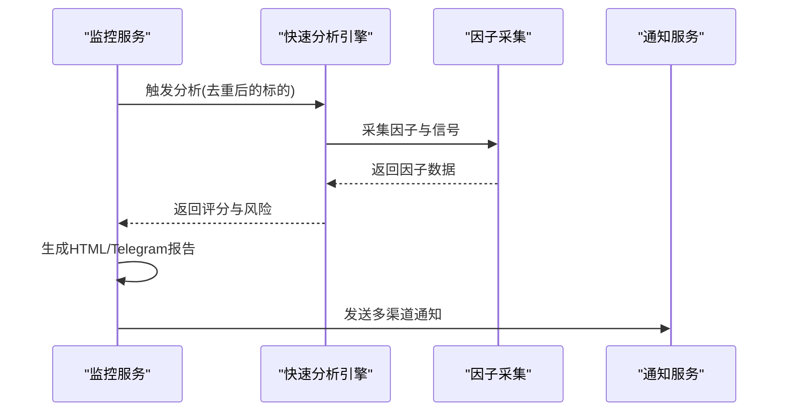
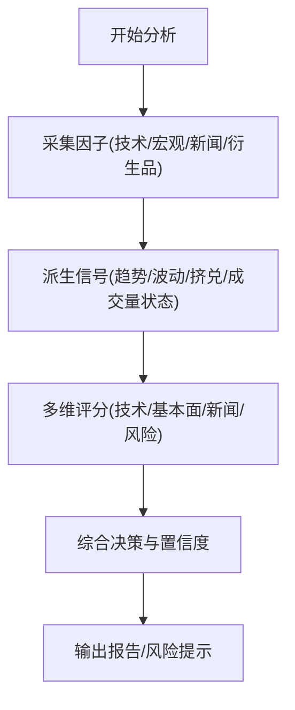
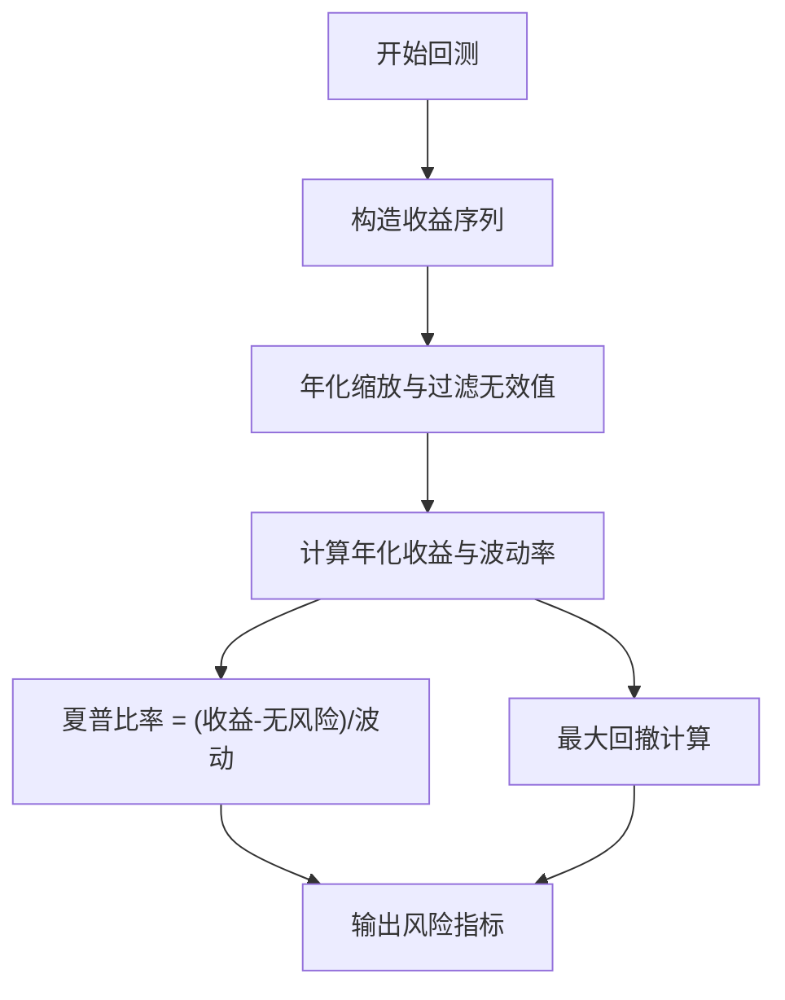
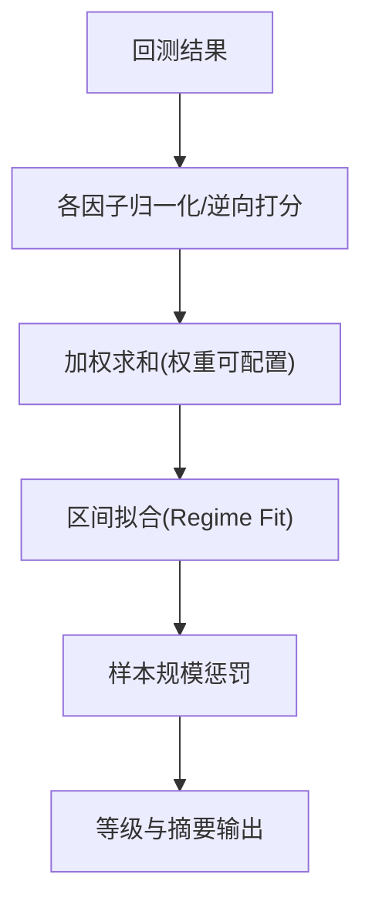
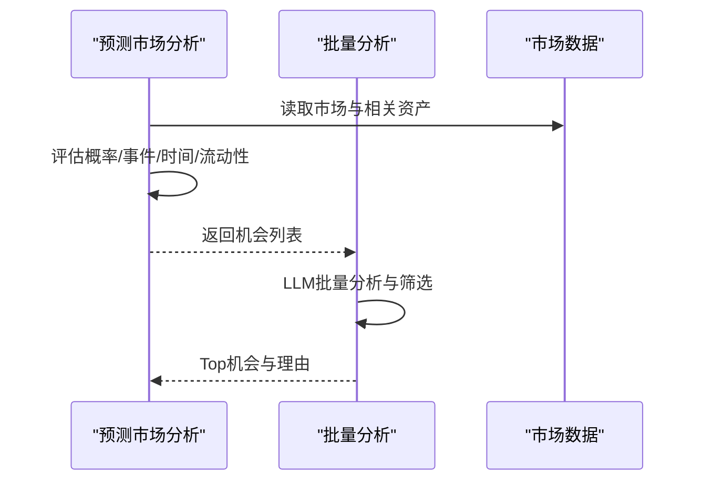
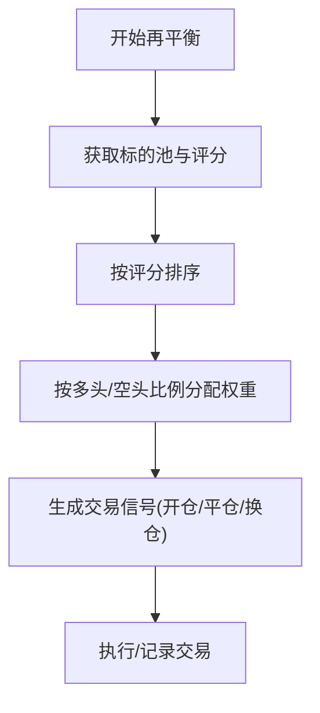
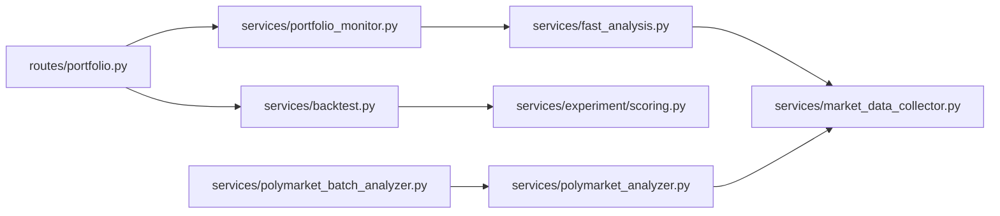

# 投资组合风险分析

<cite>
**本文引用的文件**
- [portfolio.py](file://backend_api_python/app/routes/portfolio.py)
- [portfolio_monitor.py](file://backend_api_python/app/services/portfolio_monitor.py)
- [backtest.py](file://backend_api_python/app/services/backtest.py)
- [scoring.py](file://backend_api_python/app/services/experiment/scoring.py)
- [fast_analysis.py](file://backend_api_python/app/services/fast_analysis.py)
- [market_data_collector.py](file://backend_api_python/app/services/market_data_collector.py)
- [polymarket_analyzer.py](file://backend_api_python/app/services/polymarket_analyzer.py)
- [polymarket_batch_analyzer.py](file://backend_api_python/app/services/polymarket_batch_analyzer.py)
- [strategy_templates.json](file://backend_api_python/app/data/strategy_templates.json)
- [CROSS_SECTIONAL_STRATEGY_GUIDE_CN.md](file://docs/CROSS_SECTIONAL_STRATEGY_GUIDE_CN.md)
- [CROSS_SECTIONAL_STRATEGY_GUIDE_EN.md](file://docs/CROSS_SECTIONAL_STRATEGY_GUIDE_EN.md)
</cite>

## 目录
1. [引言](#引言)
2. [项目结构](#项目结构)
3. [核心组件](#核心组件)
4. [架构总览](#架构总览)
5. [详细组件分析](#详细组件分析)
6. [依赖分析](#依赖分析)
7. [性能考量](#性能考量)
8. [故障排查指南](#故障排查指南)
9. [结论](#结论)
10. [附录](#附录)

## 引言
本技术文档面向QuantDinger的投资组合风险分析系统，聚焦以下目标：
- 全面阐述投资组合风险度量方法：方差-协方差法、历史模拟法、蒙特卡洛模拟的实现思路与适用场景
- 文档化资产配置优化算法：现代投资组合理论(MPT)与Black-Litterman模型的扩展应用
- 风险平价与最低方差组合的计算流程与参数调节要点
- 投资组合再平衡策略：定期再平衡与阈值再平衡的触发机制
- 因子风险分析：系统性风险与非系统性风险的识别与控制
- 流动性风险评估与变现成本计算：在风险控制的同时维持良好市场流动性

本系统通过统一的数据采集层、快速分析引擎与回测评分体系，为投资组合提供从数据到决策的闭环支持。

## 项目结构
QuantDinger后端采用分层架构：
- 路由层：负责用户请求接入与业务编排
- 服务层：封装数据分析、回测、监控、因子提取等核心能力
- 数据层：统一数据采集与缓存，支撑多市场、多维度因子
- 配置与文档：策略模板与使用指南

图表来源
- [portfolio.py:1-120](file://backend_api_python/app/routes/portfolio.py#L1-L120)
- [portfolio_monitor.py:1-120](file://backend_api_python/app/services/portfolio_monitor.py#L1-L120)
- [fast_analysis.py:1-120](file://backend_api_python/app/services/fast_analysis.py#L1-L120)
- [backtest.py:1-120](file://backend_api_python/app/services/backtest.py#L1-L120)
- [scoring.py:1-60](file://backend_api_python/app/services/experiment/scoring.py#L1-L60)
- [market_data_collector.py:1150-1180](file://backend_api_python/app/services/market_data_collector.py#L1150-L1180)
- [polymarket_analyzer.py:90-130](file://backend_api_python/app/services/polymarket_analyzer.py#L90-L130)
- [polymarket_batch_analyzer.py:41-75](file://backend_api_python/app/services/polymarket_batch_analyzer.py#L41-L75)
- [strategy_templates.json:169-190](file://backend_api_python/app/data/strategy_templates.json#L169-L190)
- [CROSS_SECTIONAL_STRATEGY_GUIDE_CN.md:35-62](file://docs/CROSS_SECTIONAL_STRATEGY_GUIDE_CN.md#L35-L62)
- [CROSS_SECTIONAL_STRATEGY_GUIDE_EN.md:35-62](file://docs/CROSS_SECTIONAL_STRATEGY_GUIDE_EN.md#L35-L62)

章节来源
- [portfolio.py:1-120](file://backend_api_python/app/routes/portfolio.py#L1-L120)
- [portfolio_monitor.py:1-120](file://backend_api_python/app/services/portfolio_monitor.py#L1-L120)
- [fast_analysis.py:1-120](file://backend_api_python/app/services/fast_analysis.py#L1-L120)
- [backtest.py:1-120](file://backend_api_python/app/services/backtest.py#L1-L120)
- [scoring.py:1-60](file://backend_api_python/app/services/experiment/scoring.py#L1-L60)
- [market_data_collector.py:1150-1180](file://backend_api_python/app/services/market_data_collector.py#L1150-L1180)
- [polymarket_analyzer.py:90-130](file://backend_api_python/app/services/polymarket_analyzer.py#L90-L130)
- [polymarket_batch_analyzer.py:41-75](file://backend_api_python/app/services/polymarket_batch_analyzer.py#L41-L75)
- [strategy_templates.json:169-190](file://backend_api_python/app/data/strategy_templates.json#L169-L190)
- [CROSS_SECTIONAL_STRATEGY_GUIDE_CN.md:35-62](file://docs/CROSS_SECTIONAL_STRATEGY_GUIDE_CN.md#L35-L62)
- [CROSS_SECTIONAL_STRATEGY_GUIDE_EN.md:35-62](file://docs/CROSS_SECTIONAL_STRATEGY_GUIDE_EN.md#L35-L62)

## 核心组件
- 手动持仓与监控路由：提供手动持仓查询、增删改、组合概览与监控任务管理
- 组合监控服务：基于快速分析引擎生成AI报告，支持价格/盈亏预警与多语言通知
- 快速分析引擎：统一数据采集，输出技术/基本面/新闻/风险等多维评分与最终决策
- 回测服务：支持多时间框架、高精度回测，计算夏普比率、最大回撤等风险指标
- 回测评分：将回测结果映射为多因子综合评分，用于策略对比与择优
- 因子采集器：统一采集宏观、衍生品、资金流等因子，派生信号与风险状态
- 预测市场分析：基于事件概率与关键因子评估交易机会
- 策略模板与指南：提供截面策略参数与再平衡频率等配置入口

章节来源
- [portfolio.py:140-520](file://backend_api_python/app/routes/portfolio.py#L140-L520)
- [portfolio_monitor.py:220-380](file://backend_api_python/app/services/portfolio_monitor.py#L220-L380)
- [fast_analysis.py:180-220](file://backend_api_python/app/services/fast_analysis.py#L180-L220)
- [backtest.py:64-142](file://backend_api_python/app/services/backtest.py#L64-L142)
- [scoring.py:10-75](file://backend_api_python/app/services/experiment/scoring.py#L10-L75)
- [market_data_collector.py:1150-1180](file://backend_api_python/app/services/market_data_collector.py#L1150-L1180)
- [polymarket_analyzer.py:90-130](file://backend_api_python/app/services/polymarket_analyzer.py#L90-L130)
- [strategy_templates.json:169-190](file://backend_api_python/app/data/strategy_templates.json#L169-L190)

## 架构总览
系统围绕“数据采集—分析—回测—评分—监控—再平衡”的闭环构建，关键交互如下：

图表来源
- [portfolio.py:400-520](file://backend_api_python/app/routes/portfolio.py#L400-L520)
- [portfolio_monitor.py:280-380](file://backend_api_python/app/services/portfolio_monitor.py#L280-L380)
- [fast_analysis.py:180-220](file://backend_api_python/app/services/fast_analysis.py#L180-L220)
- [market_data_collector.py:1150-1180](file://backend_api_python/app/services/market_data_collector.py#L1150-L1180)
- [backtest.py:4826-4896](file://backend_api_python/app/services/backtest.py#L4826-L4896)
- [scoring.py:23-75](file://backend_api_python/app/services/experiment/scoring.py#L23-L75)

## 详细组件分析

### 组件A：手动持仓与组合概览
- 功能要点
  - 并行获取实时价格，计算市值、成本、盈亏与盈亏百分比
  - 支持强制刷新与缓存控制，降低外部API压力
  - 组合概览统计总成本、总市值、总盈亏与市场分布
- 关键路径
  - 位置查询与并行价格抓取
  - PnL计算与市场分布聚合
- 适用场景
  - 个人投资组合监控与风控
  - 与AI监控联动，触发再平衡或预警

图表来源
- [portfolio.py:140-520](file://backend_api_python/app/routes/portfolio.py#L140-L520)

章节来源
- [portfolio.py:140-520](file://backend_api_python/app/routes/portfolio.py#L140-L520)

### 组件B：组合监控与AI报告
- 功能要点
  - 基于快速分析引擎对重复标的去重处理，提升LLM利用率
  - 生成HTML/Telegram报告，包含组合概览、AI建议、逐项分析与风险提示
  - 支持价格/盈亏预警，多通道通知（邮件/电报/Webhook/浏览器）
- 关键路径
  - 去重与并行分析
  - 报告拼装与多语言模板
  - 通知渠道解析与投递

图表来源
- [portfolio_monitor.py:280-380](file://backend_api_python/app/services/portfolio_monitor.py#L280-L380)
- [fast_analysis.py:180-220](file://backend_api_python/app/services/fast_analysis.py#L180-L220)
- [market_data_collector.py:1150-1180](file://backend_api_python/app/services/market_data_collector.py#L1150-L1180)

章节来源
- [portfolio_monitor.py:220-380](file://backend_api_python/app/services/portfolio_monitor.py#L220-L380)
- [fast_analysis.py:180-220](file://backend_api_python/app/services/fast_analysis.py#L180-L220)
- [market_data_collector.py:1150-1180](file://backend_api_python/app/services/market_data_collector.py#L1150-L1180)

### 组件C：快速分析引擎与因子信号
- 功能要点
  - 统一数据采集器，支持技术、宏观、新闻、衍生品等多维因子
  - 输出技术/基本面/新闻/风险等维度评分与最终决策
  - 针对加密市场提供衍生品因子（资金费率、持仓、多空比、资金流等）与风险状态
- 关键路径
  - 因子采集与信号派生
  - 多维评分与风险汇总
  - 决策与置信度输出

图表来源
- [fast_analysis.py:1441-1461](file://backend_api_python/app/services/fast_analysis.py#L1441-L1461)
- [market_data_collector.py:1150-1180](file://backend_api_python/app/services/market_data_collector.py#L1150-L1180)
- [market_data_collector.py:1576-1607](file://backend_api_python/app/services/market_data_collector.py#L1576-L1607)

章节来源
- [fast_analysis.py:1441-1461](file://backend_api_python/app/services/fast_analysis.py#L1441-L1461)
- [market_data_collector.py:1150-1180](file://backend_api_python/app/services/market_data_collector.py#L1150-L1180)
- [market_data_collector.py:1576-1607](file://backend_api_python/app/services/market_data_collector.py#L1576-L1607)

### 组件D：回测与风险指标计算
- 功能要点
  - 支持多时间框架与高精度回测（尤其加密市场）
  - 计算夏普比率、最大回撤等风险指标
  - 执行假设与滑点/手续费建模（通过配置项）
- 关键路径
  - 权益曲线收益序列构造
  - 年化收益与波动率计算
  - 夏普比率与最大回撤计算

图表来源
- [backtest.py:4826-4896](file://backend_api_python/app/services/backtest.py#L4826-L4896)

章节来源
- [backtest.py:4826-4896](file://backend_api_python/app/services/backtest.py#L4826-L4896)

### 组件E：回测结果评分与策略择优
- 功能要点
  - 将回测结果映射为多因子综合评分，权重可调
  - 考虑样本规模、稳定性、区间状态（牛市/熊市/震荡/高波动）等
  - 提供整体评分、等级与摘要指标
- 关键路径
  - 各因子归一化与逆向打分
  - 加权求和与区间拟合
  - 样本规模惩罚与最终等级

图表来源
- [scoring.py:23-75](file://backend_api_python/app/services/experiment/scoring.py#L23-L75)
- [scoring.py:84-92](file://backend_api_python/app/services/experiment/scoring.py#L84-L92)

章节来源
- [scoring.py:10-75](file://backend_api_python/app/services/experiment/scoring.py#L10-L75)
- [scoring.py:84-92](file://backend_api_python/app/services/experiment/scoring.py#L84-L92)

### 组件F：预测市场分析与机会筛选
- 功能要点
  - 基于预测市场概率、事件重要性、时间窗口、流动性等维度评估机会
  - 生成机会评分、推荐方向与关键因素
  - 批量分析与筛选Top机会
- 关键路径
  - 市场分析与相关资产识别
  - 机会评分与推荐方向
  - 结果持久化与返回

图表来源
- [polymarket_analyzer.py:90-130](file://backend_api_python/app/services/polymarket_analyzer.py#L90-L130)
- [polymarket_batch_analyzer.py:41-75](file://backend_api_python/app/services/polymarket_batch_analyzer.py#L41-L75)

章节来源
- [polymarket_analyzer.py:90-130](file://backend_api_python/app/services/polymarket_analyzer.py#L90-L130)
- [polymarket_batch_analyzer.py:41-75](file://backend_api_python/app/services/polymarket_batch_analyzer.py#L41-L75)

### 组件G：再平衡策略与截面轮动
- 功能要点
  - 截面策略支持每日/每周/每月再平衡
  - 通过指标评分排序，按多头/空头比例分配头寸
  - 支持动量轮动等高级策略模板
- 关键路径
  - 指标评分与排序
  - 目标权重计算与信号生成
  - 再平衡触发条件与执行

图表来源
- [CROSS_SECTIONAL_STRATEGY_GUIDE_CN.md:124-168](file://docs/CROSS_SECTIONAL_STRATEGY_GUIDE_CN.md#L124-L168)
- [CROSS_SECTIONAL_STRATEGY_GUIDE_EN.md:210-224](file://docs/CROSS_SECTIONAL_STRATEGY_GUIDE_EN.md#L210-L224)
- [strategy_templates.json:169-190](file://backend_api_python/app/data/strategy_templates.json#L169-L190)

章节来源
- [CROSS_SECTIONAL_STRATEGY_GUIDE_CN.md:35-62](file://docs/CROSS_SECTIONAL_STRATEGY_GUIDE_CN.md#L35-L62)
- [CROSS_SECTIONAL_STRATEGY_GUIDE_CN.md:124-168](file://docs/CROSS_SECTIONAL_STRATEGY_GUIDE_CN.md#L124-L168)
- [CROSS_SECTIONAL_STRATEGY_GUIDE_EN.md:35-62](file://docs/CROSS_SECTIONAL_STRATEGY_GUIDE_EN.md#L35-L62)
- [CROSS_SECTIONAL_STRATEGY_GUIDE_EN.md:210-224](file://docs/CROSS_SECTIONAL_STRATEGY_GUIDE_EN.md#L210-L224)
- [strategy_templates.json:169-190](file://backend_api_python/app/data/strategy_templates.json#L169-L190)

## 依赖分析
- 路由层依赖服务层：组合接口依赖监控与分析服务
- 监控服务依赖快速分析与因子采集：报告生成依赖多维因子
- 快速分析依赖因子采集：统一数据源保障一致性
- 回测服务依赖评分服务：回测结果需评分用于策略对比
- 预测市场分析依赖因子采集与批量分析：机会筛选依赖LLM

图表来源
- [portfolio.py:1-120](file://backend_api_python/app/routes/portfolio.py#L1-L120)
- [portfolio_monitor.py:1-120](file://backend_api_python/app/services/portfolio_monitor.py#L1-L120)
- [fast_analysis.py:1-120](file://backend_api_python/app/services/fast_analysis.py#L1-L120)
- [market_data_collector.py:1150-1180](file://backend_api_python/app/services/market_data_collector.py#L1150-L1180)
- [backtest.py:1-120](file://backend_api_python/app/services/backtest.py#L1-L120)
- [scoring.py:1-60](file://backend_api_python/app/services/experiment/scoring.py#L1-L60)
- [polymarket_analyzer.py:90-130](file://backend_api_python/app/services/polymarket_analyzer.py#L90-L130)
- [polymarket_batch_analyzer.py:41-75](file://backend_api_python/app/services/polymarket_batch_analyzer.py#L41-L75)

章节来源
- [portfolio.py:1-120](file://backend_api_python/app/routes/portfolio.py#L1-L120)
- [portfolio_monitor.py:1-120](file://backend_api_python/app/services/portfolio_monitor.py#L1-L120)
- [fast_analysis.py:1-120](file://backend_api_python/app/services/fast_analysis.py#L1-L120)
- [market_data_collector.py:1150-1180](file://backend_api_python/app/services/market_data_collector.py#L1150-L1180)
- [backtest.py:1-120](file://backend_api_python/app/services/backtest.py#L1-L120)
- [scoring.py:1-60](file://backend_api_python/app/services/experiment/scoring.py#L1-L60)
- [polymarket_analyzer.py:90-130](file://backend_api_python/app/services/polymarket_analyzer.py#L90-L130)
- [polymarket_batch_analyzer.py:41-75](file://backend_api_python/app/services/polymarket_batch_analyzer.py#L41-L75)

## 性能考量
- 并发与限流
  - 组合接口使用线程池并发获取价格，内置请求间隔限制，避免触发外部API限流
- 缓存与去重
  - 快速分析对重复标的进行去重，减少重复LLM调用
  - 回测服务内置K线缓存，按时间框架设置TTL
- 计算复杂度
  - 夏普比率与最大回撤计算基于收益序列，时间复杂度线性
  - 回测评分对收益曲线进行单调性与稳定性评估，线性复杂度
- I/O与网络
  - 因子采集统一入口，减少重复拉取与解析成本

章节来源
- [portfolio.py:28-46](file://backend_api_python/app/routes/portfolio.py#L28-L46)
- [portfolio_monitor.py:300-320](file://backend_api_python/app/services/portfolio_monitor.py#L300-L320)
- [backtest.py:25-61](file://backend_api_python/app/services/backtest.py#L25-L61)

## 故障排查指南
- 组合监控未生成报告
  - 检查监控任务配置与运行间隔
  - 确认通知渠道与目标已正确解析
- 快速分析失败
  - 检查因子采集是否成功
  - 查看错误日志定位具体异常
- 回测结果异常
  - 检查时间框架与数据范围
  - 确认无风险利率与年化因子设置
- 截面策略未执行
  - 检查策略类型与标的列表
  - 确认再平衡频率与阈值设置

章节来源
- [portfolio_monitor.py:68-130](file://backend_api_python/app/services/portfolio_monitor.py#L68-L130)
- [fast_analysis.py:276-279](file://backend_api_python/app/services/fast_analysis.py#L276-L279)
- [backtest.py:4826-4896](file://backend_api_python/app/services/backtest.py#L4826-L4896)
- [CROSS_SECTIONAL_STRATEGY_GUIDE_EN.md:210-224](file://docs/CROSS_SECTIONAL_STRATEGY_GUIDE_EN.md#L210-L224)

## 结论
QuantDinger的投资组合风险分析系统通过统一数据采集、快速分析与回测评分，实现了从因子洞察到策略验证再到监控预警的全链路闭环。系统在性能上采用并发与缓存策略，在可靠性上提供多通道通知与错误处理。结合截面策略与再平衡机制，可在控制风险的同时保持对市场流动性的敏感性。

## 附录
- 风险度量方法与优化算法
  - 方差-协方差法：适用于正态分布假设下的线性组合风险估算
  - 历史模拟法：基于历史收益率分布，无需参数假设
  - 蒙特卡洛模拟：通过随机抽样生成大量情景，评估极端尾部风险
  - 现代投资组合理论(MPT)：在给定期望收益下最小化方差，或在给定风险下最大化收益
  - Black-Litterman模型：融合投资者观点与市场均衡收益，改善估计稳定性
  - 风险平价与最低方差组合：通过等边际贡献或最小化方差实现权重分配
- 再平衡策略
  - 定期再平衡：按日/周/月固定周期调整权重
  - 阈值再平衡：当组合权重偏离目标超过阈值时触发
- 因子风险分析
  - 系统性风险：通过市场因子与宏观变量衡量
  - 非系统性风险：通过个股/资产特定因子与残差衡量
- 流动性风险与变现成本
  - 通过交易量、买卖价差与滑点建模评估流动性风险
  - 在回测中引入滑点与手续费，确保策略在真实市场中的可行性

[本节为概念性总结，不直接分析具体文件]