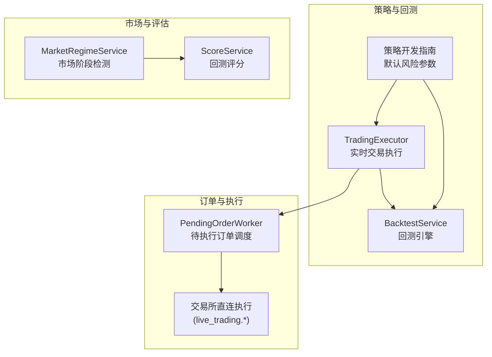
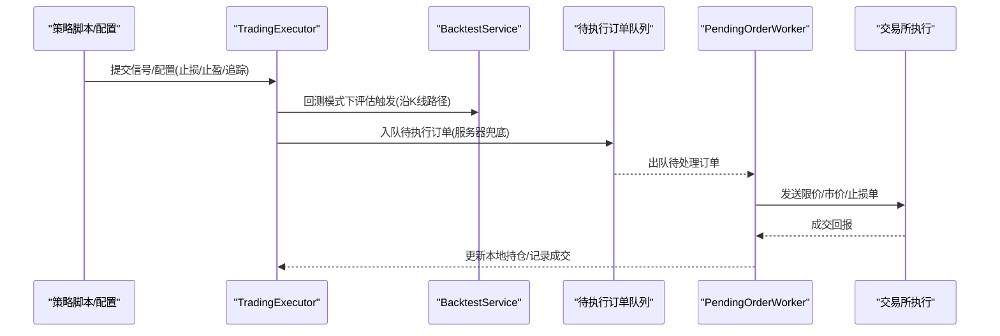
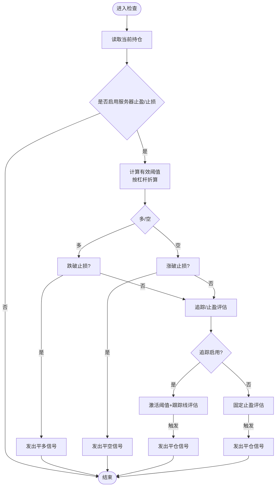
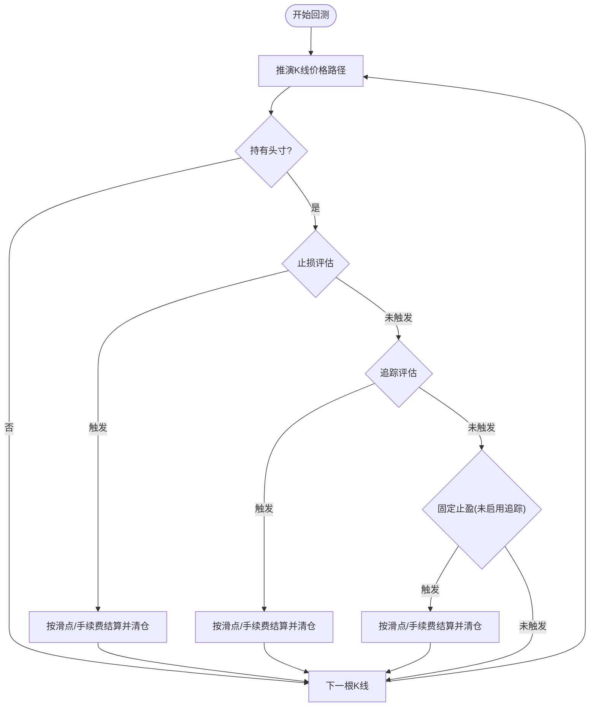
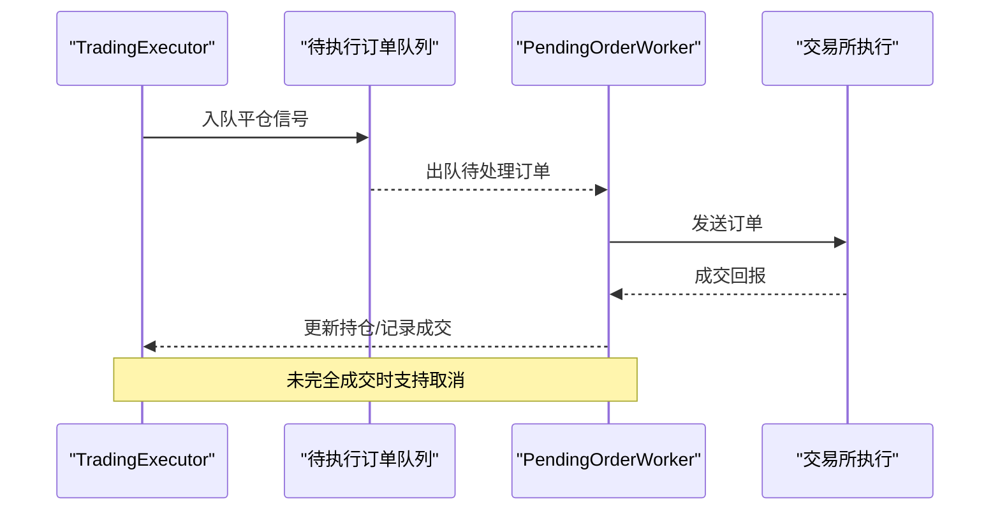
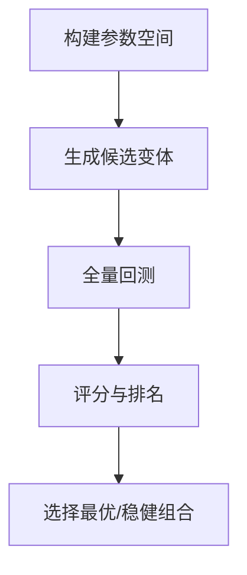
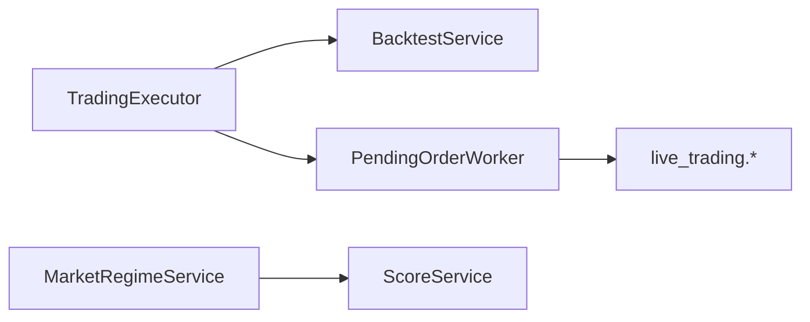

# 止损策略

<cite>
**本文引用的文件**
- [trading_executor.py](file://backend_api_python/app/services/trading_executor.py)
- [backtest.py](file://backend_api_python/app/services/backtest.py)
- [pending_order_worker.py](file://backend_api_python/app/services/pending_order_worker.py)
- [STRATEGY_DEV_GUIDE_CN.md](file://docs/STRATEGY_DEV_GUIDE_CN.md)
- [regime.py](file://backend_api_python/app/services/experiment/regime.py)
- [scoring.py](file://backend_api_python/app/services/experiment/scoring.py)
- [strategy.py](file://backend_api_python/app/services/strategy.py)
</cite>

## 目录
1. [引言](#引言)
2. [项目结构](#项目结构)
3. [核心组件](#核心组件)
4. [架构总览](#架构总览)
5. [详细组件分析](#详细组件分析)
6. [依赖分析](#依赖分析)
7. [性能考量](#性能考量)
8. [故障排查指南](#故障排查指南)
9. [结论](#结论)
10. [附录](#附录)

## 引言
本文件面向QuantDinger的止损策略，系统化阐述固定止损、追踪止损、动态止损与移动止损的实现原理、参数配置、触发条件与执行时机，并结合回测与实盘执行链路，给出在震荡市、趋势市与突破市中的有效性分析、参数优化方法与风险收益评估指标，以及止损与仓位管理的协同机制与失败处理方案。

## 项目结构
围绕止损策略的关键代码分布在以下模块：
- 实时交易执行与服务器兜底：trading_executor.py
- 回测引擎：backtest.py
- 待执行订单调度与实盘执行：pending_order_worker.py
- 策略开发与默认风险参数说明：STRATEGY_DEV_GUIDE_CN.md
- 市场阶段检测与评分：experiment/regime.py、experiment/scoring.py
- 策略运行状态与查询：services/strategy.py

图示来源
- [trading_executor.py](file://backend_api_python/app/services/trading_executor.py)
- [backtest.py](file://backend_api_python/app/services/backtest.py)
- [pending_order_worker.py](file://backend_api_python/app/services/pending_order_worker.py)
- [STRATEGY_DEV_GUIDE_CN.md](file://docs/STRATEGY_DEV_GUIDE_CN.md)
- [regime.py](file://backend_api_python/app/services/experiment/regime.py)
- [scoring.py](file://backend_api_python/app/services/experiment/scoring.py)

章节来源
- [trading_executor.py](file://backend_api_python/app/services/trading_executor.py)
- [backtest.py](file://backend_api_python/app/services/backtest.py)
- [pending_order_worker.py](file://backend_api_python/app/services/pending_order_worker.py)
- [STRATEGY_DEV_GUIDE_CN.md](file://docs/STRATEGY_DEV_GUIDE_CN.md)
- [regime.py](file://backend_api_python/app/services/experiment/regime.py)
- [scoring.py](file://backend_api_python/app/services/experiment/scoring.py)
- [strategy.py](file://backend_api_python/app/services/strategy.py)

## 核心组件
- 服务器兜底止损/止盈/追踪：在实时执行中，若价格穿透止损线或满足止盈/追踪条件，则直接生成平仓信号，避免指标回放导致的漏触发。
- 回测止损/止盈/追踪：在回测中沿K线价格路径逐点评估，优先级最高，随后是固定止盈与追踪止盈互斥生效。
- 订单调度与实盘执行：PendingOrderWorker负责从队列取出待执行订单，按交易所接口执行并更新状态。
- 市场阶段检测与评分：基于特征提取与分类规则识别牛市、熊市、震荡压缩、高波动与过渡阶段，并据此评估策略适配度与综合评分。

章节来源
- [trading_executor.py](file://backend_api_python/app/services/trading_executor.py)
- [backtest.py](file://backend_api_python/app/services/backtest.py)
- [pending_order_worker.py](file://backend_api_python/app/services/pending_order_worker.py)
- [regime.py](file://backend_api_python/app/services/experiment/regime.py)
- [scoring.py](file://backend_api_python/app/services/experiment/scoring.py)

## 架构总览
止损策略在系统中的位置与交互如下：

图示来源
- [trading_executor.py](file://backend_api_python/app/services/trading_executor.py)
- [backtest.py](file://backend_api_python/app/services/backtest.py)
- [pending_order_worker.py](file://backend_api_python/app/services/pending_order_worker.py)

## 详细组件分析

### 服务器兜底止损/止盈/追踪（实时执行）
- 触发条件
  - 固定止损：多头跌破 entry*(1-sl_pct/lev)，空头涨破 entry*(1+sl_pct/lev)
  - 固定止盈：多头涨破 entry*(1+tp_pct/lev)，空头跌破 entry*(1-tp_pct/lev)
  - 追踪止损：激活阈值激活后，多头以最高价 hp*(1-trailing_pct/lev) 下轨，空头以最低价 lp*(1+trailing_pct/lev) 上轨
- 执行时机
  - 以当前价格与K线起始时间戳去重，避免同K内重复触发
  - 触发后生成 close_long/close_short 信号，交由订单队列处理
- 关键要点
  - 风险百分比按保证金PnL定义，需除以杠杆换算为价格阈值
  - 追踪止盈启用时禁用固定止盈，避免冲突
  - 服务器兜底与策略脚本信号共同构成双重保护

图示来源
- [trading_executor.py](file://backend_api_python/app/services/trading_executor.py)

章节来源
- [trading_executor.py](file://backend_api_python/app/services/trading_executor.py)

### 回测中的止损/止盈/追踪
- 价格路径评估
  - 对每根K线推演价格路径（如开低高收），沿路径逐点评估
  - 优先级：止损/止盈/追踪 > 固定止盈（追踪启用时禁用）
- 多/空方向
  - 多头：最高价序列用于追踪，跌破止损线即触发
  - 空头：最低价序列用于追踪，涨破止损线即触发
- 执行价格与滑点
  - 触发时采用执行价格并叠加/扣除滑点与手续费，计算利润与账户余额
- 爆仓处理
  - 当价格触及强平线，先尝试止损，否则直接记录爆仓

图示来源
- [backtest.py](file://backend_api_python/app/services/backtest.py)

章节来源
- [backtest.py](file://backend_api_python/app/services/backtest.py)

### 订单创建、修改与取消流程
- 创建
  - 策略脚本或服务器兜底生成平仓信号，进入待执行订单队列
- 修改
  - 系统未提供通用“修改止损/止盈”的接口；可通过重新提交新信号覆盖旧信号（遵循去重逻辑）
- 取消
  - 对于未完全成交的限价单，按交易所客户端类型调用取消接口
- 执行
  - PendingOrderWorker按优先级与限流策略出队，调用具体交易所执行模块，记录成交与状态变更

图示来源
- [trading_executor.py](file://backend_api_python/app/services/trading_executor.py)
- [pending_order_worker.py](file://backend_api_python/app/services/pending_order_worker.py)

章节来源
- [pending_order_worker.py](file://backend_api_python/app/services/pending_order_worker.py)
- [trading_executor.py](file://backend_api_python/app/services/trading_executor.py)

### 不同止损机制详解与适用场景

- 固定止损
  - 定义：以入场价为基准，按固定百分比设置止损线
  - 优点：简单明确，易于理解与回测
  - 适用：震荡市或波动有限的行情，避免极端波动导致过早止损
  - 注意：需考虑滑点与手续费，避免“假破位”

- 追踪止损
  - 定义：随价格朝有利方向移动而上移止损线，锁定利润
  - 优点：在趋势行情中最大化收益
  - 适用：趋势市，尤其多头上涨/空头下跌过程中
  - 注意：激活阈值避免频繁触发；与固定止盈互斥

- 动态止损
  - 定义：基于波动率（如ATR）或市场结构（支撑/阻力）自适应调整止损距离
  - 优点：对不同市场环境自适应
  - 适用：高波动或突破后的震荡
  - 实现建议：在策略脚本中将“止损”编码为 sell 信号，而非外部配置

- 移动止损
  - 定义：以滚动最高/最低价或技术指标（如通道上轨/下轨）为基准移动止损线
  - 优点：跟随趋势，减少回撤
  - 适用：趋势延续较强时
  - 注意：避免“追涨杀跌”陷阱，应配合趋势过滤

章节来源
- [STRATEGY_DEV_GUIDE_CN.md](file://docs/STRATEGY_DEV_GUIDE_CN.md)
- [backtest.py](file://backend_api_python/app/services/backtest.py)
- [trading_executor.py](file://backend_api_python/app/services/trading_executor.py)

### 市场环境下的有效性分析
- 牛趋势（Bull Trend）
  - 固定止损易被反向波动触发，建议结合追踪止损或动态止损
  - 追踪止损/移动止损效果佳，能有效保留利润
- 熊趋势（Bear Trend）
  - 固定止损可快速控制损失；追踪止损可能过早触发
  - 建议降低止损档位或启用更高激活阈值
- 震荡压缩（Range Compression）
  - 固定止损易被噪音触发；建议扩大止损或启用动态止损
  - 追踪/移动止损不适用，易在箱体上下反复止损
- 高波动（High Volatility）
  - 固定止损可能过于敏感；建议扩大止损或采用ATR类动态止损
  - 追踪止损需谨慎，避免“追涨杀跌”

章节来源
- [regime.py](file://backend_api_python/app/services/experiment/regime.py)

### 参数优化与风险收益评估
- 参数空间
  - 止损百分比、止盈百分比、追踪百分比与激活阈值、加仓/减仓步进与次数
- 优化方法
  - 结构化网格/随机搜索，在指定参数空间内遍历组合
  - 以综合评分（如夏普比率、最大回撤、胜率、盈亏比）排序
- 评估指标
  - 年化收益、夏普比率、最大回撤、胜率、盈亏比、稳定性得分、样本量修正

图示来源
- [scoring.py](file://backend_api_python/app/services/experiment/scoring.py)

章节来源
- [scoring.py](file://backend_api_python/app/services/experiment/scoring.py)

### 止损与仓位管理协同
- 仓位管理边界
  - IndicatorStrategy：默认开仓资金占比、方向限制、固定止损/止盈/追踪
  - 超出边界（分批加减仓、部分止盈、冷却重入、动态止损线）迁移至 ScriptStrategy
- 协同机制
  - 服务器兜底止损/止盈与策略脚本信号共同生效，优先级顺序由引擎决定
  - 回测与实盘在“按杠杆折算阈值”“成交时机”“滑点/手续费”上保持一致语义

章节来源
- [STRATEGY_DEV_GUIDE_CN.md](file://docs/STRATEGY_DEV_GUIDE_CN.md)
- [trading_executor.py](file://backend_api_python/app/services/trading_executor.py)
- [backtest.py](file://backend_api_python/app/services/backtest.py)

### 止损失败的处理方案
- 服务器兜底兜住漏触发
  - 当指标回放未产生平仓信号或K线“插针反弹”导致条件不满足时，服务器按阈值强制平仓
- 订单未完全成交
  - 支持取消未成交限价单，避免占用资金与暴露风险
- 爆仓处理
  - 当价格触及强平线，优先按止损执行；否则记录爆仓并清仓

章节来源
- [trading_executor.py](file://backend_api_python/app/services/trading_executor.py)
- [pending_order_worker.py](file://backend_api_python/app/services/pending_order_worker.py)
- [backtest.py](file://backend_api_python/app/services/backtest.py)

## 依赖分析
- 组件耦合
  - TradingExecutor 与 BacktestService 在“阈值折算/触发优先级/成交语义”上保持一致
  - PendingOrderWorker 与 live_trading 各交易所客户端解耦，通过统一接口执行
- 外部依赖
  - 市场阶段检测与评分服务为策略筛选与优化提供辅助

图示来源
- [trading_executor.py](file://backend_api_python/app/services/trading_executor.py)
- [backtest.py](file://backend_api_python/app/services/backtest.py)
- [pending_order_worker.py](file://backend_api_python/app/services/pending_order_worker.py)
- [regime.py](file://backend_api_python/app/services/experiment/regime.py)
- [scoring.py](file://backend_api_python/app/services/experiment/scoring.py)

章节来源
- [trading_executor.py](file://backend_api_python/app/services/trading_executor.py)
- [backtest.py](file://backend_api_python/app/services/backtest.py)
- [pending_order_worker.py](file://backend_api_python/app/services/pending_order_worker.py)
- [regime.py](file://backend_api_python/app/services/experiment/regime.py)
- [scoring.py](file://backend_api_python/app/services/experiment/scoring.py)

## 性能考量
- 回测路径评估
  - 逐K线逐点评估止损/止盈/追踪，复杂度与K线数量线性相关
  - 建议在震荡/高波动阶段适当放宽阈值，减少频繁触发
- 实时执行
  - 服务器兜底检查按当前价格与K线起始时间戳去重，避免重复触发
  - 订单队列按优先级与限流策略处理，保障吞吐

## 故障排查指南
- 服务器兜底未触发
  - 检查是否启用、止损/止盈/追踪配置是否大于零、杠杆折算是否正确
- 订单未成交或延迟
  - 查看待执行订单状态、尝试取消未成交限价单、检查交易所接口状态
- 回测与实盘差异
  - 成交时机配置（下一根开盘/当根收盘）不同会导致差异，需重新回测核对

章节来源
- [trading_executor.py](file://backend_api_python/app/services/trading_executor.py)
- [pending_order_worker.py](file://backend_api_python/app/services/pending_order_worker.py)
- [STRATEGY_DEV_GUIDE_CN.md](file://docs/STRATEGY_DEV_GUIDE_CN.md)

## 结论
QuantDinger的止损体系以“服务器兜底 + 策略信号 + 回测一致性”为核心，通过固定/追踪/动态/移动止损在不同市场环境下形成互补。结合市场阶段检测与评分体系，可实现参数空间的系统化优化与稳健策略筛选。实际应用中，应根据市场环境选择合适止损机制，并将止损与仓位管理协同设计，以提升风险收益比与策略稳定性。

## 附录
- 关键术语
  - 止损线：触发平仓的价格阈值
  - 追踪激活阈值：追踪止损开始跟踪的最小价格变动
  - 杠杆折算：将保证金PnL百分比转换为价格阈值
  - 爆仓线：强平触发的极端价格线
- 参考配置入口
  - 服务器兜底止损/止盈/追踪开关与阈值
  - 回测执行时机（下一根开盘/当根收盘）