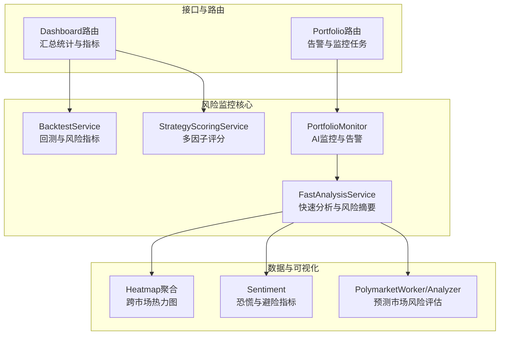
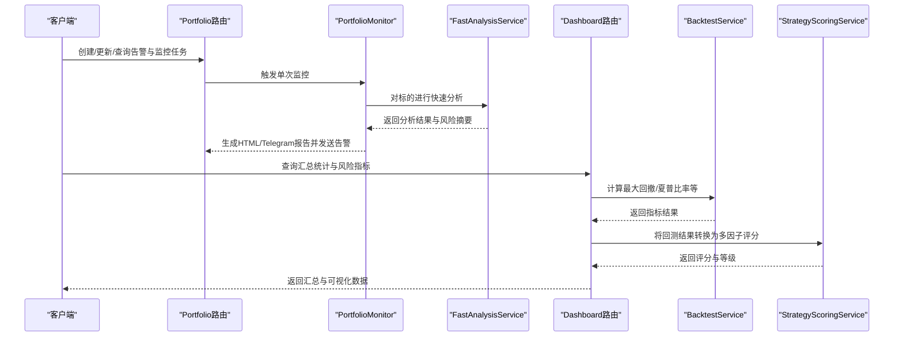
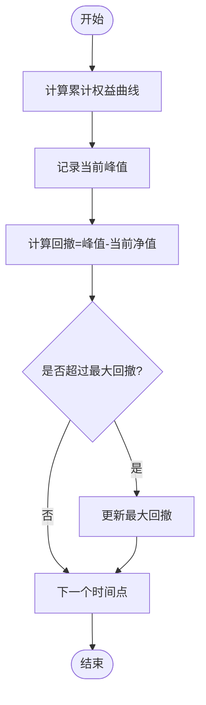
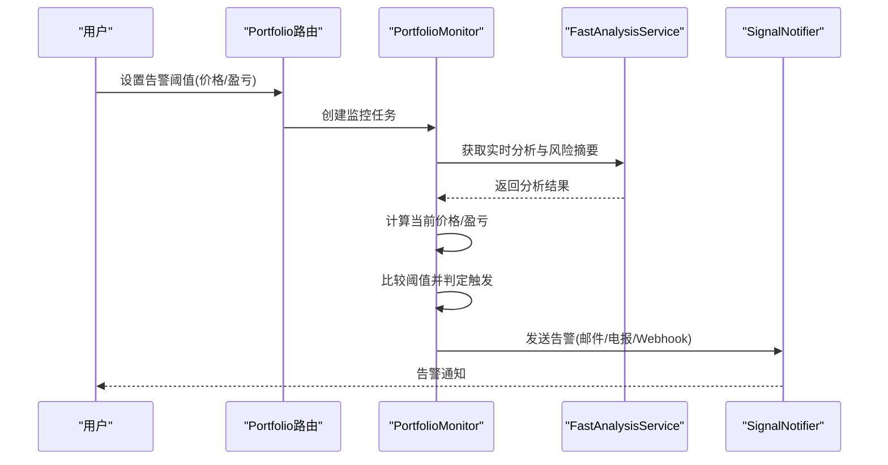
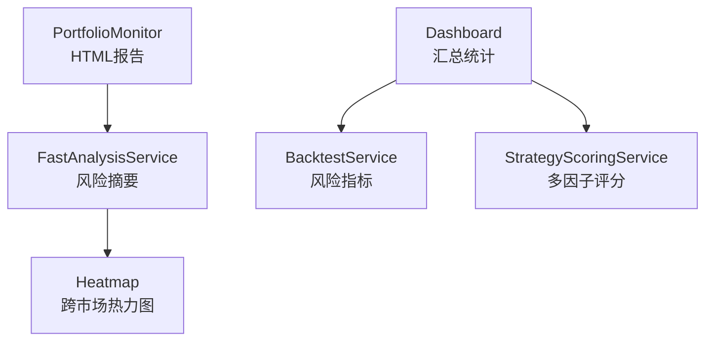
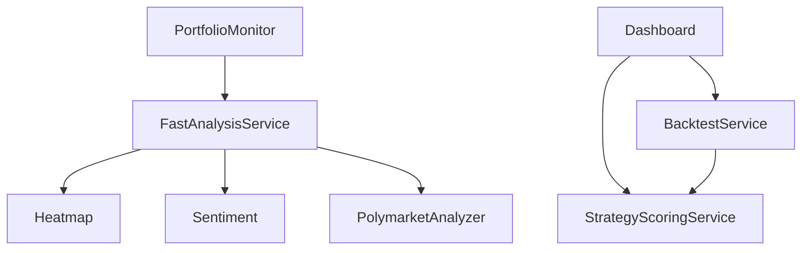

# 风险监控

<cite>
**本文引用的文件**
- [backend_api_python/app/services/backtest.py](file://backend_api_python/app/services/backtest.py)
- [backend_api_python/app/services/experiment/scoring.py](file://backend_api_python/app/services/experiment/scoring.py)
- [backend_api_python/app/route/dashboard.py](file://backend_api_python/app/route/dashboard.py)
- [backend_api_python/app/route/portfolio.py](file://backend_api_python/app/route/portfolio.py)
- [backend_api_python/app/services/portfolio_monitor.py](file://backend_api_python/app/services/portfolio_monitor.py)
- [backend_api_python/app/data_providers/heatmap.py](file://backend_api_python/app/data_providers/heatmap.py)
- [backend_api_python/app/services/fast_analysis.py](file://backend_api_python/app/services/fast_analysis.py)
- [backend_api_python/app/data_providers/sentiment.py](file://backend_api_python/app/data_providers/sentiment.py)
- [backend_api_python/app/services/polymarket_worker.py](file://backend_api_python/app/services/polymarket_worker.py)
- [backend_api_python/app/services/polymarket_analyzer.py](file://backend_api_python/app/services/polymarket_analyzer.py)
- [backend_api_python/docs/agent/AI_INTEGRATION_DESIGN.md](file://backend_api_python/docs/agent/AI_INTEGRATION_DESIGN.md)
</cite>

## 目录
1. [简介](#简介)
2. [项目结构](#项目结构)
3. [核心组件](#核心组件)
4. [架构总览](#架构总览)
5. [详细组件分析](#详细组件分析)
6. [依赖分析](#依赖分析)
7. [性能考量](#性能考量)
8. [故障排查指南](#故障排查指南)
9. [结论](#结论)
10. [附录](#附录)

## 简介
本技术文档面向QuantDinger的风险监控系统，聚焦实时风险指标计算与可视化、风险阈值与预警机制、多维度风险监控体系、风险报告与展示、以及压力测试与情景分析能力。文档从代码层面梳理了VaR、最大回撤、夏普比率、索提诺比率等关键风险度量的实现方式，明确了价格/盈亏预警、自动暂停交易、强制平仓与资金调拨的触发条件与集成路径，并总结了市场风险、信用风险、流动性风险与操作风险的识别与控制手段。

## 项目结构
QuantDinger后端采用Python Flask微服务架构，风险监控相关能力主要分布在以下模块：
- 回测与评分：BacktestService负责回测与风险指标计算；StrategyScoringService将回测结果转化为可比较的多因子评分。
- 报告与监控：PortfolioMonitor提供AI驱动的投资组合监控与告警；FastAnalysisService提供快速多维分析与风险摘要。
- 数据与可视化：Heatmap数据聚合用于宏观与跨市场风险热力图；Sentiment提供恐慌与避险类指标。
- 预测市场与机会：Polymarket系列服务支持基于预测市场的风险评估与机会筛选。
- 路由与接口：Portfolio路由提供告警与监控任务管理；Dashboard路由提供汇总统计与风险指标计算。

**图表来源**
- [backend_api_python/app/services/backtest.py](file://backend_api_python/app/services/backtest.py)
- [backend_api_python/app/services/experiment/scoring.py](file://backend_api_python/app/services/experiment/scoring.py)
- [backend_api_python/app/services/portfolio_monitor.py](file://backend_api_python/app/services/portfolio_monitor.py)
- [backend_api_python/app/services/fast_analysis.py](file://backend_api_python/app/services/fast_analysis.py)
- [backend_api_python/app/data_providers/heatmap.py](file://backend_api_python/app/data_providers/heatmap.py)
- [backend_api_python/app/data_providers/sentiment.py](file://backend_api_python/app/data_providers/sentiment.py)
- [backend_api_python/app/services/polymarket_worker.py](file://backend_api_python/app/services/polymarket_worker.py)
- [backend_api_python/app/services/polymarket_analyzer.py](file://backend_api_python/app/services/polymarket_analyzer.py)
- [backend_api_python/app/route/portfolio.py](file://backend_api_python/app/route/portfolio.py)
- [backend_api_python/app/route/dashboard.py](file://backend_api_python/app/route/dashboard.py)

**章节来源**
- [backend_api_python/app/services/backtest.py](file://backend_api_python/app/services/backtest.py)
- [backend_api_python/app/services/experiment/scoring.py](file://backend_api_python/app/services/experiment/scoring.py)
- [backend_api_python/app/services/portfolio_monitor.py](file://backend_api_python/app/services/portfolio_monitor.py)
- [backend_api_python/app/services/fast_analysis.py](file://backend_api_python/app/services/fast_analysis.py)
- [backend_api_python/app/data_providers/heatmap.py](file://backend_api_python/app/data_providers/heatmap.py)
- [backend_api_python/app/data_providers/sentiment.py](file://backend_api_python/app/data_providers/sentiment.py)
- [backend_api_python/app/services/polymarket_worker.py](file://backend_api_python/app/services/polymarket_worker.py)
- [backend_api_python/app/services/polymarket_analyzer.py](file://backend_api_python/app/services/polymarket_analyzer.py)
- [backend_api_python/app/route/portfolio.py](file://backend_api_python/app/route/portfolio.py)
- [backend_api_python/app/route/dashboard.py](file://backend_api_python/app/route/dashboard.py)

## 核心组件
- 回测与风险指标
  - 最大回撤：通过累计权益曲线计算从峰值到后续低点的最大百分比回撤。
  - 夏普比率：基于收益序列计算年化回报与波动率，结合无风险利率得出风险调整收益。
  - 索提诺比率：仅惩罚下行波动，衡量单位下行风险的超额回报。
  - 盈利因子、胜率等：用于综合评估策略稳定性与盈利能力。
- 多因子评分与回归
  - 将回测结果映射为标准化分量，结合样本量、波动率、稳定性等权重，形成可比较的整体评分。
- AI监控与告警
  - 支持价格突破/跌破、盈亏目标触发的告警；提供HTML/Telegram报告，包含风险评估摘要。
- 快速分析与风险摘要
  - 提供技术/基本面/新闻/情绪等多维分析，输出风险维度得分与风险摘要，辅助决策。
- 可视化与热力图
  - 跨市场涨跌幅热力图，辅助识别系统性风险与板块轮动。
- 预测市场与压力测试
  - 基于预测市场概率与流动性，构建机会评分与风险评估，支持压力场景下的风险暴露分析。

**章节来源**
- [backend_api_python/app/services/backtest.py](file://backend_api_python/app/services/backtest.py)
- [backend_api_python/app/services/experiment/scoring.py](file://backend_api_python/app/services/experiment/scoring.py)
- [backend_api_python/app/services/portfolio_monitor.py](file://backend_api_python/app/services/portfolio_monitor.py)
- [backend_api_python/app/services/fast_analysis.py](file://backend_api_python/app/services/fast_analysis.py)
- [backend_api_python/app/data_providers/heatmap.py](file://backend_api_python/app/data_providers/heatmap.py)
- [backend_api_python/app/services/polymarket_worker.py](file://backend_api_python/app/services/polymarket_worker.py)
- [backend_api_python/app/services/polymarket_analyzer.py](file://backend_api_python/app/services/polymarket_analyzer.py)

## 架构总览
风险监控系统围绕“数据采集—指标计算—报告生成—告警与可视化”闭环构建，核心流程如下：

**图表来源**
- [backend_api_python/app/route/portfolio.py](file://backend_api_python/app/route/portfolio.py)
- [backend_api_python/app/services/portfolio_monitor.py](file://backend_api_python/app/services/portfolio_monitor.py)
- [backend_api_python/app/services/fast_analysis.py](file://backend_api_python/app/services/fast_analysis.py)
- [backend_api_python/app/route/dashboard.py](file://backend_api_python/app/route/dashboard.py)
- [backend_api_python/app/services/backtest.py](file://backend_api_python/app/services/backtest.py)
- [backend_api_python/app/services/experiment/scoring.py](file://backend_api_python/app/services/experiment/scoring.py)

## 详细组件分析

### 实时风险指标计算
- 最大回撤
  - 依据累计权益曲线，从峰值到后续低点计算最大百分比回撤，用于衡量策略在回测期内的最大资金回撤幅度。
  - 参考实现路径：[最大回撤计算](file://backend_api_python/app/services/backtest.py)
- 夏普比率
  - 基于收益序列计算年化回报与波动率，结合无风险利率得出风险调整收益；支持不同K线时间框架的年化系数。
  - 参考实现路径：[夏普比率计算](file://backend_api_python/app/services/backtest.py)
- 索提诺比率
  - 仅惩罚下行波动，衡量单位下行风险的超额回报，适合评估非对称收益分布的策略。
  - 参考实现路径：[索提诺比率计算](file://backend_api_python/app/services/backtest.py)
- 盈利因子与胜率
  - 盈利因子=总盈利/总亏损，胜率=胜数/总交易数，用于衡量策略稳定性与盈利能力。
  - 参考实现路径：[盈利因子与胜率](file://backend_api_python/app/services/backtest.py)

**图表来源**
- [backend_api_python/app/services/backtest.py](file://backend_api_python/app/services/backtest.py)

**章节来源**
- [backend_api_python/app/services/backtest.py](file://backend_api_python/app/services/backtest.py)

### 风险阈值设置与预警机制
- 阈值类型
  - 价格阈值：支持“价格高于/低于”阈值触发。
  - 盈亏阈值：支持“盈亏百分比达到/跌破”阈值触发。
- 触发条件
  - 价格/盈亏阈值满足即触发告警；支持重复间隔与多语言消息模板。
- 自动暂停交易与强制平仓
  - 系统通过回测与风险控制配置（止损、止盈、跟踪止损）实现自动暂停与强制平仓；当账户余额低于最低交易资本时，触发强制平仓。
  - 参考实现路径：[风险控制与强制平仓](file://backend_api_python/app/services/backtest.py)
- 资金调拨
  - 通过回测与评分服务输出的策略建议，结合用户配置的资金分配策略，实现动态资金调拨与再平衡。
  - 参考实现路径：[策略评分与建议](file://backend_api_python/app/services/experiment/scoring.py)

**图表来源**
- [backend_api_python/app/route/portfolio.py](file://backend_api_python/app/route/portfolio.py)
- [backend_api_python/app/services/portfolio_monitor.py](file://backend_api_python/app/services/portfolio_monitor.py)
- [backend_api_python/app/services/fast_analysis.py](file://backend_api_python/app/services/fast_analysis.py)

**章节来源**
- [backend_api_python/app/route/portfolio.py](file://backend_api_python/app/route/portfolio.py)
- [backend_api_python/app/services/portfolio_monitor.py](file://backend_api_python/app/services/portfolio_monitor.py)
- [backend_api_python/app/services/backtest.py](file://backend_api_python/app/services/backtest.py)
- [backend_api_python/app/services/experiment/scoring.py](file://backend_api_python/app/services/experiment/scoring.py)

### 多维度风险监控体系
- 市场风险
  - 通过跨市场热力图识别宏观与板块轮动风险；利用Sentiment指标评估恐慌与避险情绪。
  - 参考实现路径：[热力图聚合](file://backend_api_python/app/data_providers/heatmap.py)、[恐慌与避险指标](file://backend_api_python/app/data_providers/sentiment.py)
- 信用风险
  - 通过预测市场分析与相关资产识别，评估事件驱动的信用风险暴露。
  - 参考实现路径：[预测市场分析](file://backend_api_python/app/services/polymarket_analyzer.py)
- 流动性风险
  - 通过预测市场交易量与概率偏差筛选高流动性机会，降低因流动性不足导致的滑点与执行风险。
  - 参考实现路径：[预测市场工作流](file://backend_api_python/app/services/polymarket_worker.py)
- 操作风险
  - 通过告警与报告机制，确保异常情况及时通知与处理；AI监控报告包含风险摘要，辅助人工复核。
  - 参考实现路径：[PortfolioMonitor报告](file://backend_api_python/app/services/portfolio_monitor.py)

**章节来源**
- [backend_api_python/app/data_providers/heatmap.py](file://backend_api_python/app/data_providers/heatmap.py)
- [backend_api_python/app/data_providers/sentiment.py](file://backend_api_python/app/data_providers/sentiment.py)
- [backend_api_python/app/services/polymarket_analyzer.py](file://backend_api_python/app/services/polymarket_analyzer.py)
- [backend_api_python/app/services/polymarket_worker.py](file://backend_api_python/app/services/polymarket_worker.py)
- [backend_api_python/app/services/portfolio_monitor.py](file://backend_api_python/app/services/portfolio_monitor.py)

### 风险报告生成与可视化
- HTML报告
  - PortfolioMonitor生成包含概览、AI建议、持仓明细、交易员分析、市场概览与风险评估的折叠式HTML报告。
  - 参考实现路径：[HTML报告生成](file://backend_api_python/app/services/portfolio_monitor.py)
- 风险热力图
  - Heatmap聚合跨市场涨跌幅，支持加密货币、外汇、商品、指数与板块ETF，便于识别系统性风险。
  - 参考实现路径：[热力图聚合](file://backend_api_python/app/data_providers/heatmap.py)
- 风险分布与趋势
  - Dashboard路由提供汇总统计与风险指标，结合回测服务计算最大回撤、夏普比率等，支撑趋势分析。
  - 参考实现路径：[汇总统计与指标](file://backend_api_python/app/route/dashboard.py)

**图表来源**
- [backend_api_python/app/services/portfolio_monitor.py](file://backend_api_python/app/services/portfolio_monitor.py)
- [backend_api_python/app/services/fast_analysis.py](file://backend_api_python/app/services/fast_analysis.py)
- [backend_api_python/app/data_providers/heatmap.py](file://backend_api_python/app/data_providers/heatmap.py)
- [backend_api_python/app/route/dashboard.py](file://backend_api_python/app/route/dashboard.py)
- [backend_api_python/app/services/backtest.py](file://backend_api_python/app/services/backtest.py)
- [backend_api_python/app/services/experiment/scoring.py](file://backend_api_python/app/services/experiment/scoring.py)

**章节来源**
- [backend_api_python/app/services/portfolio_monitor.py](file://backend_api_python/app/services/portfolio_monitor.py)
- [backend_api_python/app/data_providers/heatmap.py](file://backend_api_python/app/data_providers/heatmap.py)
- [backend_api_python/app/route/dashboard.py](file://backend_api_python/app/route/dashboard.py)

### 压力测试与情景分析
- 基于预测市场的压力测试
  - 通过PolymarketWorker与PolymarketAnalyzer，对高交易量与概率显著偏离的市场进行筛选与分析，评估极端事件下的风险暴露。
  - 参考实现路径：[预测市场工作流](file://backend_api_python/app/services/polymarket_worker.py)、[预测市场分析](file://backend_api_python/app/services/polymarket_analyzer.py)
- 场景设定与触发
  - 结合回测服务中的止损、止盈与跟踪止损配置，模拟极端行情下的强制平仓与资金调拨。
  - 参考实现路径：[风险控制与强制平仓](file://backend_api_python/app/services/backtest.py)

**章节来源**
- [backend_api_python/app/services/polymarket_worker.py](file://backend_api_python/app/services/polymarket_worker.py)
- [backend_api_python/app/services/polymarket_analyzer.py](file://backend_api_python/app/services/polymarket_analyzer.py)
- [backend_api_python/app/services/backtest.py](file://backend_api_python/app/services/backtest.py)

## 依赖分析
- 组件耦合
  - PortfolioMonitor依赖FastAnalysisService获取分析与风险摘要；Dashboard路由依赖BacktestService与StrategyScoringService进行指标与评分计算。
  - Heatmap与Sentiment为分析提供外部数据输入，增强宏观与情绪层面的风险识别。
- 外部依赖
  - yfinance用于ETF与宏观指标；CoinGecko/CoCap用于加密货币热力图；预测市场API用于事件驱动的风险评估。
- 能力分类与权限
  - Agent能力分类明确区分读取、回测、通知与交易等风险类别，确保风险相关操作的权限控制与审计。

**图表来源**
- [backend_api_python/app/services/portfolio_monitor.py](file://backend_api_python/app/services/portfolio_monitor.py)
- [backend_api_python/app/services/fast_analysis.py](file://backend_api_python/app/services/fast_analysis.py)
- [backend_api_python/app/route/dashboard.py](file://backend_api_python/app/route/dashboard.py)
- [backend_api_python/app/services/backtest.py](file://backend_api_python/app/services/backtest.py)
- [backend_api_python/app/services/experiment/scoring.py](file://backend_api_python/app/services/experiment/scoring.py)
- [backend_api_python/app/data_providers/heatmap.py](file://backend_api_python/app/data_providers/heatmap.py)
- [backend_api_python/app/data_providers/sentiment.py](file://backend_api_python/app/data_providers/sentiment.py)
- [backend_api_python/app/services/polymarket_analyzer.py](file://backend_api_python/app/services/polymarket_analyzer.py)

**章节来源**
- [backend_api_python/docs/agent/AI_INTEGRATION_DESIGN.md](file://backend_api_python/docs/agent/AI_INTEGRATION_DESIGN.md)

## 性能考量
- 并行与缓存
  - PortfolioMonitor对同标的去重分析，避免重复调用LLM；BacktestService内置K线缓存与多时间框架配置，降低外部API压力。
- 限流与降级
  - 价格获取与数据源拉取设置请求间隔与降级策略，防止触发外部API限流。
- 指标计算复杂度
  - 夏普比率与最大回撤计算涉及收益序列与滚动峰值，需注意数据长度与内存占用；建议在批处理与缓存策略下运行。

[本节为通用指导，不直接分析具体文件]

## 故障排查指南
- 告警未触发
  - 检查告警阈值配置与监控任务状态；确认通知渠道配置与目标地址有效。
  - 参考实现路径：[告警与监控任务管理](file://backend_api_python/app/route/portfolio.py)
- 报告为空或异常
  - 检查FastAnalysisService的分析结果与错误信息；确认PortfolioMonitor的报告生成逻辑。
  - 参考实现路径：[HTML报告生成](file://backend_api_python/app/services/portfolio_monitor.py)
- 指标计算异常
  - 检查收益序列与时间框架配置；确认无风险利率与年化系数设置。
  - 参考实现路径：[风险指标计算](file://backend_api_python/app/services/backtest.py)
- 数据源失败
  - 检查yfinance、CoinGecko等外部API可用性与网络连接；查看降级策略是否生效。
  - 参考实现路径：[热力图与Sentiment数据源](file://backend_api_python/app/data_providers/heatmap.py)、[backend_api_python/app/data_providers/sentiment.py](file://backend_api_python/app/data_providers/sentiment.py)

**章节来源**
- [backend_api_python/app/route/portfolio.py](file://backend_api_python/app/route/portfolio.py)
- [backend_api_python/app/services/portfolio_monitor.py](file://backend_api_python/app/services/portfolio_monitor.py)
- [backend_api_python/app/services/backtest.py](file://backend_api_python/app/services/backtest.py)
- [backend_api_python/app/data_providers/heatmap.py](file://backend_api_python/app/data_providers/heatmap.py)
- [backend_api_python/app/data_providers/sentiment.py](file://backend_api_python/app/data_providers/sentiment.py)

## 结论
QuantDinger的风险监控系统通过回测与评分、AI监控与告警、快速分析与可视化、以及预测市场与压力测试，构建了覆盖市场、信用、流动性与操作风险的多维度监控体系。系统在指标计算、阈值告警、报告生成与可视化方面具备完整能力，并通过并行与缓存策略保障性能。建议在生产环境中结合业务场景进一步完善阈值策略、通知渠道与权限控制，持续优化压力测试与情景分析能力。

[本节为总结性内容，不直接分析具体文件]

## 附录
- 关键实现路径参考
  - [最大回撤与夏普比率计算](file://backend_api_python/app/services/backtest.py)
  - [多因子评分与回归](file://backend_api_python/app/services/experiment/scoring.py)
  - [告警与监控任务管理](file://backend_api_python/app/route/portfolio.py)
  - [HTML报告生成](file://backend_api_python/app/services/portfolio_monitor.py)
  - [热力图聚合](file://backend_api_python/app/data_providers/heatmap.py)
  - [预测市场工作流](file://backend_api_python/app/services/polymarket_worker.py)
  - [预测市场分析](file://backend_api_python/app/services/polymarket_analyzer.py)
  - [汇总统计与指标](file://backend_api_python/app/route/dashboard.py)
  - [AI能力分类与权限](file://backend_api_python/docs/agent/AI_INTEGRATION_DESIGN.md)