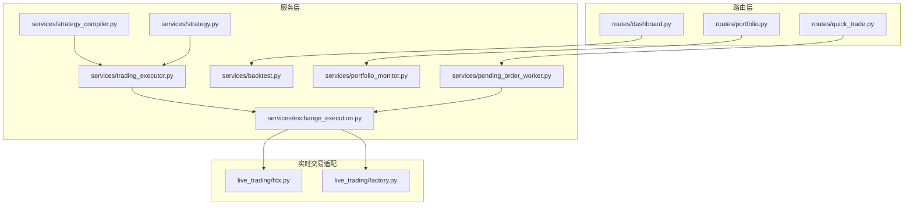
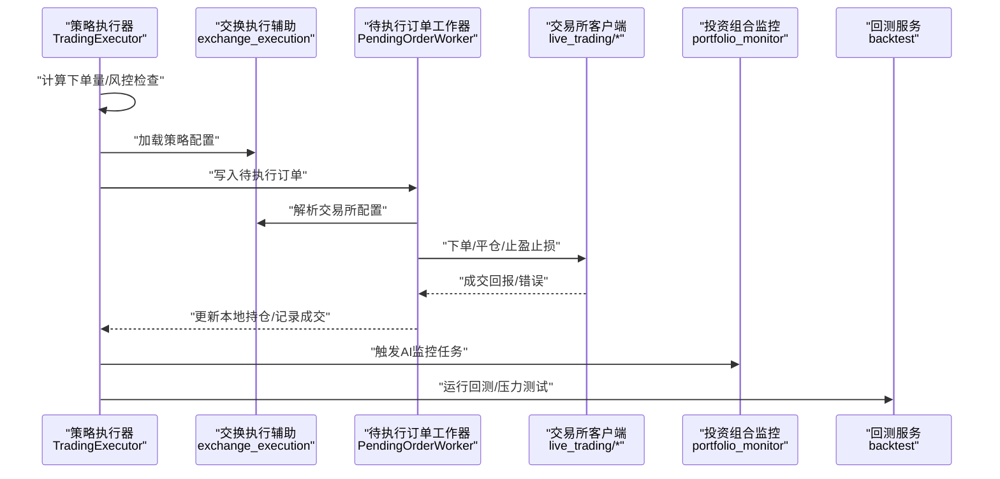
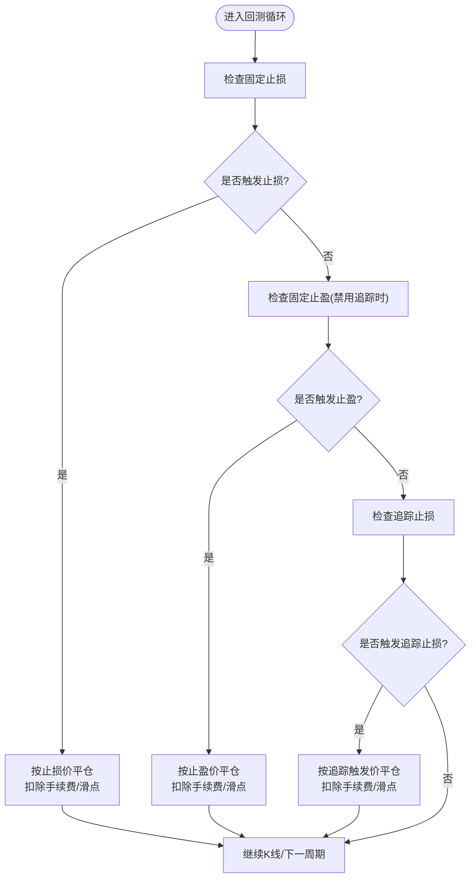
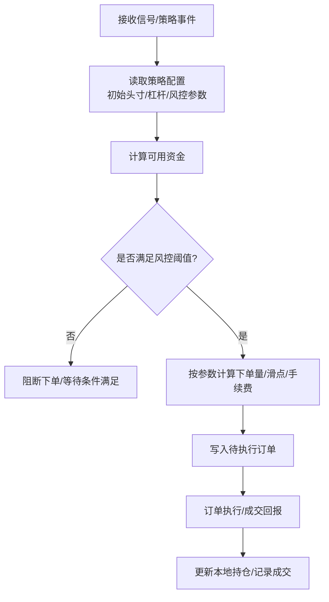
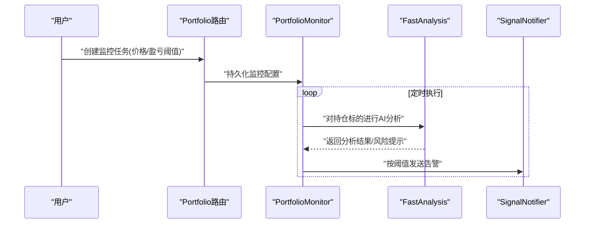
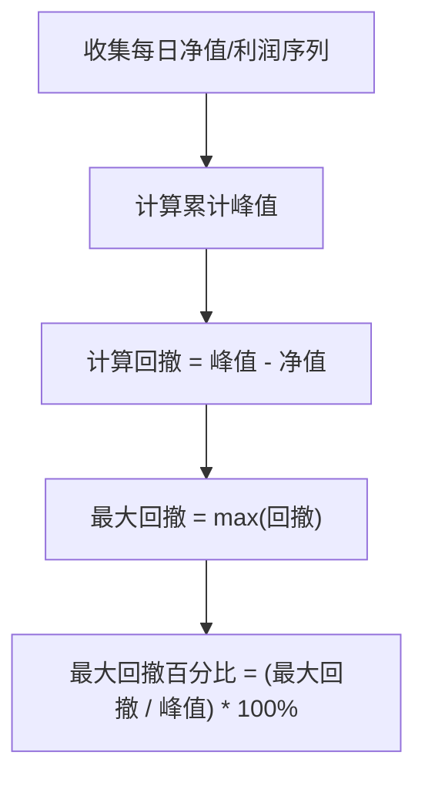
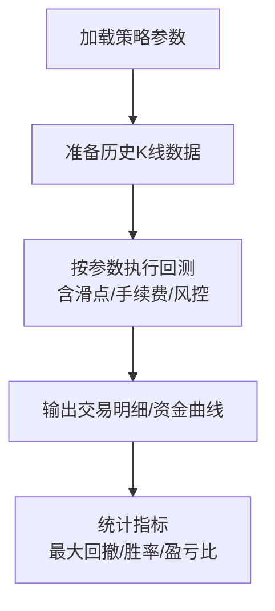
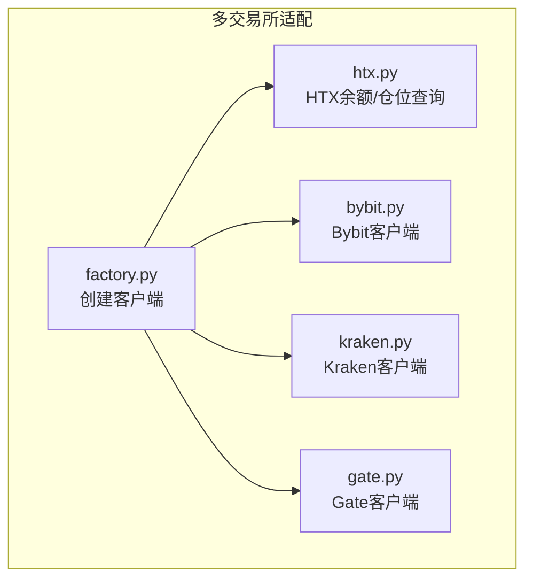
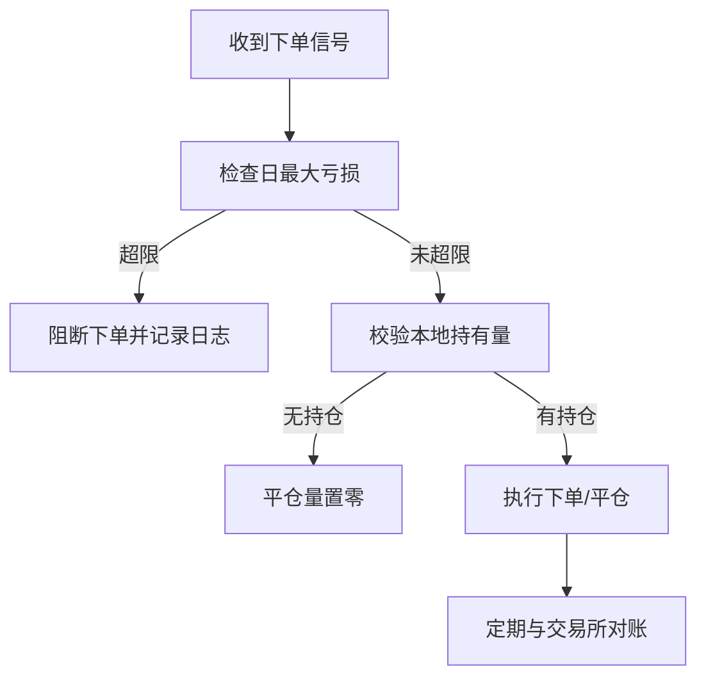
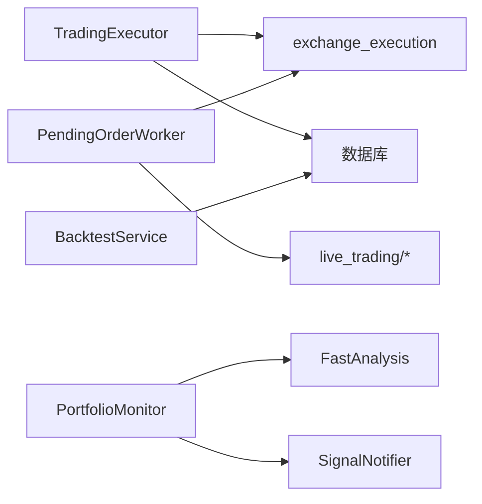

# 风险管理策略

<cite>
**本文引用的文件**
- [trading_executor.py](file://backend_api_python/app/services/trading_executor.py)
- [backtest.py](file://backend_api_python/app/services/backtest.py)
- [portfolio_monitor.py](file://backend_api_python/app/services/portfolio_monitor.py)
- [portfolio.py](file://backend_api_python/app/routes/portfolio.py)
- [pending_order_worker.py](file://backend_api_python/app/services/pending_order_worker.py)
- [exchange_execution.py](file://backend_api_python/app/services/exchange_execution.py)
- [dashboard.py](file://backend_api_python/app/routes/dashboard.py)
- [strategy_compiler.py](file://backend_api_python/app/services/strategy_compiler.py)
- [strategy.py](file://backend_api_python/app/services/strategy.py)
- [live_trading/htx.py](file://backend_api_python/app/services/live_trading/htx.py)
- [live_trading/factory.py](file://backend_api_python/app/services/live_trading/factory.py)
- [routes/quick_trade.py](file://backend_api_python/app/routes/quick_trade.py)
</cite>

## 目录
1. [引言](#引言)
2. [项目结构](#项目结构)
3. [核心组件](#核心组件)
4. [架构总览](#架构总览)
5. [详细组件分析](#详细组件分析)
6. [依赖分析](#依赖分析)
7. [性能考虑](#性能考虑)
8. [故障排查指南](#故障排查指南)
9. [结论](#结论)
10. [附录](#附录)

## 引言
本文件面向QuantDinger的风险管理策略，系统化阐述止损止盈机制、仓位管理与资金控制、风险限额与实时监控、压力测试与情景分析、多市场多品种分散与对冲、以及风险指标计算与自动风控实现。文档基于仓库中实际代码与接口进行技术解读，帮助开发者与策略工程师快速理解并扩展风控能力。

## 项目结构
QuantDinger后端采用分层设计：路由层负责对外接口与参数解析；服务层承载业务逻辑（回测、交易执行、AI分析、监控等）；数据访问层通过数据库连接池与缓存提升性能；实时交易通过“待执行订单工作器”调度到各交易所客户端。

图示来源
- [portfolio.py:1-200](file://backend_api_python/app/routes/portfolio.py#L1-L200)
- [dashboard.py:196-230](file://backend_api_python/app/routes/dashboard.py#L196-L230)
- [quick_trade.py:1167-1198](file://backend_api_python/app/routes/quick_trade.py#L1167-L1198)
- [trading_executor.py:37-104](file://backend_api_python/app/services/trading_executor.py#L37-L104)
- [backtest.py:64-142](file://backend_api_python/app/services/backtest.py#L64-L142)
- [portfolio_monitor.py:1-80](file://backend_api_python/app/services/portfolio_monitor.py#L1-L80)
- [pending_order_worker.py:52-90](file://backend_api_python/app/services/pending_order_worker.py#L52-L90)
- [exchange_execution.py:59-92](file://backend_api_python/app/services/exchange_execution.py#L59-L92)
- [strategy_compiler.py:34-73](file://backend_api_python/app/services/strategy_compiler.py#L34-L73)
- [strategy.py:14-57](file://backend_api_python/app/services/strategy.py#L14-L57)
- [live_trading/htx.py:209-433](file://backend_api_python/app/services/live_trading/htx.py#L209-L433)
- [live_trading/factory.py:190-215](file://backend_api_python/app/services/live_trading/factory.py#L190-L215)

章节来源
- [portfolio.py:1-200](file://backend_api_python/app/routes/portfolio.py#L1-L200)
- [dashboard.py:196-230](file://backend_api_python/app/routes/dashboard.py#L196-L230)
- [quick_trade.py:1167-1198](file://backend_api_python/app/routes/quick_trade.py#L1167-L1198)
- [trading_executor.py:37-104](file://backend_api_python/app/services/trading_executor.py#L37-L104)
- [backtest.py:64-142](file://backend_api_python/app/services/backtest.py#L64-L142)
- [portfolio_monitor.py:1-80](file://backend_api_python/app/services/portfolio_monitor.py#L1-L80)
- [pending_order_worker.py:52-90](file://backend_api_python/app/services/pending_order_worker.py#L52-L90)
- [exchange_execution.py:59-92](file://backend_api_python/app/services/exchange_execution.py#L59-L92)
- [strategy_compiler.py:34-73](file://backend_api_python/app/services/strategy_compiler.py#L34-L73)
- [strategy.py:14-57](file://backend_api_python/app/services/strategy.py#L14-L57)
- [live_trading/htx.py:209-433](file://backend_api_python/app/services/live_trading/htx.py#L209-L433)
- [live_trading/factory.py:190-215](file://backend_api_python/app/services/live_trading/factory.py#L190-L215)

## 核心组件
- 实时交易执行器：负责策略信号生成、下单量计算、风控拦截（如日最大亏损）、价格缓存与去重、数据库列保障。
- 待执行订单工作器：轮询待执行订单队列，按交易所客户端执行真实或模拟交易，支持位置同步校验。
- 回测服务：内置固定止损、追踪止损、动态止盈等机制，支持金字塔加仓/减仓、DCA、最大回撤统计与资金曲线。
- 投资组合监控：基于AI分析的实时监控任务，支持价格/盈亏阈值告警、多语言消息模板、通知通道聚合。
- 交换执行辅助：安全加载与脱敏配置、加载策略配置、解析交易所凭证。
- 策略编译器：将策略参数（含止损、追踪止损、杠杆、初始头寸比例）注入生成的脚本运行环境。
- 仪表盘与报表：计算最大回撤、收益分布、最佳/最差日等关键风险指标。

章节来源
- [trading_executor.py:37-104](file://backend_api_python/app/services/trading_executor.py#L37-L104)
- [pending_order_worker.py:52-90](file://backend_api_python/app/services/pending_order_worker.py#L52-L90)
- [backtest.py:64-142](file://backend_api_python/app/services/backtest.py#L64-L142)
- [portfolio_monitor.py:1-80](file://backend_api_python/app/services/portfolio_monitor.py#L1-L80)
- [exchange_execution.py:59-92](file://backend_api_python/app/services/exchange_execution.py#L59-L92)
- [strategy_compiler.py:34-73](file://backend_api_python/app/services/strategy_compiler.py#L34-L73)
- [dashboard.py:196-230](file://backend_api_python/app/routes/dashboard.py#L196-L230)

## 架构总览
下图展示从策略信号到订单执行与风控拦截的关键路径，以及AI监控与回测在风控体系中的作用。

图示来源
- [trading_executor.py:2678-2707](file://backend_api_python/app/services/trading_executor.py#L2678-L2707)
- [exchange_execution.py:59-92](file://backend_api_python/app/services/exchange_execution.py#L59-L92)
- [pending_order_worker.py:99-122](file://backend_api_python/app/services/pending_order_worker.py#L99-L122)
- [portfolio_monitor.py:226-279](file://backend_api_python/app/services/portfolio_monitor.py#L226-L279)
- [backtest.py:64-142](file://backend_api_python/app/services/backtest.py#L64-L142)

## 详细组件分析

### 止损止盈机制与策略实现
- 固定止损/止盈
  - 回测中固定止损与固定止盈分别以入场价的百分比触发，结合滑点与手续费计算盈亏与手续费，支持多市场多周期回测。
  - 实盘中，服务器端追踪止损在长/空方向上根据最新价格与激活阈值判断是否触发平仓。
- 追踪止损
  - 回测支持追踪止损与激活阈值，激活后以最低价（做多）或最高价（做空）为基准按回调幅度触发。
  - 实盘中，追踪止损在达到激活阈值后，以最新价格与回调幅度判断是否触发。
- 动态止损
  - 回测支持基于移动高/低点的动态止损，结合趋势加仓与逆向减仓规则，形成动态跟踪与风险控制闭环。

图示来源
- [backtest.py:1038-1060](file://backend_api_python/app/services/backtest.py#L1038-L1060)
- [backtest.py:1091-1157](file://backend_api_python/app/services/backtest.py#L1091-L1157)
- [backtest.py:1159-1169](file://backend_api_python/app/services/backtest.py#L1159-L1169)
- [backtest.py:3861-3881](file://backend_api_python/app/services/backtest.py#L3861-L3881)
- [trading_executor.py:2009-2037](file://backend_api_python/app/services/trading_executor.py#L2009-L2037)

章节来源
- [backtest.py:1038-1060](file://backend_api_python/app/services/backtest.py#L1038-L1060)
- [backtest.py:1091-1157](file://backend_api_python/app/services/backtest.py#L1091-L1157)
- [backtest.py:1159-1169](file://backend_api_python/app/services/backtest.py#L1159-L1169)
- [backtest.py:3861-3881](file://backend_api_python/app/services/backtest.py#L3861-L3881)
- [trading_executor.py:2009-2037](file://backend_api_python/app/services/trading_executor.py#L2009-L2037)

### 仓位管理与资金控制
- 初始头寸与杠杆
  - 策略编译器将初始头寸比例、杠杆、金字塔加仓/减仓、DCA等参数注入运行环境，用于计算开仓/加仓份额与保证金占用。
- 可用资金与下单量
  - 实时交易执行器在下单前计算可用资金，结合当前价格、已有头寸与滑点估算，确保不超可用资金。
- 仓位同步与风控
  - 待执行订单工作器定期与交易所对账，防止“幽灵仓位”，并在平仓时校验本地持有量，避免超报单。

图示来源
- [strategy_compiler.py:34-73](file://backend_api_python/app/services/strategy_compiler.py#L34-L73)
- [trading_executor.py:2684-2707](file://backend_api_python/app/services/trading_executor.py#L2684-L2707)
- [pending_order_worker.py:1240-1254](file://backend_api_python/app/services/pending_order_worker.py#L1240-L1254)

章节来源
- [strategy_compiler.py:34-73](file://backend_api_python/app/services/strategy_compiler.py#L34-L73)
- [trading_executor.py:2684-2707](file://backend_api_python/app/services/trading_executor.py#L2684-L2707)
- [pending_order_worker.py:1240-1254](file://backend_api_python/app/services/pending_order_worker.py#L1240-L1254)

### 风险限额与实时监控
- 价格/盈亏阈值监控
  - 投资组合监控支持按价格上下限与盈亏百分比阈值触发告警，支持多语言消息模板与多种通知渠道（邮件、Telegram、Webhook、站内）。
- 位置同步校验
  - 待执行订单工作器定期与交易所对账，若发现本地与交易所不一致，进行最佳努力同步，避免“幽灵仓位”。

图示来源
- [portfolio.py:523-716](file://backend_api_python/app/routes/portfolio.py#L523-L716)
- [portfolio_monitor.py:30-61](file://backend_api_python/app/services/portfolio_monitor.py#L30-L61)
- [portfolio_monitor.py:226-279](file://backend_api_python/app/services/portfolio_monitor.py#L226-L279)

章节来源
- [portfolio.py:523-716](file://backend_api_python/app/routes/portfolio.py#L523-L716)
- [portfolio_monitor.py:30-61](file://backend_api_python/app/services/portfolio_monitor.py#L30-L61)
- [portfolio_monitor.py:226-279](file://backend_api_python/app/services/portfolio_monitor.py#L226-L279)

### 风险指标计算与最大回撤
- 最大回撤
  - 仪表盘根据净值曲线计算最大回撤与回撤百分比，支持多种基线选择与异常保护，避免极端值影响展示。
- 收益分布
  - 统计最佳/最差交易日，辅助评估波动与风险稳定性。

图示来源
- [dashboard.py:196-230](file://backend_api_python/app/routes/dashboard.py#L196-L230)

章节来源
- [dashboard.py:196-230](file://backend_api_python/app/routes/dashboard.py#L196-L230)

### 压力测试与情景分析
- 回测引擎
  - 支持多时间框架、滑点与手续费建模、止损/止盈/追踪止损、金字塔加仓/减仓、DCA、逆向减仓等策略要素，输出交易明细与资金曲线。
- 参数扫描与情景
  - 通过调整止损/止盈/追踪止损参数与滑点，进行多情景对比，评估策略在不同市场状态下的稳健性。

图示来源
- [backtest.py:64-142](file://backend_api_python/app/services/backtest.py#L64-L142)
- [backtest.py:2926-3095](file://backend_api_python/app/services/backtest.py#L2926-L3095)
- [backtest.py:3714-4006](file://backend_api_python/app/services/backtest.py#L3714-L4006)

章节来源
- [backtest.py:64-142](file://backend_api_python/app/services/backtest.py#L64-L142)
- [backtest.py:2926-3095](file://backend_api_python/app/services/backtest.py#L2926-L3095)
- [backtest.py:3714-4006](file://backend_api_python/app/services/backtest.py#L3714-L4006)

### 多市场、多品种分散与对冲
- 多市场支持
  - 交换执行辅助与实时交易适配层支持多家交易所（如HTX、Bybit、Kraken、Gate等），通过工厂模式创建客户端，统一处理下单与对账。
- 对冲与套利思路
  - 通过不同市场/品种的反向头寸实现多空对冲；回测中可加入对冲因子（如反向加仓/减仓）以降低单一方向风险。

图示来源
- [live_trading/factory.py:190-215](file://backend_api_python/app/services/live_trading/factory.py#L190-L215)
- [live_trading/htx.py:209-433](file://backend_api_python/app/services/live_trading/htx.py#L209-L433)

章节来源
- [live_trading/factory.py:190-215](file://backend_api_python/app/services/live_trading/factory.py#L190-L215)
- [live_trading/htx.py:209-433](file://backend_api_python/app/services/live_trading/htx.py#L209-L433)

### 自动风控与实时拦截
- 日最大亏损拦截
  - 实时交易执行器在下单前检查当日累计盈亏，超过阈值则阻断后续信号，避免进一步扩大损失。
- 位置校验与拦截
  - 待执行订单工作器在平仓时校验本地持有量，若无持仓则将平仓量置零，防止误报单。
- 交易所账户类型切换
  - HTX适配层在特定错误码下尝试切换账户类型，恢复可用余额与仓位查询，减少风控中断。

图示来源
- [trading_executor.py:2678-2682](file://backend_api_python/app/services/trading_executor.py#L2678-L2682)
- [pending_order_worker.py:1240-1254](file://backend_api_python/app/services/pending_order_worker.py#L1240-L1254)
- [live_trading/htx.py:234-409](file://backend_api_python/app/services/live_trading/htx.py#L234-L409)

章节来源
- [trading_executor.py:2678-2682](file://backend_api_python/app/services/trading_executor.py#L2678-L2682)
- [pending_order_worker.py:1240-1254](file://backend_api_python/app/services/pending_order_worker.py#L1240-L1254)
- [live_trading/htx.py:234-409](file://backend_api_python/app/services/live_trading/htx.py#L234-L409)

## 依赖分析
- 组件耦合
  - TradingExecutor与ExchangeExecution紧密耦合，前者依赖后者解析策略配置与交易所凭证；与数据库交互频繁，需注意连接池与锁竞争。
  - PendingOrderWorker与各交易所客户端解耦，通过工厂模式创建客户端，便于扩展新交易所。
  - BacktestService独立于实盘，专注于策略验证与风险评估。
- 外部依赖
  - 交易所REST/WS接口、数据库(PostgreSQL)、通知服务(邮件/Telegram/Webhook)。

图示来源
- [trading_executor.py:37-104](file://backend_api_python/app/services/trading_executor.py#L37-L104)
- [exchange_execution.py:59-92](file://backend_api_python/app/services/exchange_execution.py#L59-L92)
- [pending_order_worker.py:52-90](file://backend_api_python/app/services/pending_order_worker.py#L52-L90)
- [backtest.py:64-142](file://backend_api_python/app/services/backtest.py#L64-L142)
- [portfolio_monitor.py:1-80](file://backend_api_python/app/services/portfolio_monitor.py#L1-L80)

章节来源
- [trading_executor.py:37-104](file://backend_api_python/app/services/trading_executor.py#L37-L104)
- [exchange_execution.py:59-92](file://backend_api_python/app/services/exchange_execution.py#L59-L92)
- [pending_order_worker.py:52-90](file://backend_api_python/app/services/pending_order_worker.py#L52-L90)
- [backtest.py:64-142](file://backend_api_python/app/services/backtest.py#L64-L142)
- [portfolio_monitor.py:1-80](file://backend_api_python/app/services/portfolio_monitor.py#L1-L80)

## 性能考虑
- 缓存与去重
  - 实时交易执行器维护价格缓存与信号去重缓存，降低重复下单与外部API调用频率。
- 并发与限流
  - 投资组合监控使用线程池并发分析多个标的，同时对同一市场的请求施加最小间隔，避免触发第三方API限流。
- 数据库索引与批处理
  - 回测服务在交易表与净值点表建立索引，批量写入提高吞吐；待执行订单工作器按批次处理订单，减少锁竞争。

章节来源
- [trading_executor.py:40-60](file://backend_api_python/app/services/trading_executor.py#L40-L60)
- [portfolio_monitor.py:223-224](file://backend_api_python/app/services/portfolio_monitor.py#L223-L224)
- [portfolio.py:28-46](file://backend_api_python/app/routes/portfolio.py#L28-L46)
- [backtest.py:88-142](file://backend_api_python/app/services/backtest.py#L88-L142)
- [pending_order_worker.py:52-90](file://backend_api_python/app/services/pending_order_worker.py#L52-L90)

## 故障排查指南
- 订单未成交或被拒
  - 检查待执行订单工作器的“位置同步”与“持有量校验”日志，确认是否存在本地无持仓却发起平仓的情况。
- 交易所账户异常
  - 查看HTX适配层的账户类型检测与切换日志，确认是否因账户模式导致余额/仓位查询失败。
- 配置脱敏与凭证加载
  - 使用交换执行辅助的安全日志函数与凭证加载函数，核对密钥是否正确脱敏与解密成功。
- 通知通道无效
  - 检查PortfolioMonitor的通知通道解析逻辑，确认目标邮箱/聊天ID/Webhook URL是否有效。

章节来源
- [pending_order_worker.py:1240-1254](file://backend_api_python/app/services/pending_order_worker.py#L1240-L1254)
- [live_trading/htx.py:209-232](file://backend_api_python/app/services/live_trading/htx.py#L209-L232)
- [exchange_execution.py:39-56](file://backend_api_python/app/services/exchange_execution.py#L39-L56)
- [portfolio_monitor.py:68-129](file://backend_api_python/app/services/portfolio_monitor.py#L68-L129)

## 结论
QuantDinger在风控层面形成了“参数化止损止盈+实时风控拦截+AI监控+回测验证”的闭环：策略参数通过编译器注入运行环境，实盘通过交易执行器与待执行订单工作器落实风控，回测提供压力测试与情景分析支撑，仪表盘输出关键风险指标。该架构既保证了策略执行的确定性，也为风险控制提供了可观测、可扩展的技术基础。

## 附录
- 关键流程补充
  - 快速交易路由中对多交易所的多头/空头方向解析，确保与交易所端的持仓方向一致，避免对向开仓引发的风控误判。

章节来源
- [quick_trade.py:1167-1198](file://backend_api_python/app/routes/quick_trade.py#L1167-L1198)