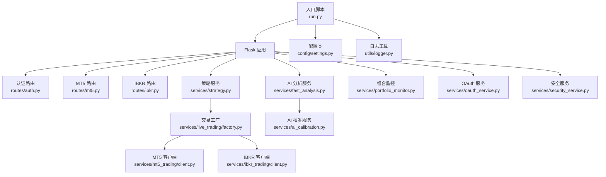
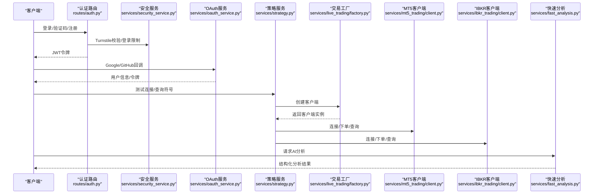
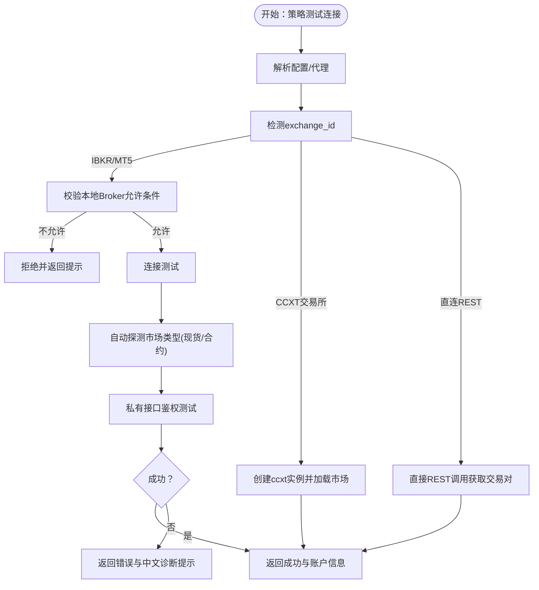
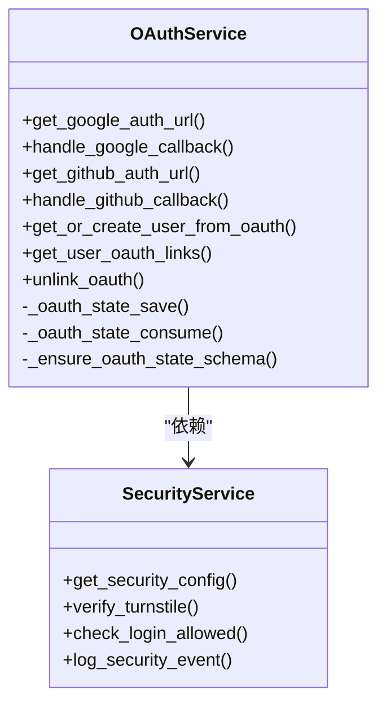
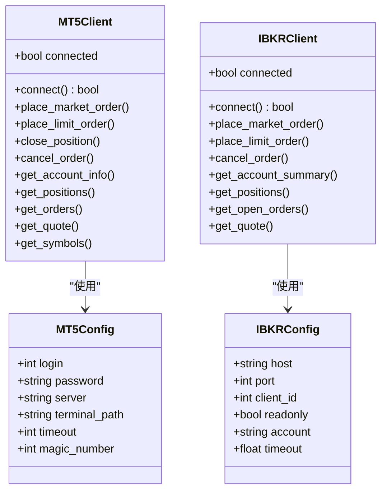
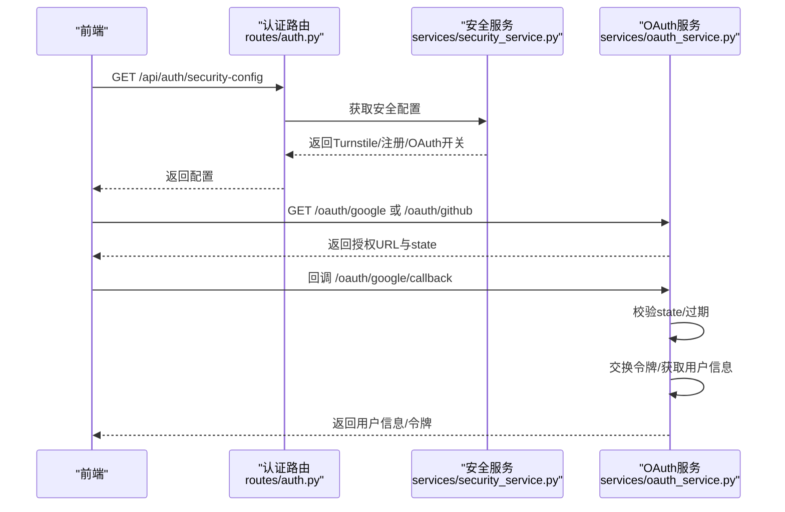
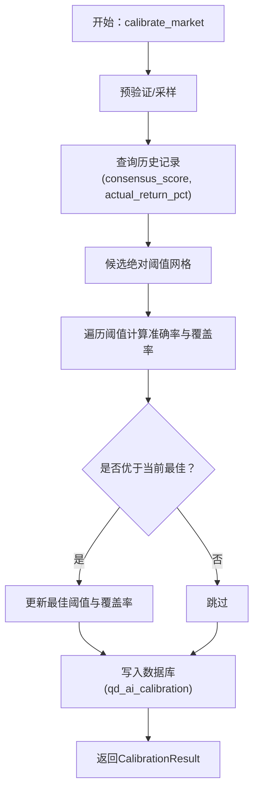
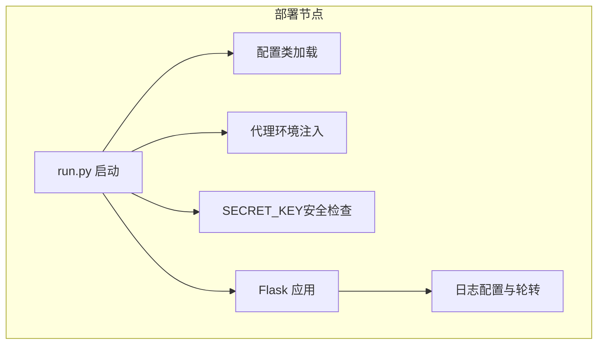
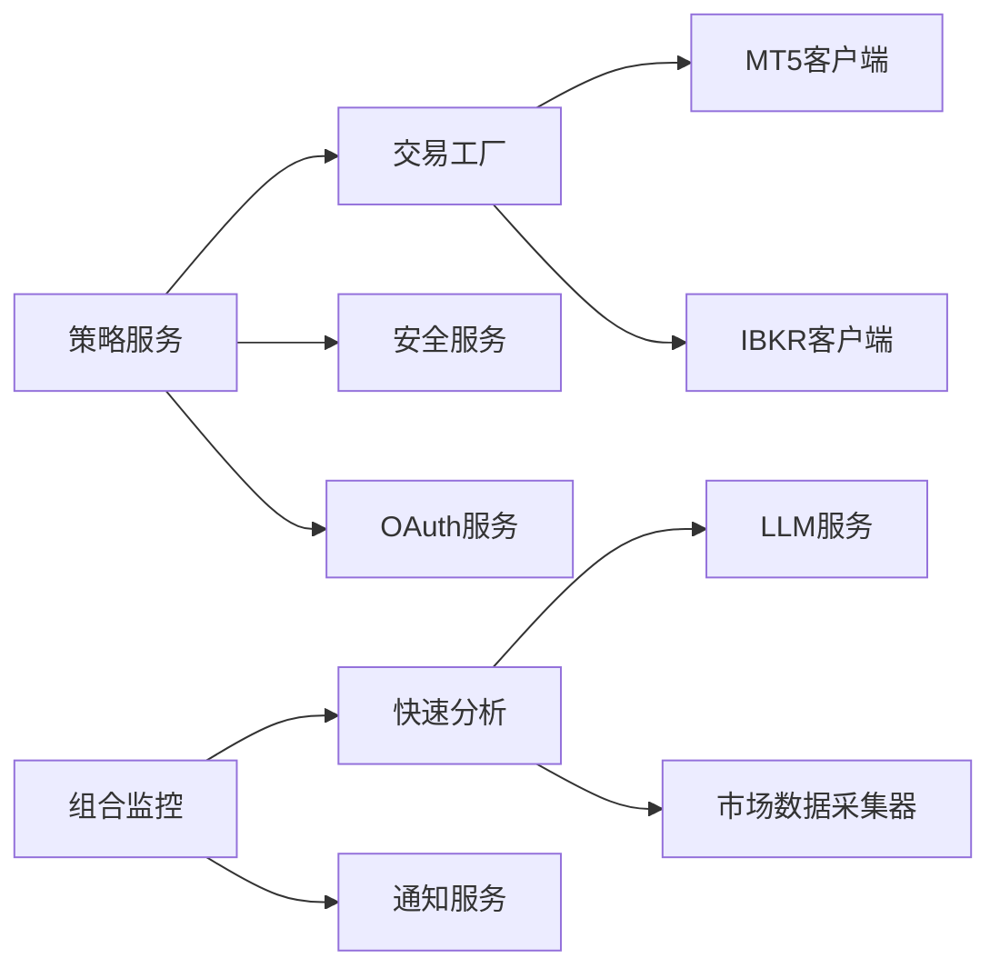

# 高级主题

<cite>
**本文档引用的文件**
- [run.py](file://backend_api_python/run.py)
- [settings.py](file://backend_api_python/app/config/settings.py)
- [logger.py](file://backend_api_python/app/utils/logger.py)
- [auth.py](file://backend_api_python/app/routes/auth.py)
- [oauth_service.py](file://backend_api_python/app/services/oauth_service.py)
- [security_service.py](file://backend_api_python/app/services/security_service.py)
- [strategy.py](file://backend_api_python/app/services/strategy.py)
- [factory.py](file://backend_api_python/app/services/live_trading/factory.py)
- [mt5.py](file://backend_api_python/app/routes/mt5.py)
- [ibkr.py](file://backend_api_python/app/routes/ibkr.py)
- [client.py](file://backend_api_python/app/services/mt5_trading/client.py)
- [client.py](file://backend_api_python/app/services/ibkr_trading/client.py)
- [ai_calibration.py](file://backend_api_python/app/services/ai_calibration.py)
- [portfolio_monitor.py](file://backend_api_python/app/services/portfolio_monitor.py)
- [fast_analysis.py](file://backend_api_python/app/services/fast_analysis.py)
</cite>

## 目录
1. [引言](#引言)
2. [项目结构](#项目结构)
3. [核心组件](#核心组件)
4. [架构总览](#架构总览)
5. [详细组件分析](#详细组件分析)
6. [依赖分析](#依赖分析)
7. [性能考量](#性能考量)
8. [故障排除指南](#故障排除指南)
9. [结论](#结论)
10. [附录](#附录)

## 引言
本文件面向QuantDinger的高级用户与平台运维人员，聚焦于高级策略开发、风险管理、多租户扩展、复杂交易集成（MT5/IBKR）、OAuth与安全加固、AI校准与模型选择、性能优化与监控体系，以及大规模部署的架构设计与容量规划。文档基于仓库现有实现进行深入解读，并提供可视化图示帮助理解。

## 项目结构
后端采用Python Flask微服务架构，按功能域划分蓝图与服务层，核心模块包括认证与安全、交易执行工厂、MT5/IBKR直连客户端、AI快速分析与校准、组合监控与告警、日志与配置等。入口脚本负责环境初始化与安全检查，配置类集中管理运行参数与日志设置。

**图表来源**
- [run.py:104-134](file://backend_api_python/run.py#L104-L134)
- [settings.py:1-99](file://backend_api_python/app/config/settings.py#L1-L99)
- [logger.py:1-63](file://backend_api_python/app/utils/logger.py#L1-L63)
- [auth.py:1-134](file://backend_api_python/app/routes/auth.py#L1-L134)
- [mt5.py:1-120](file://backend_api_python/app/routes/mt5.py#L1-L120)
- [ibkr.py:1-120](file://backend_api_python/app/routes/ibkr.py#L1-L120)
- [strategy.py:1-120](file://backend_api_python/app/services/strategy.py#L1-L120)
- [factory.py:1-120](file://backend_api_python/app/services/live_trading/factory.py#L1-L120)
- [client.py:1-120](file://backend_api_python/app/services/mt5_trading/client.py#L1-L120)
- [client.py:1-120](file://backend_api_python/app/services/ibkr_trading/client.py#L1-L120)
- [fast_analysis.py:1-120](file://backend_api_python/app/services/fast_analysis.py#L1-L120)
- [ai_calibration.py:1-120](file://backend_api_python/app/services/ai_calibration.py#L1-L120)
- [portfolio_monitor.py:1-120](file://backend_api_python/app/services/portfolio_monitor.py#L1-L120)
- [oauth_service.py:1-120](file://backend_api_python/app/services/oauth_service.py#L1-L120)
- [security_service.py:1-120](file://backend_api_python/app/services/security_service.py#L1-L120)

**章节来源**
- [run.py:104-134](file://backend_api_python/run.py#L104-L134)
- [settings.py:1-99](file://backend_api_python/app/config/settings.py#L1-L99)
- [logger.py:1-63](file://backend_api_python/app/utils/logger.py#L1-L63)

## 核心组件
- 认证与安全：提供登录、验证码、注册、OAuth（Google/GitHub）与安全防护（Cloudflare Turnstile、登录尝试限制、暴力破解保护、安全审计日志）。
- 交易执行：统一工厂创建各交易所REST客户端与桌面Broker客户端（IBKR/MT5），支持测试连接、自动切换主网/模拟网、错误诊断。
- AI分析与校准：单次LLM调用的快速分析，结合技术面、宏观、新闻、预测市场与历史记忆，提供客观评分与阈值校准。
- 组合监控：定时对人工持仓进行AI分析并推送告警，支持多渠道通知与本地化文案。
- 日志与配置：集中日志配置、轮转与过滤，环境变量驱动的配置加载。

**章节来源**
- [auth.py:115-134](file://backend_api_python/app/routes/auth.py#L115-L134)
- [oauth_service.py:1-120](file://backend_api_python/app/services/oauth_service.py#L1-L120)
- [security_service.py:1-120](file://backend_api_python/app/services/security_service.py#L1-L120)
- [strategy.py:292-610](file://backend_api_python/app/services/strategy.py#L292-L610)
- [factory.py:126-286](file://backend_api_python/app/services/live_trading/factory.py#L126-L286)
- [fast_analysis.py:186-233](file://backend_api_python/app/services/fast_analysis.py#L186-L233)
- [ai_calibration.py:57-131](file://backend_api_python/app/services/ai_calibration.py#L57-L131)
- [portfolio_monitor.py:1-120](file://backend_api_python/app/services/portfolio_monitor.py#L1-L120)

## 架构总览
下图展示从请求到交易执行与AI分析的关键路径，突出认证、安全、工厂模式、客户端与分析链路。

**图表来源**
- [auth.py:140-279](file://backend_api_python/app/routes/auth.py#L140-L279)
- [security_service.py:72-110](file://backend_api_python/app/services/security_service.py#L72-L110)
- [oauth_service.py:200-298](file://backend_api_python/app/services/oauth_service.py#L200-L298)
- [strategy.py:292-610](file://backend_api_python/app/services/strategy.py#L292-L610)
- [factory.py:126-286](file://backend_api_python/app/services/live_trading/factory.py#L126-L286)
- [client.py:84-175](file://backend_api_python/app/services/mt5_trading/client.py#L84-L175)
- [client.py:96-176](file://backend_api_python/app/services/ibkr_trading/client.py#L96-L176)
- [fast_analysis.py:186-233](file://backend_api_python/app/services/fast_analysis.py#L186-L233)

## 详细组件分析

### 策略开发与风险管理最佳实践
- 策略类型与状态管理：通过数据库查询运行中的策略类型与状态，支持批量治理与审计。
- 风险参数可视化：内置机器人策略参数展示逻辑，支持初始资金、层数、止盈止损、日最大损失等参数的统一呈现，便于风控策略落地。
- 交易连接测试：统一测试连接流程，自动探测市场类型（现货/合约），针对币安等交易所进行权限与IP白名单诊断，提供中文提示与回退方案。
- 本地Broker限制：云环境禁止本地Broker直连，避免跨平台与安全问题。

**图表来源**
- [strategy.py:292-610](file://backend_api_python/app/services/strategy.py#L292-L610)
- [factory.py:126-286](file://backend_api_python/app/services/live_trading/factory.py#L126-L286)

**章节来源**
- [strategy.py:14-120](file://backend_api_python/app/services/strategy.py#L14-L120)
- [strategy.py:692-793](file://backend_api_python/app/services/strategy.py#L692-L793)
- [strategy.py:292-610](file://backend_api_python/app/services/strategy.py#L292-L610)

### 多租户架构扩展方法
- OAuth状态持久化：OAuth状态表需跨多进程/多副本共享，采用PostgreSQL表存储与索引，确保跨Worker一致性。
- 安全配置公开：前端安全配置（Turnstile开关、注册开关、OAuth开关、移动应用信息）通过安全服务统一暴露，便于前端按需渲染。
- 用户与第三方绑定：OAuth服务支持用户与第三方提供商的绑定、解绑与自动创建逻辑，保障多租户隔离与数据一致性。

**图表来源**
- [oauth_service.py:27-120](file://backend_api_python/app/services/oauth_service.py#L27-L120)
- [security_service.py:53-110](file://backend_api_python/app/services/security_service.py#L53-L110)

**章节来源**
- [oauth_service.py:42-144](file://backend_api_python/app/services/oauth_service.py#L42-L144)
- [security_service.py:53-110](file://backend_api_python/app/services/security_service.py#L53-L110)

### MT5与IBKR复杂集成场景
- MT5客户端：封装初始化、连接、下单、查询、报价等能力，支持IOC/FOK/返回式等不同成交模式，线程安全锁保护。
- IBKR客户端：基于ib_insync，支持事件循环注入、股票合约构建、限价/市价单、挂单取消、账户与持仓查询。
- 路由层：提供/status/connect/disconnect/order/close/quote等REST接口，参数校验与错误处理完善。

**图表来源**
- [client.py:39-175](file://backend_api_python/app/services/mt5_trading/client.py#L39-L175)
- [client.py:56-176](file://backend_api_python/app/services/ibkr_trading/client.py#L56-L176)

**章节来源**
- [mt5.py:52-439](file://backend_api_python/app/routes/mt5.py#L52-L439)
- [ibkr.py:31-383](file://backend_api_python/app/routes/ibkr.py#L31-L383)
- [client.py:84-175](file://backend_api_python/app/services/mt5_trading/client.py#L84-L175)
- [client.py:96-176](file://backend_api_python/app/services/ibkr_trading/client.py#L96-L176)

### OAuth集成高级配置与安全加固
- Google/GitHub授权：生成授权URL、保存OAuth状态、回调交换令牌、获取用户信息、创建或关联用户。
- 回调重定向白名单：支持多Origin，严格校验与归一化，防止开放重定向。
- 安全防护：Turnstile人机验证、登录尝试计数与封禁、验证码速率限制、密码强度校验、安全事件审计。

**图表来源**
- [auth.py:115-134](file://backend_api_python/app/routes/auth.py#L115-L134)
- [oauth_service.py:200-298](file://backend_api_python/app/services/oauth_service.py#L200-L298)
- [security_service.py:72-110](file://backend_api_python/app/services/security_service.py#L72-L110)

**章节来源**
- [oauth_service.py:192-298](file://backend_api_python/app/services/oauth_service.py#L192-L298)
- [oauth_service.py:300-426](file://backend_api_python/app/services/oauth_service.py#L300-L426)
- [security_service.py:72-110](file://backend_api_python/app/services/security_service.py#L72-L110)

### AI校准与模型选择高级技术
- 校准目标：基于历史“实际回报率”与“共识信号”的一致性规则，搜索最优阈值，使决策阈值与历史表现对齐。
- 数据来源：分析记忆库（validation后的历史记录），按市场维度回溯统计，计算准确率与覆盖率，优先高BUY+SELL覆盖与更高准确率。
- 配置持久化：将最新阈值写入数据库，支持按市场维度查询与回退默认值。

**图表来源**
- [ai_calibration.py:163-311](file://backend_api_python/app/services/ai_calibration.py#L163-L311)

**章节来源**
- [ai_calibration.py:57-131](file://backend_api_python/app/services/ai_calibration.py#L57-L131)
- [ai_calibration.py:163-311](file://backend_api_python/app/services/ai_calibration.py#L163-L311)

### 性能优化与监控体系
- 日志配置：集中日志级别、格式、轮转与文件句柄，过滤无关模块噪声，保留关键模块INFO以便排查。
- 配置加载：环境变量驱动，支持缓存开关、请求日志开关与速率限制等。
- 并发与资源：策略服务连接测试使用信号量限制并发；组合监控分析使用线程池去重与并行；MT5/IBKR客户端使用锁保证线程安全。

**章节来源**
- [logger.py:9-48](file://backend_api_python/app/utils/logger.py#L9-L48)
- [settings.py:66-91](file://backend_api_python/app/config/settings.py#L66-L91)
- [strategy.py:17-23](file://backend_api_python/app/services/strategy.py#L17-L23)
- [portfolio_monitor.py:223-387](file://backend_api_python/app/services/portfolio_monitor.py#L223-L387)
- [client.py:84-100](file://backend_api_python/app/services/mt5_trading/client.py#L84-L100)
- [client.py:96-110](file://backend_api_python/app/services/ibkr_trading/client.py#L96-L110)

### 大规模部署架构、性能调优与容量规划
- 入口与安全：启动时对SECRET_KEY进行安全检查，如为默认值则随机生成并提示持久化。
- 代理与网络：统一注入HTTP/HTTPS/ALL_PROXY，国内金融域名绕过代理，减少不必要的海外回程。
- 配置与日志：集中配置类与日志工具，便于容器化与多副本部署。

**图表来源**
- [run.py:104-134](file://backend_api_python/run.py#L104-L134)
- [run.py:60-91](file://backend_api_python/run.py#L60-L91)
- [settings.py:1-99](file://backend_api_python/app/config/settings.py#L1-L99)
- [logger.py:9-48](file://backend_api_python/app/utils/logger.py#L9-L48)

**章节来源**
- [run.py:104-134](file://backend_api_python/run.py#L104-L134)
- [run.py:60-91](file://backend_api_python/run.py#L60-L91)

## 依赖分析
- 组件耦合：策略服务依赖交易工厂与本地Broker工具；交易工厂根据exchange_id动态导入并创建客户端；AI分析服务依赖LLM与数据采集器；OAuth与安全服务相互协作。
- 外部依赖：MetaTrader5、ib_insync、ccxt等第三方库仅在特定功能启用时导入，避免非必要安装影响部署。

**图表来源**
- [strategy.py:292-610](file://backend_api_python/app/services/strategy.py#L292-L610)
- [factory.py:126-286](file://backend_api_python/app/services/live_trading/factory.py#L126-L286)
- [client.py:19-55](file://backend_api_python/app/services/mt5_trading/client.py#L19-L55)
- [client.py:37-53](file://backend_api_python/app/services/ibkr_trading/client.py#L37-L53)
- [fast_analysis.py:186-233](file://backend_api_python/app/services/fast_analysis.py#L186-L233)
- [portfolio_monitor.py:1-120](file://backend_api_python/app/services/portfolio_monitor.py#L1-L120)

**章节来源**
- [strategy.py:292-610](file://backend_api_python/app/services/strategy.py#L292-L610)
- [factory.py:126-286](file://backend_api_python/app/services/live_trading/factory.py#L126-L286)

## 性能考量
- 并发控制：策略连接测试使用信号量限制并发，避免CPU与限流压力。
- 线程池：组合监控对重复标的去重后并行分析，提升吞吐。
- 限流与缓存：配置类提供速率限制与缓存开关，配合安全服务的登录尝试与验证码速率限制。
- I/O与网络：统一代理注入与国内域名绕过，减少外部网络抖动对分析与交易的影响。

**章节来源**
- [strategy.py:17-23](file://backend_api_python/app/services/strategy.py#L17-L23)
- [portfolio_monitor.py:223-387](file://backend_api_python/app/services/portfolio_monitor.py#L223-L387)
- [settings.py:66-91](file://backend_api_python/app/config/settings.py#L66-L91)
- [security_service.py:146-241](file://backend_api_python/app/services/security_service.py#L146-L241)
- [run.py:60-91](file://backend_api_python/run.py#L60-L91)

## 故障排除指南
- OAuth状态异常：检查OAuth状态表创建与过期清理，确认state保存/消费一致性。
- 登录失败与封禁：查看Turnstile校验结果、IP/账户封禁剩余时间、登录尝试记录与安全事件日志。
- 交易连接失败：
  - MT5：确认Windows平台、终端运行、账户配置正确；检查市场类别仅限Forex；查看成交模式与符号可见性。
  - IBKR：确认TWS/Gateway运行、clientId唯一、账户存在；注意事件循环注入与合约构建。
  - 通用：区分公有ping失败与私有鉴权失败，参考币安权限与IP白名单提示。
- 日志分析：利用集中日志轮转与过滤，定位错误堆栈与关键模块（USDT支付、账单路由）的INFO级别细节。

**章节来源**
- [oauth_service.py:70-144](file://backend_api_python/app/services/oauth_service.py#L70-L144)
- [security_service.py:146-241](file://backend_api_python/app/services/security_service.py#L146-L241)
- [client.py:101-175](file://backend_api_python/app/services/mt5_trading/client.py#L101-L175)
- [client.py:110-176](file://backend_api_python/app/services/ibkr_trading/client.py#L110-L176)
- [strategy.py:427-610](file://backend_api_python/app/services/strategy.py#L427-L610)
- [logger.py:9-48](file://backend_api_python/app/utils/logger.py#L9-L48)

## 结论
QuantDinger在高级主题上提供了完善的基础设施：从OAuth与安全防护、到MT5/IBKR的复杂集成、AI分析与校准、组合监控与告警、再到日志与配置的集中化管理。通过工厂模式与统一数据采集，系统具备良好的扩展性与可维护性。建议在生产环境中强化密钥管理、接入可观测性平台、完善容量与弹性伸缩策略，并持续迭代AI校准阈值以适配市场变化。

## 附录
- 关键路径参考
  - [策略测试连接:292-610](file://backend_api_python/app/services/strategy.py#L292-L610)
  - [交易工厂创建:126-286](file://backend_api_python/app/services/live_trading/factory.py#L126-L286)
  - [MT5客户端:84-175](file://backend_api_python/app/services/mt5_trading/client.py#L84-L175)
  - [IBKR客户端:96-176](file://backend_api_python/app/services/ibkr_trading/client.py#L96-L176)
  - [快速分析:186-233](file://backend_api_python/app/services/fast_analysis.py#L186-L233)
  - [AI校准:163-311](file://backend_api_python/app/services/ai_calibration.py#L163-L311)
  - [组合监控:281-387](file://backend_api_python/app/services/portfolio_monitor.py#L281-L387)
  - [OAuth服务:200-426](file://backend_api_python/app/services/oauth_service.py#L200-L426)
  - [安全服务:72-241](file://backend_api_python/app/services/security_service.py#L72-L241)
  - [入口与配置:104-134](file://backend_api_python/run.py#L104-L134)
  - [配置类:1-99](file://backend_api_python/app/config/settings.py#L1-L99)
  - [日志工具:1-63](file://backend_api_python/app/utils/logger.py#L1-L63)