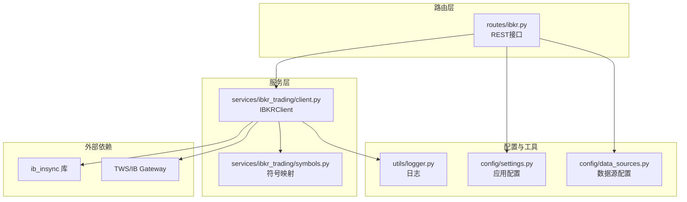
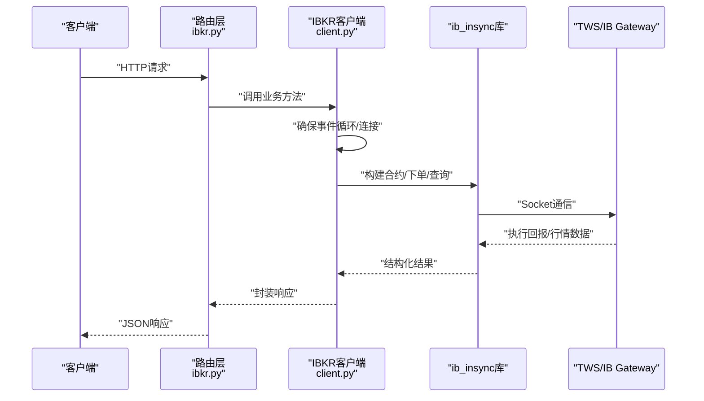
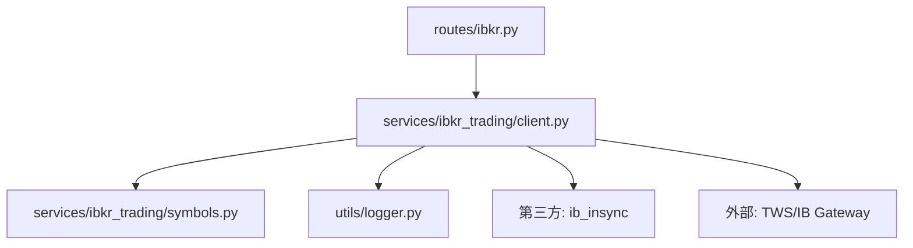

# Interactive Brokers集成

<cite>
**本文引用的文件**
- [ibkr.py](file://backend_api_python/app/routes/ibkr.py)
- [client.py](file://backend_api_python/app/services/ibkr_trading/client.py)
- [symbols.py](file://backend_api_python/app/services/ibkr_trading/symbols.py)
- [README.md](file://backend_api_python/app/services/ibkr_trading/README.md)
- [IBKR_TRADING_GUIDE_EN.md](file://docs/IBKR_TRADING_GUIDE_EN.md)
- [factory.py](file://backend_api_python/app/services/live_trading/factory.py)
- [logger.py](file://backend_api_python/app/utils/logger.py)
- [settings.py](file://backend_api_python/app/config/settings.py)
- [data_sources.py](file://backend_api_python/app/config/data_sources.py)
</cite>

## 目录
1. [简介](#简介)
2. [项目结构](#项目结构)
3. [核心组件](#核心组件)
4. [架构总览](#架构总览)
5. [详细组件分析](#详细组件分析)
6. [依赖关系分析](#依赖关系分析)
7. [性能考虑](#性能考虑)
8. [故障排除指南](#故障排除指南)
9. [结论](#结论)
10. [附录](#附录)

## 简介
本文件系统性阐述QuantDinger中Interactive Brokers（IBKR）集成功能，覆盖连接建立、账户配置、多市场支持、实时数据与市场深度、新闻推送、账户管理API、订单路由与执行确认、认证与错误处理、重连机制、合规与风控集成等主题。当前实现聚焦于美国股票市场，通过TWS或IB Gateway进行实盘交易，支持市价单与限价单，提供账户查询、持仓查询、挂单查询、报价查询等能力。

## 项目结构
IBKR相关代码主要分布在以下位置：
- 路由层：提供REST接口，封装连接管理、账户查询、下单与取消、行情查询等
- 服务层：封装ib_insync客户端，负责连接、合约构建、订单提交、账户与行情查询
- 符号映射：将系统符号转换为IB合约参数
- 配置与工具：日志、应用配置、数据源配置等

**图表来源**
- [ibkr.py:1-383](file://backend_api_python/app/routes/ibkr.py#L1-L383)
- [client.py:1-555](file://backend_api_python/app/services/ibkr_trading/client.py#L1-L555)
- [symbols.py:1-62](file://backend_api_python/app/services/ibkr_trading/symbols.py#L1-L62)
- [logger.py:1-63](file://backend_api_python/app/utils/logger.py#L1-L63)
- [settings.py:1-99](file://backend_api_python/app/config/settings.py#L1-L99)
- [data_sources.py:1-173](file://backend_api_python/app/config/data_sources.py#L1-L173)

**章节来源**
- [ibkr.py:1-383](file://backend_api_python/app/routes/ibkr.py#L1-L383)
- [client.py:1-555](file://backend_api_python/app/services/ibkr_trading/client.py#L1-L555)
- [symbols.py:1-62](file://backend_api_python/app/services/ibkr_trading/symbols.py#L1-L62)
- [logger.py:1-63](file://backend_api_python/app/utils/logger.py#L1-L63)
- [settings.py:1-99](file://backend_api_python/app/config/settings.py#L1-L99)
- [data_sources.py:1-173](file://backend_api_python/app/config/data_sources.py#L1-L173)

## 核心组件
- REST路由层：提供连接状态查询、连接/断开、账户信息、持仓、挂单、下单、撤单、实时报价等接口
- IBKR客户端：封装ib_insync库，负责连接建立、合约构造、订单提交、账户与行情查询、连接状态维护
- 符号映射：将系统符号标准化为IB合约参数（如股票、SMART路由、美元计价）
- 配置与日志：统一的日志与应用配置，支撑运行时行为控制

关键职责与边界
- 路由层：参数校验、异常捕获、响应格式化
- 客户端：与IBKR交互的业务逻辑与错误处理
- 符号映射：跨系统与IB合约格式的桥接
- 配置与日志：运行期行为与可观测性保障

**章节来源**
- [ibkr.py:21-383](file://backend_api_python/app/routes/ibkr.py#L21-L383)
- [client.py:78-555](file://backend_api_python/app/services/ibkr_trading/client.py#L78-L555)
- [symbols.py:10-62](file://backend_api_python/app/services/ibkr_trading/symbols.py#L10-L62)

## 架构总览
下图展示从HTTP请求到IBKR API调用的端到端流程，以及与外部系统的交互。

**图表来源**
- [ibkr.py:31-138](file://backend_api_python/app/routes/ibkr.py#L31-L138)
- [client.py:110-176](file://backend_api_python/app/services/ibkr_trading/client.py#L110-L176)
- [client.py:208-338](file://backend_api_python/app/services/ibkr_trading/client.py#L208-L338)
- [client.py:467-511](file://backend_api_python/app/services/ibkr_trading/client.py#L467-L511)

## 详细组件分析

### 连接管理与认证
- 支持通过主机、端口、clientId、只读模式、账户等参数建立连接
- 默认端口参考：TWS实盘7497/模拟7496；IB Gateway实盘4001/模拟4002
- 客户端ID唯一性：同一clientId在同一时间仅允许一个连接，新连接会替换旧连接
- 事件循环：确保每个线程具备asyncio事件循环，满足ib_insync要求
- 连接状态：可查询当前连接状态、账户、只读模式等

最佳实践
- 使用不同clientId区分手动测试与自动化策略
- 在容器部署时确保IBGW可达（host.docker.internal或宿主网络）
- 仅允许本地回环访问以提升安全性

**章节来源**
- [ibkr.py:52-138](file://backend_api_python/app/routes/ibkr.py#L52-L138)
- [client.py:110-176](file://backend_api_python/app/services/ibkr_trading/client.py#L110-L176)
- [client.py:512-521](file://backend_api_python/app/services/ibkr_trading/client.py#L512-L521)
- [README.md:13-38](file://backend_api_python/app/services/ibkr_trading/README.md#L13-L38)
- [IBKR_TRADING_GUIDE_EN.md:23-50](file://docs/IBKR_TRADING_GUIDE_EN.md#L23-L50)

### 账户与订单API
- 账户信息：账户汇总（标签-数值-币种）
- 持仓查询：按账户返回标的、数量、平均成本、市值等
- 挂单查询：返回订单ID、方向、数量、类型、状态、成交均价等
- 下单：支持市价单与限价单，自动构建合约并通过ib_insync提交
- 撤单：根据订单ID在开放交易中查找并撤销

注意
- 当前实现仅支持美国股票市场（USStock），市场类型默认为USStock
- 限价单需提供价格参数

**章节来源**
- [ibkr.py:143-224](file://backend_api_python/app/routes/ibkr.py#L143-L224)
- [client.py:368-466](file://backend_api_python/app/services/ibkr_trading/client.py#L368-L466)
- [client.py:208-338](file://backend_api_python/app/services/ibkr_trading/client.py#L208-L338)
- [client.py:340-365](file://backend_api_python/app/services/ibkr_trading/client.py#L340-L365)

### 实时数据与市场深度
- 实时报价：请求市场数据、等待、读取bid/ask/last/high/low/volume/close并取消订阅
- 市场深度：当前路由未提供深度数据接口；如需深度，可在客户端扩展相应方法
- 新闻推送：当前路由未提供新闻接口；如需新闻，可在客户端扩展相应方法

建议
- 报价接口适用于高频场景，注意取消订阅避免资源泄漏
- 如需深度与新闻，可参考报价实现模式扩展

**章节来源**
- [ibkr.py:353-382](file://backend_api_python/app/routes/ibkr.py#L353-L382)
- [client.py:467-511](file://backend_api_python/app/services/ibkr_trading/client.py#L467-L511)

### 符号与市场类型
- 符号标准化：将系统符号转换为IB合约参数（如SMART路由、美元计价）
- 自动检测：解析符号并推导市场类型（当前默认USStock）
- 显示格式：提供显示符号格式化函数

当前支持
- 美国股票：AAPL、MSFT等标准美股权

扩展建议
- 通过symbols模块扩展其他市场类型（期权、期货、外汇等）

**章节来源**
- [symbols.py:10-62](file://backend_api_python/app/services/ibkr_trading/symbols.py#L10-L62)

### 错误处理与重连机制
- 异常捕获：路由层对连接、下单、查询等操作进行异常捕获与错误响应
- 客户端错误：连接失败、无效合约、下单失败等均有明确错误返回
- 重连策略：客户端在必要时重新建立连接（_ensure_connected），但未内置指数退避或心跳保活
- 日志：统一日志输出，便于定位问题

建议
- 在高并发场景下增加指数退避与心跳保活
- 对网络抖动与API限流进行更细粒度的重试策略

**章节来源**
- [ibkr.py:38-110](file://backend_api_python/app/routes/ibkr.py#L38-L110)
- [client.py:169-176](file://backend_api_python/app/services/ibkr_trading/client.py#L169-L176)
- [logger.py:9-48](file://backend_api_python/app/utils/logger.py#L9-L48)

### 合规、费用与风控集成
- 合规：仅允许本地回环访问IBGW；建议使用纸交易账户进行测试
- 费用：回测模块内置佣金计算逻辑，可用于策略回测中的费用建模
- 风控：回测模块提供止损、止盈、移动止损、加减仓等风控参数与执行逻辑

注意
- 实盘费用以IB实际收取为准，回测费用仅为估算
- 风控参数在策略配置中定义，执行时按杠杆折算有效阈值

**章节来源**
- [IBKR_TRADING_GUIDE_EN.md:138-162](file://docs/IBKR_TRADING_GUIDE_EN.md#L138-L162)
- [backtest.py:2427-2626](file://backend_api_python/app/services/backtest.py#L2427-L2626)

## 依赖关系分析
IBKR模块内部依赖关系如下：

**图表来源**
- [ibkr.py:10-11](file://backend_api_python/app/routes/ibkr.py#L10-L11)
- [client.py:13-16](file://backend_api_python/app/services/ibkr_trading/client.py#L13-L16)
- [symbols.py:1-62](file://backend_api_python/app/services/ibkr_trading/symbols.py#L1-L62)
- [logger.py:1-63](file://backend_api_python/app/utils/logger.py#L1-L63)

**章节来源**
- [ibkr.py:10-11](file://backend_api_python/app/routes/ibkr.py#L10-L11)
- [client.py:13-16](file://backend_api_python/app/services/ibkr_trading/client.py#L13-L16)

## 性能考虑
- 事件循环：确保每线程存在事件循环，避免阻塞与死锁
- 请求等待：报价与下单后适当sleep等待回报，避免过于频繁的轮询
- 资源释放：报价完成后及时取消订阅，防止资源泄漏
- 并发模型：当前为单实例全局客户端，建议在多策略场景下按策略隔离客户端实例

[本节为通用指导，无需具体文件引用]

## 故障排除指南
常见问题与解决思路
- 连接失败：检查IBGW是否运行、Socket端口设置、是否启用Socket API、clientId是否冲突
- 无效合约：检查符号格式与市场类型
- 订单被拒：检查资金/保证金、价格参数、交易时段
- 重连与掉线：确认clientId唯一性与网络稳定性

参考
- 路由层错误响应与日志输出
- 客户端连接与下单异常处理
- 文档中的故障排除表格

**章节来源**
- [ibkr.py:38-110](file://backend_api_python/app/routes/ibkr.py#L38-L110)
- [client.py:157-176](file://backend_api_python/app/services/ibkr_trading/client.py#L157-L176)
- [README.md:114-123](file://backend_api_python/app/services/ibkr_trading/README.md#L114-L123)
- [IBKR_TRADING_GUIDE_EN.md:138-148](file://docs/IBKR_TRADING_GUIDE_EN.md#L138-L148)

## 结论
QuantDinger的IBKR集成功基于ib_insync库，提供了从连接管理、账户查询、订单执行到实时报价的完整链路。当前实现聚焦美国股票市场，具备清晰的路由层与客户端封装，配合日志与配置体系，能够满足基本的实盘交易需求。后续可在市场类型扩展、深度与新闻数据接入、重连与限流策略、以及合规与风控的实盘落地方面持续增强。

[本节为总结性内容，无需具体文件引用]

## 附录

### API端点一览
- 连接管理
  - GET /api/ibkr/status：获取连接状态
  - POST /api/ibkr/connect：连接TWS/IB Gateway
  - POST /api/ibkr/disconnect：断开连接
- 账户与订单
  - GET /api/ibkr/account：账户信息
  - GET /api/ibkr/positions：持仓
  - GET /api/ibkr/orders：挂单
  - POST /api/ibkr/order：下单（市价/限价）
  - DELETE /api/ibkr/order/{id}：撤单
- 实时数据
  - GET /api/ibkr/quote：实时报价

**章节来源**
- [ibkr.py:31-382](file://backend_api_python/app/routes/ibkr.py#L31-L382)
- [README.md:39-68](file://backend_api_python/app/services/ibkr_trading/README.md#L39-L68)
- [IBKR_TRADING_GUIDE_EN.md:80-109](file://docs/IBKR_TRADING_GUIDE_EN.md#L80-L109)

### 端口与配置参考
- 端口参考：TWS实盘7497/模拟7496；IB Gateway实盘4001/模拟4002
- 客户端ID：手动测试默认1；策略/实盘默认7（可通过环境变量或前端配置）
- 配置来源：前端策略配置（非环境变量）

**章节来源**
- [README.md:13-38](file://backend_api_python/app/services/ibkr_trading/README.md#L13-L38)
- [IBKR_TRADING_GUIDE_EN.md:23-50](file://docs/IBKR_TRADING_GUIDE_EN.md#L23-L50)
- [factory.py:314-337](file://backend_api_python/app/services/live_trading/factory.py#L314-L337)