# MetaTrader 5集成

<cite>
**本文档引用的文件**
- [mt5.py](file://backend_api_python/app/routes/mt5.py)
- [client.py](file://backend_api_python/app/services/mt5_trading/client.py)
- [symbols.py](file://backend_api_python/app/services/mt5_trading/symbols.py)
- [README.md](file://backend_api_python/app/services/mt5_trading/README.md)
- [MT5_TRADING_GUIDE_EN.md](file://docs/MT5_TRADING_GUIDE_EN.md)
- [local_brokers.py](file://backend_api_python/app/utils/local_brokers.py)
- [settings.py](file://backend_api_python/app/config/settings.py)
- [requirements-windows.txt](file://backend_api_python/requirements-windows.txt)
- [factory.py](file://backend_api_python/app/services/live_trading/factory.py)
- [strategy.py](file://backend_api_python/app/services/strategy.py)
- [pending_order_worker.py](file://backend_api_python/app/services/pending_order_worker.py)
- [execution.py](file://backend_api_python/app/services/live_trading/execution.py)
</cite>

## 目录
1. [简介](#简介)
2. [项目结构](#项目结构)
3. [核心组件](#核心组件)
4. [架构概览](#架构概览)
5. [详细组件分析](#详细组件分析)
6. [依赖关系分析](#依赖关系分析)
7. [性能考虑](#性能考虑)
8. [故障排除指南](#故障排除指南)
9. [结论](#结论)
10. [附录](#附录)

## 简介

QuantDinger的MetaTrader 5（MT5）集成功能提供了完整的外汇自动交易解决方案。该系统通过官方MetaTrader5 Python库连接到MT5终端，实现了账户管理、订单执行和实时数据订阅的完整功能栈。

该集成支持：
- **连接管理**：建立和维护与MT5终端的安全连接
- **账户管理**：查询账户余额、持仓和挂单状态
- **订单执行**：支持市价单和限价单的下单、撤单和仓位平仓
- **实时数据**：提供报价数据和市场符号列表
- **符号处理**：自动符号标准化和解析

## 项目结构

MT5集成模块位于后端API的特定目录中，采用清晰的分层架构设计：

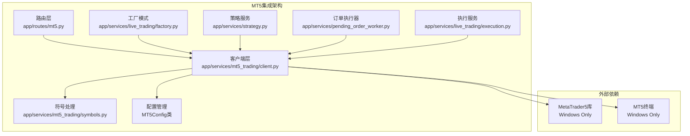

**图表来源**
- [mt5.py:1-439](file://backend_api_python/app/routes/mt5.py#L1-L439)
- [client.py:1-858](file://backend_api_python/app/services/mt5_trading/client.py#L1-L858)

**章节来源**
- [mt5.py:1-439](file://backend_api_python/app/routes/mt5.py#L1-L439)
- [client.py:1-858](file://backend_api_python/app/services/mt5_trading/client.py#L1-L858)

## 核心组件

### MT5客户端类

MT5Client是整个集成系统的核心，封装了所有与MT5交互的功能：

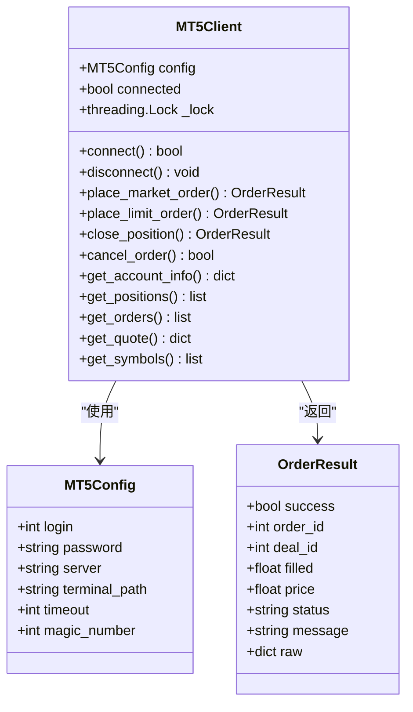

**图表来源**
- [client.py:62-858](file://backend_api_python/app/services/mt5_trading/client.py#L62-L858)

### 路由层设计

REST API路由提供了标准化的接口：

| 端点 | 方法 | 描述 |
|------|------|------|
| `/api/mt5/status` | GET | 获取连接状态 |
| `/api/mt5/connect` | POST | 连接到MT5终端 |
| `/api/mt5/disconnect` | POST | 断开连接 |
| `/api/mt5/account` | GET | 获取账户信息 |
| `/api/mt5/positions` | GET | 获取持仓列表 |
| `/api/mt5/orders` | GET | 获取挂单列表 |
| `/api/mt5/symbols` | GET | 获取可用符号 |
| `/api/mt5/order` | POST | 下单 |
| `/api/mt5/close` | POST | 平仓 |
| `/api/mt5/order/{ticket}` | DELETE | 撤销挂单 |
| `/api/mt5/quote` | GET | 获取报价 |

**章节来源**
- [mt5.py:52-439](file://backend_api_python/app/routes/mt5.py#L52-L439)

## 架构概览

### 整体架构图

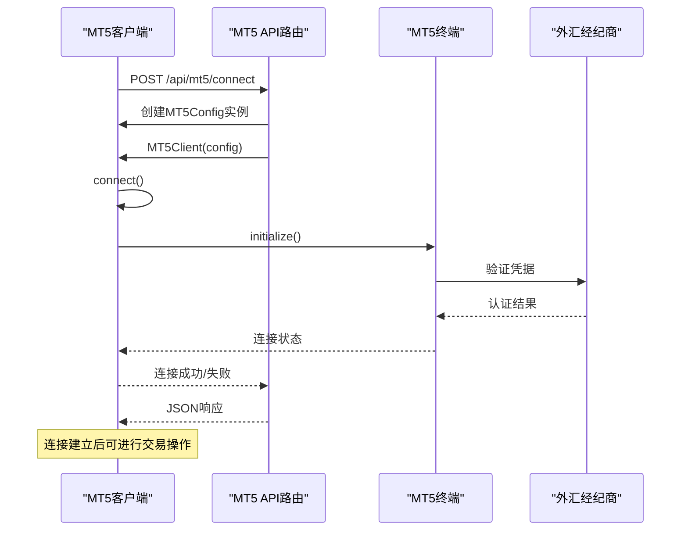

**图表来源**
- [mt5.py:77-154](file://backend_api_python/app/routes/mt5.py#L77-L154)
- [client.py:101-155](file://backend_api_python/app/services/mt5_trading/client.py#L101-L155)

### 交易执行流程

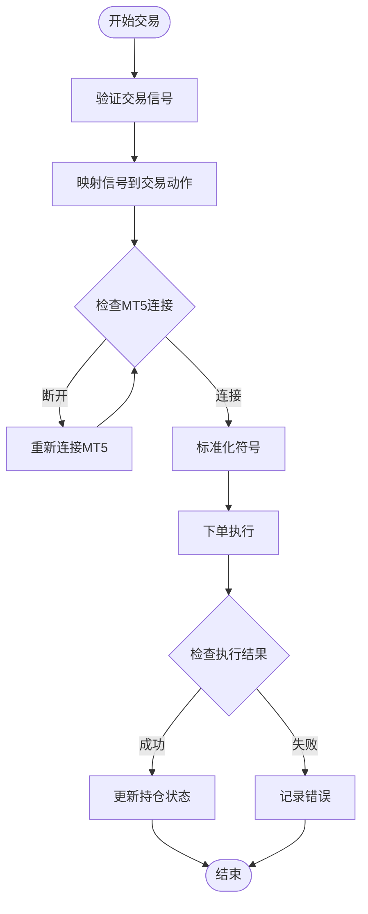

**图表来源**
- [pending_order_worker.py:2372-2423](file://backend_api_python/app/services/pending_order_worker.py#L2372-L2423)
- [execution.py:369-401](file://backend_api_python/app/services/live_trading/execution.py#L369-L401)

## 详细组件分析

### 连接管理组件

#### MT5Config配置类

MT5Config类定义了连接MT5终端所需的所有配置参数：

| 参数 | 类型 | 默认值 | 描述 |
|------|------|--------|------|
| login | int | 0 | MT5账户号码 |
| password | str | "" | MT5账户密码 |
| server | str | "" | 经纪商服务器名称 |
| terminal_path | str | "" | MT5终端可执行文件路径 |
| timeout | int | 60000 | 连接超时时间（毫秒） |
| magic_number | int | 123456 | EA魔法数字用于识别订单 |

#### 连接状态检测

连接状态检测机制确保系统能够准确判断MT5终端的可用性：

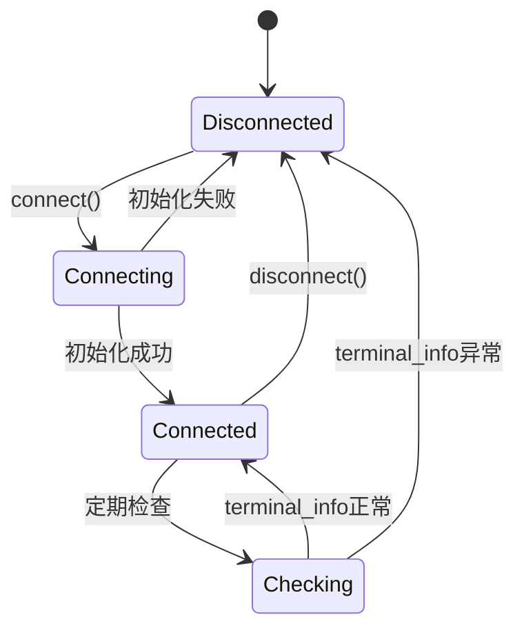

**图表来源**
- [client.py:89-100](file://backend_api_python/app/services/mt5_trading/client.py#L89-L100)

**章节来源**
- [client.py:38-47](file://backend_api_python/app/services/mt5_trading/client.py#L38-L47)
- [client.py:84-100](file://backend_api_python/app/services/mt5_trading/client.py#L84-L100)

### 订单执行组件

#### 市价单执行流程

市价单是最常用的交易指令，具有快速成交的特点：

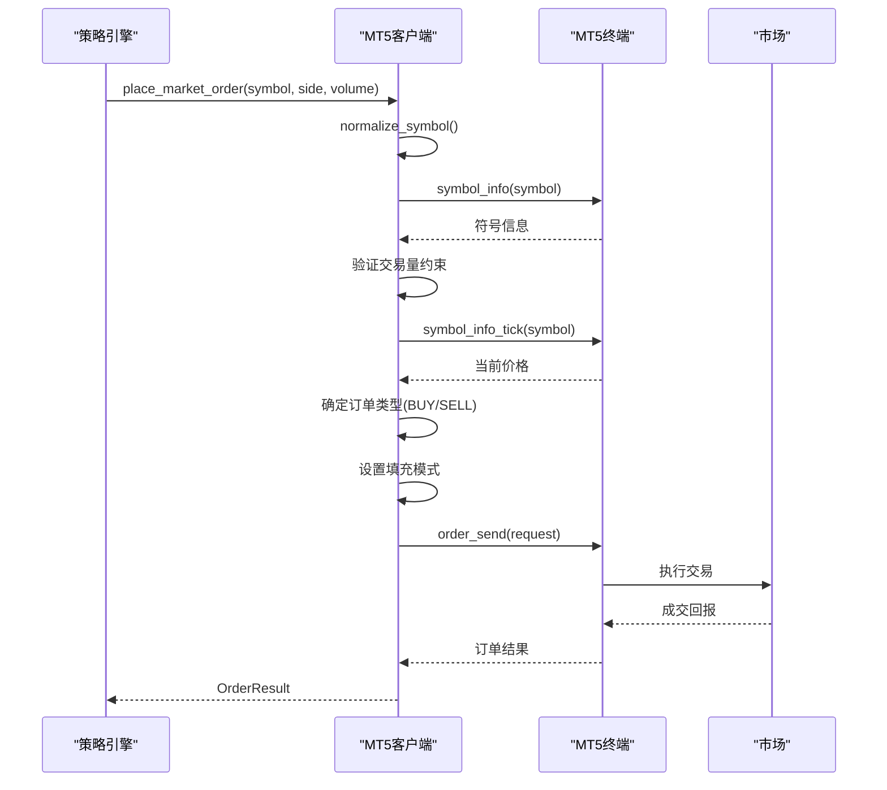

**图表来源**
- [client.py:178-314](file://backend_api_python/app/services/mt5_trading/client.py#L178-L314)

#### 限价单执行流程

限价单允许交易者指定目标价格，但可能无法立即成交：

| 订单类型 | 适用场景 | 特点 |
|----------|----------|------|
| BUY_LIMIT | 预期价格下跌后反弹 | 买入限价单 |
| BUY_STOP | 预期突破阻力位 | 买入止损单 |
| SELL_LIMIT | 预期价格上涨后回调 | 卖出限价单 |
| SELL_STOP | 预期跌破支撑位 | 卖出止损单 |

**章节来源**
- [client.py:178-443](file://backend_api_python/app/services/mt5_trading/client.py#L178-L443)

### 符号处理组件

#### 符号标准化机制

符号标准化是MT5集成的关键组件，确保不同经纪商的符号格式一致性：

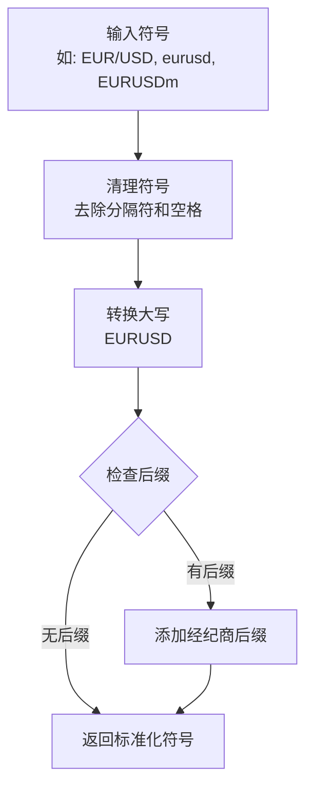

**图表来源**
- [symbols.py:33-58](file://backend_api_python/app/services/mt5_trading/symbols.py#L33-L58)

#### 支持的市场类型

| 市场类型 | 符号示例 | 说明 |
|----------|----------|------|
| 外汇货币对 | EURUSD, GBPUSD, USDJPY | 标准外汇交易对 |
| 交叉货币对 | EURGBP, EURJPY, AUDJPY | 不包含美元的货币对 |
| 金属交易 | XAUUSD, XAGUSD | 黄金和白银交易 |
| 指数CFD | US30, US500, DE40 | 主要股指期货 |
| 加密货币 | BTCUSD, ETHUSD | 数字货币交易 |

**章节来源**
- [symbols.py:10-30](file://backend_api_python/app/services/mt5_trading/symbols.py#L10-L30)
- [symbols.py:61-92](file://backend_api_python/app/services/mt5_trading/symbols.py#L61-L92)

### 账户管理组件

#### 账户信息查询

账户信息查询提供了实时的财务状况概览：

| 字段 | 类型 | 描述 |
|------|------|------|
| login | int | 账户号码 |
| server | str | 服务器名称 |
| name | str | 账户名称 |
| currency | str | 账户货币 |
| balance | float | 账户余额 |
| equity | float | 净资产价值 |
| margin | float | 已用保证金 |
| margin_free | float | 可用保证金 |
| margin_level | float | 保证金水平 |
| profit | float | 浮动盈亏 |
| leverage | int | 杠杆倍数 |
| trade_allowed | bool | 交易权限 |

#### 持仓管理

持仓管理功能提供了完整的头寸监控能力：

| 持仓属性 | 类型 | 描述 |
|----------|------|------|
| ticket | int | 持仓票据号 |
| symbol | str | 交易符号 |
| type | str | 交易方向(buy/sell) |
| volume | float | 持仓数量 |
| price_open | float | 开仓价格 |
| price_current | float | 当前价格 |
| sl | float | 止损价格 |
| tp | float | 止盈价格 |
| profit | float | 浮动盈亏 |
| swap | float | 利息费用 |
| magic | int | 魔法数字 |
| comment | str | 备注信息 |
| time | str | 开仓时间 |

**章节来源**
- [client.py:587-720](file://backend_api_python/app/services/mt5_trading/client.py#L587-L720)
- [client.py:623-667](file://backend_api_python/app/services/mt5_trading/client.py#L623-L667)

## 依赖关系分析

### 外部依赖

MT5集成依赖于以下关键组件：

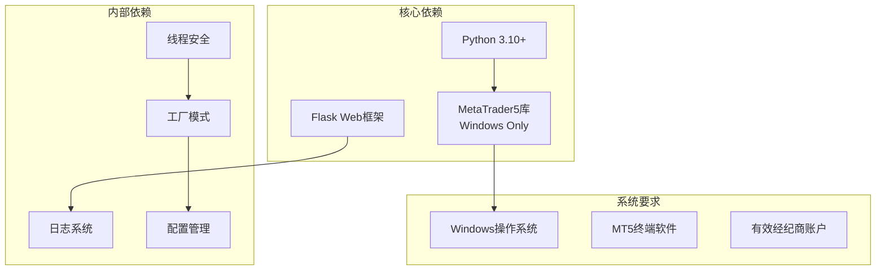

**图表来源**
- [requirements-windows.txt:5-6](file://backend_api_python/requirements-windows.txt#L5-L6)
- [MT5_TRADING_GUIDE_EN.md:23-24](file://docs/MT5_TRADING_GUIDE_EN.md#L23-L24)

### 内部模块依赖

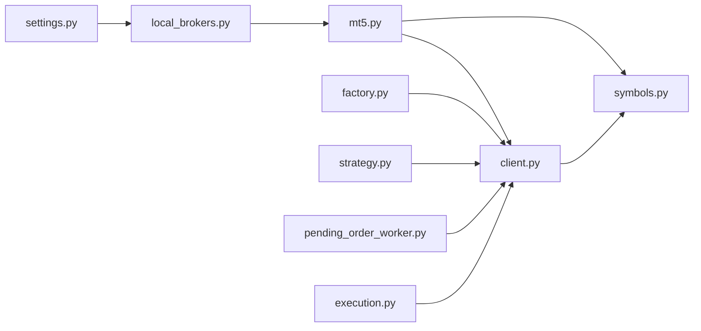

**图表来源**
- [mt5.py:10-13](file://backend_api_python/app/routes/mt5.py#L10-L13)
- [client.py:14-15](file://backend_api_python/app/services/mt5_trading/client.py#L14-L15)

**章节来源**
- [mt5.py:19-47](file://backend_api_python/app/routes/mt5.py#L19-L47)
- [client.py:19-35](file://backend_api_python/app/services/mt5_trading/client.py#L19-L35)

## 性能考虑

### 连接池管理

MT5客户端使用线程锁确保多线程环境下的安全性：

```python
# 线程安全的连接管理
with self._lock:
    if self.connected:
        return True
    # 执行连接逻辑
```

### 缓存策略

系统实现了多层次的缓存机制：

1. **连接缓存**：避免重复初始化MT5库
2. **符号缓存**：缓存符号信息减少查询次数
3. **账户信息缓存**：定期更新账户状态

### 错误处理和重试

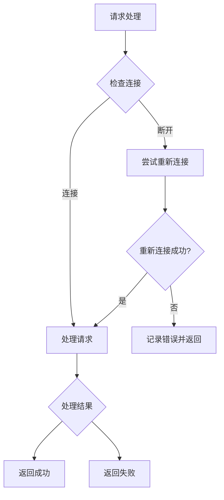

**图表来源**
- [client.py:170-174](file://backend_api_python/app/services/mt5_trading/client.py#L170-L174)

## 故障排除指南

### 常见问题诊断

| 问题类型 | 症状 | 可能原因 | 解决方案 |
|----------|------|----------|----------|
| 连接失败 | ImportError: MetaTrader5 | 库未安装或平台不支持 | 在Windows上安装MetaTrader5库 |
| 连接失败 | 连接超时 | MT5终端未运行 | 启动MT5终端并登录 |
| 订单失败 | Symbol not found | 符号格式错误 | 使用标准化符号格式 |
| 权限错误 | Trade not allowed | 算法交易未启用 | 在MT5选项中启用算法交易 |
| 资金不足 | Insufficient margin | 保证金不足 | 增加保证金或调整杠杆 |

### 环境配置检查清单

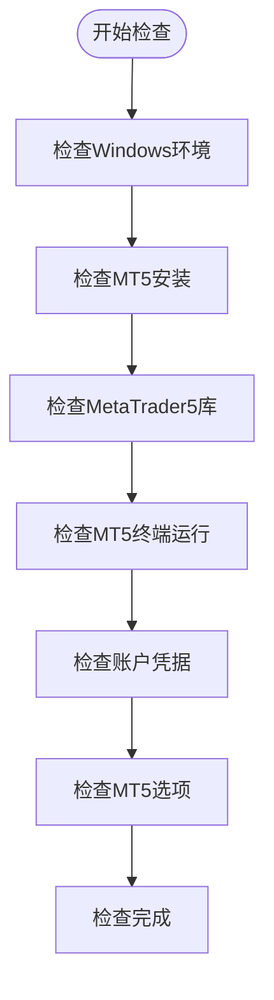

**图表来源**
- [MT5_TRADING_GUIDE_EN.md:97-105](file://docs/MT5_TRADING_GUIDE_EN.md#L97-L105)

### 安全配置建议

1. **专用账户**：使用独立的交易账户进行自动化交易
2. **最小权限**：仅授予必要的交易权限
3. **IP白名单**：限制访问源IP地址
4. **强密码**：使用高强度密码并定期更换
5. **监控设置**：启用交易活动监控和告警

**章节来源**
- [MT5_TRADING_GUIDE_EN.md:263-270](file://docs/MT5_TRADING_GUIDE_EN.md#L263-L270)

## 结论

QuantDinger的MetaTrader 5集成功能提供了企业级的外汇自动化交易解决方案。通过清晰的架构设计、完善的错误处理机制和严格的安全配置，该系统能够在Windows环境中稳定地连接到MT5终端并执行复杂的交易操作。

关键优势包括：
- **平台兼容性**：专门针对Windows平台优化
- **功能完整性**：覆盖从连接到执行的完整交易生命周期
- **安全性**：多层安全防护和权限控制
- **可扩展性**：模块化设计便于功能扩展

对于生产环境部署，建议遵循本文档的安全配置指南和最佳实践，确保系统的稳定性和安全性。

## 附录

### API端点完整参考

#### 连接管理

| 端点 | 方法 | 请求体 | 响应 | 描述 |
|------|------|--------|------|------|
| `/api/mt5/status` | GET | 无 | `{connected: boolean, error?: string}` | 获取连接状态 |
| `/api/mt5/connect` | POST | `{login, password, server, terminal_path?}` | `{success: boolean, account?: object}` | 连接到MT5终端 |
| `/api/mt5/disconnect` | POST | 无 | `{success: boolean}` | 断开连接 |

#### 账户查询

| 端点 | 方法 | 查询参数 | 响应 | 描述 |
|------|------|----------|------|------|
| `/api/mt5/account` | GET | 无 | `AccountInfo` | 获取账户信息 |
| `/api/mt5/positions` | GET | `symbol?` | `{positions: Position[]}` | 获取持仓列表 |
| `/api/mt5/orders` | GET | `symbol?` | `{orders: Order[]}` | 获取挂单列表 |
| `/api/mt5/symbols` | GET | `group?` | `{symbols: SymbolInfo[]}` | 获取可用符号 |

#### 交易执行

| 端点 | 方法 | 请求体 | 响应 | 描述 |
|------|------|--------|------|------|
| `/api/mt5/order` | POST | `{symbol, side, volume, orderType?, price?, comment?}` | `OrderResult` | 下单 |
| `/api/mt5/close` | POST | `{ticket, volume?}` | `OrderResult` | 平仓 |
| `/api/mt5/order/{ticket}` | DELETE | 无 | `{success: boolean}` | 撤销挂单 |

#### 市场数据

| 端点 | 方法 | 查询参数 | 响应 | 描述 |
|------|------|----------|------|------|
| `/api/mt5/quote` | GET | `symbol` | `Quote` | 获取实时报价 |

### 部署要求

#### 系统要求

- **操作系统**：Windows 10/11（推荐）
- **Python版本**：3.10+
- **内存**：至少4GB RAM
- **存储**：至少1GB可用空间

#### 环境变量

| 变量名 | 默认值 | 描述 |
|--------|--------|------|
| ALLOW_LOCAL_DESKTOP_BROKERS | true | 允许本地桌面经纪商连接 |
| SECRET_KEY | quantdinger-secret-key-change-me | 应用密钥 |
| PYTHON_API_HOST | 0.0.0.0 | API主机地址 |
| PYTHON_API_PORT | 5000 | API端口号 |

### 配置示例

#### MT5终端配置

```ini
[MT5终端设置]
允许算法交易 = 是
允许DLL导入 = 否
自动交易 = 是
```

#### 策略配置

```yaml
live_trading:
  exchange_id: mt5
  mt5_server: ICMarkets-Demo
  mt5_login: 12345678
  mt5_password: your_password
  mt5_terminal_path: C:\Program Files\MetaTrader 5\terminal64.exe
```