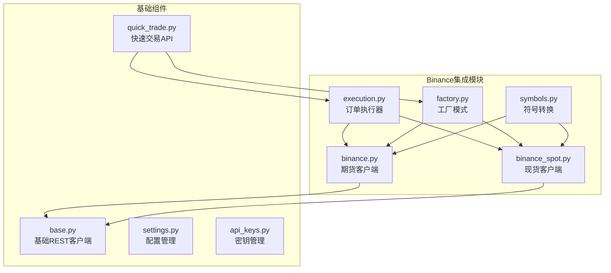
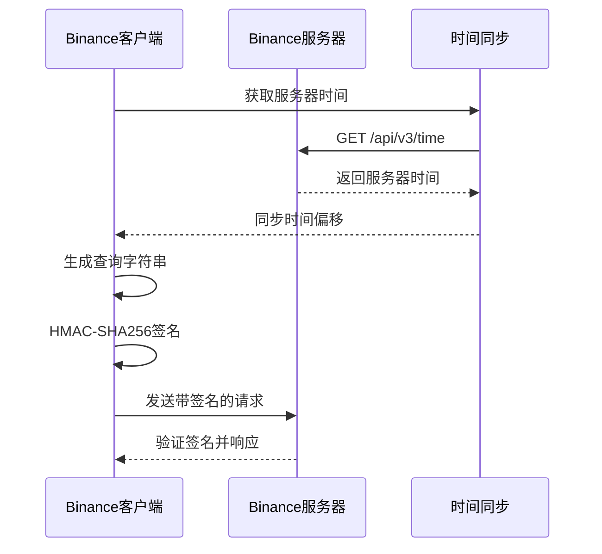
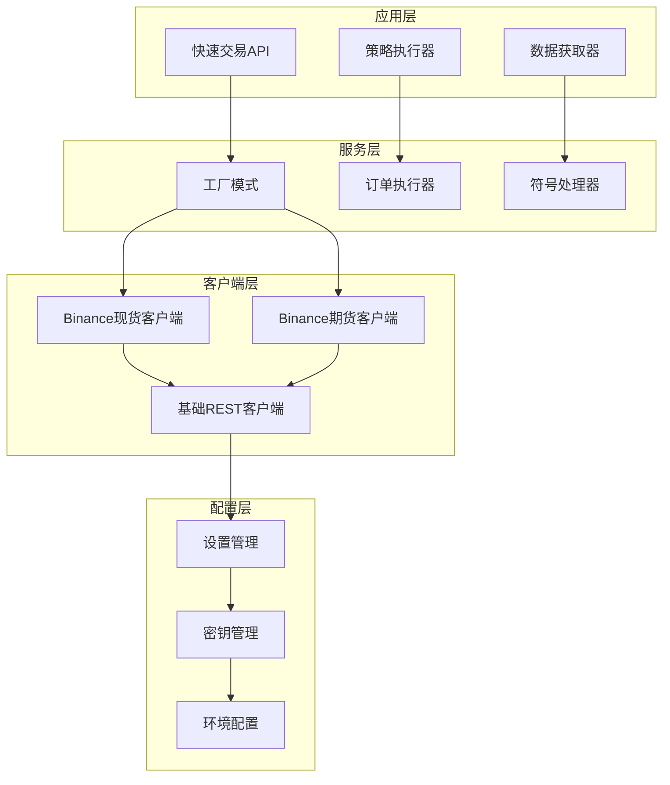
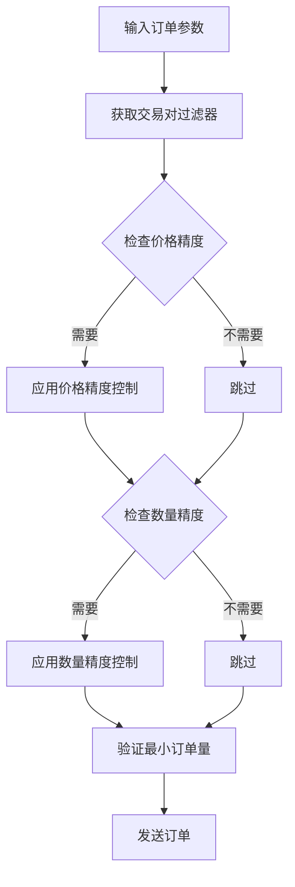
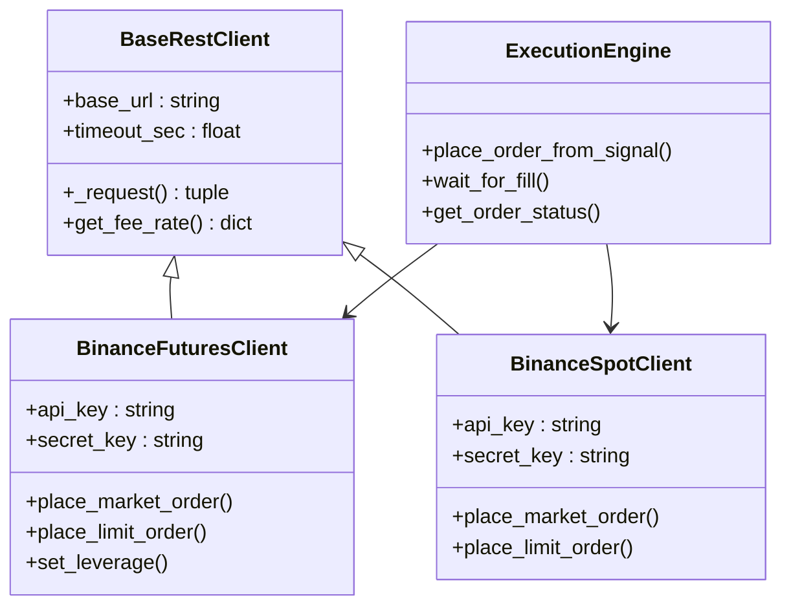
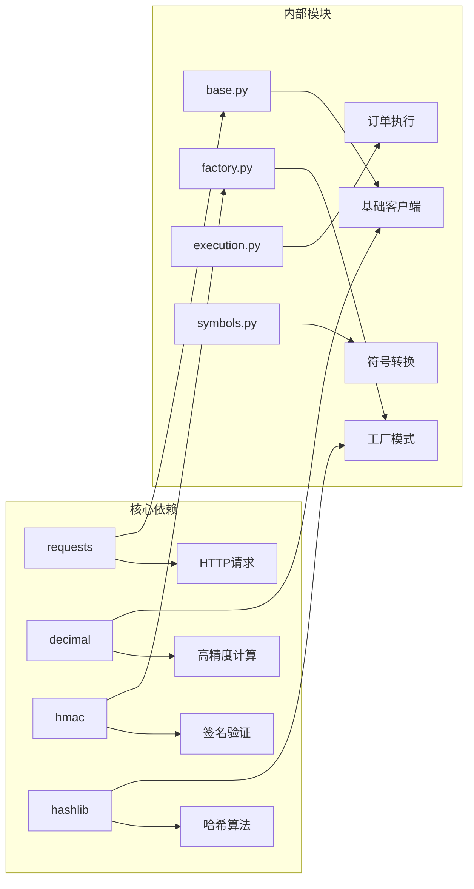
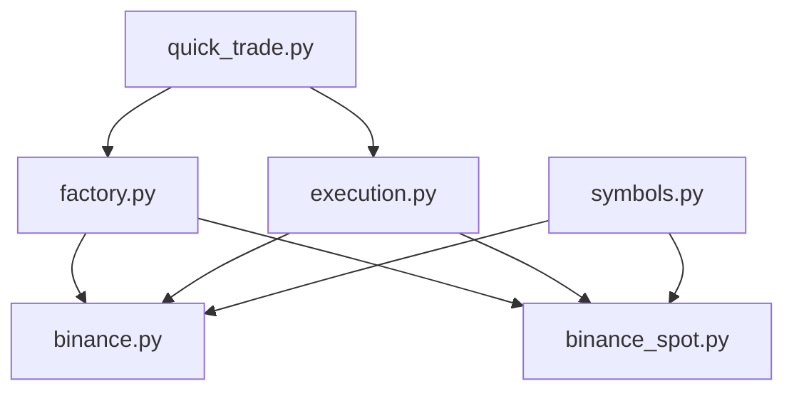
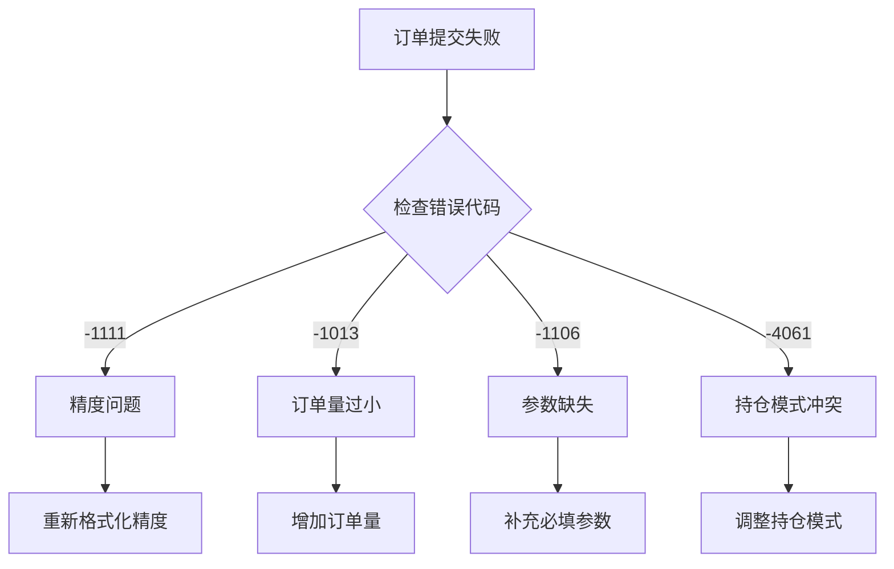

# Binance交易所集成

<cite>
**本文档引用的文件**
- [binance.py](file://backend_api_python/app/services/live_trading/binance.py)
- [binance_spot.py](file://backend_api_python/app/services/live_trading/binance_spot.py)
- [execution.py](file://backend_api_python/app/services/live_trading/execution.py)
- [factory.py](file://backend_api_python/app/services/live_trading/factory.py)
- [symbols.py](file://backend_api_python/app/services/live_trading/symbols.py)
- [base.py](file://backend_api_python/app/services/live_trading/base.py)
- [quick_trade.py](file://backend_api_python/app/routes/quick_trade.py)
- [settings.py](file://backend_api_python/app/config/settings.py)
- [api_keys.py](file://backend_api_python/app/config/api_keys.py)
- [crypto.py](file://backend_api_python/app/data_sources/crypto.py)
</cite>

## 目录
1. [简介](#简介)
2. [项目结构](#项目结构)
3. [核心组件](#核心组件)
4. [架构概览](#架构概览)
5. [详细组件分析](#详细组件分析)
6. [依赖关系分析](#依赖关系分析)
7. [性能考虑](#性能考虑)
8. [故障排除指南](#故障排除指南)
9. [结论](#结论)

## 简介

本文档详细介绍了QuantDinger项目中Binance交易所的完整集成方案。该系统提供了对Binance现货和期货市场的全面支持，包括REST API认证、订单执行、风险管理和数据获取等功能。

系统采用模块化设计，支持多种交易场景：
- **现货交易**：支持限价单和市价单执行
- **期货交易**：支持USDT-M合约交易，包括杠杆设置和保证金模式
- **实时数据**：通过公共API获取市场数据
- **风险管理**：内置精度控制、最小订单量验证和错误处理机制

## 项目结构

Binance集成位于`backend_api_python/app/services/live_trading/`目录下，主要包含以下关键文件：



**图表来源**
- [binance.py:1-1036](file://backend_api_python/app/services/live_trading/binance.py#L1-L1036)
- [binance_spot.py:1-717](file://backend_api_python/app/services/live_trading/binance_spot.py#L1-L717)
- [execution.py:1-426](file://backend_api_python/app/services/live_trading/execution.py#L1-L426)

**章节来源**
- [binance.py:1-1036](file://backend_api_python/app/services/live_trading/binance.py#L1-L1036)
- [binance_spot.py:1-717](file://backend_api_python/app/services/live_trading/binance_spot.py#L1-L717)
- [execution.py:1-426](file://backend_api_python/app/services/live_trading/execution.py#L1-L426)

## 核心组件

### 认证机制

Binance集成实现了完整的HMAC SHA256签名认证机制：



**图表来源**
- [binance.py:166-236](file://backend_api_python/app/services/live_trading/binance.py#L166-L236)
- [binance_spot.py:161-249](file://backend_api_python/app/services/live_trading/binance_spot.py#L161-L249)

### 订单执行系统

系统支持多种订单类型和执行策略：

| 订单类型 | 支持范围 | 特殊参数 |
|---------|---------|---------|
| 市价单 | 现货/期货 | 无需价格参数 |
| 限价单 | 现货/期货 | 必须指定价格 |
| 做市商单 | 期货 | 支持做市商模式 |
| 止损单 | 期货 | 支持止损触发 |

**章节来源**
- [binance.py:735-892](file://backend_api_python/app/services/live_trading/binance.py#L735-L892)
- [binance_spot.py:432-522](file://backend_api_python/app/services/live_trading/binance_spot.py#L432-L522)

## 架构概览

Binance集成采用分层架构设计，确保代码的可维护性和扩展性：



**图表来源**
- [factory.py:126-285](file://backend_api_python/app/services/live_trading/factory.py#L126-L285)
- [execution.py:123-310](file://backend_api_python/app/services/live_trading/execution.py#L123-L310)

## 详细组件分析

### Binance期货客户端

期货客户端提供了完整的USDT-M合约交易功能：

#### 订单精度控制

系统实现了精确的价格和数量精度控制机制：



**图表来源**
- [binance.py:331-426](file://backend_api_python/app/services/live_trading/binance.py#L331-L426)

#### 杠杆和保证金管理

系统支持灵活的杠杆设置和保证金模式切换：

| 保证金模式 | 描述 | 适用场景 |
|-----------|------|---------|
| 逐仓 | 风险隔离，最大损失等于保证金 | 高风险偏好交易者 |
| 交叉 | 整体风险敞口，可用保证金共享 | 长期趋势交易者 |

**章节来源**
- [binance.py:508-530](file://backend_api_python/app/services/live_trading/binance.py#L508-L530)
- [binance.py:998-1013](file://backend_api_python/app/services/live_trading/binance.py#L998-L1013)

### Binance现货客户端

现货客户端专注于现货市场的交易执行：

#### 交易对配置

系统支持多种交易对格式的自动转换：

| 输入格式 | 输出格式 | 说明 |
|---------|---------|------|
| BTC/USDT | BTC/USDT | 标准格式 |
| BTCUSDT | BTC/USDT | 简化格式 |
| BTC/USDT:USDT | BTC/USDT | 带合约信息 |
| SOL/USDT | SOL/USDT | 支持多币种 |

**章节来源**
- [symbols.py:43-47](file://backend_api_python/app/services/live_trading/symbols.py#L43-L47)
- [binance_spot.py:268-320](file://backend_api_python/app/services/live_trading/binance_spot.py#L268-L320)

### 订单执行引擎

统一的订单执行接口支持多交易所一致性：



**图表来源**
- [base.py:95-167](file://backend_api_python/app/services/live_trading/base.py#L95-L167)
- [execution.py:123-310](file://backend_api_python/app/services/live_trading/execution.py#L123-L310)

**章节来源**
- [execution.py:153-194](file://backend_api_python/app/services/live_trading/execution.py#L153-L194)
- [execution.py:41-100](file://backend_api_python/app/services/live_trading/execution.py#L41-L100)

### 数据获取和缓存

系统实现了智能的数据缓存机制来优化性能：

#### 缓存策略

| 缓存类型 | TTL(秒) | 缓存内容 | 更新策略 |
|---------|--------|---------|---------|
| 交易对过滤器 | 300 | 精度、步长等 | 基于时间的过期 |
| 双边持仓模式 | 60 | Hedge/One-way模式 | 动态检测 |
| 服务器时间 | 300 | 服务器时间偏移 | 定期同步 |

**章节来源**
- [binance.py:36-48](file://backend_api_python/app/services/live_trading/binance.py#L36-L48)
- [binance_spot.py:33-38](file://backend_api_python/app/services/live_trading/binance_spot.py#L33-L38)

## 依赖关系分析

### 外部依赖

系统对外部库的依赖关系如下：



**图表来源**
- [base.py:18-19](file://backend_api_python/app/services/live_trading/base.py#L18-L19)
- [factory.py:18-31](file://backend_api_python/app/services/live_trading/factory.py#L18-L31)

### 内部模块耦合

各模块之间的依赖关系清晰，遵循单一职责原则：



**图表来源**
- [factory.py:19-31](file://backend_api_python/app/services/live_trading/factory.py#L19-L31)
- [execution.py:14-26](file://backend_api_python/app/services/live_trading/execution.py#L14-L26)

**章节来源**
- [factory.py:126-150](file://backend_api_python/app/services/live_trading/factory.py#L126-L150)
- [execution.py:123-194](file://backend_api_python/app/services/live_trading/execution.py#L123-L194)

## 性能考虑

### 请求优化策略

系统采用了多种性能优化技术：

1. **连接复用**：使用持久连接减少TCP握手开销
2. **批量请求**：支持批量获取多个交易对的数据
3. **智能缓存**：减少重复的API调用
4. **异步处理**：在可能的情况下使用异步I/O

### 错误处理和重试机制

系统实现了完善的错误处理机制：

| 错误类型 | 处理策略 | 重试次数 |
|---------|---------|---------|
| 网络超时 | 指数退避重试 | 3次 |
| 服务器错误 | 立即重试 | 2次 |
| 认证失败 | 抛出异常并终止 | 0次 |
| 业务逻辑错误 | 返回具体错误码 | 0次 |

**章节来源**
- [binance.py:215-236](file://backend_api_python/app/services/live_trading/binance.py#L215-L236)
- [binance_spot.py:218-249](file://backend_api_python/app/services/live_trading/binance_spot.py#L218-L249)

## 故障排除指南

### 常见问题诊断

#### API密钥相关问题

| 错误代码 | 可能原因 | 解决方案 |
|---------|---------|---------|
| -2015 | IP白名单未配置 | 在Binance控制台添加服务器IP |
| -1021 | 时间偏移过大 | 检查系统时间同步 |
| -1106 | 参数格式错误 | 验证请求参数格式 |
| -1111 | 精度不匹配 | 检查价格和数量精度 |

#### 订单执行问题



**图表来源**
- [binance.py:845-879](file://backend_api_python/app/services/live_trading/binance.py#L845-L879)

#### 网络连接问题

系统提供了详细的网络连接诊断功能：

1. **SSL证书验证**：支持自定义CA证书链
2. **代理支持**：透明支持SOCKS5和HTTP代理
3. **连接池管理**：优化连接复用
4. **超时配置**：可配置的请求超时时间

**章节来源**
- [base.py:34-79](file://backend_api_python/app/services/live_trading/base.py#L34-L79)
- [quick_trade.py:34-59](file://backend_api_python/app/routes/quick_trade.py#L34-L59)

### 配置最佳实践

#### API密钥配置

建议使用环境变量存储敏感信息：

```bash
# 生产环境配置
export BINANCE_API_KEY="your_api_key_here"
export BINANCE_SECRET_KEY="your_secret_key_here"

# 测试环境配置
export BINANCE_TESTNET=true
export BINANCE_API_KEY="test_api_key"
export BINANCE_SECRET_KEY="test_secret_key"
```

#### 性能优化配置

```python
# 配置示例
{
    "exchange_id": "binance",
    "api_key": "your_api_key",
    "secret_key": "your_secret_key",
    "enable_demo_trading": false,
    "timeout_sec": 15.0,
    "recv_window_ms": 10000
}
```

**章节来源**
- [settings.py:10-91](file://backend_api_python/app/config/settings.py#L10-L91)
- [api_keys.py:1-184](file://backend_api_python/app/config/api_keys.py#L1-L184)

## 结论

QuantDinger项目的Binance集成为量化交易提供了完整的技术解决方案。系统具有以下优势：

1. **功能完整性**：支持现货和期货交易的所有核心功能
2. **安全性**：实现了严格的认证和授权机制
3. **可靠性**：具备完善的错误处理和重试机制
4. **可扩展性**：模块化设计便于功能扩展
5. **易用性**：提供统一的API接口和配置管理

通过合理的配置和使用，用户可以安全、高效地进行Binance交易所的自动化交易。系统的监控和日志功能有助于及时发现和解决问题，确保交易系统的稳定运行。