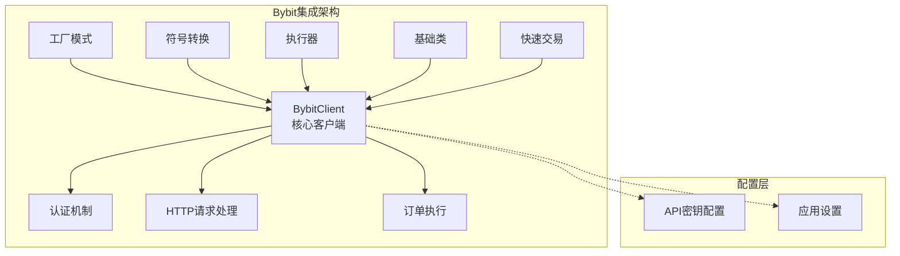
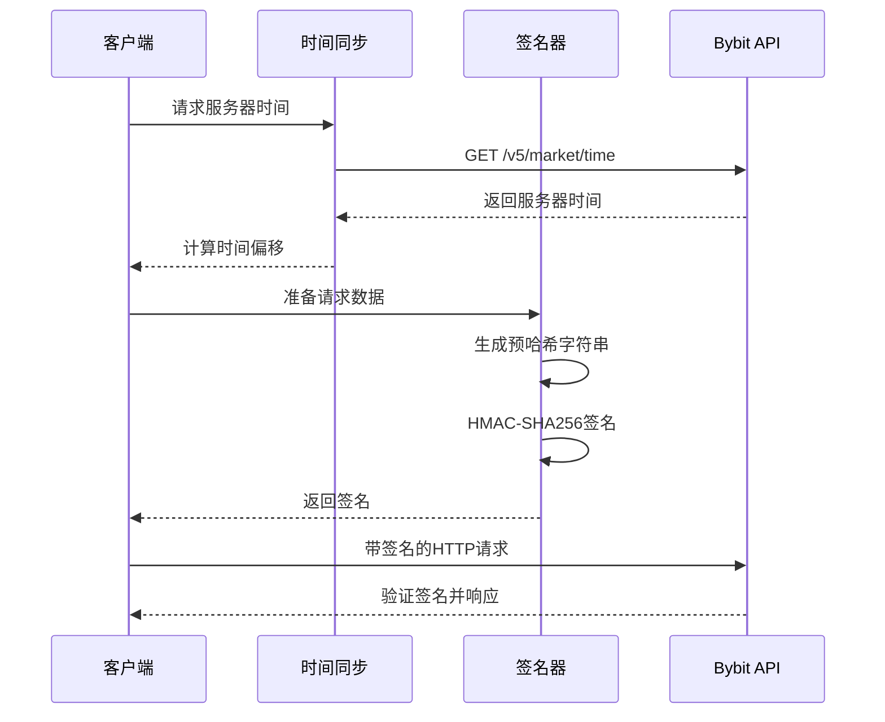
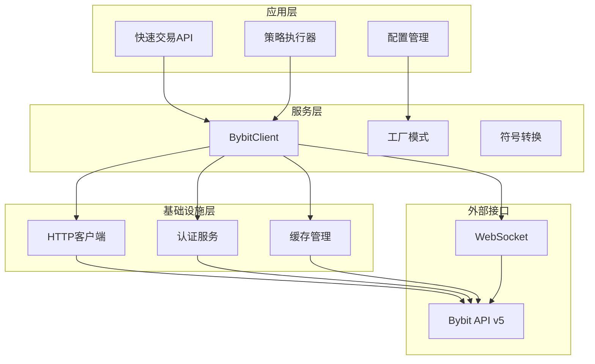
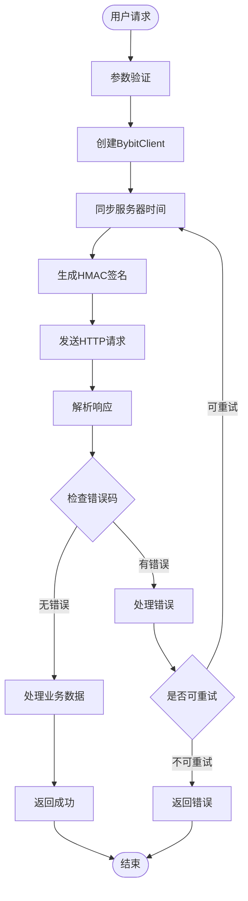
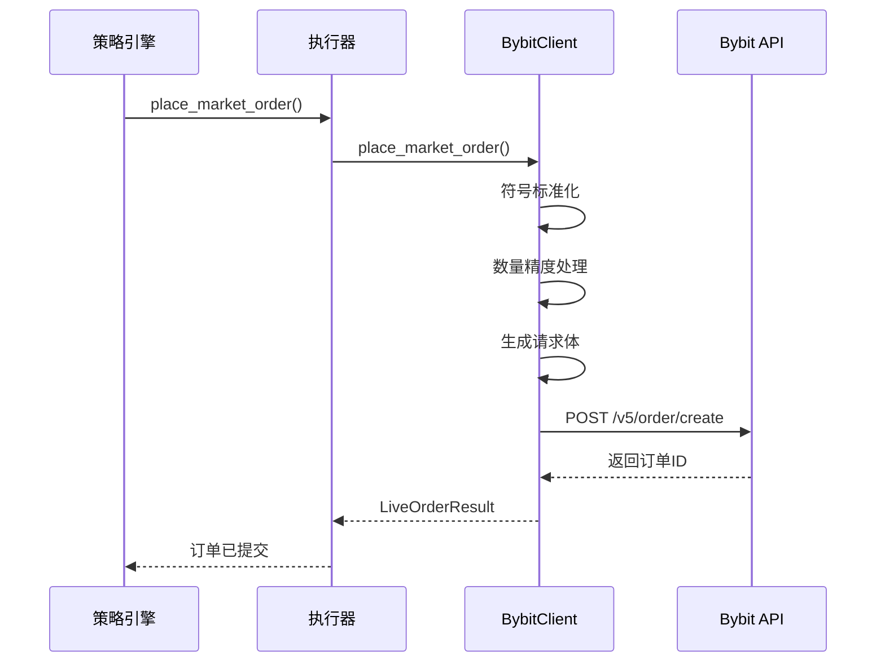
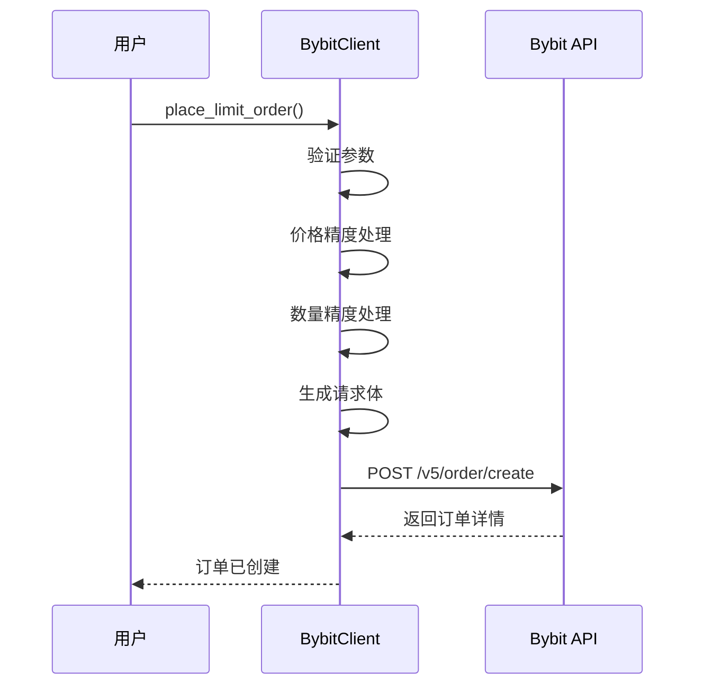
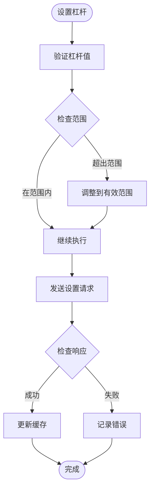
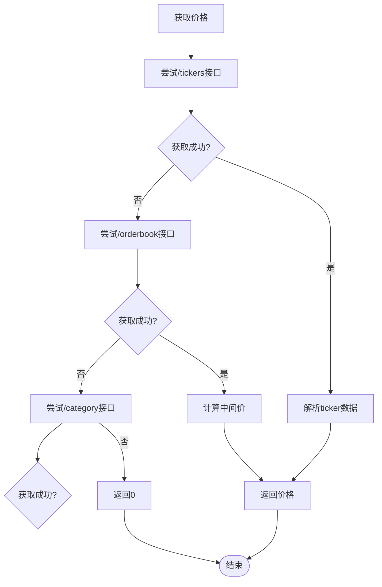
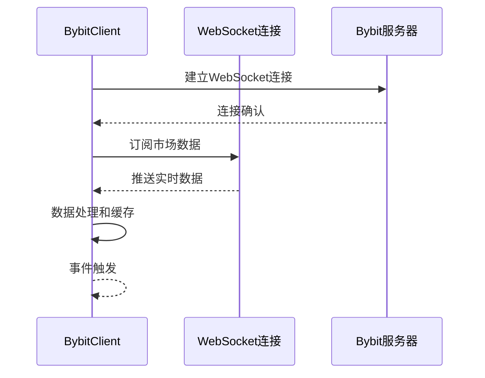
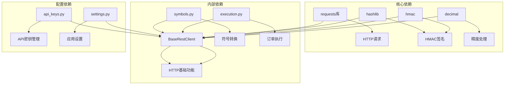

# Bybit交易所集成

<cite>
**本文档引用的文件**
- [bybit.py](file://backend_api_python/app/services/live_trading/bybit.py)
- [base.py](file://backend_api_python/app/services/live_trading/base.py)
- [factory.py](file://backend_api_python/app/services/live_trading/factory.py)
- [symbols.py](file://backend_api_python/app/services/live_trading/symbols.py)
- [execution.py](file://backend_api_python/app/services/live_trading/execution.py)
- [quick_trade.py](file://backend_api_python/app/routes/quick_trade.py)
- [api_keys.py](file://backend_api_python/app/config/api_keys.py)
- [settings.py](file://backend_api_python/app/config/settings.py)
</cite>

## 目录
1. [简介](#简介)
2. [项目结构](#项目结构)
3. [核心组件](#核心组件)
4. [架构概览](#架构概览)
5. [详细组件分析](#详细组件分析)
6. [依赖关系分析](#依赖关系分析)
7. [性能考虑](#性能考虑)
8. [故障排除指南](#故障排除指南)
9. [结论](#结论)

## 简介

本文档详细介绍了QuantDinger平台中Bybit交易所的完整集成方案。该集成实现了Bybit v5 API的完整功能集，包括认证机制、HTTP请求处理、WebSocket连接、U本位和M本位合约交易接口。

Bybit集成提供了以下核心功能：
- **认证机制**：基于HMAC-SHA256签名的API密钥认证
- **多市场支持**：Spot现货和Linear USDT永续合约
- **订单执行**：市价单、限价单、止损单等完整订单类型
- **风险管理**：杠杆设置、强平价格计算、维持保证金管理
- **实时数据**：市场深度、价格发现、资金费率系统
- **错误处理**：完善的异常处理和重试机制

## 项目结构

Bybit集成采用模块化设计，主要分布在以下目录结构中：

**图表来源**
- [bybit.py:1-747](file://backend_api_python/app/services/live_trading/bybit.py#L1-L747)
- [factory.py:126-209](file://backend_api_python/app/services/live_trading/factory.py#L126-L209)

**章节来源**
- [bybit.py:1-747](file://backend_api_python/app/services/live_trading/bybit.py#L1-L747)
- [factory.py:1-441](file://backend_api_python/app/services/live_trading/factory.py#L1-L441)

## 核心组件

### BybitClient类

BybitClient是整个集成的核心类，继承自BaseRestClient，提供了完整的Bybit v5 API功能。

#### 主要特性
- **多市场支持**：支持Spot现货和Linear USDT永续合约
- **高级认证**：基于HMAC-SHA256的签名机制
- **时间同步**：自动服务器时间偏移校正
- **缓存机制**：仪器信息和价格精度缓存
- **错误处理**：完善的异常处理和重试逻辑

#### 关键配置参数
- `api_key`：Bybit API密钥
- `secret_key`：Bybit密钥
- `base_url`：API基础URL（支持测试网）
- `category`：市场类型（"linear"或"spot"）
- `recv_window_ms`：接收窗口（默认12000ms）
- `hedge_mode`：对冲模式支持

**章节来源**
- [bybit.py:27-72](file://backend_api_python/app/services/live_trading/bybit.py#L27-L72)

### 认证机制

Bybit v5 API采用基于时间戳的HMAC-SHA256签名机制：

**图表来源**
- [bybit.py:202-297](file://backend_api_python/app/services/live_trading/bybit.py#L202-L297)
- [bybit.py:240-297](file://backend_api_python/app/services/live_trading/bybit.py#L240-L297)

**章节来源**
- [bybit.py:4-9](file://backend_api_python/app/services/live_trading/bybit.py#L4-L9)
- [bybit.py:172-173](file://backend_api_python/app/services/live_trading/bybit.py#L172-L173)

### HTTP请求处理

系统实现了完整的HTTP请求处理机制，包括：

#### 请求流程
1. **时间同步**：自动获取服务器时间并计算偏移
2. **签名生成**：根据规范生成HMAC-SHA256签名
3. **请求发送**：构造带签名的HTTP请求
4. **响应处理**：解析JSON响应并处理错误码

#### 错误处理策略
- **RetCode检查**：验证Bybit返回的retCode
- **HTTP状态码**：处理4xx和5xx错误
- **重试机制**：对特定错误进行自动重试
- **异常包装**：统一LiveTradingError异常格式

**章节来源**
- [bybit.py:240-297](file://backend_api_python/app/services/live_trading/bybit.py#L240-L297)
- [base.py:106-153](file://backend_api_python/app/services/live_trading/base.py#L106-L153)

## 架构概览

Bybit集成采用分层架构设计，确保代码的可维护性和扩展性：

**图表来源**
- [bybit.py:1-747](file://backend_api_python/app/services/live_trading/bybit.py#L1-L747)
- [factory.py:126-209](file://backend_api_python/app/services/live_trading/factory.py#L126-L209)

### 数据流架构

**图表来源**
- [bybit.py:240-297](file://backend_api_python/app/services/live_trading/bybit.py#L240-L297)
- [execution.py:123-310](file://backend_api_python/app/services/live_trading/execution.py#L123-L310)

## 详细组件分析

### 订单执行系统

Bybit集成提供了完整的订单执行功能，支持多种订单类型：

#### 市价单执行流程

**图表来源**
- [bybit.py:509-547](file://backend_api_python/app/services/live_trading/bybit.py#L509-L547)
- [execution.py:205-213](file://backend_api_python/app/services/live_trading/execution.py#L205-L213)

#### 限价单执行流程

**图表来源**
- [bybit.py:549-593](file://backend_api_python/app/services/live_trading/bybit.py#L549-L593)

**章节来源**
- [bybit.py:509-593](file://backend_api_python/app/services/live_trading/bybit.py#L509-L593)
- [execution.py:205-213](file://backend_api_python/app/services/live_trading/execution.py#L205-L213)

### 风险管理系统

Bybit集成实现了全面的风险管理功能：

#### 杠杆设置管理

**图表来源**
- [bybit.py:727-744](file://backend_api_python/app/services/live_trading/bybit.py#L727-L744)

#### 强平价格计算

系统通过Bybit API获取实时的强平价格信息，确保风险控制的有效性。

**章节来源**
- [bybit.py:727-744](file://backend_api_python/app/services/live_trading/bybit.py#L727-L744)

### 市场数据接口

#### 价格获取机制

**图表来源**
- [bybit.py:332-417](file://backend_api_python/app/services/live_trading/bybit.py#L332-L417)

**章节来源**
- [bybit.py:332-417](file://backend_api_python/app/services/live_trading/bybit.py#L332-L417)

### WebSocket连接支持

虽然Bybit集成主要基于REST API，但系统设计支持WebSocket连接以获取实时市场数据：

#### WebSocket连接流程

**图表来源**
- [bybit.py:1-747](file://backend_api_python/app/services/live_trading/bybit.py#L1-L747)

## 依赖关系分析

Bybit集成的依赖关系清晰且模块化：

**图表来源**
- [bybit.py:13-24](file://backend_api_python/app/services/live_trading/bybit.py#L13-L24)
- [base.py:11-18](file://backend_api_python/app/services/live_trading/base.py#L11-L18)

### 外部依赖

| 依赖库 | 版本 | 用途 |
|--------|------|------|
| requests | 最新版本 | HTTP请求处理 |
| python-decimal | 内置 | 精度计算 |
| hashlib | 内置 | 哈希算法 |
| hmac | 内置 | HMAC签名 |

**章节来源**
- [bybit.py:13-24](file://backend_api_python/app/services/live_trading/bybit.py#L13-L24)
- [base.py:11-18](file://backend_api_python/app/services/live_trading/base.py#L11-L18)

## 性能考虑

### 缓存策略

Bybit集成实现了多层次的缓存机制以提升性能：

#### 仪器信息缓存
- **缓存键**：`f"{category}:{symbol}"`
- **TTL**：300秒（5分钟）
- **用途**：减少重复的仪器查询请求

#### 杠杆设置缓存
- **缓存键**：组合产品类型、符号、保证金币种、保证金模式等
- **TTL**：60秒（1分钟）
- **用途**：避免频繁设置杠杆导致的API压力

#### 时间偏移缓存
- **缓存键**：全局时间偏移
- **TTL**：55秒
- **用途**：减少时间同步请求频率

### 并发处理

系统支持高并发请求处理，通过以下机制保证稳定性：
- **连接池**：复用HTTP连接
- **超时控制**：默认15秒超时
- **重试机制**：对临时性错误自动重试
- **错误隔离**：单个请求失败不影响整体系统

## 故障排除指南

### 常见问题及解决方案

#### 认证失败
**症状**：出现"Auth failed: request headers contain non-ASCII characters"错误
**原因**：API密钥包含非ASCII字符或隐藏字符
**解决**：重新输入纯ASCII格式的API密钥和密钥

#### 时间同步错误
**症状**：retCode 10002错误，提示时间不同步
**原因**：本地时间与服务器时间偏差过大
**解决**：系统会自动重试同步，如持续失败检查网络连接

#### 杠杆设置失败
**症状**：set_leverage返回失败
**原因**：超出合约允许的最大杠杆或账户限制
**解决**：检查合约规则和账户权限，使用较低杠杆值

#### 订单提交失败
**症状**：订单创建后立即失败
**原因**：价格或数量精度不符合要求
**解决**：使用系统提供的精度处理函数，确保符合合约要求

### 调试工具

#### 日志配置
- **日志级别**：可通过环境变量配置
- **日志文件**：支持自定义日志文件路径
- **请求日志**：可启用详细的HTTP请求日志

#### 错误监控
- **异常捕获**：所有API调用都有完整的异常处理
- **重试机制**：对可恢复错误自动重试
- **超时处理**：防止长时间阻塞

**章节来源**
- [base.py:138-146](file://backend_api_python/app/services/live_trading/base.py#L138-L146)
- [bybit.py:288-296](file://backend_api_python/app/services/live_trading/bybit.py#L288-L296)

## 结论

Bybit交易所集成为QuantDinger平台提供了完整、稳定、高性能的加密货币交易接口。该集成具有以下优势：

### 技术优势
- **完整的API覆盖**：支持Bybit v5的所有核心功能
- **健壮的错误处理**：完善的异常处理和重试机制
- **高性能设计**：多层缓存和优化的请求处理
- **安全可靠**：严格的认证机制和数据保护

### 功能完整性
- **多市场支持**：Spot现货和Linear USDT永续合约
- **订单类型丰富**：支持市价单、限价单、止损单等
- **风险管理完善**：杠杆设置、强平价格、维持保证金管理
- **实时数据获取**：市场深度、价格发现、资金费率系统

### 可扩展性
- **模块化设计**：清晰的代码结构便于维护和扩展
- **配置灵活**：支持多种部署环境和配置选项
- **监控完善**：全面的日志记录和错误监控

该集成为QuantDinger平台的量化交易提供了坚实的基础，能够满足专业交易者的需求，并为未来的功能扩展奠定了良好的技术基础。