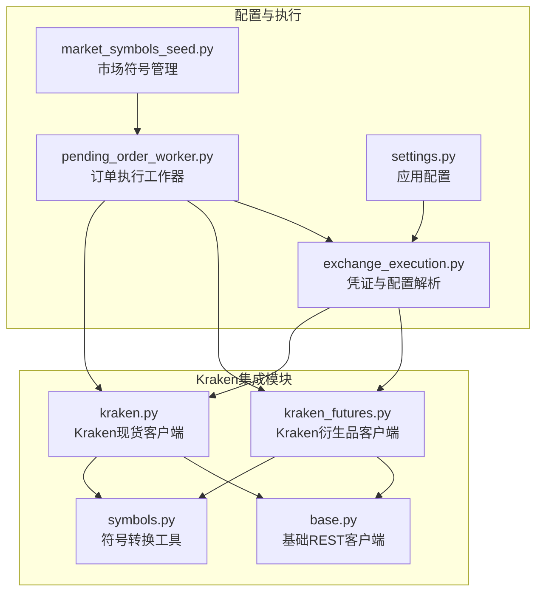
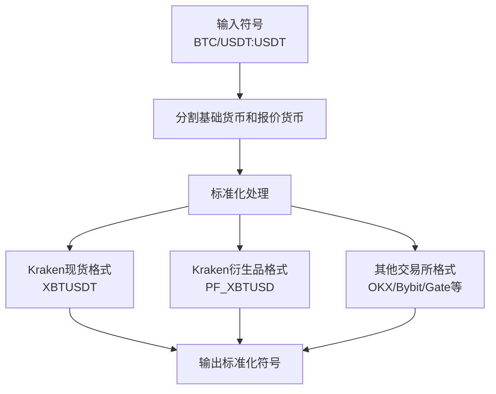
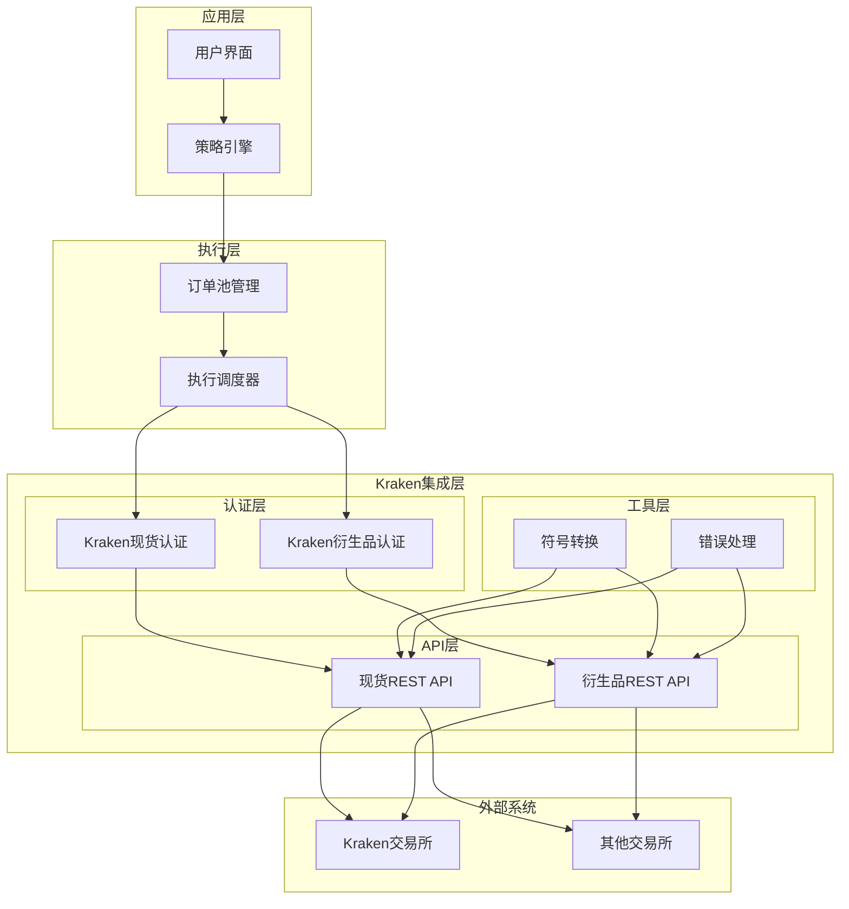
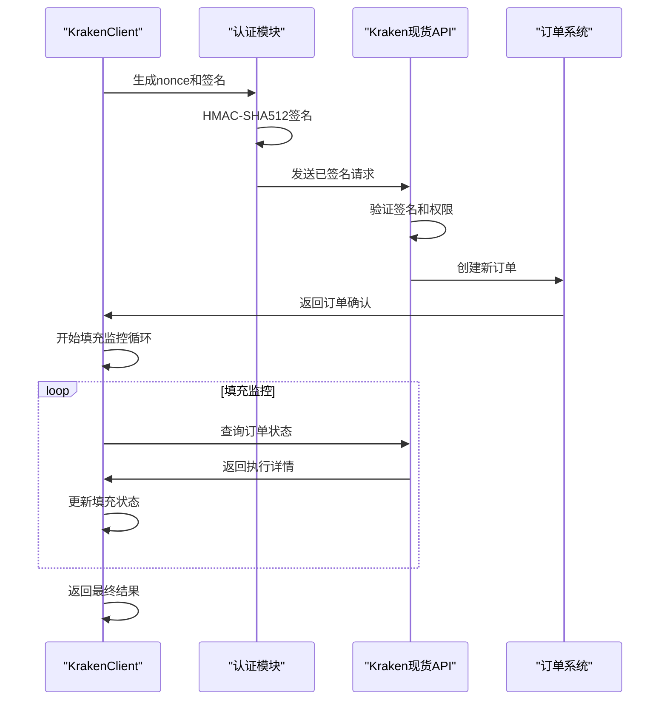
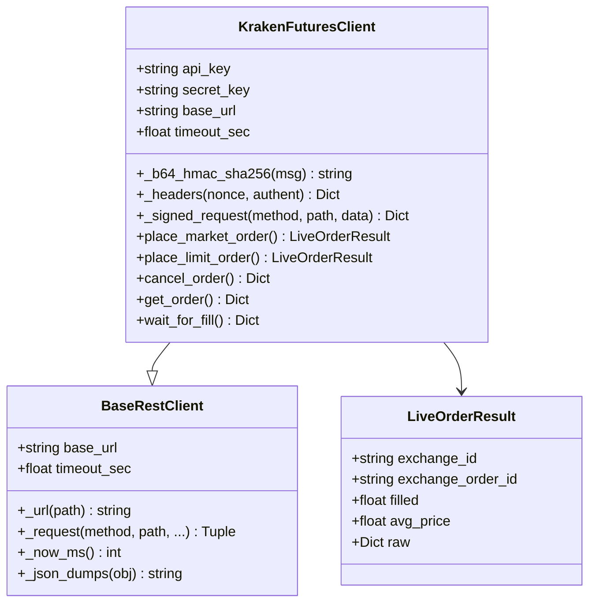
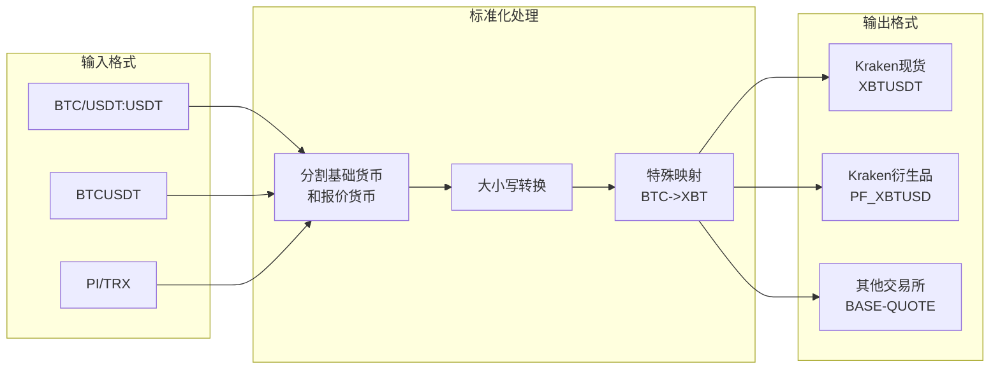
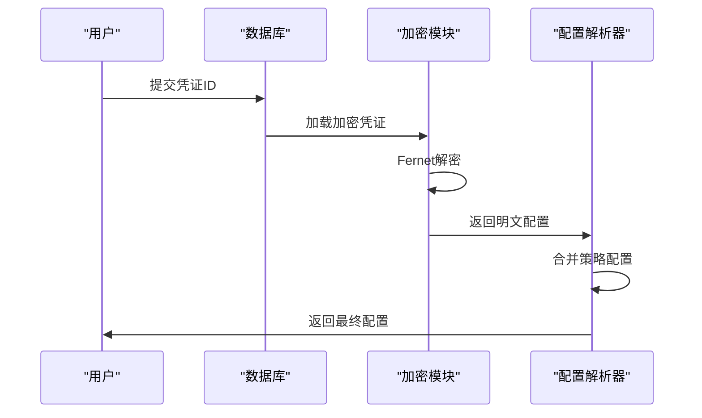
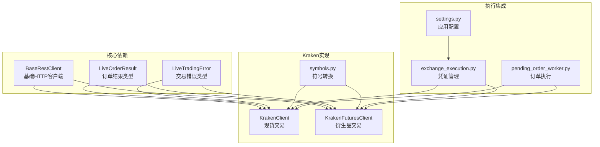
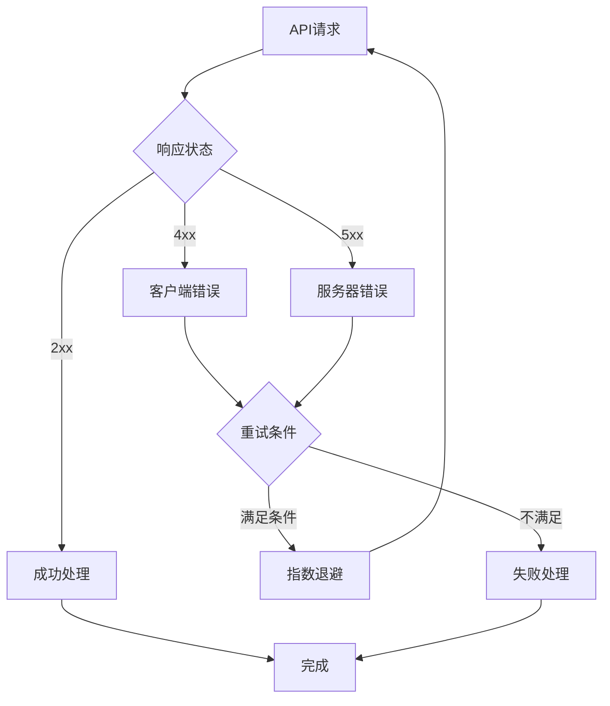

# Kraken交易所集成

<cite>
**本文档引用的文件**
- [kraken.py](file://backend_api_python/app/services/live_trading/kraken.py)
- [kraken_futures.py](file://backend_api_python/app/services/live_trading/kraken_futures.py)
- [symbols.py](file://backend_api_python/app/services/live_trading/symbols.py)
- [base.py](file://backend_api_python/app/services/live_trading/base.py)
- [exchange_execution.py](file://backend_api_python/app/services/exchange_execution.py)
- [pending_order_worker.py](file://backend_api_python/app/services/pending_order_worker.py)
- [settings.py](file://backend_api_python/app/config/settings.py)
- [market_symbols_seed.py](file://backend_api_python/app/data/market_symbols_seed.py)
</cite>

## 目录
1. [简介](#简介)
2. [项目结构](#项目结构)
3. [核心组件](#核心组件)
4. [架构概览](#架构概览)
5. [详细组件分析](#详细组件分析)
6. [依赖关系分析](#依赖关系分析)
7. [性能考虑](#性能考虑)
8. [故障排除指南](#故障排除指南)
9. [结论](#结论)
10. [附录](#附录)

## 简介

本文件为QuantDinger系统中Kraken交易所的完整技术集成文档。文档涵盖Kraken现货交易和衍生品交易的REST API实现、认证流程、订单簿深度、价格精度、交易对配置等关键要素，并提供API密钥生成、请求签名和时间戳同步处理的详细说明。

Kraken作为全球领先的数字资产交易所，在现货和衍生品领域均提供了标准化且安全的API接口。在本项目中，我们实现了两个独立的客户端：
- KrakenClient：用于Kraken现货交易（REST）
- KrakenFuturesClient：用于Kraken衍生品交易（REST）

两个客户端均基于统一的BaseRestClient抽象层，确保了认证流程、错误处理和HTTP请求的一致性。

## 项目结构

QuantDinger的Kraken集成位于后端Python服务的`app/services/live_trading/`目录下，采用模块化设计：



**图表来源**
- [kraken.py:1-193](file://backend_api_python/app/services/live_trading/kraken.py#L1-L193)
- [kraken_futures.py:1-223](file://backend_api_python/app/services/live_trading/kraken_futures.py#L1-L223)
- [symbols.py:1-235](file://backend_api_python/app/services/live_trading/symbols.py#L1-L235)
- [base.py:1-168](file://backend_api_python/app/services/live_trading/base.py#L1-L168)

**章节来源**
- [kraken.py:1-193](file://backend_api_python/app/services/live_trading/kraken.py#L1-L193)
- [kraken_futures.py:1-223](file://backend_api_python/app/services/live_trading/kraken_futures.py#L1-L223)
- [symbols.py:1-235](file://backend_api_python/app/services/live_trading/symbols.py#L1-L235)
- [base.py:1-168](file://backend_api_python/app/services/live_trading/base.py#L1-L168)

## 核心组件

### 认证系统

Kraken现货和衍生品交易采用了不同的认证机制：

#### Kraken现货认证
- **算法**：HMAC-SHA512
- **密钥处理**：Base64解码API密钥
- **签名构建**：`base64(hmac_sha512(base64_decode(secret), uri_path + sha256(nonce + postdata)))`
- **头部信息**：`API-Key` 和 `API-Sign`

#### Kraken衍生品认证
- **算法**：HMAC-SHA256
- **签名构建**：`base64(hmac_sha256(secret, nonce + postdata + endpoint_path))`
- **头部信息**：`APIKey`、`Nonce`、`Authent`

### 符号标准化

系统提供了完整的符号转换工具，支持多种交易所的符号格式：



**图表来源**
- [symbols.py:100-162](file://backend_api_python/app/services/live_trading/symbols.py#L100-L162)

**章节来源**
- [kraken.py:4-6](file://backend_api_python/app/services/live_trading/kraken.py#L4-L6)
- [kraken_futures.py:8-11](file://backend_api_python/app/services/live_trading/kraken_futures.py#L8-L11)
- [symbols.py:100-162](file://backend_api_python/app/services/live_trading/symbols.py#L100-L162)

## 架构概览

QuantDinger的Kraken集成采用分层架构设计，确保了代码的可维护性和扩展性：



**图表来源**
- [kraken.py:26-36](file://backend_api_python/app/services/live_trading/kraken.py#L26-L36)
- [kraken_futures.py:31-37](file://backend_api_python/app/services/live_trading/kraken_futures.py#L31-L37)
- [base.py:95-104](file://backend_api_python/app/services/live_trading/base.py#L95-L104)

## 详细组件分析

### Kraken现货客户端 (KrakenClient)

KrakenClient是现货交易的核心实现，提供了完整的订单生命周期管理：

#### 订单类型支持
- **市价单**：立即以市场最优价格成交
- **限价单**：指定价格进行挂单
- **取消订单**：支持按订单ID取消
- **查询订单**：获取订单状态和执行详情

#### 关键特性
- **自动nonce生成**：基于毫秒级时间戳
- **请求签名**：HMAC-SHA512算法
- **错误处理**：详细的API错误解析
- **填充监控**：轮询订单执行状态



**图表来源**
- [kraken.py:56-73](file://backend_api_python/app/services/live_trading/kraken.py#L56-L73)
- [kraken.py:145-191](file://backend_api_python/app/services/live_trading/kraken.py#L145-L191)

**章节来源**
- [kraken.py:26-193](file://backend_api_python/app/services/live_trading/kraken.py#L26-L193)

### Kraken衍生品客户端 (KrakenFuturesClient)

KrakenFuturesClient专注于衍生品交易，支持永续合约和期货产品：

#### 衍生品特性
- **合约单位**：以"contracts"为单位
- **杠杆支持**：通过账户配置管理
- **风险控制**：支持reduce-only和post-only订单
- **仓位管理**：实时仓位查询和管理

#### 订单类型
- **市价单**：`orderType: "mkt"`
- **限价单**：`orderType: "lmt"`
- **条件订单**：支持多种订单类型



**图表来源**
- [kraken_futures.py:31-37](file://backend_api_python/app/services/live_trading/kraken_futures.py#L31-L37)
- [base.py:95-167](file://backend_api_python/app/services/live_trading/base.py#L95-L167)

**章节来源**
- [kraken_futures.py:31-223](file://backend_api_python/app/services/live_trading/kraken_futures.py#L31-L223)

### 符号转换系统

符号转换系统确保了跨交易所的一致性：

#### 支持的转换函数
- `to_kraken_pair()`: Kraken现货符号转换
- `to_kraken_futures_symbol()`: Kraken衍生品符号转换
- `to_okx_swap_inst_id()`: OKX永续合约转换
- `to_gate_currency_pair()`: Gate现货符号转换



**图表来源**
- [symbols.py:16-40](file://backend_api_python/app/services/live_trading/symbols.py#L16-L40)
- [symbols.py:100-162](file://backend_api_python/app/services/live_trading/symbols.py#L100-L162)

**章节来源**
- [symbols.py:1-235](file://backend_api_python/app/services/live_trading/symbols.py#L1-L235)

### 配置与凭证管理

系统提供了完整的配置和凭证管理机制：

#### 凭证加载流程


**图表来源**
- [exchange_execution.py:95-147](file://backend_api_python/app/services/exchange_execution.py#L95-L147)

**章节来源**
- [exchange_execution.py:1-150](file://backend_api_python/app/services/exchange_execution.py#L1-L150)

## 依赖关系分析

### 组件间依赖



**图表来源**
- [base.py:82-92](file://backend_api_python/app/services/live_trading/base.py#L82-L92)
- [kraken.py:22-23](file://backend_api_python/app/services/live_trading/kraken.py#L22-L23)
- [kraken_futures.py:27-28](file://backend_api_python/app/services/live_trading/kraken_futures.py#L27-L28)

### 外部依赖

系统对外部依赖的管理：

| 依赖项 | 用途 | 版本要求 | 安全考虑 |
|--------|------|----------|----------|
| requests | HTTP客户端 | >= 2.25.0 | SSL证书验证 |
| base64 | 编码解码 | 内置库 | 密钥安全存储 |
| hashlib | 哈希算法 | 内置库 | 签名完整性 |
| hmac | HMAC签名 | 内置库 | 防篡改保护 |
| time | 时间戳 | 内置库 | 同步准确性 |

**章节来源**
- [base.py:11-18](file://backend_api_python/app/services/live_trading/base.py#L11-L18)
- [kraken.py:15-20](file://backend_api_python/app/services/live_trading/kraken.py#L15-L20)
- [kraken_futures.py:20-25](file://backend_api_python/app/services/live_trading/kraken_futures.py#L20-L25)

## 性能考虑

### 请求优化策略

1. **连接复用**：使用持久连接减少握手开销
2. **批量请求**：合并多个小请求为批量操作
3. **缓存机制**：对公共数据进行本地缓存
4. **超时配置**：合理设置请求超时时间

### 错误恢复



### 性能监控指标

- **响应时间**：API调用延迟
- **成功率**：请求成功比率
- **错误率**：各类错误发生频率
- **吞吐量**：每秒处理请求数

## 故障排除指南

### 常见问题诊断

#### 认证失败
**症状**：返回401或403状态码
**原因**：
- API密钥无效或过期
- 签名计算错误
- 时间戳不同步

**解决方案**：
1. 验证API密钥格式正确
2. 检查签名算法实现
3. 同步系统时间

#### 请求超时
**症状**：网络请求超时
**原因**：
- 网络连接不稳定
- 服务器负载过高
- 防火墙阻断

**解决方案**：
1. 增加超时时间
2. 实现重试机制
3. 检查网络配置

#### 数据不一致
**症状**：本地数据与交易所数据不符
**原因**：
- 仓位同步延迟
- 订单状态更新滞后
- 并发访问冲突

**解决方案**：
1. 实施定期同步
2. 添加并发控制
3. 增强错误处理

**章节来源**
- [base.py:138-146](file://backend_api_python/app/services/live_trading/base.py#L138-L146)
- [kraken.py:67-72](file://backend_api_python/app/services/live_trading/kraken.py#L67-L72)
- [kraken_futures.py:56-61](file://backend_api_python/app/services/live_trading/kraken_futures.py#L56-L61)

## 结论

QuantDinger的Kraken集成为现货和衍生品交易提供了完整的技术解决方案。通过模块化的架构设计、标准化的认证流程和完善的错误处理机制，系统能够稳定可靠地处理各种交易场景。

主要优势包括：
- **安全性**：采用业界标准的HMAC签名算法
- **可靠性**：完善的错误处理和重试机制
- **可扩展性**：模块化设计便于功能扩展
- **易用性**：统一的API接口和配置管理

未来可以考虑的功能增强：
- WebSocket订阅支持
- 更多交易所的集成
- 实时行情推送
- 高级风险管理功能

## 附录

### API密钥生成指南

#### Kraken现货API密钥生成步骤
1. 登录Kraken账户
2. 进入API管理页面
3. 创建新的API密钥
4. 选择所需权限级别
5. 下载密钥文件
6. 配置环境变量

#### Kraken衍生品API密钥生成步骤
1. 访问Kraken衍生品平台
2. 申请衍生品交易权限
3. 生成专用API密钥
4. 配置IP白名单
5. 测试API连通性

### 配置示例

#### 环境变量配置
```bash
# Kraken现货配置
KRAKEN_API_KEY=your_api_key_here
KRAKEN_SECRET_KEY=your_secret_key_here

# Kraken衍生品配置  
KRAKEN_FUTURES_API_KEY=your_futures_api_key
KRAKEN_FUTURES_SECRET_KEY=your_futures_secret_key

# SSL验证配置
LIVE_TRADING_SSL_VERIFY=true
```

#### 数据库配置
```sql
-- 交换机凭证表结构
CREATE TABLE qd_exchange_credentials (
    id INTEGER PRIMARY KEY,
    user_id INTEGER,
    exchange_id TEXT,
    encrypted_config TEXT,
    created_at TIMESTAMP,
    updated_at TIMESTAMP
);
```

### 最佳实践

1. **密钥管理**：使用环境变量存储敏感信息
2. **错误处理**：实现全面的异常捕获和处理
3. **日志记录**：详细记录API交互和错误信息
4. **监控告警**：建立系统健康监控和告警机制
5. **测试验证**：在模拟环境中充分测试后再上线