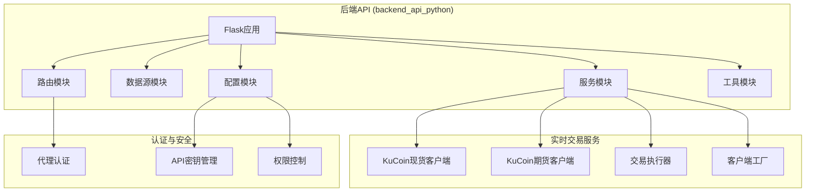
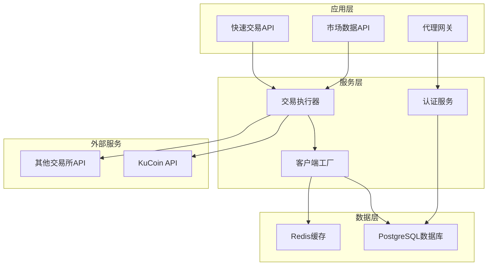
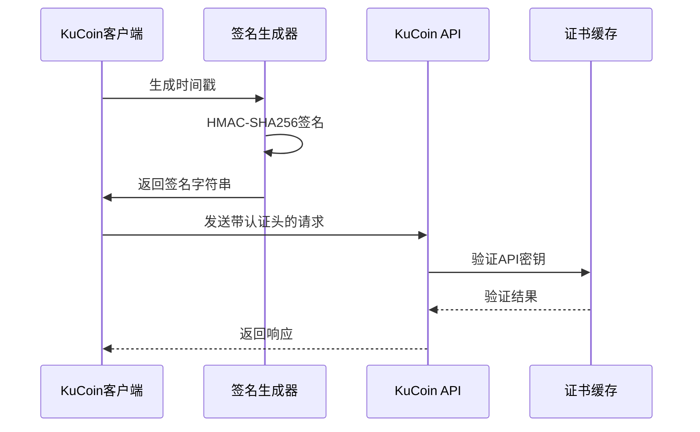
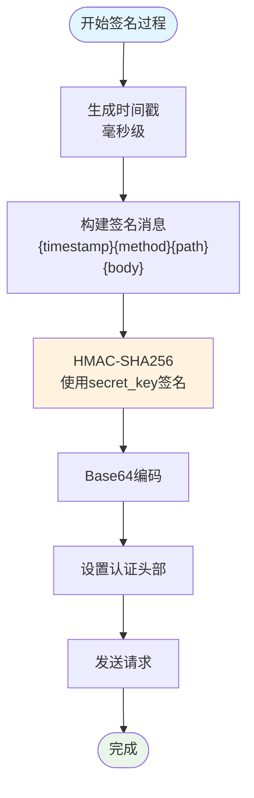
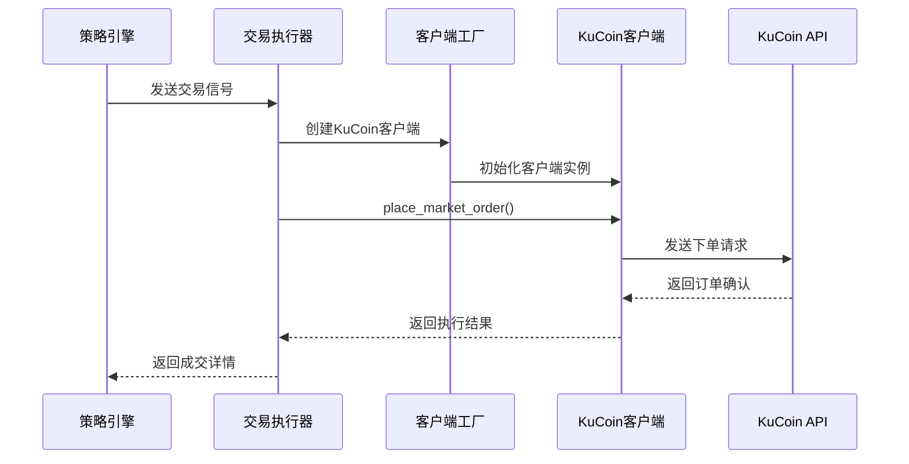
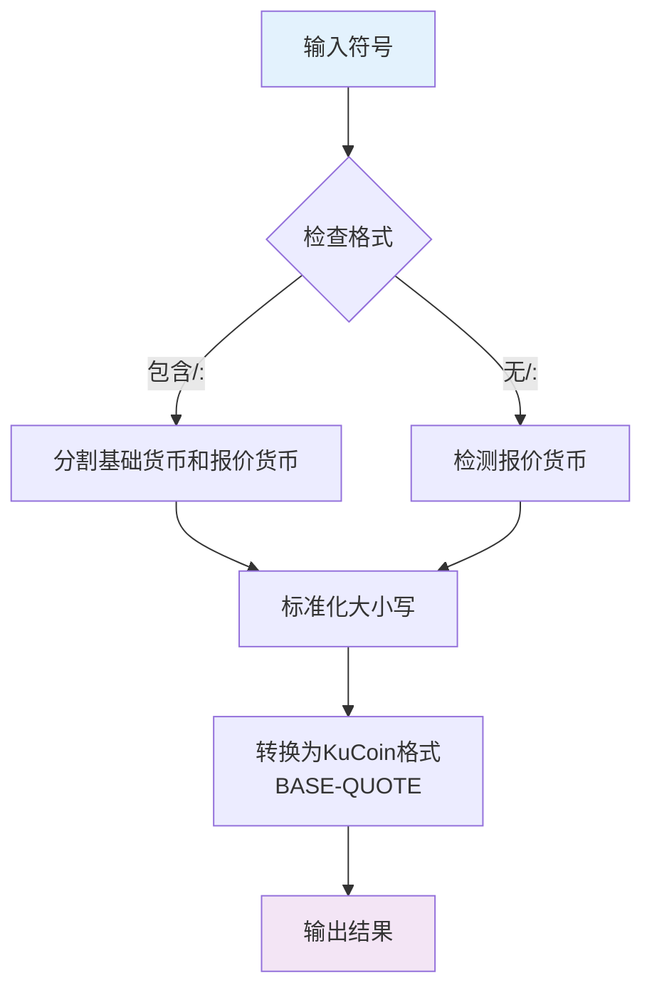
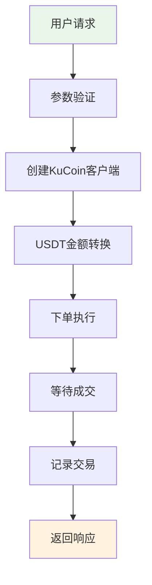
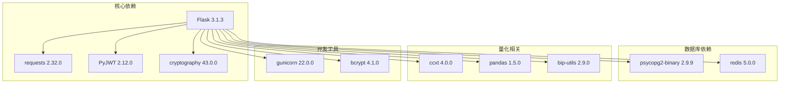
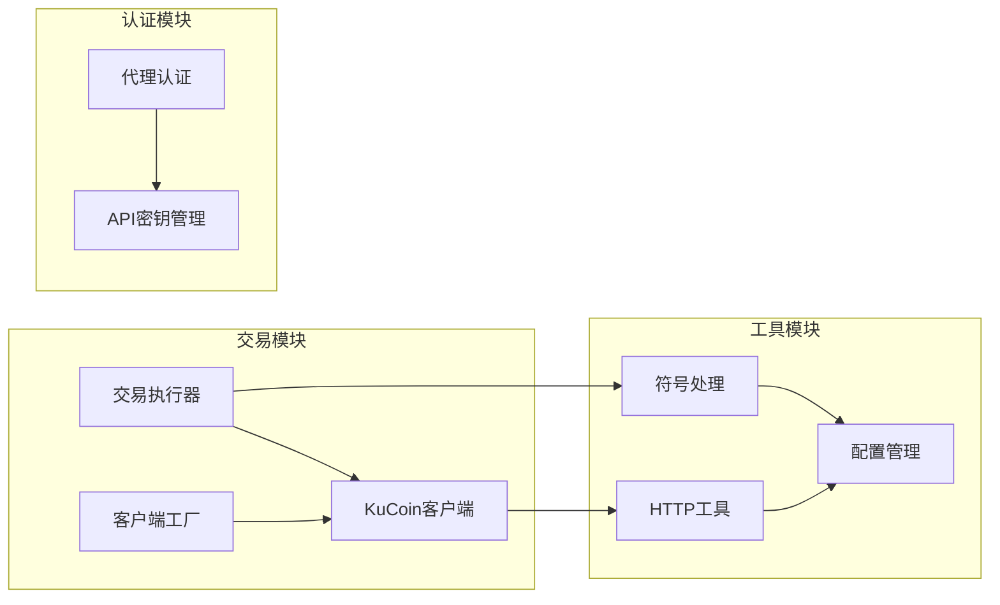
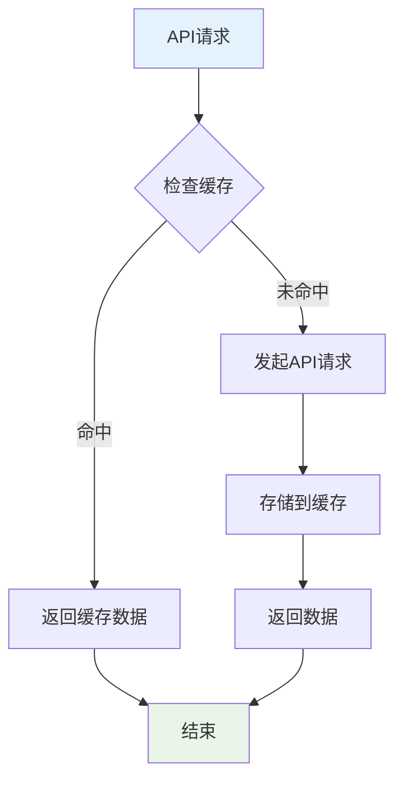

# KuCoin交易所集成

<cite>
**本文档引用的文件**
- [kucoin.py](file://backend_api_python/app/services/live_trading/kucoin.py)
- [symbols.py](file://backend_api_python/app/services/live_trading/symbols.py)
- [base.py](file://backend_api_python/app/services/live_trading/base.py)
- [execution.py](file://backend_api_python/app/services/live_trading/execution.py)
- [factory.py](file://backend_api_python/app/services/live_trading/factory.py)
- [quick_trade.py](file://backend_api_python/app/routes/quick_trade.py)
- [markets.py](file://backend_api_python/app/routes/agent_v1/markets.py)
- [agent_auth.py](file://backend_api_python/app/utils/agent_auth.py)
- [api_keys.py](file://backend_api_python/app/config/api_keys.py)
- [settings.py](file://backend_api_python/app/config/settings.py)
- [http.py](file://backend_api_python/app/utils/http.py)
- [README.md](file://backend_api_python/README.md)
- [requirements.txt](file://backend_api_python/requirements.txt)
</cite>

## 目录
1. [简介](#简介)
2. [项目结构](#项目结构)
3. [核心组件](#核心组件)
4. [架构概览](#架构概览)
5. [详细组件分析](#详细组件分析)
6. [依赖关系分析](#依赖关系分析)
7. [性能考虑](#性能考虑)
8. [故障排除指南](#故障排除指南)
9. [结论](#结论)

## 简介

QuantDinger是一个基于Python的量化交易平台，该项目集成了KuCoin交易所的直接API连接。本文档详细说明了KuCoin API的认证方式、WebSocket连接和HTTP请求处理机制，以及交易费用结构、市场做市商机制和流动性池功能。

该项目采用Flask框架构建后端服务，支持多用户认证和权限管理，提供了完整的量化交易解决方案。KuCoin集成包括现货交易和期货交易的完整支持，具备请求签名、响应解析、错误处理等核心功能。

## 项目结构

QuantDinger项目采用模块化架构设计，主要分为以下几个核心部分：

**图表来源**
- [README.md:15-33](file://backend_api_python/README.md#L15-L33)
- [kucoin.py:24-538](file://backend_api_python/app/services/live_trading/kucoin.py#L24-L538)

**章节来源**
- [README.md:15-33](file://backend_api_python/README.md#L15-L33)
- [requirements.txt:1-37](file://backend_api_python/requirements.txt#L1-L37)

## 核心组件

### KuCoin现货交易客户端

KuCoin现货交易客户端实现了完整的REST API接口，支持以下核心功能：

- **认证机制**: 使用KC-API-*头部进行API认证
- **请求签名**: 基于HMAC-SHA256的签名算法
- **订单管理**: 支持限价单和市价单
- **账户查询**: 账户余额和交易历史查询
- **市场数据**: 实时行情和深度数据获取

### KuCoin期货交易客户端

期货交易客户端专门处理USDT永续合约交易：

- **合约管理**: 合约信息查询和缓存
- **杠杆设置**: 杠杆倍数调整
- **仓位管理**: 持仓查询和管理
- **订单执行**: 期货专用订单类型支持

### 交易执行器

统一的交易执行接口，支持多种交易所的一致化操作：

- **信号到订单映射**: 将交易信号转换为具体订单
- **跨交易所兼容**: 统一不同交易所的API差异
- **错误处理**: 标准化的错误处理和重试机制

**章节来源**
- [kucoin.py:24-538](file://backend_api_python/app/services/live_trading/kucoin.py#L24-L538)
- [execution.py:123-311](file://backend_api_python/app/services/live_trading/execution.py#L123-L311)

## 架构概览

QuantDinger的KuCoin集成采用了分层架构设计，确保了系统的可扩展性和可维护性：

**图表来源**
- [factory.py:126-285](file://backend_api_python/app/services/live_trading/factory.py#L126-L285)
- [agent_auth.py:340-418](file://backend_api_python/app/utils/agent_auth.py#L340-L418)

## 详细组件分析

### KuCoin认证机制

KuCoin采用严格的API认证机制，确保交易安全性：

**图表来源**
- [kucoin.py:41-71](file://backend_api_python/app/services/live_trading/kucoin.py#L41-L71)
- [base.py:106-153](file://backend_api_python/app/services/live_trading/base.py#L106-L153)

认证流程包含以下关键步骤：

1. **时间戳生成**: 使用毫秒级时间戳确保请求时效性
2. **签名计算**: 对请求内容进行HMAC-SHA256哈希
3. **头部设置**: 设置KC-API-*认证头部
4. **请求发送**: 发送到KuCoin API服务器
5. **响应处理**: 解析API响应并处理错误

**章节来源**
- [kucoin.py:41-71](file://backend_api_python/app/services/live_trading/kucoin.py#L41-L71)
- [base.py:106-153](file://backend_api_python/app/services/live_trading/base.py#L106-L153)

### 请求签名算法

KuCoin使用基于HMAC-SHA256的签名算法，确保请求的完整性和真实性：

**图表来源**
- [kucoin.py:57-71](file://backend_api_python/app/services/live_trading/kucoin.py#L57-L71)

签名算法的关键要素：

- **预哈希内容**: 时间戳 + HTTP方法 + 请求路径 + 请求体
- **密钥使用**: 使用secret_key进行HMAC-SHA256签名
- **头部信息**: 包含API密钥、签名、时间戳和版本信息

**章节来源**
- [kucoin.py:57-71](file://backend_api_python/app/services/live_trading/kucoin.py#L57-L71)

### 交易执行流程

统一的交易执行器确保了跨交易所的一致性操作：

**图表来源**
- [execution.py:123-311](file://backend_api_python/app/services/live_trading/execution.py#L123-L311)
- [factory.py:227-234](file://backend_api_python/app/services/live_trading/factory.py#L227-L234)

执行流程的关键特性：

1. **信号标准化**: 将不同类型的交易信号转换为标准格式
2. **客户端抽象**: 通过工厂模式创建特定交易所客户端
3. **参数适配**: 自动适配不同交易所的参数要求
4. **结果统一**: 提供统一的执行结果格式

**章节来源**
- [execution.py:123-311](file://backend_api_python/app/services/live_trading/execution.py#L123-L311)
- [factory.py:227-234](file://backend_api_python/app/services/live_trading/factory.py#L227-L234)

### 交易对符号处理

KuCoin交易对符号转换系统确保了符号格式的一致性：

**图表来源**
- [symbols.py:113-121](file://backend_api_python/app/services/live_trading/symbols.py#L113-L121)

符号转换规则：

- **现货交易**: BTC/USDT → BTC-USDT
- **期货交易**: BTC/USDT → BTCUSDTM
- **大小写处理**: 自动转换为大写字母
- **格式验证**: 确保符号符合KuCoin要求

**章节来源**
- [symbols.py:113-121](file://backend_api_python/app/services/live_trading/symbols.py#L113-L121)

### 快速交易功能

快速交易API提供了便捷的手动交易入口：

**图表来源**
- [quick_trade.py:364-614](file://backend_api_python/app/routes/quick_trade.py#L364-L614)

快速交易的核心功能：

1. **自动金额转换**: 将USDT金额转换为基础资产数量
2. **杠杆设置**: 支持期货市场的杠杆倍数设置
3. **实时监控**: 跟踪订单执行状态
4. **错误提示**: 提供友好的错误信息

**章节来源**
- [quick_trade.py:364-614](file://backend_api_python/app/routes/quick_trade.py#L364-L614)

## 依赖关系分析

### 外部依赖

QuantDinger项目依赖以下关键库：

**图表来源**
- [requirements.txt:1-37](file://backend_api_python/requirements.txt#L1-L37)

### 内部模块依赖

**图表来源**
- [kucoin.py:24-538](file://backend_api_python/app/services/live_trading/kucoin.py#L24-L538)
- [agent_auth.py:340-418](file://backend_api_python/app/utils/agent_auth.py#L340-L418)

**章节来源**
- [requirements.txt:1-37](file://backend_api_python/requirements.txt#L1-L37)
- [kucoin.py:24-538](file://backend_api_python/app/services/live_trading/kucoin.py#L24-L538)

## 性能考虑

### 连接管理

项目采用了优化的连接管理策略：

- **HTTP会话复用**: 使用全局会话减少连接开销
- **重试机制**: 配置智能重试策略处理临时故障
- **超时设置**: 合理的超时配置避免资源泄露

### 缓存策略

**图表来源**
- [kucoin.py:305-330](file://backend_api_python/app/services/live_trading/kucoin.py#L305-L330)

### 错误处理

系统实现了多层次的错误处理机制：

- **网络错误**: 自动重试和降级处理
- **API错误**: 标准化错误响应和用户提示
- **认证错误**: 清晰的认证失败原因说明

## 故障排除指南

### 常见问题诊断

1. **认证失败**
   - 检查API密钥格式和有效期
   - 验证Passphrase设置
   - 确认时间同步

2. **请求超时**
   - 检查网络连接稳定性
   - 调整超时参数
   - 配置代理设置

3. **签名错误**
   - 验证签名算法实现
   - 检查时间戳精度
   - 确认请求体序列化

### 日志分析

系统提供了详细的日志记录机制：

- **请求日志**: 记录所有API请求的详细信息
- **错误日志**: 详细的错误堆栈和上下文信息
- **审计日志**: 所有关键操作的审计跟踪

**章节来源**
- [base.py:138-146](file://backend_api_python/app/services/live_trading/base.py#L138-L146)
- [quick_trade.py:578-614](file://backend_api_python/app/routes/quick_trade.py#L578-L614)

## 结论

QuantDinger的KuCoin集成提供了完整、安全、高效的交易所接入方案。通过标准化的API接口、严格的认证机制和完善的错误处理，确保了交易系统的稳定性和可靠性。

主要优势包括：

- **安全性**: 采用行业标准的API认证和签名机制
- **兼容性**: 支持现货和期货交易，覆盖主流交易场景
- **可扩展性**: 模块化设计便于添加新的交易所支持
- **易用性**: 提供统一的API接口和友好的错误提示

未来可以考虑的功能增强：

- WebSocket实时数据订阅
- 更精细的风险控制机制
- 多交易所套利策略支持
- 更丰富的技术分析工具