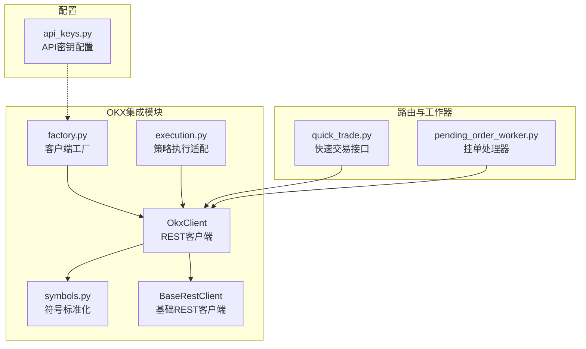
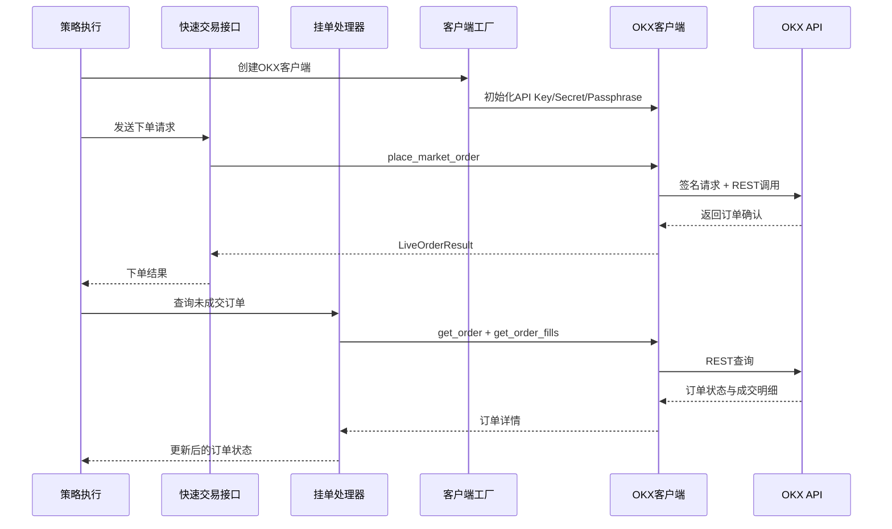
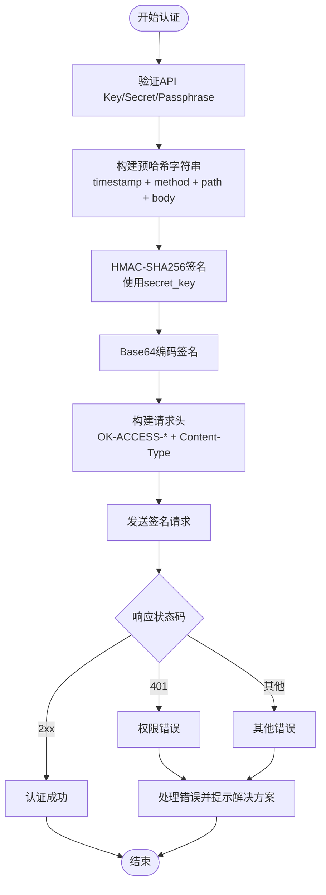
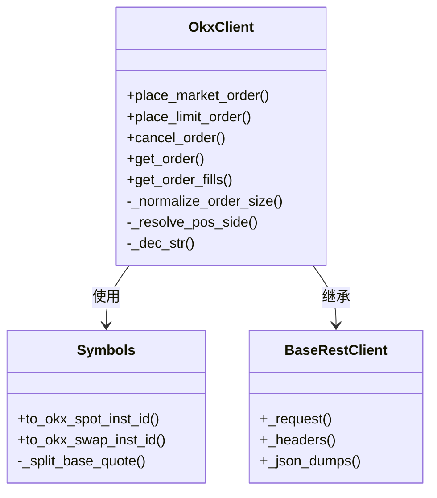
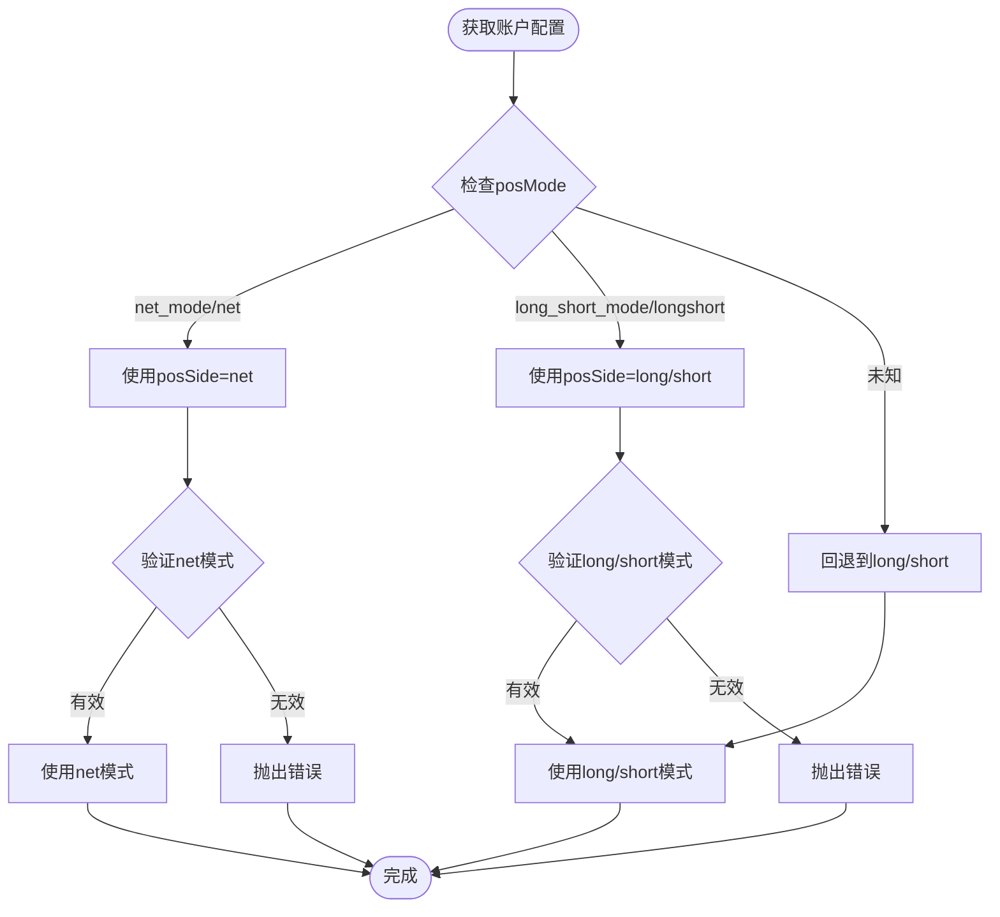
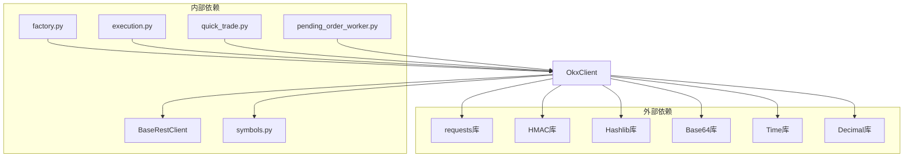

# OKX交易所集成

<cite>
**本文档引用的文件**
- [okx.py](file://backend_api_python/app/services/live_trading/okx.py)
- [symbols.py](file://backend_api_python/app/services/live_trading/symbols.py)
- [base.py](file://backend_api_python/app/services/live_trading/base.py)
- [factory.py](file://backend_api_python/app/services/live_trading/factory.py)
- [execution.py](file://backend_api_python/app/services/live_trading/execution.py)
- [quick_trade.py](file://backend_api_python/app/routes/quick_trade.py)
- [pending_order_worker.py](file://backend_api_python/app/services/pending_order_worker.py)
- [api_keys.py](file://backend_api_python/app/config/api_keys.py)
</cite>

## 目录
1. [简介](#简介)
2. [项目结构](#项目结构)
3. [核心组件](#核心组件)
4. [架构概览](#架构概览)
5. [详细组件分析](#详细组件分析)
6. [依赖关系分析](#依赖关系分析)
7. [性能考虑](#性能考虑)
8. [故障排除指南](#故障排除指南)
9. [结论](#结论)

## 简介

本文件为QuantDinger平台中OKX交易所集成的详细技术文档。文档深入解释了OKX API的认证流程、REST API调用规范以及与系统其他模块的集成方式。特别关注以下关键特性：

- OKX API认证流程与签名算法
- REST API调用规范与错误处理
- 符号标准化与不同市场类型的转换
- 杠杆设置、仓位模式解析与订单规范化
- 仓位查询、订单查询与成交明细获取
- 模拟交易支持与SSL证书验证配置
- 与策略执行引擎的集成点

## 项目结构

OKX集成位于后端Python服务的`live_trading`子系统中，采用模块化设计，便于与其他交易所客户端并行维护。

**图表来源**
- [okx.py:1-884](file://backend_api_python/app/services/live_trading/okx.py#L1-L884)
- [symbols.py:1-235](file://backend_api_python/app/services/live_trading/symbols.py#L1-L235)
- [factory.py:126-161](file://backend_api_python/app/services/live_trading/factory.py#L126-L161)
- [execution.py:123-173](file://backend_api_python/app/services/live_trading/execution.py#L123-L173)
- [quick_trade.py:470-515](file://backend_api_python/app/routes/quick_trade.py#L470-L515)
- [pending_order_worker.py:324-387](file://backend_api_python/app/services/pending_order_worker.py#L324-L387)

**章节来源**
- [okx.py:1-884](file://backend_api_python/app/services/live_trading/okx.py#L1-L884)
- [factory.py:126-161](file://backend_api_python/app/services/live_trading/factory.py#L126-L161)

## 核心组件

### OkxClient类

OkxClient是OKX直连REST客户端的核心实现，继承自BaseRestClient，提供了完整的OKX API交互能力。

主要特性：
- 完整的认证流程实现（API Key、签名、时间戳、Passphrase）
- 仪器元数据缓存与账户配置缓存
- 订单大小规范化与精度控制
- 仓位模式兼容性处理
- 模拟交易支持

**章节来源**
- [okx.py:25-82](file://backend_api_python/app/services/live_trading/okx.py#L25-L82)

### 符号标准化模块

symbols.py提供了跨交易所的符号标准化功能，特别是针对OKX的永续合约和现货交易对的ID转换。

关键功能：
- 将用户输入的符号转换为OKX标准格式
- 支持永续合约：BASE-QUOTE-SWAP
- 支持现货交易对：BASE-QUOTE

**章节来源**
- [symbols.py:50-62](file://backend_api_python/app/services/live_trading/symbols.py#L50-L62)

### 客户端工厂

factory.py中的create_client函数负责根据配置创建相应的交易所客户端实例，包括OKX客户端的初始化。

**章节来源**
- [factory.py:151-161](file://backend_api_python/app/services/live_trading/factory.py#L151-L161)

## 架构概览

OKX集成采用分层架构，从上到下分别为：策略执行层、路由接口层、工作器层、客户端工厂层、OKX REST客户端层。

**图表来源**
- [execution.py:123-173](file://backend_api_python/app/services/live_trading/execution.py#L123-L173)
- [quick_trade.py:500-515](file://backend_api_python/app/routes/quick_trade.py#L500-L515)
- [pending_order_worker.py:324-387](file://backend_api_python/app/services/pending_order_worker.py#L324-L387)
- [okx.py:570-736](file://backend_api_python/app/services/live_trading/okx.py#L570-L736)

## 详细组件分析

### 认证流程与签名算法

OKX认证采用HMAC-SHA256签名，要求严格的请求头格式和时间同步。

**图表来源**
- [okx.py:291-306](file://backend_api_python/app/services/live_trading/okx.py#L291-L306)
- [okx.py:356-403](file://backend_api_python/app/services/live_trading/okx.py#L356-L403)

认证流程的关键要点：
- 时间戳必须为RFC3339格式（含毫秒）
- 请求路径必须包含查询字符串（GET请求）
- 所有请求头必须为ASCII字符
- 支持模拟交易模式（x-simulated-trading头）

**章节来源**
- [okx.py:284-306](file://backend_api_python/app/services/live_trading/okx.py#L284-L306)
- [okx.py:308-403](file://backend_api_python/app/services/live_trading/okx.py#L308-L403)

### REST API调用规范

OKX客户端实现了多个核心REST端点的调用：

#### 公共端点
- `/api/v5/public/instruments` - 仪器元数据查询
- `/api/v5/public/time` - 服务器时间同步

#### 私有端点
- `/api/v5/account/balance` - 账户余额查询
- `/api/v5/account/config` - 账户配置查询
- `/api/v5/account/positions` - 仓位查询
- `/api/v5/account/trade-fee` - 交易费率查询
- `/api/v5/account/set-leverage` - 杠杆设置

#### 交易端点
- `/api/v5/trade/order` - 订单提交
- `/api/v5/trade/cancel-order` - 订单取消
- `/api/v5/trade/order` - 订单查询
- `/api/v5/trade/fills` - 成交明细查询

**章节来源**
- [okx.py:198-442](file://backend_api_python/app/services/live_trading/okx.py#L198-L442)
- [okx.py:444-736](file://backend_api_python/app/services/live_trading/okx.py#L444-L736)

### 订单规范化与符号转换

系统实现了跨交易所的订单规范化，确保不同交易所的符号格式统一。

**图表来源**
- [okx.py:570-736](file://backend_api_python/app/services/live_trading/okx.py#L570-L736)
- [symbols.py:50-62](file://backend_api_python/app/services/live_trading/symbols.py#L50-L62)
- [base.py:95-167](file://backend_api_python/app/services/live_trading/base.py#L95-L167)

订单规范化的关键流程：
1. 符号标准化：将输入符号转换为OKX标准格式
2. 价格/数量精度控制：根据仪器步进精确到小数位
3. 仓位方向解析：根据账户配置解析posSide
4. 参数映射：将通用参数映射到OKX特定字段

**章节来源**
- [okx.py:223-282](file://backend_api_python/app/services/live_trading/okx.py#L223-L282)
- [okx.py:539-568](file://backend_api_python/app/services/live_trading/okx.py#L539-L568)

### 仓位模式兼容性

OKX支持两种仓位模式：net_mode（净头寸）和long_short_mode（多空分离）。系统自动检测并适配不同的模式。

**图表来源**
- [okx.py:516-568](file://backend_api_python/app/services/live_trading/okx.py#L516-L568)

**章节来源**
- [okx.py:516-568](file://backend_api_python/app/services/live_trading/okx.py#L516-L568)

### 模拟交易支持

系统支持OKX模拟交易模式，通过在请求头中添加x-simulated-trading来启用。

**章节来源**
- [okx.py:304-306](file://backend_api_python/app/services/live_trading/okx.py#L304-L306)
- [factory.py:159-160](file://backend_api_python/app/services/live_trading/factory.py#L159-L160)

### 错误处理与重试机制

OKX客户端实现了完善的错误处理机制，包括：

- HTTP状态码检查
- OKX特定错误码解析
- 权限错误的友好提示
- 交易错误的分类处理

**章节来源**
- [okx.py:356-403](file://backend_api_python/app/services/live_trading/okx.py#L356-L403)

## 依赖关系分析

OKX集成模块之间的依赖关系如下：

**图表来源**
- [okx.py:10-19](file://backend_api_python/app/services/live_trading/okx.py#L10-L19)
- [base.py:18](file://backend_api_python/app/services/live_trading/base.py#L18)

**章节来源**
- [okx.py:10-19](file://backend_api_python/app/services/live_trading/okx.py#L10-L19)
- [base.py:18](file://backend_api_python/app/services/live_trading/base.py#L18)

## 性能考虑

OKX集成在性能方面采用了多项优化措施：

### 缓存策略
- 仪器元数据缓存：默认5分钟有效期
- 账户配置缓存：默认30秒有效期
- 杠杆设置缓存：默认60秒有效期

### 精度控制
- 使用Decimal进行高精度计算
- 自动推导订单精度（基于lotSz）
- 防止科学计数法输出

### 并发处理
- 异常安全的请求头验证
- SSL证书验证的灵活配置
- 超时控制和重试机制

**章节来源**
- [okx.py:68-82](file://backend_api_python/app/services/live_trading/okx.py#L68-L82)
- [okx.py:84-164](file://backend_api_python/app/services/live_trading/okx.py#L84-L164)

## 故障排除指南

### 常见问题及解决方案

#### 认证失败
**症状**：HTTP 401错误，提示API Key无效
**原因**：API Key/Secret/Passphrase配置错误或包含非ASCII字符
**解决**：
1. 确认API密钥来自OKX网站的ASCII字符
2. 检查API密钥权限是否包含"Trade"
3. 验证时间同步是否正常

#### 权限错误
**症状**：错误码50120，提示权限不足
**解决**：
1. 在OKX网站启用"Trade"权限
2. 检查API密钥的IP白名单设置
3. 验证Passphrase正确性

#### 杠杆设置失败
**症状**：设置杠杆时报错
**解决**：
1. 确认账户有足够的保证金
2. 检查posSide与账户模式匹配
3. 验证杠杆倍数在允许范围内

#### 订单大小无效
**症状**：订单被拒绝，提示小于最小订单量
**解决**：
1. 检查仪器的lotSz和minSz
2. 确认订单量已按精度规范化
3. 对于永续合约，注意ctVal转换

**章节来源**
- [okx.py:356-403](file://backend_api_python/app/services/live_trading/okx.py#L356-L403)
- [okx.py:565-568](file://backend_api_python/app/services/live_trading/okx.py#L565-L568)

### 调试建议

1. **启用详细日志**：检查请求和响应的完整内容
2. **验证网络连接**：确保能够访问OKX API域名
3. **测试时间同步**：确认系统时间与OKX时间一致
4. **检查SSL配置**：验证证书链完整性

## 结论

OKX交易所集成为QuantDinger平台提供了完整的加密货币交易能力，具有以下特点：

1. **完整的API覆盖**：实现了OKX主要REST端点的功能
2. **严格的安全性**：完整的认证流程和错误处理
3. **良好的扩展性**：模块化设计便于维护和扩展
4. **完善的错误处理**：友好的错误提示和恢复机制
5. **性能优化**：多级缓存和精度控制

该集成支持多种市场类型（现货、永续合约），并提供了灵活的配置选项，能够满足不同用户的需求。通过与其他模块的紧密集成，形成了完整的量化交易生态系统。