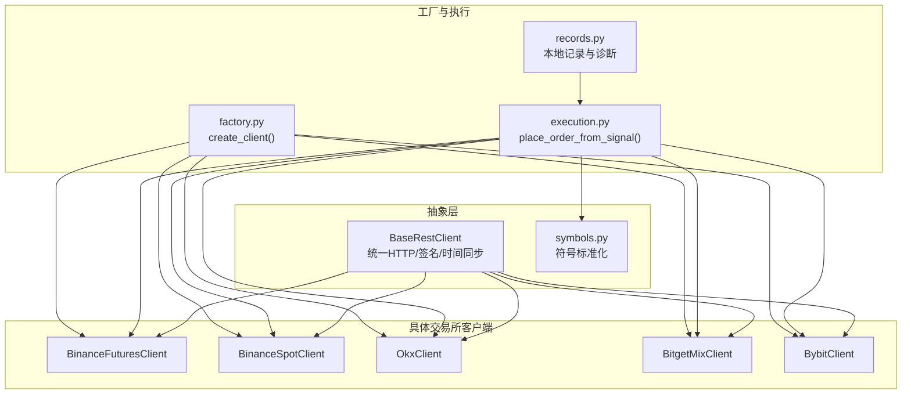
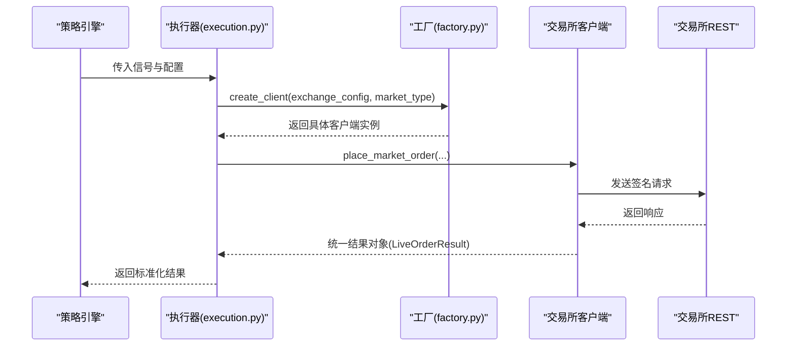
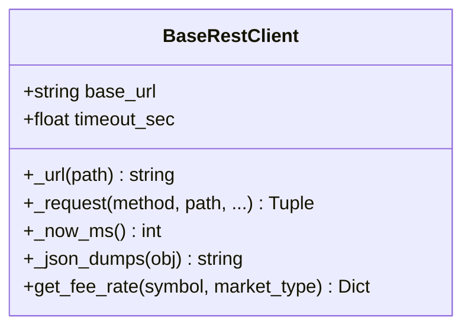
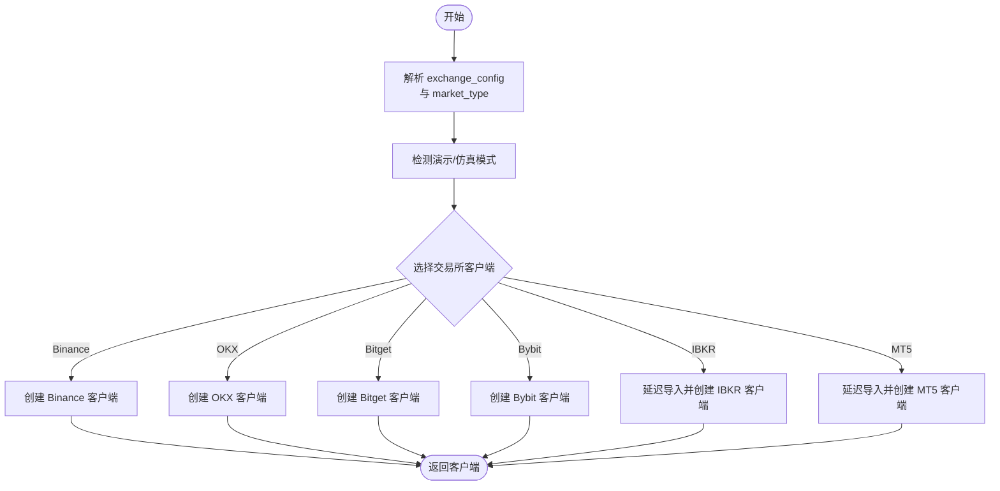
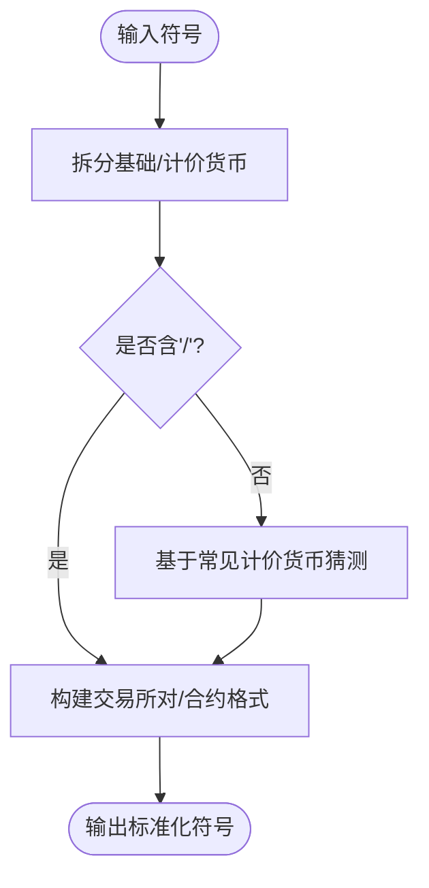
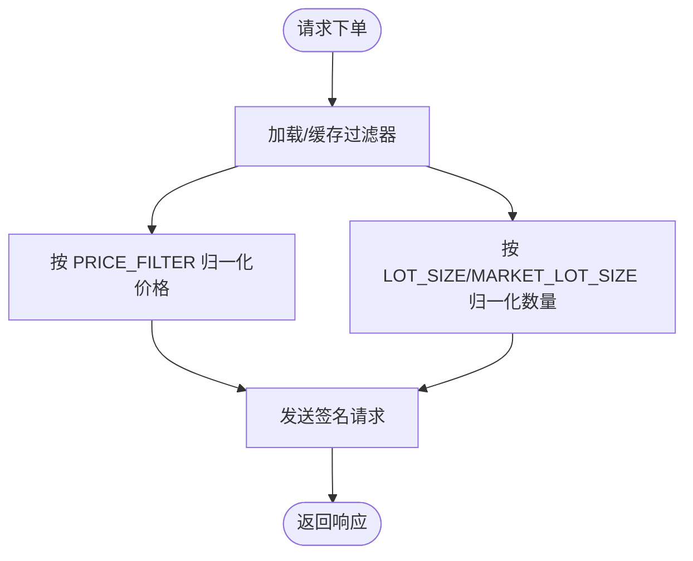
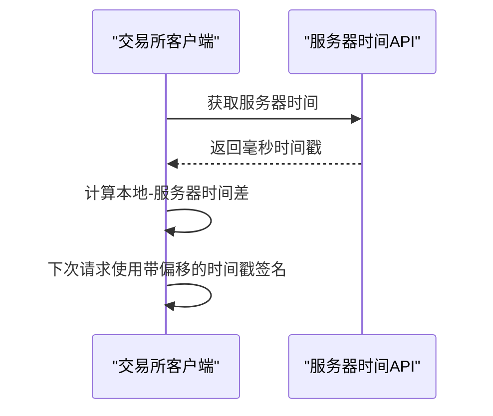
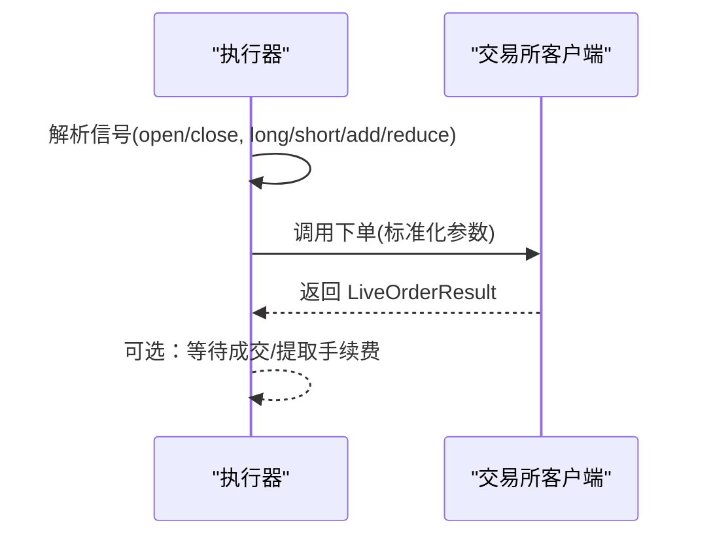
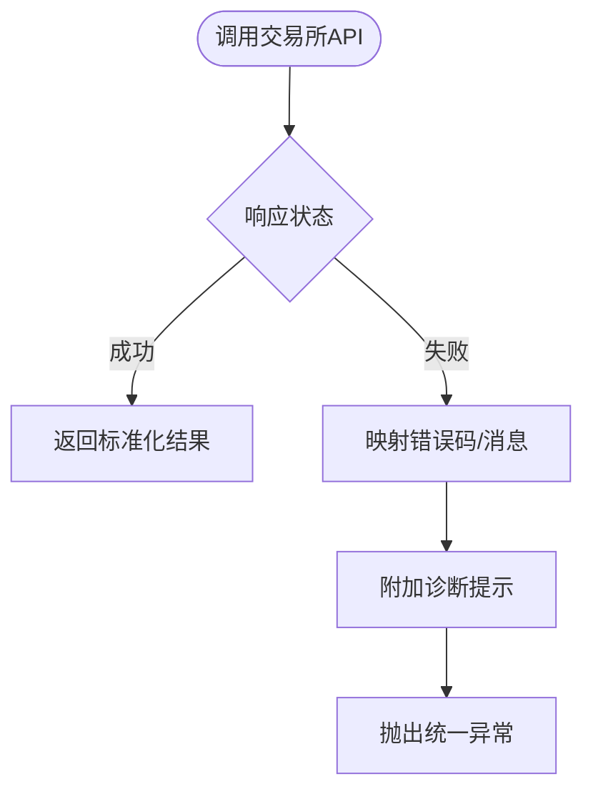
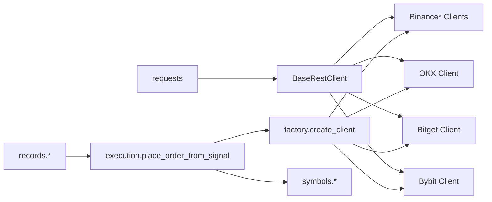

# 交易所抽象层设计

<cite>
**本文档引用的文件**
- [base.py](file://backend_api_python/app/services/live_trading/base.py)
- [factory.py](file://backend_api_python/app/services/live_trading/factory.py)
- [execution.py](file://backend_api_python/app/services/live_trading/execution.py)
- [symbols.py](file://backend_api_python/app/services/live_trading/symbols.py)
- [binance.py](file://backend_api_python/app/services/live_trading/binance.py)
- [binance_spot.py](file://backend_api_python/app/services/live_trading/binance_spot.py)
- [okx.py](file://backend_api_python/app/services/live_trading/okx.py)
- [bitget.py](file://backend_api_python/app/services/live_trading/bitget.py)
- [bybit.py](file://backend_api_python/app/services/live_trading/bybit.py)
- [records.py](file://backend_api_python/app/services/live_trading/records.py)
</cite>

## 目录
1. [简介](#简介)
2. [项目结构](#项目结构)
3. [核心组件](#核心组件)
4. [架构总览](#架构总览)
5. [详细组件分析](#详细组件分析)
6. [依赖关系分析](#依赖关系分析)
7. [性能考虑](#性能考虑)
8. [故障排查指南](#故障排查指南)
9. [结论](#结论)

## 简介
本文件系统化阐述量化平台中的“交易所抽象层”设计，覆盖统一交易接口、抽象基类、工厂模式与动态加载、交易对标准化、价格与数量精度统一、时间戳同步、订单格式标准化、执行报告统一、错误码映射、交易所切换与配置管理、运行时诊断以及跨交易所一致性与性能优化策略。目标是帮助开发者在不改变上层策略逻辑的前提下，透明地接入多家主流交易所。

## 项目结构
交易所抽象层位于后端服务的“实盘交易”子模块中，采用“抽象基类 + 具体交易所客户端 + 工厂 + 执行器”的分层设计：

- 抽象基类与通用工具：提供统一的HTTP请求封装、签名与时间同步、错误处理等基础设施
- 具体交易所客户端：针对各交易所的REST API进行适配，实现下单、查询、手续费等差异化逻辑
- 工厂：根据配置动态创建对应交易所客户端，支持多市场类型（现货/永续）
- 执行器：将策略信号转换为具体交易所的下单调用，并统一返回格式
- 符号标准化：将不同来源的交易对符号转换为交易所期望格式
- 记录与诊断：本地数据库记录成交与持仓快照，辅助运行时诊断

**图表来源**
- [base.py:95-167](file://backend_api_python/app/services/live_trading/base.py#L95-L167)
- [factory.py:126-285](file://backend_api_python/app/services/live_trading/factory.py#L126-L285)
- [execution.py:123-310](file://backend_api_python/app/services/live_trading/execution.py#L123-L310)
- [symbols.py:16-234](file://backend_api_python/app/services/live_trading/symbols.py#L16-L234)
- [records.py:85-280](file://backend_api_python/app/services/live_trading/records.py#L85-L280)

**章节来源**
- [base.py:1-168](file://backend_api_python/app/services/live_trading/base.py#L1-L168)
- [factory.py:1-441](file://backend_api_python/app/services/live_trading/factory.py#L1-L441)
- [execution.py:1-426](file://backend_api_python/app/services/live_trading/execution.py#L1-L426)
- [symbols.py:1-235](file://backend_api_python/app/services/live_trading/symbols.py#L1-L235)
- [records.py:1-280](file://backend_api_python/app/services/live_trading/records.py#L1-L280)

## 核心组件
- 抽象基类 BaseRestClient：提供统一的HTTP请求、签名、时间同步、错误包装与JSON序列化能力
- 交易所客户端：继承自基类，实现各自签名算法、精度归一化、错误映射与API细节
- 工厂函数 create_client：根据 exchange_id 与 market_type 动态创建对应客户端
- 执行器 place_order_from_signal：将策略信号标准化为具体交易所下单参数
- 符号标准化模块：将输入符号转换为各交易所期望格式
- 本地记录与诊断：记录成交与持仓快照，支持运行时诊断

**章节来源**
- [base.py:95-167](file://backend_api_python/app/services/live_trading/base.py#L95-L167)
- [factory.py:126-285](file://backend_api_python/app/services/live_trading/factory.py#L126-L285)
- [execution.py:123-310](file://backend_api_python/app/services/live_trading/execution.py#L123-L310)
- [symbols.py:16-234](file://backend_api_python/app/services/live_trading/symbols.py#L16-L234)
- [records.py:85-280](file://backend_api_python/app/services/live_trading/records.py#L85-L280)

## 架构总览
抽象层通过“工厂 + 执行器 + 客户端”的组合，实现以下目标：
- 统一接口：上层仅需传入 exchange_config 与信号，即可在多交易所间无缝切换
- 数据标准化：符号、价格/数量精度、时间戳、手续费率等均在客户端内部处理
- 错误映射：将各交易所错误码映射为统一异常或日志提示
- 运行时诊断：通过本地记录与日志，追踪成交与持仓状态

**图表来源**
- [execution.py:123-310](file://backend_api_python/app/services/live_trading/execution.py#L123-L310)
- [factory.py:126-285](file://backend_api_python/app/services/live_trading/factory.py#L126-L285)
- [base.py:106-153](file://backend_api_python/app/services/live_trading/base.py#L106-L153)

## 详细组件分析

### 抽象基类 BaseRestClient
- 统一HTTP请求：封装 requests 调用，支持超时、SSL验证策略与文本回退解析
- 时间同步：为需要严格时间戳的交易所提供服务器时间偏移计算
- 签名与头信息：为各交易所提供可扩展的签名与请求头生成
- 错误处理：将底层异常包装为统一的 LiveTradingError，便于上层捕获与降级

**图表来源**
- [base.py:95-167](file://backend_api_python/app/services/live_trading/base.py#L95-L167)

**章节来源**
- [base.py:95-167](file://backend_api_python/app/services/live_trading/base.py#L95-L167)

### 工厂模式与动态加载
- 支持多交易所与多市场类型：通过 exchange_id 与 market_type 决定创建哪个客户端
- 演示/仿真模式检测：统一识别测试网/仿真开关，自动选择测试网URL
- 延迟导入：对非必需依赖（如 IBKR、MT5）采用延迟导入，避免无用安装阻塞
- 统一错误语义：对不支持的交易所抛出统一异常，便于前端提示

**图表来源**
- [factory.py:126-285](file://backend_api_python/app/services/live_trading/factory.py#L126-L285)

**章节来源**
- [factory.py:126-285](file://backend_api_python/app/services/live_trading/factory.py#L126-L285)

### 交易对标准化与符号映射
- 输入符号可能来自UI或策略配置，格式多样（如 BTCUSDT、BTC/USDT:USDT）
- 提供 to_*_symbol 系列函数，将输入标准化为交易所期望格式
- 对于永续/期货，提供 instrumentId 或合约代码的映射规则

**图表来源**
- [symbols.py:16-234](file://backend_api_python/app/services/live_trading/symbols.py#L16-L234)

**章节来源**
- [symbols.py:16-234](file://backend_api_python/app/services/live_trading/symbols.py#L16-L234)

### 价格与数量精度统一
- 各交易所对价格/数量精度有严格限制（tickSize、stepSize、最小挂单量等）
- 客户端内部缓存公共元数据（如过滤器），并提供精度归一化方法
- 使用 Decimal 控制精度，避免浮点误差导致的拒绝

**图表来源**
- [binance.py:264-426](file://backend_api_python/app/services/live_trading/binance.py#L264-L426)
- [binance_spot.py:268-430](file://backend_api_python/app/services/live_trading/binance_spot.py#L268-L430)
- [okx.py:223-282](file://backend_api_python/app/services/live_trading/okx.py#L223-L282)
- [bitget.py:464-527](file://backend_api_python/app/services/live_trading/bitget.py#L464-L527)
- [bybit.py:441-476](file://backend_api_python/app/services/live_trading/bybit.py#L441-L476)

**章节来源**
- [binance.py:264-426](file://backend_api_python/app/services/live_trading/binance.py#L264-L426)
- [binance_spot.py:268-430](file://backend_api_python/app/services/live_trading/binance_spot.py#L268-L430)
- [okx.py:223-282](file://backend_api_python/app/services/live_trading/okx.py#L223-L282)
- [bitget.py:464-527](file://backend_api_python/app/services/live_trading/bitget.py#L464-L527)
- [bybit.py:441-476](file://backend_api_python/app/services/live_trading/bybit.py#L441-L476)

### 时间戳规范化与签名
- 对需要严格时间戳的交易所（如 Binance、OKX、Bybit），在签名前同步服务器时间
- 通过时间偏移修正，避免因本地时钟偏差导致的签名失败
- 统一签名流程：构造预哈希字符串 → HMAC → 添加到请求头/路径

**图表来源**
- [binance.py:173-191](file://backend_api_python/app/services/live_trading/binance.py#L173-L191)
- [okx.py:284-289](file://backend_api_python/app/services/live_trading/okx.py#L284-L289)
- [bybit.py:202-215](file://backend_api_python/app/services/live_trading/bybit.py#L202-L215)

**章节来源**
- [binance.py:173-191](file://backend_api_python/app/services/live_trading/binance.py#L173-L191)
- [okx.py:284-289](file://backend_api_python/app/services/live_trading/okx.py#L284-L289)
- [bybit.py:202-215](file://backend_api_python/app/services/live_trading/bybit.py#L202-L215)

### 订单格式标准化与执行报告统一
- 执行器将策略信号映射为交易所侧的 side/pos_side/reduceOnly 等字段
- 统一返回 LiveOrderResult，包含 exchange_id、exchange_order_id、filled、avg_price、raw 等
- 不同交易所的下单参数差异由客户端内部处理，上层无需感知

**图表来源**
- [execution.py:123-310](file://backend_api_python/app/services/live_trading/execution.py#L123-L310)

**章节来源**
- [execution.py:123-310](file://backend_api_python/app/services/live_trading/execution.py#L123-L310)

### 错误码映射与运行时诊断
- 统一异常：将各交易所错误映射为 LiveTradingError，附带上下文信息
- 常见问题提示：如 Binance -2015、Bybit 10002 等，提供针对性建议
- 本地记录：记录成交与持仓快照，便于回溯与诊断

**图表来源**
- [binance_spot.py:200-216](file://backend_api_python/app/services/live_trading/binance_spot.py#L200-L216)
- [bybit.py:280-297](file://backend_api_python/app/services/live_trading/bybit.py#L280-L297)
- [records.py:85-280](file://backend_api_python/app/services/live_trading/records.py#L85-L280)

**章节来源**
- [binance_spot.py:200-216](file://backend_api_python/app/services/live_trading/binance_spot.py#L200-L216)
- [bybit.py:280-297](file://backend_api_python/app/services/live_trading/bybit.py#L280-L297)
- [records.py:85-280](file://backend_api_python/app/services/live_trading/records.py#L85-L280)

### 交易所切换、配置管理与运行时诊断
- 通过 exchange_config 与 market_type 实现动态切换
- 支持测试网/仿真模式、代理/证书配置、BrokerID/渠道号等扩展参数
- 本地数据库记录成交与持仓，支持模糊匹配与符号归一化，便于UI展示与策略状态维护

**章节来源**
- [factory.py:76-119](file://backend_api_python/app/services/live_trading/factory.py#L76-L119)
- [records.py:17-72](file://backend_api_python/app/services/live_trading/records.py#L17-L72)

## 依赖关系分析
- 抽象层依赖 requests 与标准库，保持轻量
- 具体客户端依赖抽象层，复用签名、时间同步与错误处理
- 工厂集中管理客户端创建与延迟导入，降低耦合
- 执行器依赖工厂与符号模块，屏蔽交易所差异
- 本地记录模块依赖数据库连接工具

**图表来源**
- [base.py:18-20](file://backend_api_python/app/services/live_trading/base.py#L18-L20)
- [factory.py:18-39](file://backend_api_python/app/services/live_trading/factory.py#L18-L39)
- [execution.py:14-38](file://backend_api_python/app/services/live_trading/execution.py#L14-L38)
- [records.py:14-14](file://backend_api_python/app/services/live_trading/records.py#L14-L14)

**章节来源**
- [base.py:18-20](file://backend_api_python/app/services/live_trading/base.py#L18-L20)
- [factory.py:18-39](file://backend_api_python/app/services/live_trading/factory.py#L18-L39)
- [execution.py:14-38](file://backend_api_python/app/services/live_trading/execution.py#L14-L38)
- [records.py:14-14](file://backend_api_python/app/services/live_trading/records.py#L14-L14)

## 性能考虑
- 缓存策略：对公共元数据（过滤器、合约信息、账户配置）设置TTL缓存，减少重复请求
- 精度归一化：在客户端内完成，避免上层反复计算
- 请求合并与批处理：在满足API约束前提下，尽量减少网络往返
- 超时与重试：合理设置超时与重试策略，避免阻塞主线程
- 日志与监控：统一错误与警告日志，便于定位性能瓶颈

[本节为通用指导，无需特定文件引用]

## 故障排查指南
- SSL/TLS证书问题：检查 LIVE_TRADING_SSL_VERIFY、LIVE_TRADING_CA_BUNDLE 等环境变量
- API权限不足：检查各交易所API Key权限（如OKX的Trade权限）
- 时间戳偏差：确认本地时间与交易所时间同步，必要时启用演示/仿真模式
- 符号格式错误：确保输入符号经标准化模块转换
- 本地记录异常：检查数据库连接与表结构，关注符号归一化与模糊匹配逻辑

**章节来源**
- [base.py:34-79](file://backend_api_python/app/services/live_trading/base.py#L34-L79)
- [okx.py:356-401](file://backend_api_python/app/services/live_trading/okx.py#L356-L401)
- [records.py:17-72](file://backend_api_python/app/services/live_trading/records.py#L17-L72)

## 结论
该抽象层通过“抽象基类 + 工厂 + 执行器 + 符号标准化 + 本地记录”的组合，实现了跨交易所的一致性与可扩展性。其核心价值在于：
- 上层策略无需关心交易所差异，仅需提供标准化配置与信号
- 客户端内部完成精度、时间、签名与错误映射，保证下单可靠性
- 通过缓存与标准化手段提升性能与稳定性
- 提供统一的错误与诊断机制，便于运维与排障