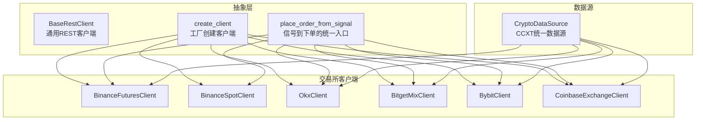
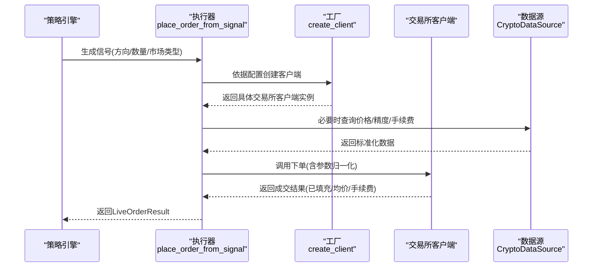
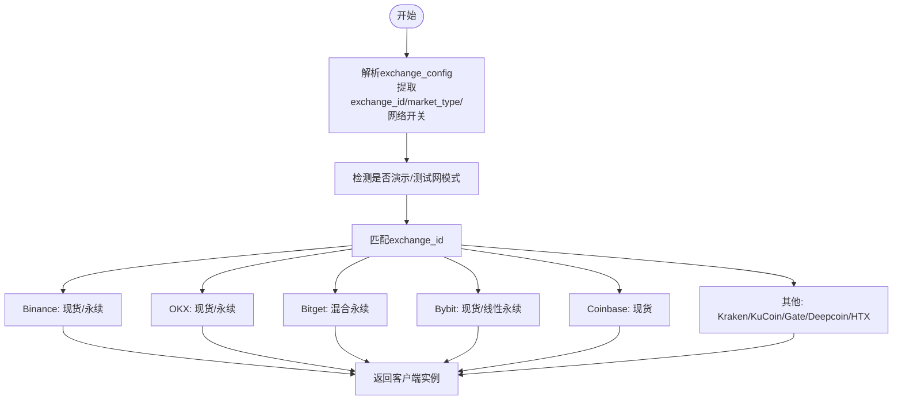
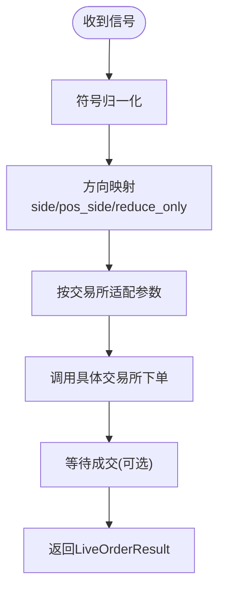
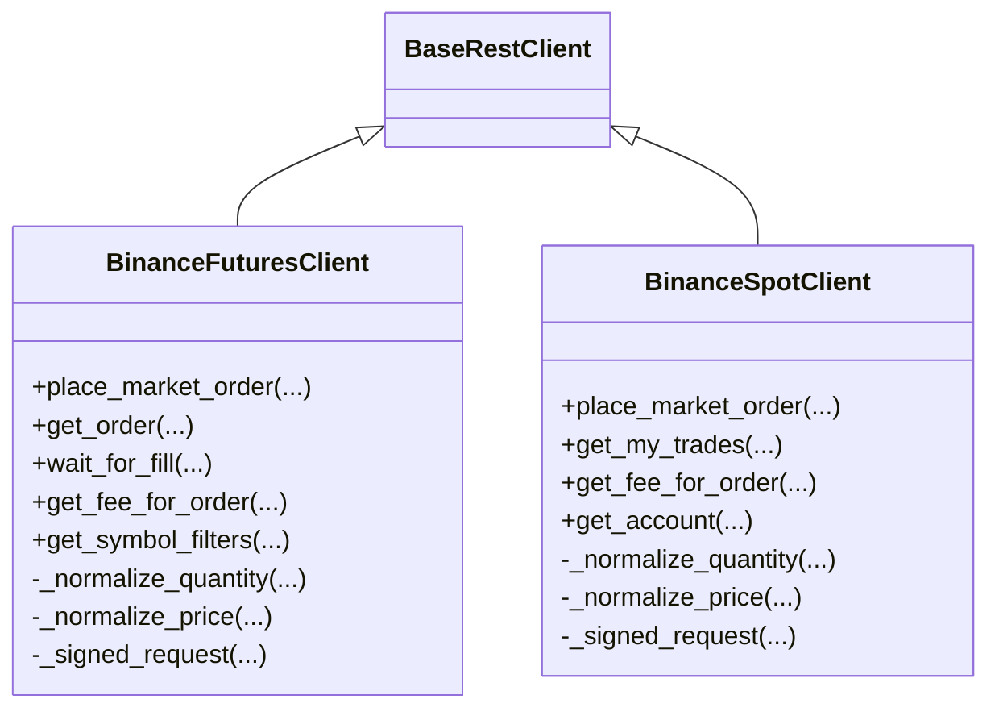
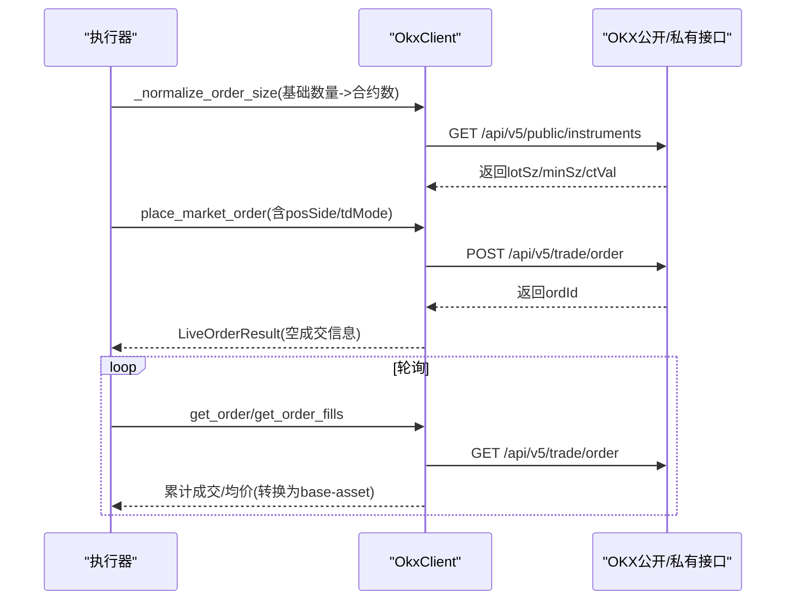
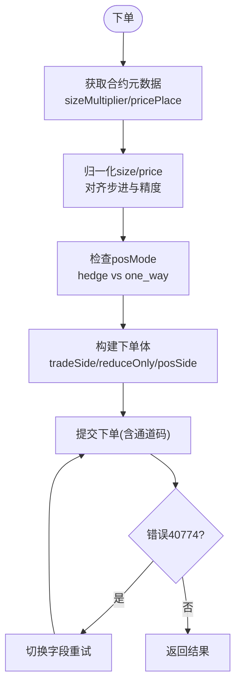
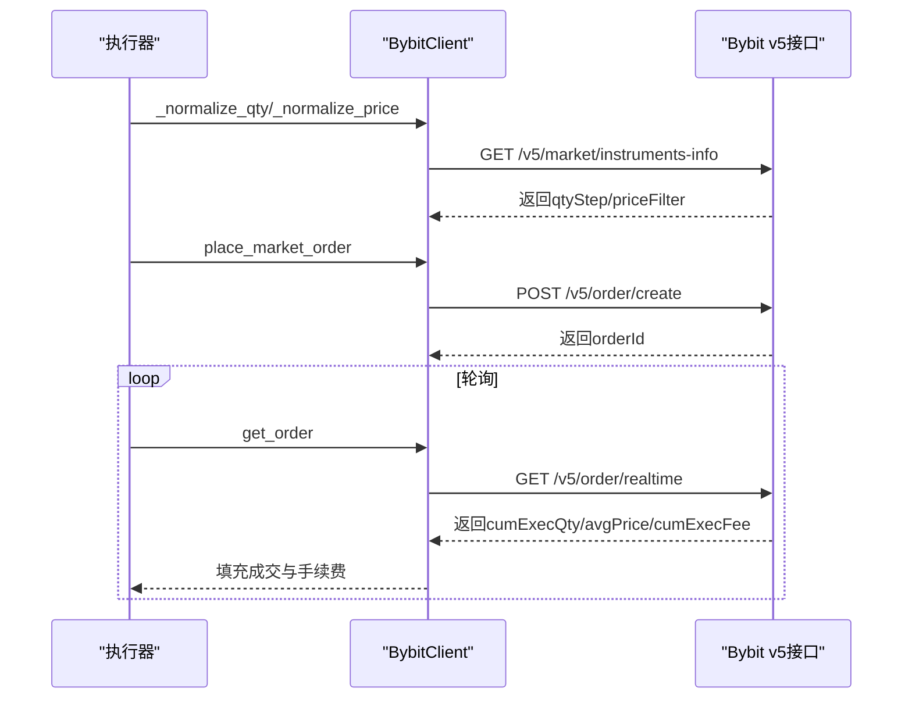
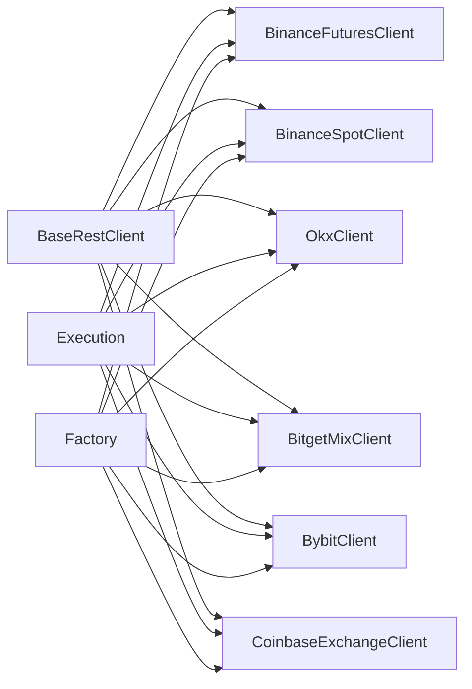

# 多交易所支持

<cite>
**本文引用的文件**
- [factory.py](file://backend_api_python/app/services/live_trading/factory.py)
- [base.py](file://backend_api_python/app/services/live_trading/base.py)
- [execution.py](file://backend_api_python/app/services/live_trading/execution.py)
- [binance.py](file://backend_api_python/app/services/live_trading/binance.py)
- [binance_spot.py](file://backend_api_python/app/services/live_trading/binance_spot.py)
- [okx.py](file://backend_api_python/app/services/live_trading/okx.py)
- [bitget.py](file://backend_api_python/app/services/live_trading/bitget.py)
- [bybit.py](file://backend_api_python/app/services/live_trading/bybit.py)
- [coinbase_exchange.py](file://backend_api_python/app/services/live_trading/coinbase_exchange.py)
- [crypto.py](file://backend_api_python/app/data_sources/crypto.py)
</cite>

## 目录
1. [简介](#简介)
2. [项目结构](#项目结构)
3. [核心组件](#核心组件)
4. [架构总览](#架构总览)
5. [详细组件分析](#详细组件分析)
6. [依赖关系分析](#依赖关系分析)
7. [性能考虑](#性能考虑)
8. [故障排查指南](#故障排查指南)
9. [结论](#结论)
10. [附录](#附录)

## 简介
本技术文档围绕 QuantDinger 的多交易所支持能力，系统阐述各主流加密交易所的 API 适配、认证机制、数据流处理与一致性抽象层设计。内容覆盖：
- 交易所特定的订单格式、手续费结构与最小交易单位处理
- 跨交易所的一致性抽象层与标准化接口实现
- 连接配置、心跳检测与断线重连策略
- 交易对映射、价格精度与时间戳处理细节
- 流动性管理、滑点优化与套利机会识别的实现方案

## 项目结构
QuantDinger 的多交易所支持主要集中在后端 Python 服务的 live_trading 子模块，通过工厂模式统一创建各交易所客户端，执行器模块将策略信号转换为具体交易所的下单调用，基础模块提供通用的 REST 客户端与错误处理。

**图表来源**
- [factory.py:126-285](file://backend_api_python/app/services/live_trading/factory.py#L126-L285)
- [execution.py:123-310](file://backend_api_python/app/services/live_trading/execution.py#L123-L310)
- [base.py:95-167](file://backend_api_python/app/services/live_trading/base.py#L95-L167)
- [binance.py:24-80](file://backend_api_python/app/services/live_trading/binance.py#L24-L80)
- [binance_spot.py:21-40](file://backend_api_python/app/services/live_trading/binance_spot.py#L21-L40)
- [okx.py:25-82](file://backend_api_python/app/services/live_trading/okx.py#L25-L82)
- [bitget.py:26-71](file://backend_api_python/app/services/live_trading/bitget.py#L26-L71)
- [bybit.py:27-61](file://backend_api_python/app/services/live_trading/bybit.py#L27-L61)
- [coinbase_exchange.py:23-44](file://backend_api_python/app/services/live_trading/coinbase_exchange.py#L23-L44)
- [crypto.py:16-53](file://backend_api_python/app/data_sources/crypto.py#L16-L53)

**章节来源**
- [factory.py:1-441](file://backend_api_python/app/services/live_trading/factory.py#L1-L441)
- [execution.py:1-426](file://backend_api_python/app/services/live_trading/execution.py#L1-L426)
- [base.py:1-168](file://backend_api_python/app/services/live_trading/base.py#L1-L168)
- [crypto.py:1-428](file://backend_api_python/app/data_sources/crypto.py#L1-L428)

## 核心组件
- 抽象基类 BaseRestClient：提供统一的 HTTP 请求封装、签名辅助、时间同步与错误处理，确保所有交易所客户端具备一致的行为特征。
- 工厂函数 create_client：根据 exchange_config 与 market_type 创建对应交易所客户端，支持多交易所、多市场的统一接入。
- 执行器 place_order_from_signal：将策略信号标准化为各交易所的下单参数，自动处理符号归一化、方向映射与参数适配。
- 数据源 CryptoDataSource：基于 CCXT 提供统一的加密货币数据获取能力，内置符号映射与交易所差异适配。

**章节来源**
- [base.py:95-167](file://backend_api_python/app/services/live_trading/base.py#L95-L167)
- [factory.py:126-285](file://backend_api_python/app/services/live_trading/factory.py#L126-L285)
- [execution.py:123-310](file://backend_api_python/app/services/live_trading/execution.py#L123-L310)
- [crypto.py:16-53](file://backend_api_python/app/data_sources/crypto.py#L16-L53)

## 架构总览
下图展示从策略信号到交易所下单的整体流程，以及与数据源的交互关系：

**图表来源**
- [execution.py:123-310](file://backend_api_python/app/services/live_trading/execution.py#L123-L310)
- [factory.py:126-285](file://backend_api_python/app/services/live_trading/factory.py#L126-L285)
- [crypto.py:176-230](file://backend_api_python/app/data_sources/crypto.py#L176-L230)

## 详细组件分析

### 抽象层与工厂模式
- 统一认证与请求封装：BaseRestClient 提供 _request 方法、_get_requests_verify 证书校验、_now_ms 时间戳工具与 LiveOrderResult 结构化返回。
- 工厂创建逻辑：create_client 支持 Binance、OKX、Bitget、Bybit、Coinbase、Kraken、KuCoin、Gate、Deepcoin、HTX 等，自动合并根配置中的网络/测试网开关等键值，兼容多种前端命名变体。
- 传统与外汇：IBKR（美股股票）与 MT5（外汇）通过延迟导入与专用配置创建，确保可选依赖不强制安装。

**图表来源**
- [factory.py:126-285](file://backend_api_python/app/services/live_trading/factory.py#L126-L285)

**章节来源**
- [base.py:95-167](file://backend_api_python/app/services/live_trading/base.py#L95-L167)
- [factory.py:76-120](file://backend_api_python/app/services/live_trading/factory.py#L76-L120)
- [factory.py:126-285](file://backend_api_python/app/services/live_trading/factory.py#L126-L285)

### 执行器：信号到下单的标准化
- 符号归一化：_normalize_symbol_for_order 统一 BTC/USDT、BTCUSDT、PI/USDT 等格式，自动补全默认报价货币。
- 方向映射：_signal_to_sides 将 open_long/add_long 等映射为 buy/long，close_long/reduce_long 映射为 sell/long（含 reduce_only）。
- 参数适配：针对各交易所的 side/pos_side/size/qty/reduce_only/td_mode/margin_mode/product_type 等字段进行适配。
- 限价/市价：按交易所要求构造 quantity/size/price，并在必要时将基础币数量转换为报价币数量（如 KuCoin/Bitget/OKX/Bybit）。

**图表来源**
- [execution.py:41-101](file://backend_api_python/app/services/live_trading/execution.py#L41-L101)
- [execution.py:123-310](file://backend_api_python/app/services/live_trading/execution.py#L123-L310)

**章节来源**
- [execution.py:41-101](file://backend_api_python/app/services/live_trading/execution.py#L41-L101)
- [execution.py:123-310](file://backend_api_python/app/services/live_trading/execution.py#L123-L310)

### Binance（现货/永续）
- 认证与签名：HMAC-SHA256 对查询字符串签名，X-MBX-APIKEY 头部，支持 recvWindow 与服务器时间偏移校正。
- 数量与价格归一化：通过 exchangeInfo 获取 LOT_SIZE/PRICE_FILTER 等约束，使用 stepSize 与精度上限进行量化与舍入。
- 最小未交额校验：通过 MARKET 订单近似未交额与 MIN_NOTIONAL 对比，避免下单被拒。
- 成交与手续费：优先从 userTrades/fills 获取手续费，否则回退 commissionRate 计算。
- 下单与轮询：place_market_order 构造参数并提交；wait_for_fill 轮询订单状态与成交均价、手续费。

**图表来源**
- [binance.py:24-80](file://backend_api_python/app/services/live_trading/binance.py#L24-L80)
- [binance_spot.py:21-40](file://backend_api_python/app/services/live_trading/binance_spot.py#L21-L40)

**章节来源**
- [binance.py:166-236](file://backend_api_python/app/services/live_trading/binance.py#L166-L236)
- [binance.py:363-426](file://backend_api_python/app/services/live_trading/binance.py#L363-L426)
- [binance.py:735-800](file://backend_api_python/app/services/live_trading/binance.py#L735-L800)
- [binance_spot.py:161-249](file://backend_api_python/app/services/live_trading/binance_spot.py#L161-L249)
- [binance_spot.py:367-430](file://backend_api_python/app/services/live_trading/binance_spot.py#L367-L430)
- [binance_spot.py:483-522](file://backend_api_python/app/services/live_trading/binance_spot.py#L483-L522)

### OKX（永续）
- 认证与签名：HMAC-SHA256 对时间戳+方法+路径+体进行签名，头含 OK-ACCESS-*，支持模拟交易标记。
- 合约元数据与精度：通过公共接口获取 lotSz、minSz、ctVal 等，将基础币数量转换为合约数并进行步进对齐。
- 仓位模式兼容：根据账户配置（net_mode/long_short_mode）决定 posSide 是否必填与取值。
- 下单与轮询：下单返回后通过轮询获取 accFillSz/avgPx 并转换为系统标准的 base-asset 数量。

**图表来源**
- [okx.py:223-282](file://backend_api_python/app/services/live_trading/okx.py#L223-L282)
- [okx.py:570-636](file://backend_api_python/app/services/live_trading/okx.py#L570-L636)
- [okx.py:737-800](file://backend_api_python/app/services/live_trading/okx.py#L737-L800)

**章节来源**
- [okx.py:25-82](file://backend_api_python/app/services/live_trading/okx.py#L25-L82)
- [okx.py:223-282](file://backend_api_python/app/services/live_trading/okx.py#L223-L282)
- [okx.py:570-636](file://backend_api_python/app/services/live_trading/okx.py#L570-L636)
- [okx.py:737-800](file://backend_api_python/app/services/live_trading/okx.py#L737-L800)

### Bitget（混合永续）
- 认证与签名：HMAC-SHA256 对时间戳+方法+路径+体签名，头含 ACCESS-*，部分路径支持通道码。
- 合约元数据与精度：通过 contracts 接口获取 sizeMultiplier/pricePlace/priceEndStep 等，进行 size 与 price 的步进与精度对齐。
- 模式兼容：根据账户 posMode（hedge_mode/one_way_mode）选择 tradeSide/open/close 或 reduceOnly 字段。
- 下单与杠杆：下单前可设置杠杆（best-effort），并处理 40774 错误时的字段切换重试。

**图表来源**
- [bitget.py:437-527](file://backend_api_python/app/services/live_trading/bitget.py#L437-L527)
- [bitget.py:408-435](file://backend_api_python/app/services/live_trading/bitget.py#L408-L435)
- [bitget.py:291-314](file://backend_api_python/app/services/live_trading/bitget.py#L291-L314)

**章节来源**
- [bitget.py:26-71](file://backend_api_python/app/services/live_trading/bitget.py#L26-L71)
- [bitget.py:437-527](file://backend_api_python/app/services/live_trading/bitget.py#L437-L527)
- [bitget.py:713-766](file://backend_api_python/app/services/live_trading/bitget.py#L713-L766)

### Bybit（v5）
- 认证与签名：HMAC-SHA256 对时间戳+API Key+RecvWindow+Payload 签名，严格的时间同步与窗口校验。
- 合约元数据与精度：通过 instruments-info 获取 qtyStep/priceFilter.tickSize，进行数量与价格的步进对齐。
- 下单与轮询：市价单使用 IOC，限价单 GTC；轮询获取 cumExecQty/avgPrice 并从 cumExecFee/cumFeeDetail 提取手续费。

**图表来源**
- [bybit.py:441-476](file://backend_api_python/app/services/live_trading/bybit.py#L441-L476)
- [bybit.py:509-547](file://backend_api_python/app/services/live_trading/bybit.py#L509-L547)
- [bybit.py:620-685](file://backend_api_python/app/services/live_trading/bybit.py#L620-L685)

**章节来源**
- [bybit.py:27-61](file://backend_api_python/app/services/live_trading/bybit.py#L27-L61)
- [bybit.py:240-297](file://backend_api_python/app/services/live_trading/bybit.py#L240-L297)
- [bybit.py:509-547](file://backend_api_python/app/services/live_trading/bybit.py#L509-L547)
- [bybit.py:620-685](file://backend_api_python/app/services/live_trading/bybit.py#L620-L685)

### Coinbase（现货）
- 认证与签名：HMAC-SHA256 对 base64 解码后的 secret 进行签名，头含 CB-ACCESS-*。
- 下单与轮询：市价单/限价单均支持 client_oid；轮询获取 filled_size/executed_value 计算均价，fee 从 fill_fees 获取。

**章节来源**
- [coinbase_exchange.py:23-56](file://backend_api_python/app/services/live_trading/coinbase_exchange.py#L23-L56)
- [coinbase_exchange.py:99-138](file://backend_api_python/app/services/live_trading/coinbase_exchange.py#L99-L138)
- [coinbase_exchange.py:154-207](file://backend_api_python/app/services/live_trading/coinbase_exchange.py#L154-L207)

### 数据源与符号映射
- CryptoDataSource：统一 CCXT 接口，支持时间周期映射、符号规范化、交易所差异适配（如 Coinbase 使用 USD 而非 USDT）。
- 符号映射：_normalize_symbol/_normalize_symbol_for_exchange 处理 BTCUSDT、PI/USDT 等多种输入格式，并在交易所 markets 中查找有效符号。

**章节来源**
- [crypto.py:70-174](file://backend_api_python/app/data_sources/crypto.py#L70-L174)
- [crypto.py:176-230](file://backend_api_python/app/data_sources/crypto.py#L176-L230)
- [crypto.py:232-306](file://backend_api_python/app/data_sources/crypto.py#L232-L306)

## 依赖关系分析
- 组件耦合：各交易所客户端均继承 BaseRestClient，共享统一的请求与错误处理；执行器通过类型判断路由到具体客户端，降低耦合度。
- 外部依赖：交易所 API 文档与 CCXT 库；证书校验通过 _get_requests_verify 统一处理，支持自定义 CA Bundle。
- 可选依赖：IBKR/MT5 通过延迟导入避免强制安装。

**图表来源**
- [base.py:95-167](file://backend_api_python/app/services/live_trading/base.py#L95-L167)
- [execution.py:123-310](file://backend_api_python/app/services/live_trading/execution.py#L123-L310)
- [factory.py:126-285](file://backend_api_python/app/services/live_trading/factory.py#L126-L285)

**章节来源**
- [base.py:95-167](file://backend_api_python/app/services/live_trading/base.py#L95-L167)
- [execution.py:123-310](file://backend_api_python/app/services/live_trading/execution.py#L123-L310)
- [factory.py:126-285](file://backend_api_python/app/services/live_trading/factory.py#L126-L285)

## 性能考虑
- 缓存策略：各客户端广泛采用 TTL 缓存（如 Binance 符号过滤、OKX 合约元数据、Bybit 服务器时间偏移），减少重复请求与 API 调用开销。
- 精度与步进：通过交易所返回的 step/precision 严格对齐，避免因精度不足导致的下单失败与重试。
- 轮询间隔：wait_for_fill 默认短轮询，结合交易所返回的实时字段（如 avgPx、cumExecQty）尽早获取成交信息。
- 证书与代理：_get_requests_verify 统一处理证书校验与 CA Bundle，减少 TLS 握手失败与重试成本。

[本节为通用指导，无需特定文件引用]

## 故障排查指南
- 通用错误：LiveTradingError 统一封装 HTTP/业务错误；BaseRestClient 对非 ASCII 头部字符与 TLS 校验失败给出明确提示。
- 交易所特例：
  - Binance：-1021 时自动重新同步服务器时间；-2015（现货）提示 API 权限与演示环境配置。
  - OKX：401/50120 权限错误、51008 保证金不足错误提供明确修复建议。
  - Bybit：retCode 10002 时间偏差错误自动重试并同步时间。
  - Coinbase：base64 解码失败提示 secret_key 格式问题。
- 建议排查步骤：
  1) 检查 exchange_config 的网络/测试网开关与 base_url 是否正确。
  2) 确认 API Key/Secret/Passphrase 仅包含 ASCII 字符且无多余空白。
  3) 核对交易所权限（如 Binance 现货权限、OKX Trade 权限）。
  4) 关注缓存失效与重试策略，避免频繁触发限流。

**章节来源**
- [base.py:128-146](file://backend_api_python/app/services/live_trading/base.py#L128-L146)
- [binance_spot.py:200-216](file://backend_api_python/app/services/live_trading/binance_spot.py#L200-L216)
- [okx.py:357-401](file://backend_api_python/app/services/live_trading/okx.py#L357-L401)
- [bybit.py:288-296](file://backend_api_python/app/services/live_trading/bybit.py#L288-L296)
- [coinbase_exchange.py:42-43](file://backend_api_python/app/services/live_trading/coinbase_exchange.py#L42-L43)

## 结论
QuantDinger 的多交易所支持通过“抽象层 + 工厂 + 执行器”的架构实现了对主流加密交易所的统一接入与标准化下单流程。各交易所客户端在精度控制、手续费计算、时间同步与错误处理方面形成一致行为，同时保留对交易所差异的适配能力。配合 CCXT 数据源与符号映射，系统能够稳定地处理多交易所、多市场的复杂场景。

[本节为总结，无需特定文件引用]

## 附录

### 连接配置与心跳检测
- 工厂配置：支持 network/environment/env、base_url/futures_base_url、demo/testnet 切换键值合并。
- 心跳检测：各客户端提供 ping 接口（如 Binance/OKX/Bybit/Coinbase），用于快速验证连通性。
- 断线重连：Bybit/OKX 在签名错误或时间偏差时自动重试并重同步；Binance 在 -1021 时重同步时间；Bybit 在 retCode 10002 时重试。

**章节来源**
- [factory.py:53-84](file://backend_api_python/app/services/live_trading/factory.py#L53-L84)
- [binance.py:428-430](file://backend_api_python/app/services/live_trading/binance.py#L428-L430)
- [okx.py:405-407](file://backend_api_python/app/services/live_trading/okx.py#L405-L407)
- [bybit.py:309-314](file://backend_api_python/app/services/live_trading/bybit.py#L309-L314)
- [coinbase_exchange.py:89-94](file://backend_api_python/app/services/live_trading/coinbase_exchange.py#L89-L94)

### 交易对映射与精度处理
- 符号映射：_normalize_symbol_for_order 与 CryptoDataSource 的 _normalize_symbol/_normalize_symbol_for_exchange 统一处理多种输入格式与交易所差异。
- 精度与步进：各客户端通过 exchangeInfo/instruments-info/contracts 接口获取 step/precision 并进行量化与舍入，避免 -1111/-2015 等错误。

**章节来源**
- [execution.py:41-83](file://backend_api_python/app/services/live_trading/execution.py#L41-L83)
- [crypto.py:70-174](file://backend_api_python/app/data_sources/crypto.py#L70-L174)
- [binance.py:264-313](file://backend_api_python/app/services/live_trading/binance.py#L264-L313)
- [okx.py:198-221](file://backend_api_python/app/services/live_trading/okx.py#L198-L221)
- [bitget.py:437-462](file://backend_api_python/app/services/live_trading/bitget.py#L437-L462)
- [bybit.py:441-476](file://backend_api_python/app/services/live_trading/bybit.py#L441-L476)

### 手续费结构与最小交易单位
- 手续费查询：各客户端提供 get_fee_rate 或 get_fee_for_order，优先从 fills/tradeFee/trade-rate 获取，回退计算。
- 最小交易单位：LOT_SIZE/MIN_NOTIONAL/lotSz/minSz/sizeStep 等约束由交易所返回，客户端严格对齐。

**章节来源**
- [binance.py:495-506](file://backend_api_python/app/services/live_trading/binance.py#L495-L506)
- [binance_spot.py:586-598](file://backend_api_python/app/services/live_trading/binance_spot.py#L586-L598)
- [okx.py:428-442](file://backend_api_python/app/services/live_trading/okx.py#L428-L442)
- [bitget.py:642-655](file://backend_api_python/app/services/live_trading/bitget.py#L642-L655)
- [bybit.py:710-725](file://backend_api_python/app/services/live_trading/bybit.py#L710-L725)

### 时间戳处理与滑点优化
- 时间同步：Binance/OKX/Bybit 分别通过服务器时间接口或签名时间偏移，确保本地时间与交易所一致。
- 滑点优化：执行器在买入时将基础币数量转换为报价币数量以提升成交概率（如 KuCoin/Bitget/OKX/Bybit），并在下单后轮询获取成交均价与手续费。

**章节来源**
- [binance.py:173-191](file://backend_api_python/app/services/live_trading/binance.py#L173-L191)
- [okx.py:284-289](file://backend_api_python/app/services/live_trading/okx.py#L284-L289)
- [bybit.py:202-216](file://backend_api_python/app/services/live_trading/bybit.py#L202-L216)
- [execution.py:103-121](file://backend_api_python/app/services/live_trading/execution.py#L103-L121)

### 套利机会识别与流动性管理
- 多交易所数据：通过 CryptoDataSource 统一获取各交易所行情，结合符号映射与精度控制，支撑跨市场价差监控。
- 流动性管理：下单前进行最小未交额/最小数量校验，避免低流动性时段的无效挂单；轮询成交以及时调整后续指令。

**章节来源**
- [crypto.py:176-230](file://backend_api_python/app/data_sources/crypto.py#L176-L230)
- [binance.py:754-778](file://backend_api_python/app/services/live_trading/binance.py#L754-L778)
- [okx.py:223-282](file://backend_api_python/app/services/live_trading/okx.py#L223-L282)
- [bitget.py:464-527](file://backend_api_python/app/services/live_trading/bitget.py#L464-L527)
- [bybit.py:441-476](file://backend_api_python/app/services/live_trading/bybit.py#L441-L476)