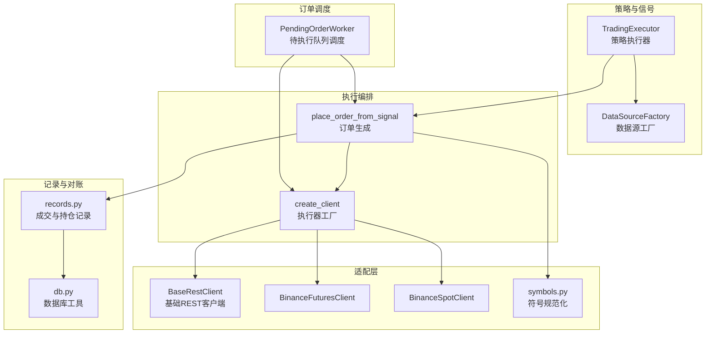
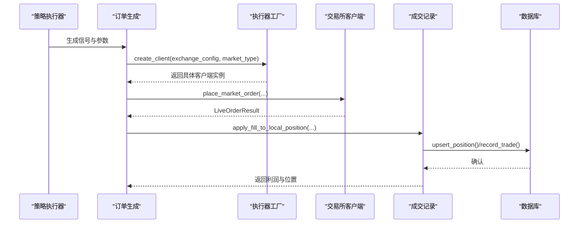
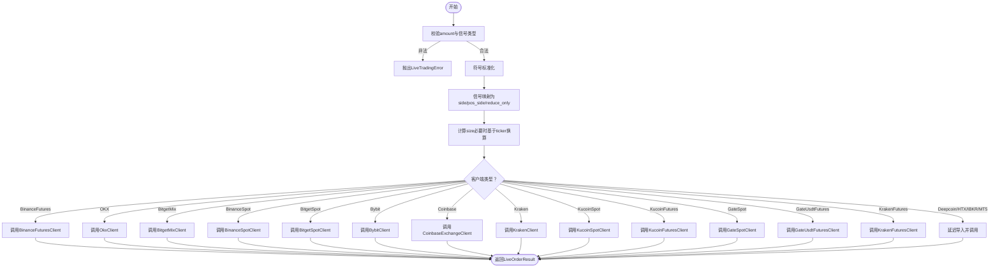
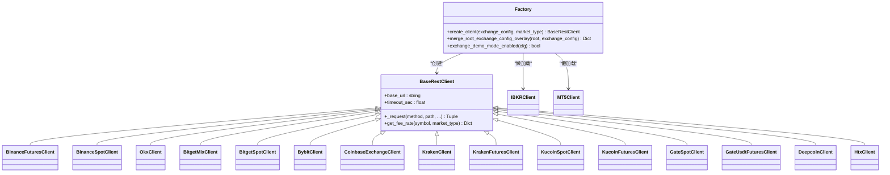
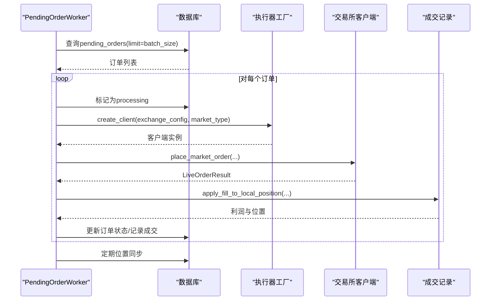
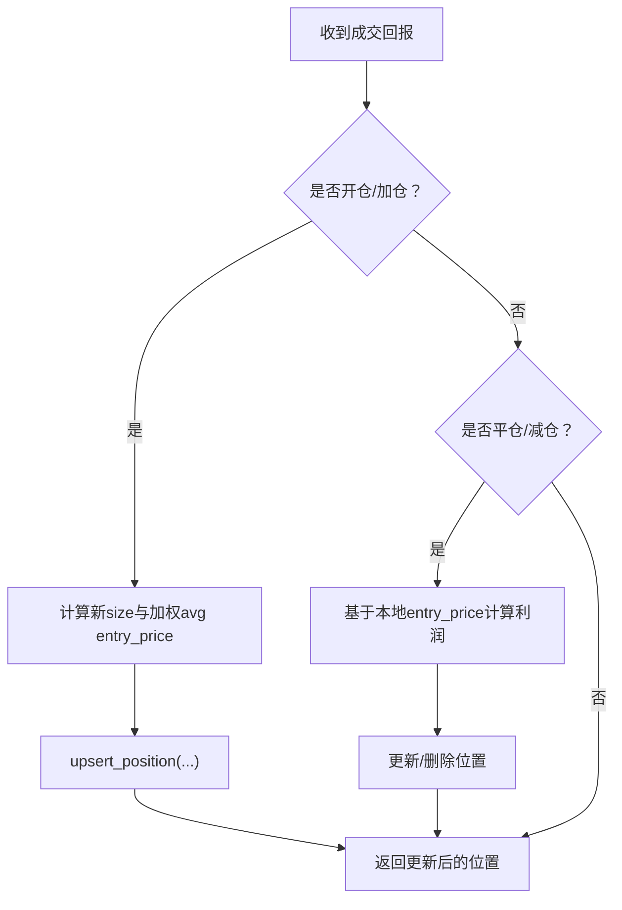
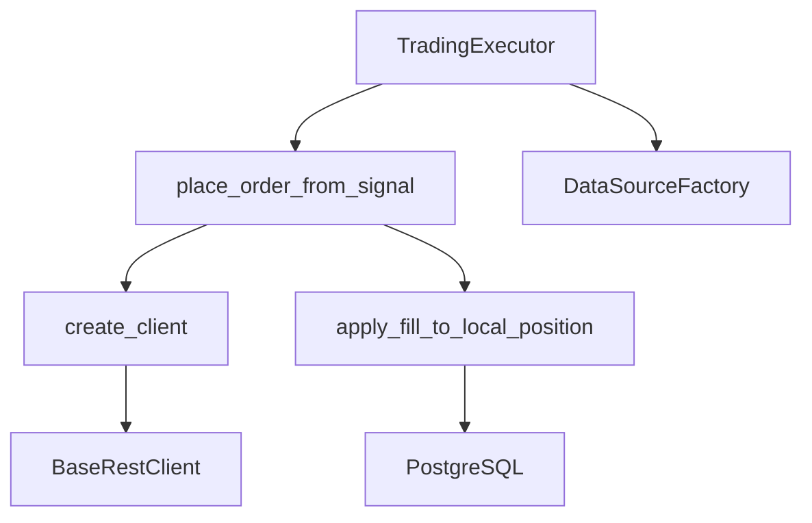

# 实时交易执行

<cite>
**本文档引用的文件**
- [execution.py](file://backend_api_python/app/services/live_trading/execution.py)
- [factory.py](file://backend_api_python/app/services/live_trading/factory.py)
- [base.py](file://backend_api_python/app/services/live_trading/base.py)
- [records.py](file://backend_api_python/app/services/live_trading/records.py)
- [symbols.py](file://backend_api_python/app/services/live_trading/symbols.py)
- [binance.py](file://backend_api_python/app/services/live_trading/binance.py)
- [binance_spot.py](file://backend_api_python/app/services/live_trading/binance_spot.py)
- [pending_order_worker.py](file://backend_api_python/app/services/pending_order_worker.py)
- [exchange_execution.py](file://backend_api_python/app/services/exchange_execution.py)
- [trading_executor.py](file://backend_api_python/app/services/trading_executor.py)
- [db.py](file://backend_api_python/app/utils/db.py)
- [factory.py](file://backend_api_python/app/data_sources/factory.py)
</cite>

## 目录
1. [简介](#简介)
2. [项目结构](#项目结构)
3. [核心组件](#核心组件)
4. [架构总览](#架构总览)
5. [详细组件分析](#详细组件分析)
6. [依赖分析](#依赖分析)
7. [性能考虑](#性能考虑)
8. [故障排查指南](#故障排查指南)
9. [结论](#结论)
10. [附录](#附录)

## 简介
本文件面向QuantDinger的实时交易执行系统，聚焦于订单队列管理、执行算法与风险控制机制的实现架构，系统性阐述订单生命周期管理、执行确认与状态更新的技术流程，多执行器工厂模式的设计原理与扩展机制，并提供订单路由策略、滑点处理与成交回报的数据结构说明。同时给出执行性能监控、延迟测量与可靠性保障的技术方案，以及与各交易所API的适配层设计与协议转换机制。

## 项目结构
QuantDinger后端采用模块化组织，实时交易执行相关的关键模块包括：
- 适配层与工厂：负责根据配置创建具体交易所客户端，统一封装REST请求与错误处理
- 执行编排：将策略信号转化为实际订单，支持多市场类型与多交易所
- 订单调度：轮询待执行队列，按优先级与模式派发订单
- 成交记录：维护本地持仓快照与成交回报，支持最佳努力的对账与修复
- 数据源与数据库：提供历史K线与实时报价，统一数据库访问

**图表来源**
- [trading_executor.py:395-456](file://backend_api_python/app/services/trading_executor.py#L395-L456)
- [execution.py:123-311](file://backend_api_python/app/services/live_trading/execution.py#L123-L311)
- [factory.py:126-285](file://backend_api_python/app/services/live_trading/factory.py#L126-L285)
- [base.py:95-167](file://backend_api_python/app/services/live_trading/base.py#L95-L167)
- [binance.py:24-50](file://backend_api_python/app/services/live_trading/binance.py#L24-L50)
- [binance_spot.py:21-40](file://backend_api_python/app/services/live_trading/binance_spot.py#L21-L40)
- [symbols.py:16-47](file://backend_api_python/app/services/live_trading/symbols.py#L16-L47)
- [pending_order_worker.py:52-98](file://backend_api_python/app/services/pending_order_worker.py#L52-L98)
- [records.py:85-124](file://backend_api_python/app/services/live_trading/records.py#L85-L124)
- [db.py:19-31](file://backend_api_python/app/utils/db.py#L19-L31)

**章节来源**
- [trading_executor.py:395-456](file://backend_api_python/app/services/trading_executor.py#L395-L456)
- [execution.py:123-311](file://backend_api_python/app/services/live_trading/execution.py#L123-L311)
- [factory.py:126-285](file://backend_api_python/app/services/live_trading/factory.py#L126-L285)
- [base.py:95-167](file://backend_api_python/app/services/live_trading/base.py#L95-L167)
- [binance.py:24-50](file://backend_api_python/app/services/live_trading/binance.py#L24-L50)
- [binance_spot.py:21-40](file://backend_api_python/app/services/live_trading/binance_spot.py#L21-L40)
- [symbols.py:16-47](file://backend_api_python/app/services/live_trading/symbols.py#L16-L47)
- [pending_order_worker.py:52-98](file://backend_api_python/app/services/pending_order_worker.py#L52-L98)
- [records.py:85-124](file://backend_api_python/app/services/live_trading/records.py#L85-L124)
- [db.py:19-31](file://backend_api_python/app/utils/db.py#L19-L31)

## 核心组件
- 订单生成与路由：将策略信号映射为交易所侧的订单参数，统一走工厂创建的客户端进行下单
- 执行器工厂：根据exchange_config动态创建具体交易所客户端，支持多市场类型与多交易所
- 待执行队列调度：轮询pending_orders，按优先级与模式派发，支持位置同步与对账
- 成交记录与本地持仓：维护本地持仓快照，记录成交回报，支持最佳努力的对账
- 数据源与数据库：提供历史与实时数据，统一数据库访问

**章节来源**
- [execution.py:123-311](file://backend_api_python/app/services/live_trading/execution.py#L123-L311)
- [factory.py:126-285](file://backend_api_python/app/services/live_trading/factory.py#L126-L285)
- [pending_order_worker.py:52-98](file://backend_api_python/app/services/pending_order_worker.py#L52-L98)
- [records.py:85-124](file://backend_api_python/app/services/live_trading/records.py#L85-L124)
- [db.py:19-31](file://backend_api_python/app/utils/db.py#L19-L31)

## 架构总览
系统采用“策略信号 → 订单生成 → 工厂创建客户端 → 适配层REST → 记录与对账”的链路。工厂模式解耦了不同交易所的差异，适配层封装了签名、时间同步、精度控制与错误处理，调度器负责队列化与可靠性保障。

**图表来源**
- [trading_executor.py:3198-3211](file://backend_api_python/app/services/trading_executor.py#L3198-L3211)
- [execution.py:123-311](file://backend_api_python/app/services/live_trading/execution.py#L123-L311)
- [factory.py:126-285](file://backend_api_python/app/services/live_trading/factory.py#L126-L285)
- [records.py:186-277](file://backend_api_python/app/services/live_trading/records.py#L186-L277)

## 详细组件分析

### 组件A：订单生成与路由（place_order_from_signal）
- 功能职责
  - 将策略信号（开多/加多/平多/减多等）映射为交易所侧的side/pos_side/size/reduce_only等参数
  - 支持多市场类型（swap/spot）与多交易所（Binance、OKX、Bitget、Bybit、Coinbase、Kraken、KuCoin、Gate、Deepcoin、HTX等）
  - 对spot市场进行信号约束（例如不支持做空）
- 关键流程
  - 符号标准化：统一处理裸符号、含冒号的永续格式等
  - 信号到方向映射：根据信号类型确定side与pos_side
  - 金额到数量转换：针对某些交易所（如币安、Gate、KuCoin）的买涨以报价货币计价，需基于ticker换算
  - 客户端分发：通过类型判断调用对应交易所客户端的下单方法
- 错误处理
  - 非法amount、不支持的信号类型、不支持的客户端类型均抛出LiveTradingError

**图表来源**
- [execution.py:123-311](file://backend_api_python/app/services/live_trading/execution.py#L123-L311)

**章节来源**
- [execution.py:123-311](file://backend_api_python/app/services/live_trading/execution.py#L123-L311)

### 组件B：执行器工厂（create_client）
- 设计原则
  - 工厂模式：根据exchange_id与market_type选择具体客户端
  - 懒加载：仅在需要时导入特定交易所客户端，避免不必要的依赖
  - 配置合并：支持根配置overlay到exchange_config，统一测试网/演示模式开关
- 支持范围
  - 加密货币期货/现货：Binance、OKX、Bitget、Bybit、Coinbase、Kraken、KuCoin、Gate、Deepcoin、HTX
  - 传统券商：Interactive Brokers（IBKR）美国股票
  - 外汇平台：MetaTrader 5（MT5）外汇
- 关键能力
  - 测试网/演示模式：自动切换base_url或futures_base_url
  - 参数解析：统一解析api_key、secret_key、passphrase、broker_id等
  - 连接验证：对IBKR/MT5等需要立即建立连接的客户端进行连接校验

**图表来源**
- [factory.py:126-285](file://backend_api_python/app/services/live_trading/factory.py#L126-L285)
- [base.py:95-167](file://backend_api_python/app/services/live_trading/base.py#L95-L167)
- [binance.py:24-50](file://backend_api_python/app/services/live_trading/binance.py#L24-L50)
- [binance_spot.py:21-40](file://backend_api_python/app/services/live_trading/binance_spot.py#L21-L40)

**章节来源**
- [factory.py:126-285](file://backend_api_python/app/services/live_trading/factory.py#L126-L285)
- [base.py:95-167](file://backend_api_python/app/services/live_trading/base.py#L95-L167)
- [binance.py:24-50](file://backend_api_python/app/services/live_trading/binance.py#L24-L50)
- [binance_spot.py:21-40](file://backend_api_python/app/services/live_trading/binance_spot.py#L21-L40)

### 组件C：待执行队列调度（PendingOrderWorker）
- 轮询与批处理：周期性查询pending_orders，批量处理以降低数据库压力
- 可靠性保障
  - 处理超时回收：stale_processing_sec内未完成的订单重置为pending
  - 位置同步：定期与交易所对账，修复“幽灵持仓”与尺寸/均价偏差
  - 自动停机：检测致命认证/权限错误时自动停止策略
- 优先级与模式
  - 支持优先级排序与最大尝试次数
  - execution_mode为live时，订单进入待执行队列，由工厂与客户端实际执行

**图表来源**
- [pending_order_worker.py:91-122](file://backend_api_python/app/services/pending_order_worker.py#L91-L122)
- [pending_order_worker.py:752-800](file://backend_api_python/app/services/pending_order_worker.py#L752-L800)
- [factory.py:126-285](file://backend_api_python/app/services/live_trading/factory.py#L126-L285)
- [records.py:186-277](file://backend_api_python/app/services/live_trading/records.py#L186-L277)

**章节来源**
- [pending_order_worker.py:52-98](file://backend_api_python/app/services/pending_order_worker.py#L52-L98)
- [pending_order_worker.py:752-800](file://backend_api_python/app/services/pending_order_worker.py#L752-L800)
- [pending_order_worker.py:138-751](file://backend_api_python/app/services/pending_order_worker.py#L138-L751)

### 组件D：成交记录与本地持仓（records.py）
- 数据结构
  - 本地持仓表：qd_strategy_positions（strategy_id, symbol, side, size, entry_price, current_price, highest_price, lowest_price）
  - 成交回报表：qd_strategy_trades（strategy_id, symbol, type, price, amount, value, commission, commission_ccy, profit）
- 核心逻辑
  - 归一化符号：统一BTC/USDT等格式，兼容多种输入形态
  - 开仓/加仓：加权平均计算新的entry_price，更新最高/最低价格
  - 平仓/减仓：计算利润（基于本地entry_price），更新剩余头寸或删除
  - 插入/更新：使用ON CONFLICT策略保证幂等

**图表来源**
- [records.py:186-277](file://backend_api_python/app/services/live_trading/records.py#L186-L277)

**章节来源**
- [records.py:85-124](file://backend_api_python/app/services/live_trading/records.py#L85-L124)
- [records.py:186-277](file://backend_api_python/app/services/live_trading/records.py#L186-L277)

### 组件E：符号规范化（symbols.py）
- 目标：将策略/UI输入的符号转换为交易所期望的格式
- 能力
  - 解析base/quote，处理含冒号的永续格式
  - 提供to_binance_futures_symbol、to_okx_swap_inst_id、to_bybit_symbol、to_coinbase_product_id、to_kraken_pair、to_kucoin_symbol、to_kucoin_futures_symbol、to_gate_currency_pair、to_deepcoin_symbol、to_deepcoin_swap_symbol、to_htx_spot_symbol、to_htx_contract_code等
- 重要性：避免因符号格式不一致导致下单失败或错误计价

**章节来源**
- [symbols.py:16-47](file://backend_api_python/app/services/live_trading/symbols.py#L16-L47)
- [symbols.py:43-235](file://backend_api_python/app/services/live_trading/symbols.py#L43-L235)

### 组件F：基础REST客户端（base.py）
- 职责
  - 统一HTTP请求封装，支持超时、SSL证书验证策略
  - 提供LiveOrderResult与LiveTradingError标准结构
  - 通用的URL拼接与JSON解析
- 安全与合规
  - 支持通过环境变量配置CA证书路径或禁用校验（开发/测试场景）
  - 对非ASCII字符的请求头进行严格校验，避免签名失败

**章节来源**
- [base.py:34-80](file://backend_api_python/app/services/live_trading/base.py#L34-L80)
- [base.py:106-167](file://backend_api_python/app/services/live_trading/base.py#L106-L167)

### 组件G：交易所客户端示例（Binance Futures/Spot）
- BinanceFuturesClient
  - 精度控制：Decimal量化与步进对齐，避免超出LOT_SIZE/PRICE_FILTER
  - 时间同步：与服务器时间对齐，规避-1021错误
  - 客户端订单ID：支持broker_id前缀，长度截断
- BinanceSpotClient
  - 与期货类似，但针对现货精度与接口差异进行适配

**章节来源**
- [binance.py:24-50](file://backend_api_python/app/services/live_trading/binance.py#L24-L50)
- [binance.py:57-147](file://backend_api_python/app/services/live_trading/binance.py#L57-L147)
- [binance_spot.py:21-40](file://backend_api_python/app/services/live_trading/binance_spot.py#L21-L40)
- [binance_spot.py:48-142](file://backend_api_python/app/services/live_trading/binance_spot.py#L48-L142)

### 组件H：策略执行器（TradingExecutor）
- 职责
  - 策略线程管理：限制最大线程数，避免资源耗尽
  - 信号去重：基于策略ID、symbol、信号类型与时间戳的去重缓存
  - 风险控制：内置止盈止损、追踪止损、网格/定投等策略参数解析
  - 订单入队：将信号转换为待执行订单，支持live与signal两种模式
- 性能与可观测性
  - 资源状态打印：线程数、内存、VmRSS等
  - 价格缓存：轻量内存缓存，减少重复查询

**章节来源**
- [trading_executor.py:395-456](file://backend_api_python/app/services/trading_executor.py#L395-L456)
- [trading_executor.py:241-291](file://backend_api_python/app/services/trading_executor.py#L241-L291)
- [trading_executor.py:309-394](file://backend_api_python/app/services/trading_executor.py#L309-L394)

## 依赖分析
- 组件耦合
  - TradingExecutor与Execution紧密耦合：前者生成信号，后者负责落地执行
  - Execution与Factory强耦合：通过工厂创建具体客户端
  - PendingOrderWorker与Execution/Factory/Records强耦合：负责调度、执行与记录
  - Records与DB强耦合：直接操作qd_strategy_positions与qd_strategy_trades
- 外部依赖
  - 请求库：requests（统一HTTPS证书策略）
  - 数据库：PostgreSQL（统一连接池与事务）
  - 数据源：DataSourceFactory（历史与实时数据）

**图表来源**
- [trading_executor.py:395-456](file://backend_api_python/app/services/trading_executor.py#L395-L456)
- [execution.py:123-311](file://backend_api_python/app/services/live_trading/execution.py#L123-L311)
- [factory.py:126-285](file://backend_api_python/app/services/live_trading/factory.py#L126-L285)
- [records.py:186-277](file://backend_api_python/app/services/live_trading/records.py#L186-L277)
- [db.py:19-31](file://backend_api_python/app/utils/db.py#L19-L31)
- [factory.py:33-112](file://backend_api_python/app/data_sources/factory.py#L33-L112)

**章节来源**
- [trading_executor.py:395-456](file://backend_api_python/app/services/trading_executor.py#L395-L456)
- [execution.py:123-311](file://backend_api_python/app/services/live_trading/execution.py#L123-L311)
- [factory.py:126-285](file://backend_api_python/app/services/live_trading/factory.py#L126-L285)
- [records.py:186-277](file://backend_api_python/app/services/live_trading/records.py#L186-L277)
- [db.py:19-31](file://backend_api_python/app/utils/db.py#L19-L31)
- [factory.py:33-112](file://backend_api_python/app/data_sources/factory.py#L33-L112)

## 性能考虑
- 线程与资源
  - 通过STRATEGY_MAX_THREADS限制策略线程数，避免“can't start new thread”与OOM
  - PendingOrderWorker批处理（batch_size）与轮询间隔（poll_interval_sec）可调
- 缓存与去重
  - 价格缓存（默认10秒TTL）与信号去重缓存，减少重复下单与查询
- 精度与网络
  - 交易所精度控制（Decimal量化）避免下单失败
  - 统一SSL证书策略，减少TLS握手失败导致的重试
- 数据库
  - 使用连接池与事务，批量写入，减少锁竞争

[本节为通用指导，无需特定文件分析]

## 故障排查指南
- 常见错误与定位
  - LiveTradingError：订单参数非法、信号类型不支持、客户端类型不支持
  - SSL/TLS证书问题：检查LIVE_TRADING_CA_BUNDLE/LIVE_TRADING_SSL_VERIFY
  - 认证失败：检查API Key/Secret/Passphrase格式与字符集
  - 位置同步失败：致命错误（如HTTP 401）将自动停止策略，避免无限告警
- 日志与可观测性
  - PendingOrderWorker记录位置同步摘要与详细日志
  - TradingExecutor打印资源状态与线程/内存信息
  - exchange_execution安全脱敏日志输出

**章节来源**
- [base.py:138-146](file://backend_api_python/app/services/live_trading/base.py#L138-L146)
- [pending_order_worker.py:267-300](file://backend_api_python/app/services/pending_order_worker.py#L267-L300)
- [pending_order_worker.py:710-751](file://backend_api_python/app/services/pending_order_worker.py#L710-L751)
- [exchange_execution.py:39-56](file://backend_api_python/app/services/exchange_execution.py#L39-L56)

## 结论
QuantDinger的实时交易执行系统通过工厂模式与适配层实现了对多交易所、多市场的统一接入，结合待执行队列调度与本地成交记录，提供了高可靠、可扩展的执行基础设施。策略执行器负责信号生成与风控，工厂负责客户端创建与配置解析，调度器负责可靠性保障与对账，形成清晰的职责分离与良好的扩展性。

[本节为总结，无需特定文件分析]

## 附录

### 订单生命周期与状态更新
- 生命周期阶段
  - 策略生成信号 → 订单入队（pending）→ 调度执行 → 交易所确认 → 成交回报 → 本地持仓更新 → 记录成交
- 状态流转
  - pending → processing → 已成交/已取消/失败
  - 位置同步修复“幽灵持仓”，保持本地与交易所一致

**章节来源**
- [pending_order_worker.py:91-122](file://backend_api_python/app/services/pending_order_worker.py#L91-L122)
- [records.py:186-277](file://backend_api_python/app/services/live_trading/records.py#L186-L277)

### 多执行器工厂模式的扩展机制
- 新增交易所步骤
  - 在factory.py中新增分支，创建对应客户端类
  - 在execution.py中增加客户端分支，映射信号与参数
  - 如需特殊精度/时间同步，可在客户端类中实现
- 配置项建议
  - exchange_id、api_key、secret_key、passphrase、base_url/futures_base_url、demo模式开关

**章节来源**
- [factory.py:126-285](file://backend_api_python/app/services/live_trading/factory.py#L126-L285)
- [execution.py:123-311](file://backend_api_python/app/services/live_trading/execution.py#L123-L311)

### 订单路由策略、滑点处理与成交回报数据结构
- 路由策略
  - 基于exchange_id与market_type选择客户端
  - 支持测试网/演示模式自动切换
- 滑点处理
  - 订单生成时可结合滑点参数调整执行价格（在策略层面或回测中体现）
- 成交回报数据结构
  - 本地持仓：strategy_id、symbol、side、size、entry_price、current_price、highest/lowest
  - 成交回报：strategy_id、symbol、type、price、amount、value、commission、commission_ccy、profit

**章节来源**
- [exchange_execution.py:59-92](file://backend_api_python/app/services/exchange_execution.py#L59-L92)
- [records.py:85-124](file://backend_api_python/app/services/live_trading/records.py#L85-L124)
- [records.py:186-277](file://backend_api_python/app/services/live_trading/records.py#L186-L277)

### 执行性能监控、延迟测量与可靠性保障
- 监控指标
  - 线程数、内存、VmRSS、活跃策略数
  - 位置同步频率与成功率
  - 订单处理吞吐与失败率
- 延迟测量
  - 交易所时间同步（如Binance）与本地时间差
  - 请求超时与重试策略
- 可靠性保障
  - 处理超时回收、致命错误自动停机、位置同步修复

**章节来源**
- [trading_executor.py:149-175](file://backend_api_python/app/services/trading_executor.py#L149-L175)
- [pending_order_worker.py:138-137](file://backend_api_python/app/services/pending_order_worker.py#L138-L137)
- [binance.py:173-191](file://backend_api_python/app/services/live_trading/binance.py#L173-L191)

### 与交易所API的适配层设计与协议转换
- 适配层职责
  - 统一签名、时间戳、精度控制、错误码映射
  - 符号规范化与参数映射
- 协议转换
  - 将策略侧的信号与参数转换为交易所侧的API请求
  - 将交易所返回的原始响应转换为统一的LiveOrderResult

**章节来源**
- [base.py:106-167](file://backend_api_python/app/services/live_trading/base.py#L106-L167)
- [symbols.py:16-47](file://backend_api_python/app/services/live_trading/symbols.py#L16-L47)
- [execution.py:123-311](file://backend_api_python/app/services/live_trading/execution.py#L123-L311)