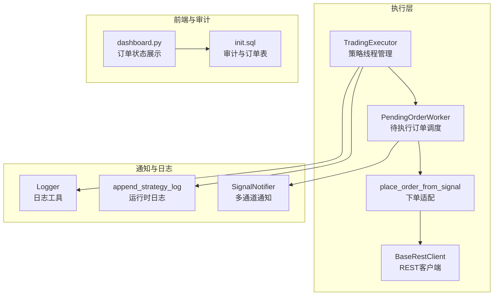
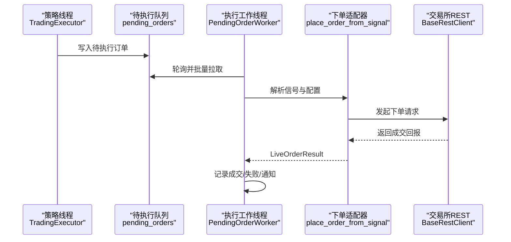
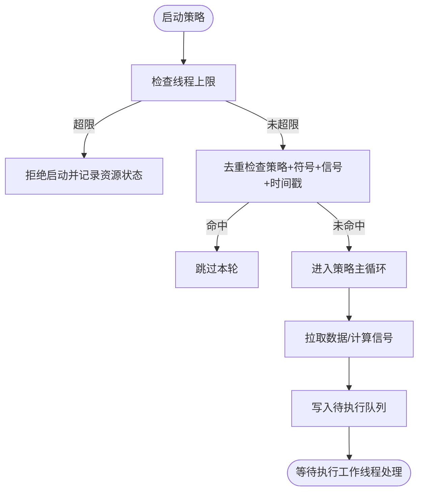
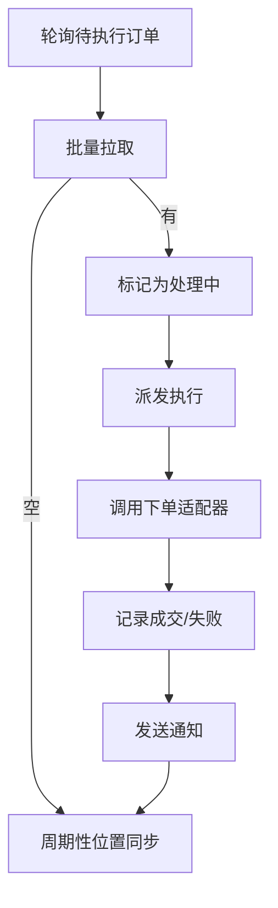
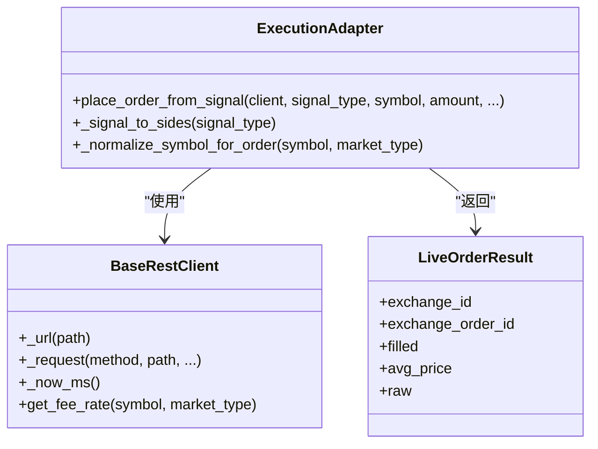
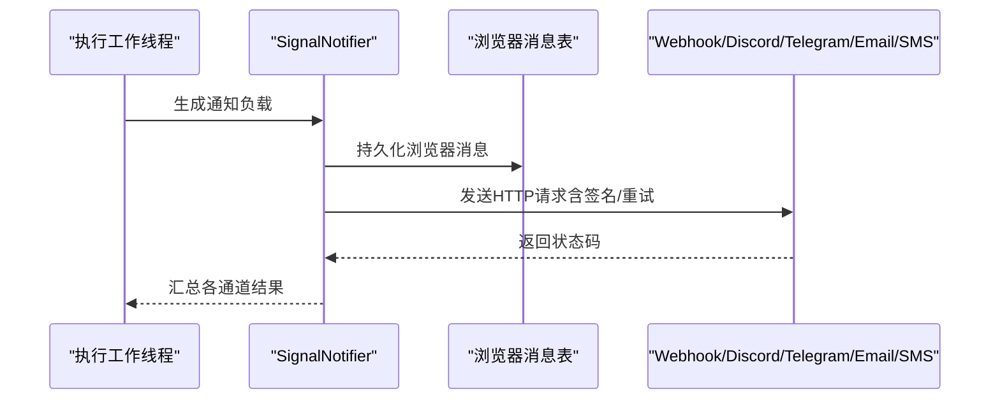
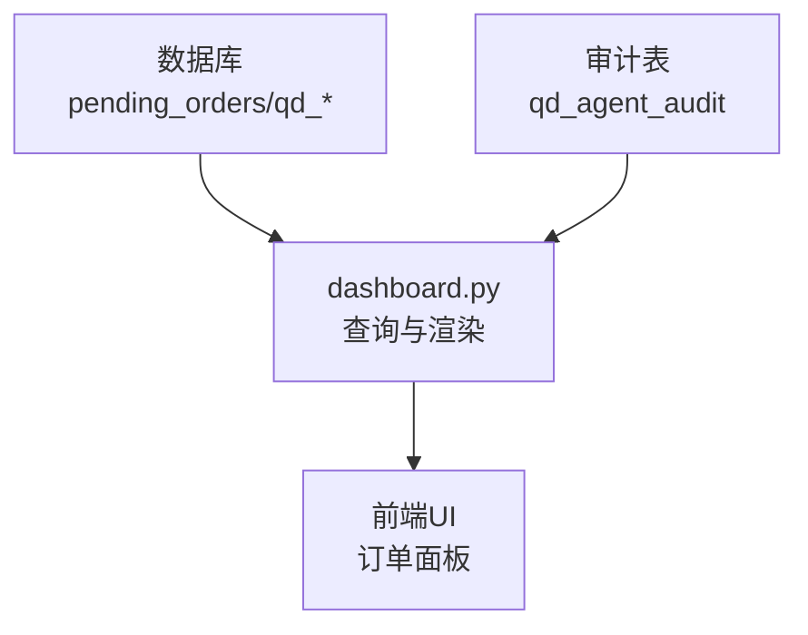
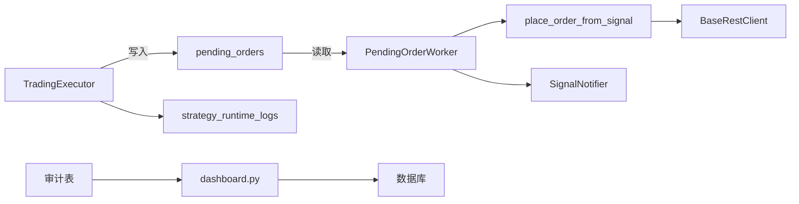

# 执行监控

<cite>
**本文引用的文件**
- [execution.py](file://backend_api_python/app/services/live_trading/execution.py)
- [pending_order_worker.py](file://backend_api_python/app/services/pending_order_worker.py)
- [trading_executor.py](file://backend_api_python/app/services/trading_executor.py)
- [base.py](file://backend_api_python/app/services/live_trading/base.py)
- [signal_notifier.py](file://backend_api_python/app/services/signal_notifier.py)
- [logger.py](file://backend_api_python/app/utils/logger.py)
- [strategy_runtime_logs.py](file://backend_api_python/app/utils/strategy_runtime_logs.py)
- [dashboard.py](file://backend_api_python/app/routes/dashboard.py)
- [init.sql](file://backend_api_python/migrations/init.sql)
</cite>

## 目录
1. [引言](#引言)
2. [项目结构](#项目结构)
3. [核心组件](#核心组件)
4. [架构总览](#架构总览)
5. [详细组件分析](#详细组件分析)
6. [依赖分析](#依赖分析)
7. [性能考虑](#性能考虑)
8. [故障排查指南](#故障排查指南)
9. [结论](#结论)
10. [附录](#附录)

## 引言
本技术文档聚焦QuantDinger的执行监控系统，围绕“执行性能监控、延迟测量与可靠性保障”展开，系统性阐述订单执行状态跟踪、成交回报处理、异常检测机制、执行工作线程调度策略、任务队列管理与资源利用率监控，并给出执行质量指标、成功率统计与性能瓶颈分析方法，以及与外部监控系统的集成与数据上报流程。

## 项目结构
执行监控相关代码主要分布在以下模块：
- 实时交易执行与下单：live_trading子系统（下单适配、REST客户端）
- 待执行订单调度与执行：PendingOrderWorker轮询与派发
- 策略线程与资源控制：TradingExecutor线程管理与去重
- 通知与可观测性：SignalNotifier通知通道、日志工具与运行时日志
- 前端展示与审计：仪表盘路由与审计表结构

图表来源
- [trading_executor.py:395-456](file://backend_api_python/app/services/trading_executor.py#L395-L456)
- [pending_order_worker.py:91-122](file://backend_api_python/app/services/pending_order_worker.py#L91-L122)
- [execution.py:123-311](file://backend_api_python/app/services/live_trading/execution.py#L123-L311)
- [base.py:95-167](file://backend_api_python/app/services/live_trading/base.py#L95-L167)
- [signal_notifier.py:171-284](file://backend_api_python/app/services/signal_notifier.py#L171-L284)
- [logger.py:9-63](file://backend_api_python/app/utils/logger.py#L9-L63)
- [strategy_runtime_logs.py:11-30](file://backend_api_python/app/utils/strategy_runtime_logs.py#L11-L30)
- [dashboard.py:621-700](file://backend_api_python/app/routes/dashboard.py#L621-L700)
- [init.sql:1073-1100](file://backend_api_python/migrations/init.sql#L1073-L1100)

章节来源
- [execution.py:1-426](file://backend_api_python/app/services/live_trading/execution.py#L1-L426)
- [pending_order_worker.py:1-800](file://backend_api_python/app/services/pending_order_worker.py#L1-L800)
- [trading_executor.py:1-800](file://backend_api_python/app/services/trading_executor.py#L1-L800)
- [base.py:1-168](file://backend_api_python/app/services/live_trading/base.py#L1-L168)
- [signal_notifier.py:1-800](file://backend_api_python/app/services/signal_notifier.py#L1-L800)
- [logger.py:1-63](file://backend_api_python/app/utils/logger.py#L1-L63)
- [strategy_runtime_logs.py:1-30](file://backend_api_python/app/utils/strategy_runtime_logs.py#L1-L30)
- [dashboard.py:621-700](file://backend_api_python/app/routes/dashboard.py#L621-L700)
- [init.sql:1073-1100](file://backend_api_python/migrations/init.sql#L1073-L1100)

## 核心组件
- 策略执行线程管理（TradingExecutor）
  - 线程上限控制、运行中策略登记、资源状态日志、去重与优先级
- 待执行订单调度（PendingOrderWorker）
  - 轮询、批量处理、位置同步、异常自动停机、通知
- 下单适配与REST客户端（execution.py、base.py）
  - 信号到订单映射、多交易所下单、请求封装与TLS校验
- 通知与日志（SignalNotifier、logger、strategy_runtime_logs）
  - 多通道通知、浏览器消息持久化、运行时日志写入
- 前端展示与审计（dashboard.py、init.sql）
  - 订单状态渲染、审计表字段与索引

章节来源
- [trading_executor.py:395-456](file://backend_api_python/app/services/trading_executor.py#L395-L456)
- [pending_order_worker.py:52-90](file://backend_api_python/app/services/pending_order_worker.py#L52-L90)
- [execution.py:123-311](file://backend_api_python/app/services/live_trading/execution.py#L123-L311)
- [base.py:95-167](file://backend_api_python/app/services/live_trading/base.py#L95-L167)
- [signal_notifier.py:171-284](file://backend_api_python/app/services/signal_notifier.py#L171-L284)
- [logger.py:9-63](file://backend_api_python/app/utils/logger.py#L9-L63)
- [strategy_runtime_logs.py:11-30](file://backend_api_python/app/utils/strategy_runtime_logs.py#L11-L30)
- [dashboard.py:621-700](file://backend_api_python/app/routes/dashboard.py#L621-L700)
- [init.sql:1073-1100](file://backend_api_python/migrations/init.sql#L1073-L1100)

## 架构总览
执行监控系统采用“策略线程 + 待执行队列 + 多交易所直连”的分层架构：
- 策略线程负责生成信号并写入待执行队列
- 待执行工作线程周期性拉取并派发执行
- 下单适配器根据信号类型与市场类型选择对应交易所客户端
- 通知模块在关键节点进行事件广播，日志模块记录运行轨迹

图表来源
- [trading_executor.py:790-800](file://backend_api_python/app/services/trading_executor.py#L790-L800)
- [pending_order_worker.py:99-122](file://backend_api_python/app/services/pending_order_worker.py#L99-L122)
- [execution.py:123-311](file://backend_api_python/app/services/live_trading/execution.py#L123-L311)
- [base.py:106-153](file://backend_api_python/app/services/live_trading/base.py#L106-L153)

## 详细组件分析

### 策略执行线程管理（TradingExecutor）
- 线程生命周期与并发控制
  - 通过环境变量限制最大线程数，避免资源耗尽
  - 启动前清理已退出线程，防止计数膨胀
  - 启动失败时记录资源状态，辅助定位“无法创建新线程”问题
- 信号去重与优先级
  - 基于策略ID、符号、信号类型与时间戳的去重键，防止同一K线重复下单
  - 信号优先级：平仓 > 减仓 > 开仓/加仓，保证风控与平仓优先
- 价格缓存与资源观测
  - 内存价格缓存与TTL，降低频繁查询开销
  - 资源状态日志（内存、线程数、运行中策略数）

图表来源
- [trading_executor.py:405-456](file://backend_api_python/app/services/trading_executor.py#L405-L456)
- [trading_executor.py:241-291](file://backend_api_python/app/services/trading_executor.py#L241-L291)

章节来源
- [trading_executor.py:395-456](file://backend_api_python/app/services/trading_executor.py#L395-L456)
- [trading_executor.py:241-291](file://backend_api_python/app/services/trading_executor.py#L241-L291)
- [trading_executor.py:149-176](file://backend_api_python/app/services/trading_executor.py#L149-L176)

### 待执行订单调度与执行（PendingOrderWorker）
- 轮询与批处理
  - 固定轮询间隔与批量大小，平衡吞吐与延迟
  - 周期性位置同步，保持本地持仓与交易所一致
- 异常与自愈
  - 对“处理中”超时订单进行重新入队，避免死锁
  - 位置同步中识别致命认证/权限错误，自动停止策略
- 成交记录与通知
  - 记录成交回报、更新本地头寸、触发实时通知
  - 对IBKR/OKX等特殊场景进行参数归一化与精度诊断

图表来源
- [pending_order_worker.py:99-122](file://backend_api_python/app/services/pending_order_worker.py#L99-L122)
- [pending_order_worker.py:752-799](file://backend_api_python/app/services/pending_order_worker.py#L752-L799)
- [pending_order_worker.py:138-211](file://backend_api_python/app/services/pending_order_worker.py#L138-L211)

章节来源
- [pending_order_worker.py:52-90](file://backend_api_python/app/services/pending_order_worker.py#L52-L90)
- [pending_order_worker.py:99-122](file://backend_api_python/app/services/pending_order_worker.py#L99-L122)
- [pending_order_worker.py:138-211](file://backend_api_python/app/services/pending_order_worker.py#L138-L211)
- [pending_order_worker.py:752-799](file://backend_api_python/app/services/pending_order_worker.py#L752-L799)

### 下单适配与REST客户端（execution.py、base.py）
- 信号到订单映射
  - 支持多信号类型（开多/开空/平多/平空/加仓/减仓）
  - 市场类型规范化（期货/永续统一为swap）
- 多交易所适配
  - 针对不同交易所的下单参数差异进行归一化
  - 提供Spot与Futures差异化处理（如按报价币种转换）
- REST客户端
  - 统一封装请求、超时与TLS校验策略
  - 结果结构化返回（成交数量、均价、原始响应）

图表来源
- [base.py:95-167](file://backend_api_python/app/services/live_trading/base.py#L95-L167)
- [execution.py:123-311](file://backend_api_python/app/services/live_trading/execution.py#L123-L311)

章节来源
- [execution.py:85-101](file://backend_api_python/app/services/live_trading/execution.py#L85-L101)
- [execution.py:41-83](file://backend_api_python/app/services/live_trading/execution.py#L41-L83)
- [execution.py:123-311](file://backend_api_python/app/services/live_trading/execution.py#L123-L311)
- [base.py:106-153](file://backend_api_python/app/services/live_trading/base.py#L106-L153)

### 通知与日志（SignalNotifier、logger、strategy_runtime_logs）
- 通知通道
  - 浏览器、Webhook、Discord、Telegram、Email、短信（Twilio）
  - 支持签名与重试、时间显示与用户时区转换
- 日志与运行时日志
  - 全局日志配置与文件滚动
  - 策略运行时日志持久化，便于UI查看

图表来源
- [signal_notifier.py:171-284](file://backend_api_python/app/services/signal_notifier.py#L171-L284)
- [signal_notifier.py:540-629](file://backend_api_python/app/services/signal_notifier.py#L540-L629)
- [signal_notifier.py:630-704](file://backend_api_python/app/services/signal_notifier.py#L630-L704)
- [signal_notifier.py:706-739](file://backend_api_python/app/services/signal_notifier.py#L706-L739)
- [signal_notifier.py:741-785](file://backend_api_python/app/services/signal_notifier.py#L741-L785)
- [signal_notifier.py:787-800](file://backend_api_python/app/services/signal_notifier.py#L787-L800)

章节来源
- [signal_notifier.py:130-170](file://backend_api_python/app/services/signal_notifier.py#L130-L170)
- [signal_notifier.py:171-284](file://backend_api_python/app/services/signal_notifier.py#L171-L284)
- [logger.py:9-63](file://backend_api_python/app/utils/logger.py#L9-L63)
- [strategy_runtime_logs.py:11-30](file://backend_api_python/app/utils/strategy_runtime_logs.py#L11-L30)

### 前端展示与审计（dashboard.py、init.sql）
- 订单状态展示
  - 将待执行队列与策略配置整合，输出前端所需字段（已成交数量/均价/错误信息等）
- 审计与追踪
  - 审计表包含路由、方法、状态码、耗时等字段，便于回溯与分析

图表来源
- [dashboard.py:621-700](file://backend_api_python/app/routes/dashboard.py#L621-L700)
- [init.sql:1073-1100](file://backend_api_python/migrations/init.sql#L1073-L1100)

章节来源
- [dashboard.py:621-700](file://backend_api_python/app/routes/dashboard.py#L621-L700)
- [init.sql:1073-1100](file://backend_api_python/migrations/init.sql#L1073-L1100)

## 依赖分析
- 组件耦合
  - TradingExecutor与PendingOrderWorker通过“待执行队列”解耦
  - PendingOrderWorker依赖下单适配器与各交易所客户端
  - SignalNotifier独立于执行链路，仅消费执行结果
- 外部依赖
  - 请求库（requests）、时区与时钟（datetime/zoneinfo/time）
  - 数据库连接池与事务控制
  - 通知渠道（SMTP/Twilio/Webhook/Discord/Telegram）

图表来源
- [trading_executor.py:790-800](file://backend_api_python/app/services/trading_executor.py#L790-L800)
- [pending_order_worker.py:99-122](file://backend_api_python/app/services/pending_order_worker.py#L99-L122)
- [execution.py:123-311](file://backend_api_python/app/services/live_trading/execution.py#L123-L311)
- [base.py:106-153](file://backend_api_python/app/services/live_trading/base.py#L106-L153)
- [signal_notifier.py:171-284](file://backend_api_python/app/services/signal_notifier.py#L171-L284)
- [strategy_runtime_logs.py:11-30](file://backend_api_python/app/utils/strategy_runtime_logs.py#L11-L30)
- [dashboard.py:621-700](file://backend_api_python/app/routes/dashboard.py#L621-L700)
- [init.sql:1073-1100](file://backend_api_python/migrations/init.sql#L1073-L1100)

章节来源
- [trading_executor.py:1-800](file://backend_api_python/app/services/trading_executor.py#L1-L800)
- [pending_order_worker.py:1-800](file://backend_api_python/app/services/pending_order_worker.py#L1-L800)
- [execution.py:1-426](file://backend_api_python/app/services/live_trading/execution.py#L1-L426)
- [base.py:1-168](file://backend_api_python/app/services/live_trading/base.py#L1-L168)
- [signal_notifier.py:1-800](file://backend_api_python/app/services/signal_notifier.py#L1-L800)
- [strategy_runtime_logs.py:1-30](file://backend_api_python/app/utils/strategy_runtime_logs.py#L1-L30)
- [dashboard.py:621-700](file://backend_api_python/app/routes/dashboard.py#L621-L700)
- [init.sql:1073-1100](file://backend_api_python/migrations/init.sql#L1073-L1100)

## 性能考虑
- 线程与资源
  - 通过环境变量限制策略线程数，避免“无法创建新线程”与OOM风险
  - 资源状态日志用于快速定位容器内内存与线程占用
- 延迟与吞吐
  - 待执行订单批处理与轮询间隔可调，平衡延迟与吞吐
  - 位置同步周期性执行，避免高频查询
- 缓存与去重
  - 价格缓存与信号去重键，减少重复下单与查询压力
- TLS与网络
  - 统一TLS校验策略，支持系统CA与自定义PEM，兼顾企业代理与合规

章节来源
- [trading_executor.py:59-62](file://backend_api_python/app/services/trading_executor.py#L59-L62)
- [trading_executor.py:149-176](file://backend_api_python/app/services/trading_executor.py#L149-L176)
- [pending_order_worker.py:52-72](file://backend_api_python/app/services/pending_order_worker.py#L52-L72)
- [base.py:34-79](file://backend_api_python/app/services/live_trading/base.py#L34-L79)

## 故障排查指南
- 线程启动失败
  - 现象：提示“已达到单进程策略线程上限”或“启动线程失败”
  - 排查：检查线程上限与当前运行中的策略数；查看资源状态日志
- 无法下单或下单失败
  - 现象：执行工作线程记录失败并通知
  - 排查：检查交易所配置、API密钥、市场类型与符号格式；查看TLS校验与网络代理
- 位置不同步
  - 现象：本地持仓与交易所不一致
  - 排查：确认位置同步开关与间隔；检查致命认证/权限错误是否触发自动停机
- 通知未送达
  - 现象：Webhook/Discord/Telegram/Email/SMS失败
  - 排查：核对凭据与签名密钥、重试与超时配置；查看通道返回状态

章节来源
- [trading_executor.py:413-424](file://backend_api_python/app/services/trading_executor.py#L413-L424)
- [pending_order_worker.py:267-298](file://backend_api_python/app/services/pending_order_worker.py#L267-L298)
- [signal_notifier.py:540-629](file://backend_api_python/app/services/signal_notifier.py#L540-L629)
- [signal_notifier.py:630-704](file://backend_api_python/app/services/signal_notifier.py#L630-L704)
- [signal_notifier.py:706-739](file://backend_api_python/app/services/signal_notifier.py#L706-L739)
- [signal_notifier.py:741-785](file://backend_api_python/app/services/signal_notifier.py#L741-L785)
- [signal_notifier.py:787-800](file://backend_api_python/app/services/signal_notifier.py#L787-L800)

## 结论
QuantDinger的执行监控系统以“策略线程 + 待执行队列 + 多交易所直连”为核心，结合通知与日志体系，实现了对订单执行的全链路可观测与高可靠。通过线程上限、信号去重、位置同步与异常自愈等机制，系统在复杂市场环境下具备良好的稳定性与可维护性。建议在生产环境中配合外部监控系统进行指标采集与告警联动，持续优化批处理与轮询参数以获得最佳性能。

## 附录
- 执行质量指标与统计
  - 成功率：成功执行订单数 / 总派发订单数
  - 平均成交延迟：从派发到记录成交的时间差
  - 重试率：因429/5xx触发的重试次数占比
  - 通知送达率：各通道成功/失败统计
- 外部监控系统集成
  - 通过Webhook/Discord/Telegram/Email/SMS通道对接第三方监控平台
  - 审计表字段可用于后置分析与合规审计

章节来源
- [signal_notifier.py:540-629](file://backend_api_python/app/services/signal_notifier.py#L540-L629)
- [signal_notifier.py:630-704](file://backend_api_python/app/services/signal_notifier.py#L630-L704)
- [signal_notifier.py:706-739](file://backend_api_python/app/services/signal_notifier.py#L706-L739)
- [signal_notifier.py:741-785](file://backend_api_python/app/services/signal_notifier.py#L741-L785)
- [signal_notifier.py:787-800](file://backend_api_python/app/services/signal_notifier.py#L787-L800)
- [init.sql:1073-1100](file://backend_api_python/migrations/init.sql#L1073-L1100)