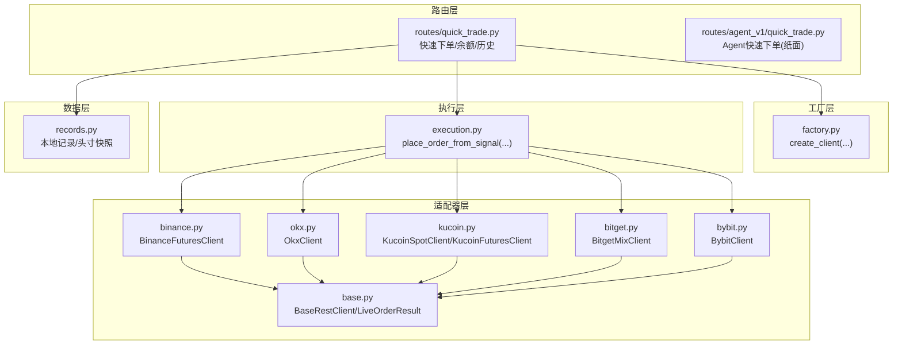
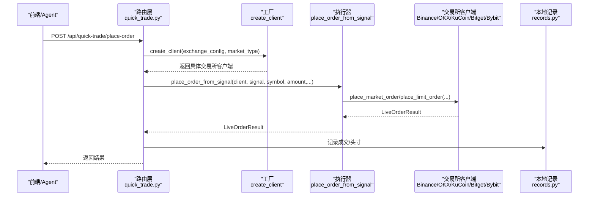
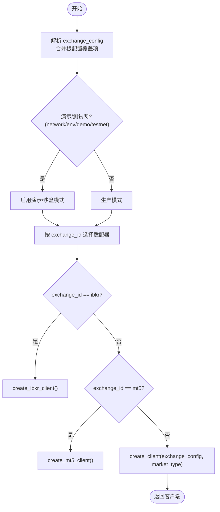
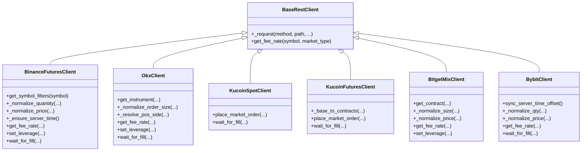
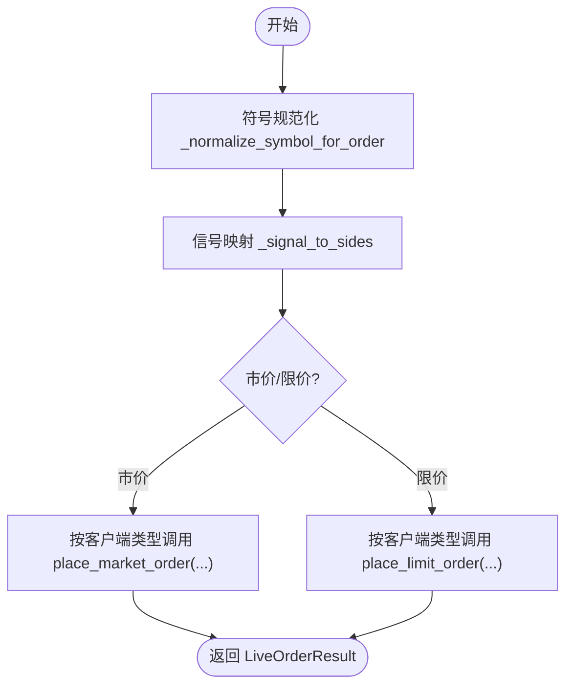
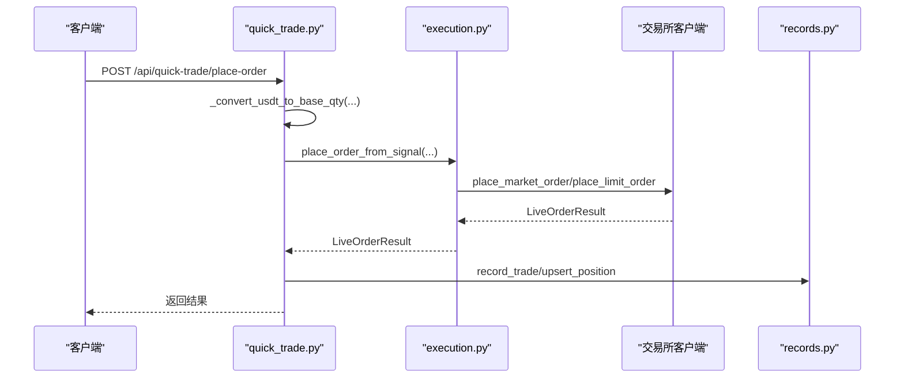
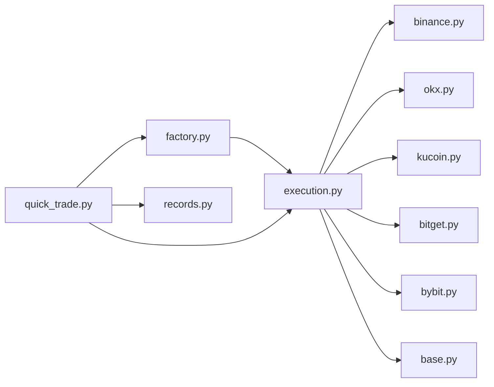

# 执行算法

<cite>
**本文引用的文件**
- [factory.py](file://backend_api_python/app/services/live_trading/factory.py)
- [execution.py](file://backend_api_python/app/services/live_trading/execution.py)
- [base.py](file://backend_api_python/app/services/live_trading/base.py)
- [binance.py](file://backend_api_python/app/services/live_trading/binance.py)
- [okx.py](file://backend_api_python/app/services/live_trading/okx.py)
- [kucoin.py](file://backend_api_python/app/services/live_trading/kucoin.py)
- [bitget.py](file://backend_api_python/app/services/live_trading/bitget.py)
- [bybit.py](file://backend_api_python/app/services/live_trading/bybit.py)
- [records.py](file://backend_api_python/app/services/live_trading/records.py)
- [quick_trade.py](file://backend_api_python/app/routes/quick_trade.py)
- [agent_v1_quick_trade.py](file://backend_api_python/app/routes/agent_v1/quick_trade.py)
- [trading_executor.py](file://backend_api_python/app/services/trading_executor.py)
</cite>

## 目录
1. [引言](#引言)
2. [项目结构](#项目结构)
3. [核心组件](#核心组件)
4. [架构总览](#架构总览)
5. [详细组件分析](#详细组件分析)
6. [依赖分析](#依赖分析)
7. [性能考虑](#性能考虑)
8. [故障排查指南](#故障排查指南)
9. [结论](#结论)
10. [附录](#附录)

## 引言
本文件面向QuantDinger的“执行算法系统”，系统性阐述多执行器工厂模式的设计与实现、主流交易所适配器（Binance、OKX、KuCoin、Bitget、Bybit等）的API集成方案、执行算法的核心逻辑（订单簿处理与价格发现）、滑点与成交量分配、执行成本优化、执行性能监控与延迟测量、成功率统计，以及执行器的动态加载、热切换与故障转移机制。文档以代码为依据，辅以图示帮助非专业读者理解。

## 项目结构
执行算法系统主要位于后端Python服务的“live_trading”子模块，围绕“工厂 + 适配器 + 执行器”的分层设计组织：
- 工厂层：根据配置动态创建具体交易所客户端
- 适配器层：各交易所REST客户端封装（签名、精度、错误码、费率查询等）
- 执行层：将策略信号转换为具体下单请求
- 路由层：对外提供快速下单、余额查询等接口
- 数据层：本地记录成交与头寸快照

图表来源
- [factory.py:126-285](file://backend_api_python/app/services/live_trading/factory.py#L126-L285)
- [execution.py:123-310](file://backend_api_python/app/services/live_trading/execution.py#L123-L310)
- [base.py:95-167](file://backend_api_python/app/services/live_trading/base.py#L95-L167)
- [binance.py:24-80](file://backend_api_python/app/services/live_trading/binance.py#L24-L80)
- [okx.py:25-67](file://backend_api_python/app/services/live_trading/okx.py#L25-L67)
- [kucoin.py:24-39](file://backend_api_python/app/services/live_trading/kucoin.py#L24-L39)
- [bitget.py:26-56](file://backend_api_python/app/services/live_trading/bitget.py#L26-L56)
- [bybit.py:27-60](file://backend_api_python/app/services/live_trading/bybit.py#L27-L60)
- [quick_trade.py:364-614](file://backend_api_python/app/routes/quick_trade.py#L364-L614)
- [records.py:85-184](file://backend_api_python/app/services/live_trading/records.py#L85-L184)

章节来源
- [factory.py:1-441](file://backend_api_python/app/services/live_trading/factory.py#L1-L441)
- [execution.py:1-426](file://backend_api_python/app/services/live_trading/execution.py#L1-L426)
- [base.py:1-168](file://backend_api_python/app/services/live_trading/base.py#L1-L168)
- [quick_trade.py:1-800](file://backend_api_python/app/routes/quick_trade.py#L1-L800)

## 核心组件
- 工厂模式（多执行器工厂）：集中解析配置、选择市场类型、决定是否演示/沙盒模式、按交易所ID创建对应客户端，支持IBKR与MT5等传统/外汇类broker。
- 适配器（交易所客户端）：统一抽象签名、时间同步、精度归一、错误映射、费率查询、杠杆设置、委托等待填充等。
- 执行器（信号到订单）：将策略信号标准化为下单请求，按交易所差异注入参数（如pos_side、td_mode、reduce_only等），并兼容限价/市价。
- 路由与记录：快速下单API、余额查询、成交记录与本地头寸快照更新。
- 策略执行器：策略线程驱动、信号去重、优先级排序、脚本上下文与参数持久化。

章节来源
- [factory.py:126-285](file://backend_api_python/app/services/live_trading/factory.py#L126-L285)
- [execution.py:123-310](file://backend_api_python/app/services/live_trading/execution.py#L123-L310)
- [base.py:82-167](file://backend_api_python/app/services/live_trading/base.py#L82-L167)
- [quick_trade.py:364-614](file://backend_api_python/app/routes/quick_trade.py#L364-L614)
- [records.py:85-184](file://backend_api_python/app/services/live_trading/records.py#L85-L184)
- [trading_executor.py:395-496](file://backend_api_python/app/services/trading_executor.py#L395-L496)

## 架构总览
下图展示从“策略信号/快速下单请求”到“交易所下单与回填”的全链路：

图表来源
- [quick_trade.py:364-577](file://backend_api_python/app/routes/quick_trade.py#L364-L577)
- [factory.py:126-285](file://backend_api_python/app/services/live_trading/factory.py#L126-L285)
- [execution.py:123-310](file://backend_api_python/app/services/live_trading/execution.py#L123-L310)
- [records.py:85-184](file://backend_api_python/app/services/live_trading/records.py#L85-L184)

## 详细组件分析

### 多执行器工厂模式（工厂层）
- 配置合并与演示模式检测：支持多种前端/后端键名覆盖，自动识别测试网/演示开关。
- 客户端创建：按exchange_id选择具体适配器，支持多市场类型（swap/spot/future/perp）。
- 传统/外汇适配：IBKR（TWS/Gateway）与MT5（仅外汇）通过延迟导入与连接校验保障可用性。
- 费率查询：提供最佳努力的费率查询入口，便于后续成本建模。

图表来源
- [factory.py:76-120](file://backend_api_python/app/services/live_trading/factory.py#L76-L120)
- [factory.py:126-285](file://backend_api_python/app/services/live_trading/factory.py#L126-L285)
- [factory.py:288-422](file://backend_api_python/app/services/live_trading/factory.py#L288-L422)

章节来源
- [factory.py:76-120](file://backend_api_python/app/services/live_trading/factory.py#L76-L120)
- [factory.py:126-285](file://backend_api_python/app/services/live_trading/factory.py#L126-L285)
- [factory.py:288-422](file://backend_api_python/app/services/live_trading/factory.py#L288-L422)

### 适配器层（交易所客户端）
- 统一基类：超时、SSL验证、请求封装、错误包装、通用JSON序列化。
- 精度与约束：Decimal量化、步进/精度归一、最小下单量/面额校验、tick大小校验。
- 时间同步：Binance/Bybit等通过服务器时间对齐，避免时钟偏差导致签名错误。
- 错误映射：将HTTP/业务错误映射为可读提示，便于前端友好提示。
- 费率查询：各交易所独立实现费率查询，作为成本建模基础。
- 杠杆设置：针对混合/永续等市场设置杠杆，减少默认杠杆带来的偏差。
- 委托等待填充：轮询订单状态与成交明细，提取已成交均价与手续费。

图表来源
- [base.py:95-167](file://backend_api_python/app/services/live_trading/base.py#L95-L167)
- [binance.py:24-80](file://backend_api_python/app/services/live_trading/binance.py#L24-L80)
- [okx.py:25-67](file://backend_api_python/app/services/live_trading/okx.py#L25-L67)
- [kucoin.py:24-39](file://backend_api_python/app/services/live_trading/kucoin.py#L24-L39)
- [bitget.py:26-56](file://backend_api_python/app/services/live_trading/bitget.py#L26-L56)
- [bybit.py:27-60](file://backend_api_python/app/services/live_trading/bybit.py#L27-L60)

章节来源
- [base.py:95-167](file://backend_api_python/app/services/live_trading/base.py#L95-L167)
- [binance.py:246-734](file://backend_api_python/app/services/live_trading/binance.py#L246-L734)
- [okx.py:198-736](file://backend_api_python/app/services/live_trading/okx.py#L198-L736)
- [kucoin.py:121-536](file://backend_api_python/app/services/live_trading/kucoin.py#L121-L536)
- [bitget.py:437-800](file://backend_api_python/app/services/live_trading/bitget.py#L437-L800)
- [bybit.py:202-746](file://backend_api_python/app/services/live_trading/bybit.py#L202-L746)

### 执行器（信号到订单）
- 符号规范化：统一处理裸符号（如PI/USDT）、含后缀符号、默认quote货币等。
- 信号映射：将策略信号映射为下单方向与pos_side（OKX）、是否reduce_only等。
- 市价/限价：按交易所差异注入参数（size/qty/price、pos_side、td_mode、reduce_only等）。
- 限价特殊处理：部分交易所（如KuCoin/Bitget/Bybit）在“买”时需将amount解释为quote_size或按ticker换算为base qty。
- 限价/市价差异化：通过类型分支选择对应客户端方法，支持IBKR/MT5等桌面broker。

图表来源
- [execution.py:41-121](file://backend_api_python/app/services/live_trading/execution.py#L41-L121)
- [execution.py:123-310](file://backend_api_python/app/services/live_trading/execution.py#L123-L310)

章节来源
- [execution.py:41-121](file://backend_api_python/app/services/live_trading/execution.py#L41-L121)
- [execution.py:123-310](file://backend_api_python/app/services/live_trading/execution.py#L123-L310)

### 快速下单与路由
- 快速下单：统一接受USDT名义金额，按交易所价格转换为base qty；支持市价/限价、杠杆设置、保证金模式、止盈止损记录。
- 余额查询：按exchange_id解析账户响应，统一输出可用/总余额。
- 成交记录与头寸：记录原始USDT金额、成交均价、手续费、状态；本地更新头寸快照（开仓/加仓/平仓/减仓）。

图表来源
- [quick_trade.py:364-577](file://backend_api_python/app/routes/quick_trade.py#L364-L577)
- [execution.py:123-310](file://backend_api_python/app/services/live_trading/execution.py#L123-L310)
- [records.py:85-184](file://backend_api_python/app/services/live_trading/records.py#L85-L184)

章节来源
- [quick_trade.py:364-577](file://backend_api_python/app/routes/quick_trade.py#L364-L577)
- [records.py:85-184](file://backend_api_python/app/services/live_trading/records.py#L85-L184)

### Agent快速下单（纸面）
- Agent侧快速下单默认纸面执行，除非满足“令牌scope + paper_only=false + 服务端开关”三要素才允许实盘。
- 无实盘时以最近K线收盘价模拟成交，记录到qd_agent_paper_orders，便于AI工作流演练。

章节来源
- [agent_v1_quick_trade.py:1-178](file://backend_api_python/app/routes/agent_v1/quick_trade.py#L1-L178)

### 策略执行器（信号生成与执行）
- 线程管理：最大线程数限制、清理退出线程、控制并发。
- 信号去重：基于策略+符号+信号类型+时间戳的去重缓存，避免同一K线重复下单。
- 信号优先级：先平仓/减仓，再开仓/加仓，保证风险控制优先。
- 脚本上下文：将策略脚本生成的订单转换为标准执行信号，支持网格/定投等机器人模式。
- 参数持久化：将脚本运行时参数与最后闭合K线时间持久化，保证重启后连续性。

章节来源
- [trading_executor.py:395-496](file://backend_api_python/app/services/trading_executor.py#L395-L496)
- [trading_executor.py:241-291](file://backend_api_python/app/services/trading_executor.py#L241-L291)
- [trading_executor.py:615-732](file://backend_api_python/app/services/trading_executor.py#L615-L732)

## 依赖分析
- 组件耦合：工厂与执行器通过BaseRestClient抽象解耦；各交易所客户端独立实现，互不影响。
- 外部依赖：requests、decimal、time、json、typing等；SSL证书路径通过环境变量统一解析。
- 循环依赖：通过延迟导入（如execution.py中的IBKR/MT5）避免循环依赖。

图表来源
- [factory.py:126-285](file://backend_api_python/app/services/live_trading/factory.py#L126-L285)
- [execution.py:123-310](file://backend_api_python/app/services/live_trading/execution.py#L123-L310)
- [quick_trade.py:364-577](file://backend_api_python/app/routes/quick_trade.py#L364-L577)
- [records.py:85-184](file://backend_api_python/app/services/live_trading/records.py#L85-L184)

章节来源
- [factory.py:1-441](file://backend_api_python/app/services/live_trading/factory.py#L1-L441)
- [execution.py:1-426](file://backend_api_python/app/services/live_trading/execution.py#L1-L426)
- [quick_trade.py:1-800](file://backend_api_python/app/routes/quick_trade.py#L1-L800)

## 性能考虑
- 精度与步进：统一使用Decimal量化与步进归一，避免精度漂移导致下单失败。
- 缓存策略：交易所公共元数据（过滤器/合约信息/费率）采用TTL缓存，降低请求频率。
- 时间同步：Binance/Bybit等进行服务器时间对齐，减少签名错误与重试。
- 请求超时与SSL：统一超时与SSL验证策略，支持代理与企业根证书。
- 并发与限流：策略执行器限制线程数，快速下单API对常见错误做友好提示，避免频繁重试。

## 故障排查指南
- 常见错误提示与定位：
  - 无效尺寸/最小下单量：检查step/minQty/最小notional校验与价格转换。
  - 时钟偏差：Binance/Bybit需时间同步，确认服务器时间对齐。
  - 权限/签名错误：检查API密钥ASCII编码、权限（OKX需启用交易权限）。
  - 速率限制：关注HTTP 429与错误提示，适当退避重试。
  - 网络/超时：检查代理、证书链与超时设置。
- 快速下单错误提示：路由层对常见错误进行正则匹配，返回国际化提示键值，便于前端展示。

章节来源
- [okx.py:357-402](file://backend_api_python/app/services/live_trading/okx.py#L357-L402)
- [binance.py:210-236](file://backend_api_python/app/services/live_trading/binance.py#L210-L236)
- [bybit.py:257-297](file://backend_api_python/app/services/live_trading/bybit.py#L257-L297)
- [quick_trade.py:34-59](file://backend_api_python/app/routes/quick_trade.py#L34-L59)

## 结论
QuantDinger的执行算法系统通过“工厂 + 适配器 + 执行器”的清晰分层，实现了对多交易所的统一接入与差异化适配。工厂负责动态创建与演示模式控制，适配器聚焦于签名、精度、约束与错误映射，执行器将策略信号转化为标准化下单请求。配合快速下单路由、本地记录与策略执行器的线程/去重/优先级机制，系统在保证一致性的同时具备良好的扩展性与可维护性。

## 附录
- 动态加载与热切换：通过工厂按配置动态创建客户端，支持在不重启服务的情况下切换不同交易所或演示模式。
- 故障转移：路由层对常见错误进行分类与提示，便于用户快速定位问题；策略执行器通过线程池与去重机制提升鲁棒性。
- 成本与性能指标建议：结合各交易所费率查询与wait_for_fill返回的手续费字段，建立滑点、成交量分配与执行成本的统计口径；通过日志与数据库记录追踪成功率与延迟分布。