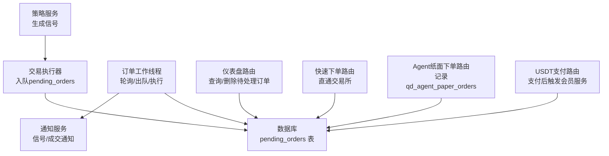
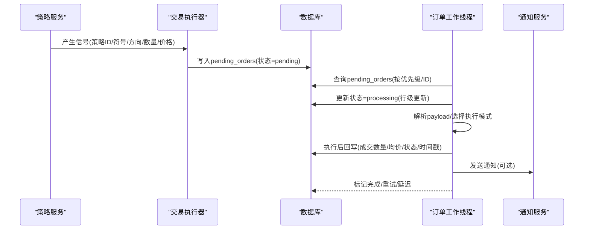
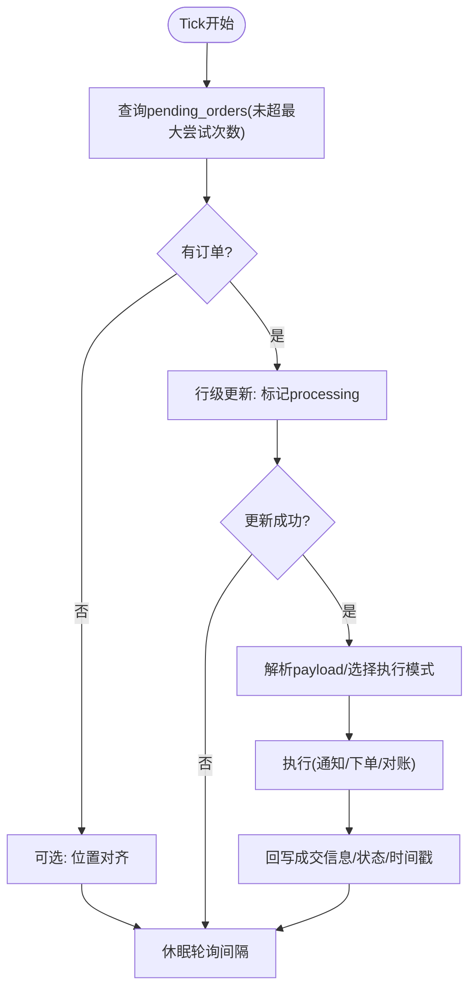
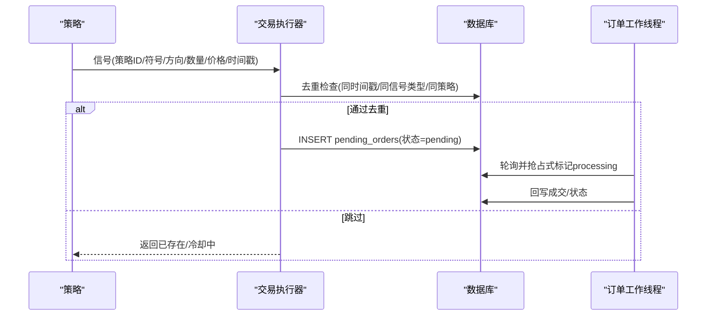
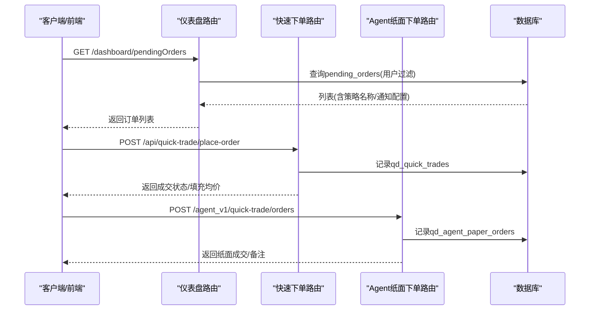
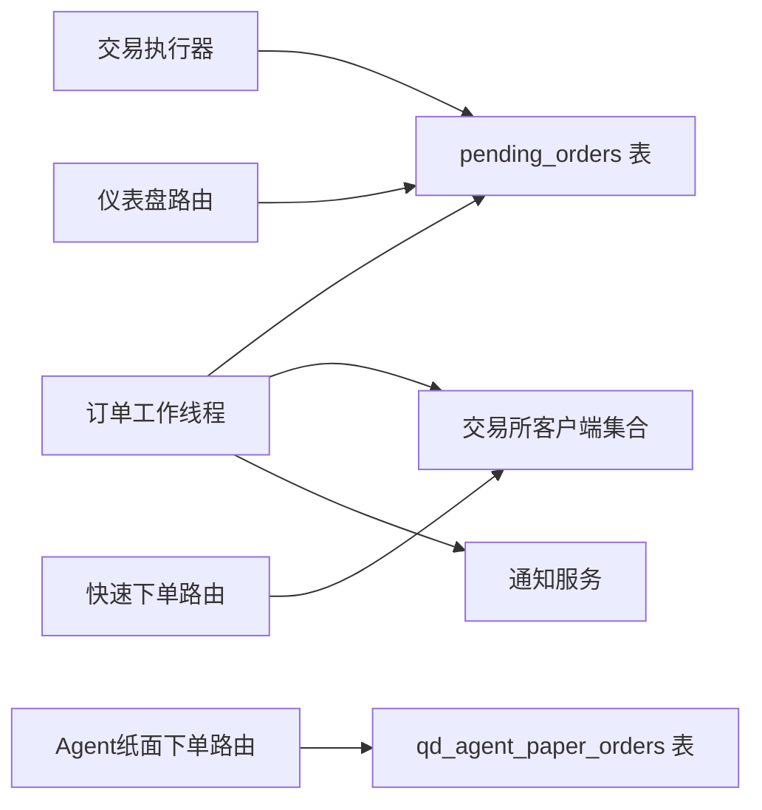

# 订单管理

<cite>
**本文引用的文件**
- [backend_api_python/app/services/pending_order_worker.py](file://backend_api_python/app/services/pending_order_worker.py)
- [backend_api_python/app/services/trading_executor.py](file://backend_api_python/app/services/trading_executor.py)
- [backend_api_python/app/routers/dashboard.py](file://backend_api_python/app/routers/dashboard.py)
- [backend_api_python/app/routers/quick_trade.py](file://backend_api_python/app/routers/quick_trade.py)
- [backend_api_python/app/routers/billing.py](file://backend_api_python/app/routers/billing.py)
- [backend_api_python/app/routers/agent_v1/quick_trade.py](file://backend_api_python/app/routers/agent_v1/quick_trade.py)
- [backend_api_python/app/utils/db.py](file://backend_api_python/app/utils/db.py)
- [backend_api_python/app/utils/logger.py](file://backend_api_python/app/utils/logger.py)
- [backend_api_python/app/__init__.py](file://backend_api_python/app/__init__.py)
- [backend_api_python/migrations/init.sql](file://backend_api_python/migrations/init.sql)
</cite>

## 目录
1. [简介](#简介)
2. [项目结构](#项目结构)
3. [核心组件](#核心组件)
4. [架构总览](#架构总览)
5. [详细组件分析](#详细组件分析)
6. [依赖分析](#依赖分析)
7. [性能考虑](#性能考虑)
8. [故障排查指南](#故障排查指南)
9. [结论](#结论)
10. [附录](#附录)

## 简介
本文件面向QuantDinger的订单管理系统，系统性阐述订单生命周期管理、状态流转与队列处理机制，覆盖订单创建、修改、取消与查询的完整流程，并说明持久化存储、内存缓存与并发安全的设计方案。文档还给出订单数据结构定义、字段含义与约束条件，以及订单路由策略、优先级管理与批量处理的技术细节，解释与订单工作线程的协作机制与异步处理模式。

## 项目结构
QuantDinger的订单管理由“策略信号生成”“待处理订单队列”“订单工作线程”“通知与回放”“前端仪表盘”等模块协同完成。核心文件包括：
- 订单工作线程：负责轮询、出队、落库、执行与通知
- 交易执行器：将策略信号转换为待处理订单并入队
- 路由层：提供快速下单、查询待处理订单、删除待处理订单等接口
- 数据库：定义pending_orders等核心表结构
- 工具与初始化：数据库连接、日志、应用工厂与工作线程启动

图示来源
- [backend_api_python/app/services/pending_order_worker.py](file://backend_api_python/app/services/pending_order_worker.py)
- [backend_api_python/app/services/trading_executor.py](file://backend_api_python/app/services/trading_executor.py)
- [backend_api_python/app/routers/dashboard.py](file://backend_api_python/app/routers/dashboard.py)
- [backend_api_python/app/routers/quick_trade.py](file://backend_api_python/app/routers/quick_trade.py)
- [backend_api_python/app/routers/agent_v1/quick_trade.py](file://backend_api_python/app/routers/agent_v1/quick_trade.py)
- [backend_api_python/migrations/init.sql](file://backend_api_python/migrations/init.sql)

章节来源
- [backend_api_python/app/__init__.py](file://backend_api_python/app/__init__.py)
- [backend_api_python/migrations/init.sql](file://backend_api_python/migrations/init.sql)

## 核心组件
- 订单工作线程（PendingOrderWorker）
  - 定时轮询pending_orders表，按优先级与ID顺序取出待处理订单
  - 使用数据库行级更新实现“仅一次”抢占式出队，避免重复执行
  - 支持“过期回收”：将超时未完成的processing订单重置为pending
  - 支持位置对齐（position sync）：定期与交易所对账，修正本地持仓
  - 执行完成后根据execution_mode决定是否发送通知或真实下单
- 交易执行器（TradingExecutor）
  - 将策略信号转换为待处理订单，写入pending_orders
  - 提供去重与冷却控制，避免同一根K线内重复入队
  - 支持“信号模式”与“实盘模式”，实盘模式下由工作线程执行
- 路由与界面
  - 仪表盘路由：查询与删除待处理订单
  - 快速下单路由：直接向交易所提交市价/限价单（非策略驱动）
  - Agent纸面下单路由：记录纸面订单，不触碰真实资金
  - USDT支付路由：会员购买流程，支付成功后触发服务

章节来源
- [backend_api_python/app/services/pending_order_worker.py](file://backend_api_python/app/services/pending_order_worker.py)
- [backend_api_python/app/services/trading_executor.py](file://backend_api_python/app/services/trading_executor.py)
- [backend_api_python/app/routers/dashboard.py](file://backend_api_python/app/routers/dashboard.py)
- [backend_api_python/app/routers/quick_trade.py](file://backend_api_python/app/routers/quick_trade.py)
- [backend_api_python/app/routers/agent_v1/quick_trade.py](file://backend_api_python/app/routers/agent_v1/quick_trade.py)
- [backend_api_python/app/routers/billing.py](file://backend_api_python/app/routers/billing.py)

## 架构总览
订单管理采用“信号驱动+队列异步执行”的架构。策略产生信号后，由交易执行器入队至pending_orders；订单工作线程周期性扫描并执行，执行结果回写数据库并触发通知。快速下单与Agent纸面下单走独立路径，不进入pending_orders队列。

图示来源
- [backend_api_python/app/services/trading_executor.py](file://backend_api_python/app/services/trading_executor.py)
- [backend_api_python/app/services/pending_order_worker.py](file://backend_api_python/app/services/pending_order_worker.py)

## 详细组件分析

### 组件A：订单工作线程（PendingOrderWorker）
- 轮询与批处理
  - 以固定轮询间隔扫描pending_orders，按priority降序、id升序取出batch_size条记录
  - 对每个订单先尝试“仅一次”抢占式标记为processing，再执行
- 过期回收
  - 若订单长时间处于processing且未更新，则自动重置为pending，避免死锁
- 执行模式
  - signal：仅发送通知，不真实下单
  - live：真实下单（由具体交易所客户端实现）
- 位置对齐（Position Sync）
  - 定期与交易所对账，修正本地持仓大小与开仓价，清理“幽灵持仓”
  - 支持多交易所客户端，按策略配置动态创建
- 并发与一致性
  - 抢占式更新使用数据库事务与行级更新，确保唯一性
  - 失败时记录last_error，最多重试max_attempts次

图示来源
- [backend_api_python/app/services/pending_order_worker.py](file://backend_api_python/app/services/pending_order_worker.py)

章节来源
- [backend_api_python/app/services/pending_order_worker.py](file://backend_api_python/app/services/pending_order_worker.py)

### 组件B：交易执行器（TradingExecutor）
- 入队逻辑
  - 将策略信号封装为payload，写入pending_orders，状态初始为pending
  - 提供严格去重：若同一策略、符号、信号类型在同一信号时间戳内已有未完成订单，则跳过
  - 提供宽松去重：若最近cooldown秒内已有未完成订单，也跳过
- 执行模式
  - execution_mode为signal：仅入队不执行
  - execution_mode为live：入队后由工作线程真实下单
- 返回语义
  - 实盘模式返回“已入队pending_orders”的标识，纸面成交即时完成

图示来源
- [backend_api_python/app/services/trading_executor.py](file://backend_api_python/app/services/trading_executor.py)

章节来源
- [backend_api_python/app/services/trading_executor.py](file://backend_api_python/app/services/trading_executor.py)

### 组件C：路由与查询（仪表盘、快速下单、Agent纸面下单）
- 仪表盘路由
  - 查询当前用户的待处理订单列表，支持分页与排序
  - 删除待处理订单（不可删除正在处理中的订单）
- 快速下单路由
  - 用户直接发起市价/限价单，直接对接交易所客户端
  - 记录qd_quick_trades以便回看与审计
- Agent纸面下单路由
  - 在Agent授权下记录qd_agent_paper_orders，不触碰真实资金
  - 可通过Kill Switch撤销未成交纸面订单

图示来源
- [backend_api_python/app/routers/dashboard.py](file://backend_api_python/app/routers/dashboard.py)
- [backend_api_python/app/routers/quick_trade.py](file://backend_api_python/app/routers/quick_trade.py)
- [backend_api_python/app/routers/agent_v1/quick_trade.py](file://backend_api_python/app/routers/agent_v1/quick_trade.py)

章节来源
- [backend_api_python/app/routers/dashboard.py](file://backend_api_python/app/routers/dashboard.py)
- [backend_api_python/app/routers/quick_trade.py](file://backend_api_python/app/routers/quick_trade.py)
- [backend_api_python/app/routers/agent_v1/quick_trade.py](file://backend_api_python/app/routers/agent_v1/quick_trade.py)

### 组件D：USDT支付与订单工作线程协作
- USDT支付路由
  - 创建订单并派生链上收款地址，等待链上确认
  - 支付完成后触发会员服务（此处与订单队列解耦）
- 订单工作线程
  - 专注于pending_orders队列的扫描与执行，不参与链上支付流程
  - 两者通过独立的服务与表结构协作

章节来源
- [backend_api_python/app/routers/billing.py](file://backend_api_python/app/routers/billing.py)
- [backend_api_python/app/services/pending_order_worker.py](file://backend_api_python/app/services/pending_order_worker.py)

## 依赖分析
- 组件耦合
  - 交易执行器与订单工作线程通过数据库表pending_orders耦合，无直接函数调用
  - 通知服务与工作线程松耦合，通过payload与策略配置传递参数
- 外部依赖
  - 交易所客户端：Binance/OKX/Bybit/Gate/Kraken等，按策略配置动态创建
  - 数据库：PostgreSQL，提供事务与索引保障
  - 日志与数据库工具：统一的日志与连接管理

图示来源
- [backend_api_python/app/services/trading_executor.py](file://backend_api_python/app/services/trading_executor.py)
- [backend_api_python/app/services/pending_order_worker.py](file://backend_api_python/app/services/pending_order_worker.py)
- [backend_api_python/migrations/init.sql](file://backend_api_python/migrations/init.sql)

章节来源
- [backend_api_python/app/services/trading_executor.py](file://backend_api_python/app/services/trading_executor.py)
- [backend_api_python/app/services/pending_order_worker.py](file://backend_api_python/app/services/pending_order_worker.py)
- [backend_api_python/migrations/init.sql](file://backend_api_python/migrations/init.sql)

## 性能考虑
- 批量与轮询
  - 工作线程以batch_size批量出队，减少频繁查询与上下文切换
  - 轮询间隔可通过环境变量调整，平衡吞吐与延迟
- 去重与冷却
  - 严格去重基于信号时间戳，避免同一根K线重复入队
  - 宽松去重基于cooldown秒数，防止策略抖动导致队列风暴
- 位置对齐频率
  - position sync可配置开关与周期，避免高频查询影响主流程
- 数据库索引
  - pending_orders表具备user_id/status/strategy_id等索引，提升查询效率

## 故障排查指南
- 订单卡在pending
  - 检查是否存在长时间未更新的processing订单，工作线程会自动回收
  - 查看last_error字段定位失败原因
- 无法删除待处理订单
  - 正在处理中的订单不允许删除，需等待处理完成或等待回收
- 通知未送达
  - 检查策略的notification_config与各通知通道配置
  - 查看工作线程日志中通知发送结果
- 位置对齐异常
  - 检查交易所凭据与网络连通性
  - 关注fatal错误（如认证失败）是否导致策略自动停止

章节来源
- [backend_api_python/app/services/pending_order_worker.py](file://backend_api_python/app/services/pending_order_worker.py)
- [backend_api_python/app/routers/dashboard.py](file://backend_api_python/app/routers/dashboard.py)

## 结论
QuantDinger的订单管理以“信号驱动+队列异步执行”为核心，通过交易执行器与订单工作线程的分工协作，实现了高可靠、可扩展的订单生命周期管理。配合严格的去重、冷却与位置对齐机制，系统在复杂多交易所环境下保持稳定运行。仪表盘与快速下单路由提供了完善的查询与操作能力，满足不同用户场景的需求。

## 附录

### 订单数据结构定义与字段说明
- 表名：pending_orders
- 字段与约束（节选）
  - id：自增主键
  - user_id：外键qd_users，删除级联
  - strategy_id：外键qd_strategies_trading，删除置空
  - symbol：标的符号
  - signal_type：信号类型（如open_long/open_short等）
  - signal_ts：信号时间戳（用于严格去重）
  - market_type：市场类型（swap/spot等）
  - order_type：订单类型（market/limit等）
  - amount/price：数量与价格
  - execution_mode：执行模式（signal/live）
  - status：状态（pending/processing/completed/failed/deferred）
  - priority：优先级（数值越大越先出队）
  - attempts/max_attempts：尝试次数与最大尝试次数
  - last_error：最后一次错误信息
  - payload_json：序列化的payload
  - dispatch_note：调度备注
  - exchange_id/exchange_order_id：交易所ID与交易所订单号
  - exchange_response_json：交易所响应
  - filled/avg_price/executed_at：成交数量/均价/执行时间
  - created_at/updated_at/processed_at/sent_at：时间戳

章节来源
- [backend_api_python/migrations/init.sql](file://backend_api_python/migrations/init.sql)