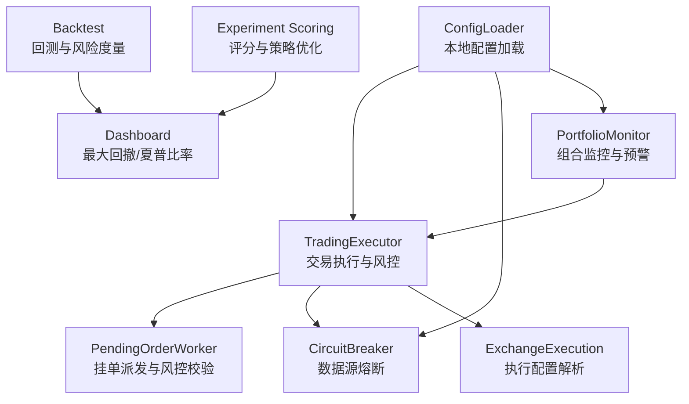
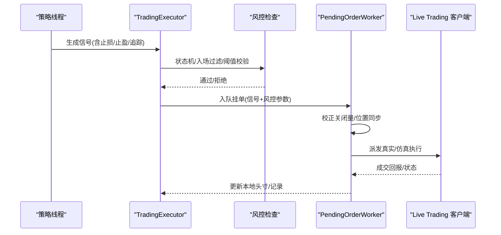
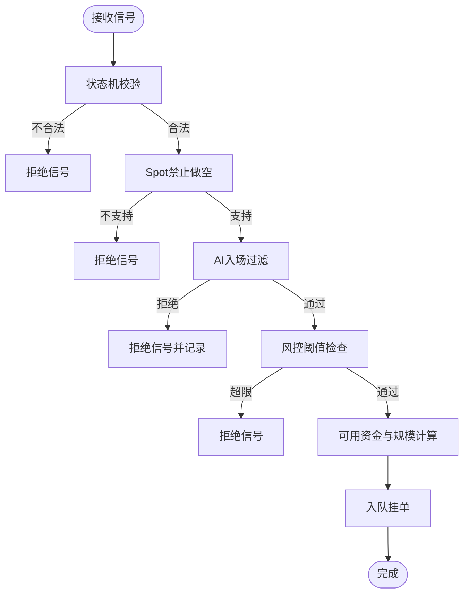
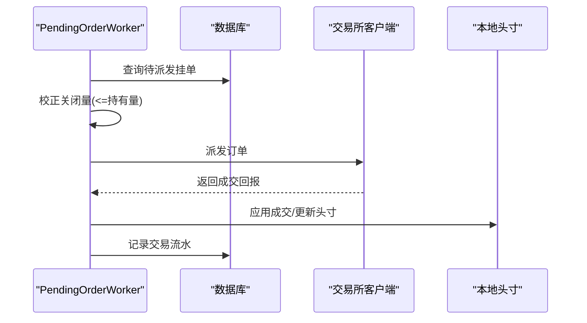
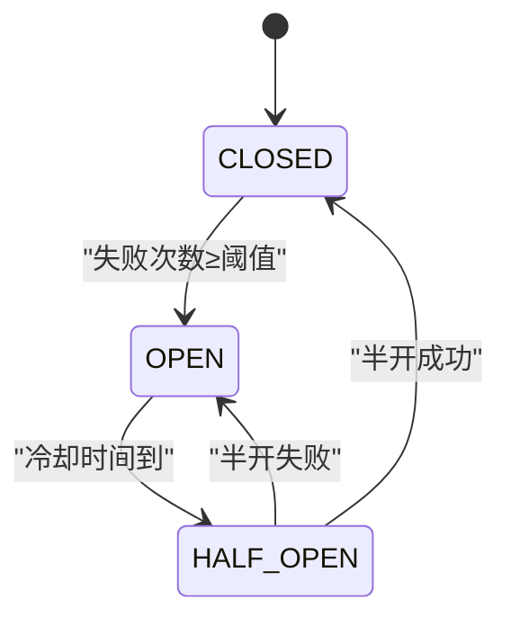
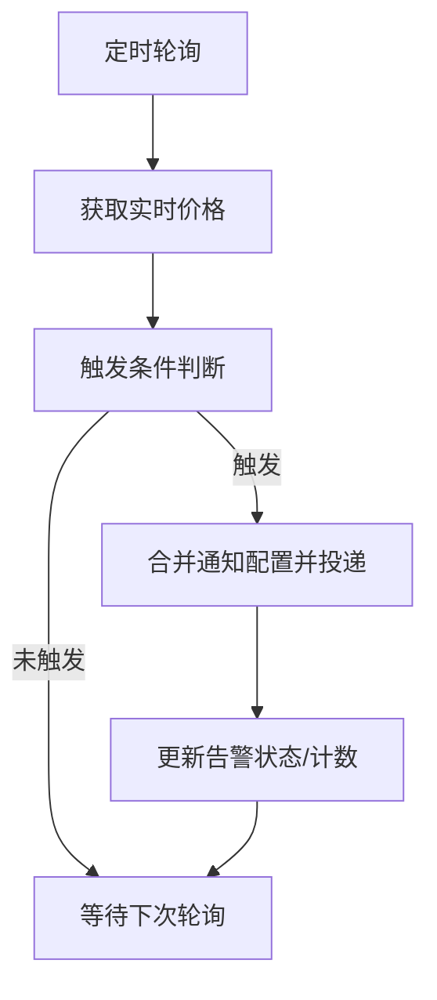
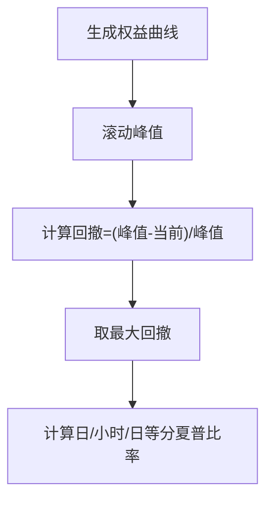
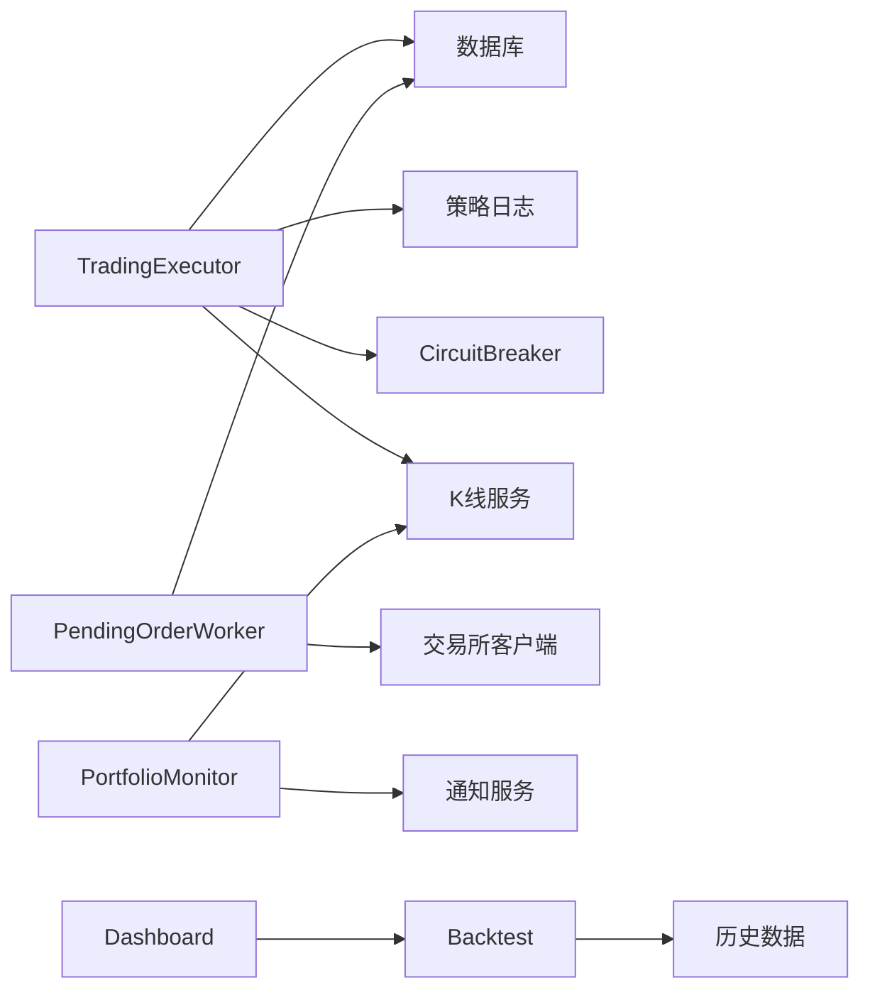

# 风险控制

<cite>
**本文引用的文件**
- [backend_api_python/app/services/trading_executor.py](file://backend_api_python/app/services/trading_executor.py)
- [backend_api_python/app/services/pending_order_worker.py](file://backend_api_python/app/services/pending_order_worker.py)
- [backend_api_python/app/data_sources/circuit_breaker.py](file://backend_api_python/app/data_sources/circuit_breaker.py)
- [backend_api_python/app/services/portfolio_monitor.py](file://backend_api_python/app/services/portfolio_monitor.py)
- [backend_api_python/app/services/backtest.py](file://backend_api_python/app/services/backtest.py)
- [backend_api_python/app/services/exchange_execution.py](file://backend_api_python/app/services/exchange_execution.py)
- [backend_api_python/app/utils/config_loader.py](file://backend_api_python/app/utils/config_loader.py)
- [backend_api_python/app/routes/dashboard.py](file://backend_api_python/app/routes/dashboard.py)
- [backend_api_python/app/services/experiment/scoring.py](file://backend_api_python/app/services/experiment/scoring.py)
</cite>

## 目录
1. [引言](#引言)
2. [项目结构](#项目结构)
3. [核心组件](#核心组件)
4. [架构总览](#架构总览)
5. [详细组件分析](#详细组件分析)
6. [依赖分析](#依赖分析)
7. [性能考虑](#性能考虑)
8. [故障排查指南](#故障排查指南)
9. [结论](#结论)
10. [附录](#附录)

## 引言
本文件面向QuantDinger的风险控制系统，聚焦实时风险监控、止损止盈与仓位管理、熔断机制、风控阈值与异常处理、资金管理与最大回撤控制、VaR风险度量、风险指标实时计算与预警、自动暂停交易、风控策略配置与动态调整以及与交易执行器的集成与风控信号传递机制。文档以代码为依据，结合可视化图示，帮助技术与非技术读者理解系统如何在实盘与仿真模式下实施风控。

## 项目结构
QuantDinger后端以服务化模块组织，风险控制相关能力主要分布在以下模块：
- 交易执行与风控：trading_executor、pending_order_worker
- 数据与熔断：circuit_breaker
- 组合监控与预警：portfolio_monitor
- 回测与风险度量：backtest、dashboard（最大回撤、夏普比率等）
- 执行辅助与配置：exchange_execution、config_loader
- 实验评分与策略优化：experiment/scoring

图表来源
- [backend_api_python/app/services/trading_executor.py](file://backend_api_python/app/services/trading_executor.py)
- [backend_api_python/app/services/pending_order_worker.py](file://backend_api_python/app/services/pending_order_worker.py)
- [backend_api_python/app/data_sources/circuit_breaker.py](file://backend_api_python/app/data_sources/circuit_breaker.py)
- [backend_api_python/app/services/portfolio_monitor.py](file://backend_api_python/app/services/portfolio_monitor.py)
- [backend_api_python/app/services/backtest.py](file://backend_api_python/app/services/backtest.py)
- [backend_api_python/app/services/exchange_execution.py](file://backend_api_python/app/services/exchange_execution.py)
- [backend_api_python/app/utils/config_loader.py](file://backend_api_python/app/utils/config_loader.py)
- [backend_api_python/app/routes/dashboard.py](file://backend_api_python/app/routes/dashboard.py)
- [backend_api_python/app/services/experiment/scoring.py](file://backend_api_python/app/services/experiment/scoring.py)

章节来源
- [backend_api_python/app/services/trading_executor.py](file://backend_api_python/app/services/trading_executor.py)
- [backend_api_python/app/services/pending_order_worker.py](file://backend_api_python/app/services/pending_order_worker.py)
- [backend_api_python/app/data_sources/circuit_breaker.py](file://backend_api_python/app/data_sources/circuit_breaker.py)
- [backend_api_python/app/services/portfolio_monitor.py](file://backend_api_python/app/services/portfolio_monitor.py)
- [backend_api_python/app/services/backtest.py](file://backend_api_python/app/services/backtest.py)
- [backend_api_python/app/services/exchange_execution.py](file://backend_api_python/app/services/exchange_execution.py)
- [backend_api_python/app/utils/config_loader.py](file://backend_api_python/app/utils/config_loader.py)
- [backend_api_python/app/routes/dashboard.py](file://backend_api_python/app/routes/dashboard.py)
- [backend_api_python/app/services/experiment/scoring.py](file://backend_api_python/app/services/experiment/scoring.py)

## 核心组件
- 交易执行与风控（TradingExecutor）
  - 信号过滤与状态机约束
  - 止损止盈与追踪止损参数构建
  - 资金可用性与头寸规模计算
  - 日内最大亏损与最大头寸限制
  - AI入场过滤与日志记录
- 挂单派发与风控校验（PendingOrderWorker）
  - 挂单批量派发与位置同步
  - 关闭信号按实际持有量校正
  - 参考价格与客户端交互
- 熔断机制（CircuitBreaker）
  - CLOSED/OPEN/HALF_OPEN状态机
  - 失败阈值、冷却时间、半开尝试次数
  - 实时行情熔断器严格策略
- 组合监控与预警（PortfolioMonitor）
  - 价格/盈亏预警触发与通知
  - 多语言消息模板与通知投递合并
- 回测与风险度量（Backtest/Dashboard）
  - 最大回撤、夏普比率、胜率、利润因子
  - 等级与稳定性评分
- 执行辅助与配置（ExchangeExecution/ConfigLoader）
  - 策略配置加载与密钥解密
  - 本地配置扁平到嵌套映射
- 实验评分与策略优化（Experiment Scoring）
  - 多指标加权综合评分与策略排序

章节来源
- [backend_api_python/app/services/trading_executor.py](file://backend_api_python/app/services/trading_executor.py)
- [backend_api_python/app/services/pending_order_worker.py](file://backend_api_python/app/services/pending_order_worker.py)
- [backend_api_python/app/data_sources/circuit_breaker.py](file://backend_api_python/app/data_sources/circuit_breaker.py)
- [backend_api_python/app/services/portfolio_monitor.py](file://backend_api_python/app/services/portfolio_monitor.py)
- [backend_api_python/app/services/backtest.py](file://backend_api_python/app/services/backtest.py)
- [backend_api_python/app/services/exchange_execution.py](file://backend_api_python/app/services/exchange_execution.py)
- [backend_api_python/app/utils/config_loader.py](file://backend_api_python/app/utils/config_loader.py)
- [backend_api_python/app/routes/dashboard.py](file://backend_api_python/app/routes/dashboard.py)
- [backend_api_python/app/services/experiment/scoring.py](file://backend_api_python/app/services/experiment/scoring.py)

## 架构总览
风险控制贯穿“策略信号→执行校验→挂单派发→执行/记录”的全链路，同时通过熔断器保护数据源，通过组合监控进行外部预警，通过回测与评分体系进行策略优化与风控参数验证。

图表来源
- [backend_api_python/app/services/trading_executor.py](file://backend_api_python/app/services/trading_executor.py)
- [backend_api_python/app/services/pending_order_worker.py](file://backend_api_python/app/services/pending_order_worker.py)

## 详细组件分析

### 交易执行与风控（TradingExecutor）
- 信号状态机与过滤
  - 严格的状态机：flat→open/add；long→add/reduce/close；short→add/reduce/close
  - 同K线去重：防止同一信号在多个tick重复下单
- 止损止盈与追踪止损
  - 将前端配置归一化为嵌套结构，包含止损比例、止盈比例与追踪止损开关、比例与激活比例
  - 回测中体现为路径价格低于止损价时按滑点与手续费计算收益与资金变化
- 资金管理与头寸规模
  - 可用资金基于初始资本、当前头寸与市价计算
  - 支持Bot脚本绝对USDT与比例两种下单方式
  - 现货/合约区分按市价与杠杆折算
- 风控阈值
  - 最大头寸价值限制：超过即拒绝开仓/加仓
  - 日内最大亏损限制：超过即阻断当日开仓/加仓
  - Spot市场禁止做空信号
- AI入场过滤
  - 对开仓信号进行AI决策拦截，记录浏览器通知事件

图表来源
- [backend_api_python/app/services/trading_executor.py](file://backend_api_python/app/services/trading_executor.py)

章节来源
- [backend_api_python/app/services/trading_executor.py](file://backend_api_python/app/services/trading_executor.py)
- [backend_api_python/app/services/backtest.py](file://backend_api_python/app/services/backtest.py)

### 挂单派发与风控校验（PendingOrderWorker）
- 批量拉取挂单并派发
- 关闭信号按实际持有量校正，避免超平
- 位置同步：定期与交易所对账，清理“幽灵”头寸
- 参考价格与客户端交互：如Binance永续标记价回退

图表来源
- [backend_api_python/app/services/pending_order_worker.py](file://backend_api_python/app/services/pending_order_worker.py)

章节来源
- [backend_api_python/app/services/pending_order_worker.py](file://backend_api_python/app/services/pending_order_worker.py)

### 熔断机制（CircuitBreaker）
- 状态机：CLOSED→OPEN→HALF_OPEN→CLOSED
- 参数：失败阈值、冷却时间、半开最大尝试
- 实时行情熔断器采用更严格阈值与冷却时间，保障系统在数据源异常时快速降级

图表来源
- [backend_api_python/app/data_sources/circuit_breaker.py](file://backend_api_python/app/data_sources/circuit_breaker.py)

章节来源
- [backend_api_python/app/data_sources/circuit_breaker.py](file://backend_api_python/app/data_sources/circuit_breaker.py)

### 组合监控与预警（PortfolioMonitor）
- 价格/盈亏预警：支持阈值触发与多语言消息
- 通知投递合并：合并用户个人中心通知配置，保证至少浏览器站内提醒
- 实时价格获取与PnL计算，支持分组与多币种

图表来源
- [backend_api_python/app/services/portfolio_monitor.py](file://backend_api_python/app/services/portfolio_monitor.py)

章节来源
- [backend_api_python/app/services/portfolio_monitor.py](file://backend_api_python/app/services/portfolio_monitor.py)

### 回测与风险度量（Backtest/Dashboard）
- 最大回撤：基于权益曲线计算最大回撤百分比
- 夏普比率：按时间尺度年化，过滤零值避免除零
- 胜率、利润因子、总收益、佣金统计
- Dashboard侧计算最大回撤与等指标，用于展示与对比

图表来源
- [backend_api_python/app/services/backtest.py](file://backend_api_python/app/services/backtest.py)
- [backend_api_python/app/routes/dashboard.py](file://backend_api_python/app/routes/dashboard.py)

章节来源
- [backend_api_python/app/services/backtest.py](file://backend_api_python/app/services/backtest.py)
- [backend_api_python/app/routes/dashboard.py](file://backend_api_python/app/routes/dashboard.py)

### 实验评分与策略优化（Experiment Scoring）
- 综合评分：返回/年化收益、夏普、胜率、最大回撤、稳定性、样本量等指标标准化与加权
- 策略排序与等级：支持按整体得分排序与等级划分
- 周期拟合度：按市场制度（牛市/熊市/震荡/高波动）估计策略适配度

章节来源
- [backend_api_python/app/services/experiment/scoring.py](file://backend_api_python/app/services/experiment/scoring.py)

### 执行辅助与配置（ExchangeExecution/ConfigLoader）
- 策略配置加载：从数据库读取并安全解密凭证
- 配置扁平到嵌套：兼容历史扁平键到嵌套结构映射
- 本地配置加载：从环境变量构建嵌套配置，避免从数据库读取敏感信息

章节来源
- [backend_api_python/app/services/exchange_execution.py](file://backend_api_python/app/services/exchange_execution.py)
- [backend_api_python/app/utils/config_loader.py](file://backend_api_python/app/utils/config_loader.py)

## 依赖分析
- 组件耦合
  - TradingExecutor依赖K线服务、数据库、策略日志与风控阈值配置
  - PendingOrderWorker依赖交易所客户端工厂与位置同步
  - PortfolioMonitor依赖K线服务与通知服务
  - Backtest与Dashboard依赖历史数据与回测结果
- 外部依赖
  - 交易所客户端库（按平台实现）
  - 数据源熔断器
  - 本地配置与凭证解密

图表来源
- [backend_api_python/app/services/trading_executor.py](file://backend_api_python/app/services/trading_executor.py)
- [backend_api_python/app/services/pending_order_worker.py](file://backend_api_python/app/services/pending_order_worker.py)
- [backend_api_python/app/data_sources/circuit_breaker.py](file://backend_api_python/app/data_sources/circuit_breaker.py)
- [backend_api_python/app/services/portfolio_monitor.py](file://backend_api_python/app/services/portfolio_monitor.py)
- [backend_api_python/app/services/backtest.py](file://backend_api_python/app/services/backtest.py)
- [backend_api_python/app/routes/dashboard.py](file://backend_api_python/app/routes/dashboard.py)

章节来源
- [backend_api_python/app/services/trading_executor.py](file://backend_api_python/app/services/trading_executor.py)
- [backend_api_python/app/services/pending_order_worker.py](file://backend_api_python/app/services/pending_order_worker.py)
- [backend_api_python/app/data_sources/circuit_breaker.py](file://backend_api_python/app/data_sources/circuit_breaker.py)
- [backend_api_python/app/services/portfolio_monitor.py](file://backend_api_python/app/services/portfolio_monitor.py)
- [backend_api_python/app/services/backtest.py](file://backend_api_python/app/services/backtest.py)
- [backend_api_python/app/routes/dashboard.py](file://backend_api_python/app/routes/dashboard.py)

## 性能考虑
- 线程与资源
  - TradingExecutor限制策略线程上限，避免OOM与线程耗尽
  - PendingOrderWorker批量派发与位置同步间隔可配置
- 缓存与去重
  - 价格缓存与同K线信号去重，降低重复下单与查询压力
- 数据源保护
  - 熔断器在失败阈值与冷却时间下快速降级，避免雪崩式重试
- 计算复杂度
  - 最大回撤与夏普比率计算为线性遍历，时间复杂度O(n)，适合大规模回测

## 故障排查指南
- 信号被拒
  - 检查状态机是否允许当前信号类型
  - 确认Spot市场不支持做空
  - 查看AI入场过滤是否拦截
  - 核对最大头寸与日内最大亏损阈值
- 挂单未成交
  - 检查挂单是否被PendingOrderWorker按持有量校正
  - 确认位置同步是否开启与最近同步时间
- 数据源异常
  - 熔断器状态是否OPEN/HALF_OPEN
  - 冷却时间是否到达
- 通知未送达
  - 检查用户通知配置与通道有效性
  - 确认至少保留浏览器站内通知

章节来源
- [backend_api_python/app/services/trading_executor.py](file://backend_api_python/app/services/trading_executor.py)
- [backend_api_python/app/services/pending_order_worker.py](file://backend_api_python/app/services/pending_order_worker.py)
- [backend_api_python/app/data_sources/circuit_breaker.py](file://backend_api_python/app/data_sources/circuit_breaker.py)
- [backend_api_python/app/services/portfolio_monitor.py](file://backend_api_python/app/services/portfolio_monitor.py)

## 结论
QuantDinger的风险控制体系以“信号→执行→派发→执行/记录”为主线，辅以熔断器、组合监控与回测评分，形成闭环。通过严格的信号状态机、风控阈值与资金管理，系统在仿真与实盘模式下均具备稳健的风控能力。建议持续优化阈值参数、完善熔断策略与通知覆盖，并结合实验评分体系进行策略迭代。

## 附录
- 风险控制策略配置要点
  - 止损/止盈/追踪止损参数需与回测一致
  - 最大头寸与日内最大亏损阈值按账户容量设定
  - Spot与合约差异下的下单方式与规模计算
- 动态调整与策略组合优化
  - 基于实验评分与回测指标动态调整参数
  - 按市场制度（牛市/熊市/震荡/高波动）选择适配策略
- 与交易执行器的集成
  - 通过挂单队列与位置同步实现风控信号落地
  - 通过熔断器与通知服务提升鲁棒性与可观测性