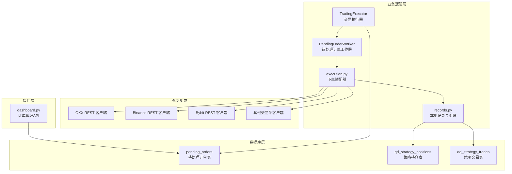
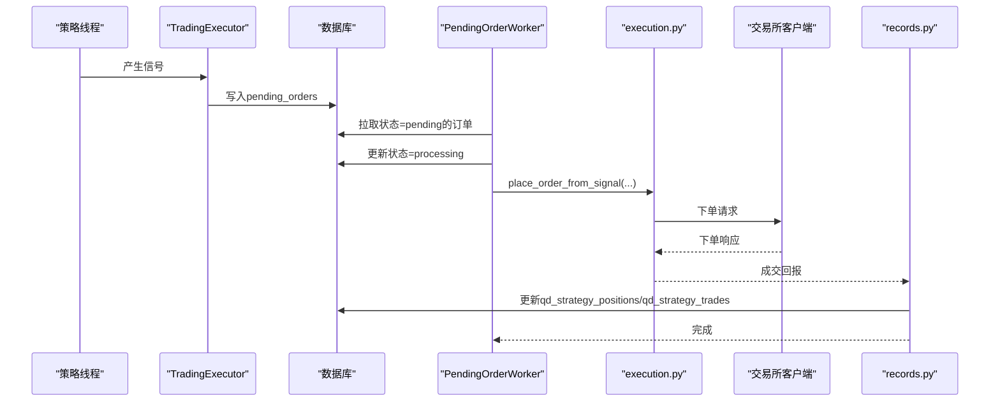
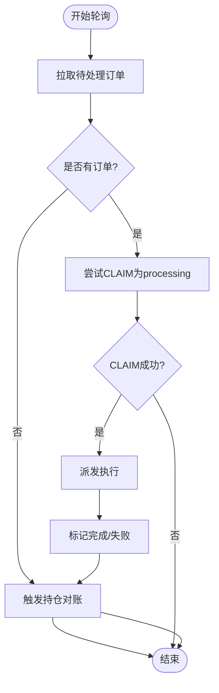
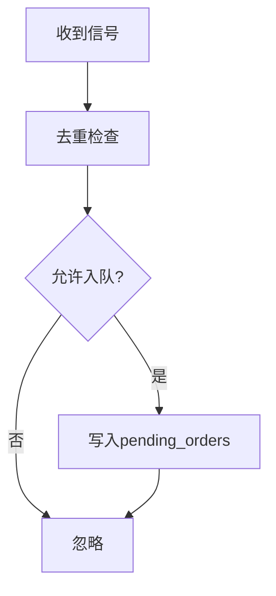
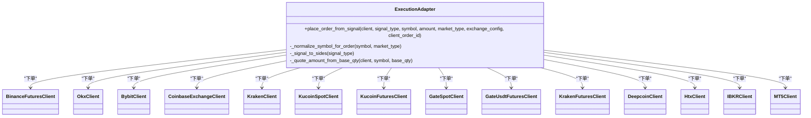
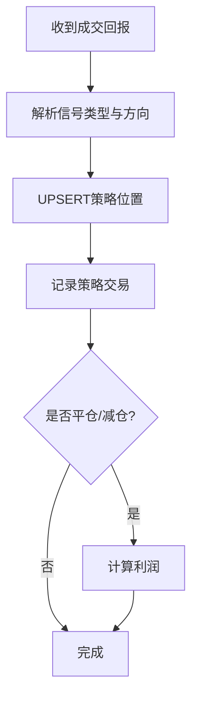
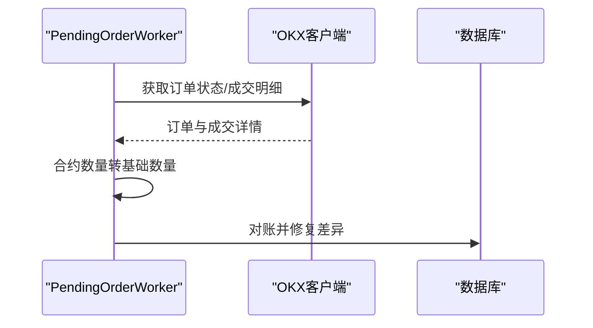
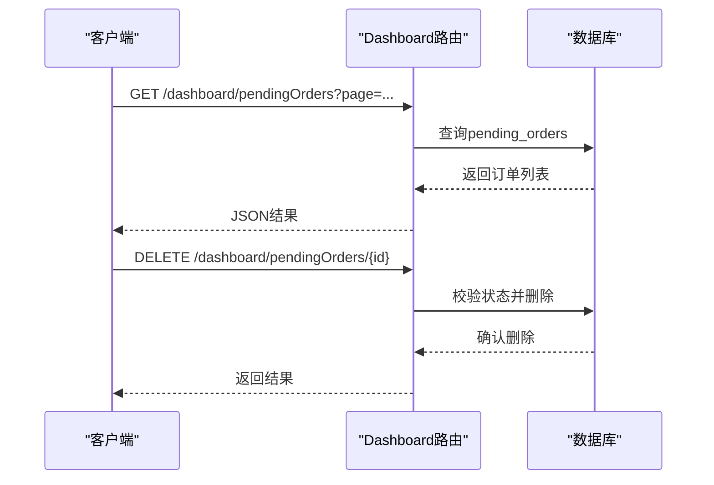
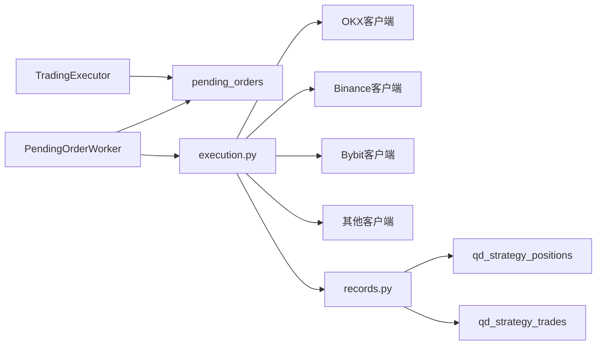

# 订单管理系统

<cite>
**本文档引用的文件**
- [init.sql](file://backend_api_python/migrations/init.sql)
- [pending_order_worker.py](file://backend_api_python/app/services/pending_order_worker.py)
- [trading_executor.py](file://backend_api_python/app/services/trading_executor.py)
- [records.py](file://backend_api_python/app/services/live_trading/records.py)
- [execution.py](file://backend_api_python/app/services/live_trading/execution.py)
- [dashboard.py](file://backend_api_python/app/routes/dashboard.py)
- [okx.py](file://backend_api_python/app/services/live_trading/okx.py)
</cite>

## 目录
1. [简介](#简介)
2. [项目结构](#项目结构)
3. [核心组件](#核心组件)
4. [架构总览](#架构总览)
5. [详细组件分析](#详细组件分析)
6. [依赖分析](#依赖分析)
7. [性能考虑](#性能考虑)
8. [故障排除指南](#故障排除指南)
9. [结论](#结论)

## 简介
本文件为QuantDinger订单管理系统的专业技术文档，聚焦于订单状态跟踪、执行记录与历史数据管理的实现架构。文档涵盖订单生命周期内的状态转换、事件触发与回调机制，阐述订单去重、幂等性与一致性保障方案，并提供订单查询、修改与取消的API接口说明。同时，文档给出订单存储结构、索引设计与查询优化策略，解释与外部交易所的订单同步、冲突解决与异常处理机制。

## 项目结构
QuantDinger的订单管理相关代码主要分布在以下模块：
- 数据库迁移与表结构定义：用于定义订单队列表、策略位置表、策略交易表等
- 实时交易执行器：负责策略信号生成与订单入队
- 待处理订单工作器：轮询待处理订单并执行实际下单
- 交易所执行层：封装各交易所REST接口与下单逻辑
- 本地记录与对账：维护本地策略位置与交易记录
- Dashboard路由：提供订单查询、删除等管理接口

**图示来源**
- [init.sql:309-338](file://backend_api_python/migrations/init.sql#L309-L338)
- [pending_order_worker.py:52-122](file://backend_api_python/app/services/pending_order_worker.py#L52-L122)
- [execution.py:123-310](file://backend_api_python/app/services/live_trading/execution.py#L123-L310)
- [records.py:85-125](file://backend_api_python/app/services/live_trading/records.py#L85-L125)
- [dashboard.py:713-744](file://backend_api_python/app/routes/dashboard.py#L713-L744)

**章节来源**
- [init.sql:309-338](file://backend_api_python/migrations/init.sql#L309-L338)
- [pending_order_worker.py:52-122](file://backend_api_python/app/services/pending_order_worker.py#L52-L122)
- [execution.py:123-310](file://backend_api_python/app/services/live_trading/execution.py#L123-L310)
- [records.py:85-125](file://backend_api_python/app/services/live_trading/records.py#L85-L125)
- [dashboard.py:713-744](file://backend_api_python/app/routes/dashboard.py#L713-L744)

## 核心组件
- 待处理订单队列表（pending_orders）
  - 字段覆盖用户、策略、信号、市场类型、订单类型、数量、价格、优先级、重试次数、错误信息、交易所ID与订单ID、成交数量与均价、时间戳等
  - 索引包括用户ID、状态、策略ID，支撑按状态批量拉取与过滤
- 策略位置表（qd_strategy_positions）
  - 记录策略的持仓方向、数量、开仓均价、当前价、最高/最低价等
  - 唯一键约束（策略ID+符号+方向），支持UPSERT更新
- 策略交易表（qd_strategy_trades）
  - 记录每笔成交的价格、数量、价值、手续费、利润等
  - 提供按策略、时间等维度的查询索引

**章节来源**
- [init.sql:309-338](file://backend_api_python/migrations/init.sql#L309-L338)
- [init.sql:261-277](file://backend_api_python/migrations/init.sql#L261-L277)
- [init.sql:286-299](file://backend_api_python/migrations/init.sql#L286-L299)

## 架构总览
订单管理采用“信号入队 + 异步执行”的解耦架构：
- TradingExecutor将策略信号转换为待处理订单并写入pending_orders
- PendingOrderWorker周期性拉取待处理订单，标记为processing并调用交易所客户端下单
- 执行完成后，通过records模块更新本地策略位置与交易记录
- Dashboard提供订单查询与删除等管理接口

**图示来源**
- [trading_executor.py:395-495](file://backend_api_python/app/services/trading_executor.py#L395-L495)
- [pending_order_worker.py:752-798](file://backend_api_python/app/services/pending_order_worker.py#L752-L798)
- [execution.py:123-310](file://backend_api_python/app/services/live_trading/execution.py#L123-L310)
- [records.py:186-277](file://backend_api_python/app/services/live_trading/records.py#L186-L277)

## 详细组件分析

### 组件A：待处理订单工作器（PendingOrderWorker）
- 轮询策略：从pending_orders按优先级与ID顺序拉取待处理订单
- 幂等与重试：通过“CLAIM”更新（status=pending → processing）避免重复处理；超时自动回滚为pending
- 交易所同步：定期对策略持仓进行最佳努力对账，清理“幽灵持仓”，补充缺失的本地记录
- 错误处理：捕获异常并记录，必要时自动停止策略以避免无限重试

**图示来源**
- [pending_order_worker.py:99-121](file://backend_api_python/app/services/pending_order_worker.py#L99-L121)
- [pending_order_worker.py:752-798](file://backend_api_python/app/services/pending_order_worker.py#L752-L798)

**章节来源**
- [pending_order_worker.py:52-122](file://backend_api_python/app/services/pending_order_worker.py#L52-L122)
- [pending_order_worker.py:752-823](file://backend_api_python/app/services/pending_order_worker.py#L752-L823)

### 组件B：交易执行器（TradingExecutor）
- 信号去重：基于策略ID、符号、信号类型、信号时间戳的内存去重，避免同一K线信号重复下单
- 线程管理：限制最大策略线程数，防止资源耗尽
- 配置构建：将交易配置转换为脚本可读的嵌套结构，支持网格/定投等机器人策略
- 日志与资源监控：输出资源状态，辅助定位线程/内存问题

**图示来源**
- [trading_executor.py:241-290](file://backend_api_python/app/services/trading_executor.py#L241-L290)
- [trading_executor.py:395-455](file://backend_api_python/app/services/trading_executor.py#L395-L455)

**章节来源**
- [trading_executor.py:241-290](file://backend_api_python/app/services/trading_executor.py#L241-L290)
- [trading_executor.py:395-455](file://backend_api_python/app/services/trading_executor.py#L395-L455)

### 组件C：交易所执行适配器（execution.py）
- 符号规范化：统一处理裸符号、不同报价货币等格式
- 信号映射：将策略信号映射为交易所侧的买卖方向与减仓标志
- 客户端适配：针对不同交易所（Binance、OKX、Bybit、Coinbase、Kraken、KuCoin、Gate、HTX、IBKR、MT5）选择对应下单方法
- 错误处理：对不支持的信号或市场类型抛出明确错误

**图示来源**
- [execution.py:41-83](file://backend_api_python/app/services/live_trading/execution.py#L41-L83)
- [execution.py:85-101](file://backend_api_python/app/services/live_trading/execution.py#L85-L101)
- [execution.py:123-310](file://backend_api_python/app/services/live_trading/execution.py#L123-L310)

**章节来源**
- [execution.py:123-310](file://backend_api_python/app/services/live_trading/execution.py#L123-L310)

### 组件D：本地记录与对账（records.py）
- 符号标准化：统一符号格式，兼容多种输入形式
- 位置增删改：通过ON CONFLICT UPSERT维护策略位置，支持权重平均开仓价与最高/最低价更新
- 成交记录：插入策略交易记录，计算价值与手续费
- 填充应用：根据成交回报更新本地位置，支持开仓/加仓/减仓/平仓的利润计算

**图示来源**
- [records.py:186-277](file://backend_api_python/app/services/live_trading/records.py#L186-L277)
- [records.py:150-184](file://backend_api_python/app/services/live_trading/records.py#L150-L184)
- [records.py:85-125](file://backend_api_python/app/services/live_trading/records.py#L85-L125)

**章节来源**
- [records.py:186-277](file://backend_api_python/app/services/live_trading/records.py#L186-L277)
- [records.py:150-184](file://backend_api_python/app/services/live_trading/records.py#L150-L184)
- [records.py:85-125](file://backend_api_python/app/services/live_trading/records.py#L85-L125)

### 组件E：与外部交易所的订单同步与冲突解决（以OKX为例）
- 订单轮询与聚合：优先使用成交明细接口聚合成交数量、成交均价与手续费，提升准确性
- 合约乘数转换：将合约数量转换为基础币数量，确保与系统内部一致
- 冲突解决：当本地记录与交易所不一致时，通过最佳努力对账（删除、更新、插入）保持一致

**图示来源**
- [okx.py:779-827](file://backend_api_python/app/services/live_trading/okx.py#L779-L827)
- [pending_order_worker.py:324-414](file://backend_api_python/app/services/pending_order_worker.py#L324-L414)

**章节来源**
- [okx.py:779-827](file://backend_api_python/app/services/live_trading/okx.py#L779-L827)
- [pending_order_worker.py:324-414](file://backend_api_python/app/services/pending_order_worker.py#L324-L414)

### 组件F：订单查询、修改与取消API
- 查询待处理订单：支持分页与条件过滤
- 删除待处理订单：仅允许删除非processing状态的订单，避免破坏执行流程

**图示来源**
- [dashboard.py:700-711](file://backend_api_python/app/routes/dashboard.py#L700-L711)
- [dashboard.py:713-744](file://backend_api_python/app/routes/dashboard.py#L713-L744)

**章节来源**
- [dashboard.py:700-711](file://backend_api_python/app/routes/dashboard.py#L700-L711)
- [dashboard.py:713-744](file://backend_api_python/app/routes/dashboard.py#L713-L744)

## 依赖分析
- 组件耦合
  - TradingExecutor与PendingOrderWorker通过数据库表进行解耦，降低耦合度
  - execution.py作为适配层，屏蔽各交易所差异
  - records.py与数据库表强耦合，负责本地状态一致性
- 外部依赖
  - 各交易所REST客户端（Binance、OKX、Bybit等）
  - PostgreSQL数据库（索引与事务）

**图示来源**
- [trading_executor.py:395-455](file://backend_api_python/app/services/trading_executor.py#L395-L455)
- [pending_order_worker.py:52-122](file://backend_api_python/app/services/pending_order_worker.py#L52-L122)
- [execution.py:123-310](file://backend_api_python/app/services/live_trading/execution.py#L123-L310)
- [records.py:150-184](file://backend_api_python/app/services/live_trading/records.py#L150-L184)

**章节来源**
- [trading_executor.py:395-455](file://backend_api_python/app/services/trading_executor.py#L395-L455)
- [pending_order_worker.py:52-122](file://backend_api_python/app/services/pending_order_worker.py#L52-L122)
- [execution.py:123-310](file://backend_api_python/app/services/live_trading/execution.py#L123-L310)
- [records.py:150-184](file://backend_api_python/app/services/live_trading/records.py#L150-L184)

## 性能考虑
- 去重与限流
  - TradingExecutor使用内存去重桶，避免同一K线信号重复下单
  - 限制策略线程数量，防止资源耗尽
- 数据库访问
  - pending_orders按状态与优先级索引，支持高效批量拉取
  - 本地位置表使用唯一键UPSERT，减少查询开销
- I/O优化
  - USDT订单查询采用短事务读取，避免长时间持有连接
  - 交易所对账采用最佳努力策略，降低失败重试成本

## 故障排除指南
- 订单卡在processing
  - 检查PendingOrderWorker的CLAIM逻辑与超时回滚设置
  - 查看数据库中对应订单的updated_at与attempts
- 下单失败
  - 检查execution.py中的信号映射与市场类型校验
  - 核对交易所客户端配置与权限
- 本地位置不一致
  - 触发PendingOrderWorker的持仓对账逻辑
  - 检查records.py的UPSERT与成交回报处理
- 删除订单被拒绝
  - 确认订单状态不是processing，否则需等待执行完成

**章节来源**
- [pending_order_worker.py:752-823](file://backend_api_python/app/services/pending_order_worker.py#L752-L823)
- [execution.py:123-310](file://backend_api_python/app/services/live_trading/execution.py#L123-L310)
- [records.py:150-184](file://backend_api_python/app/services/live_trading/records.py#L150-L184)
- [dashboard.py:713-744](file://backend_api_python/app/routes/dashboard.py#L713-L744)

## 结论
QuantDinger的订单管理系统通过“信号入队 + 异步执行 + 本地记录 + 交易所对账”的架构，实现了高可靠、可扩展的订单生命周期管理。系统在去重、幂等性与一致性方面提供了完善的保障，并通过索引与查询优化提升了整体性能。与外部交易所的对接采用适配器模式，便于扩展与维护。