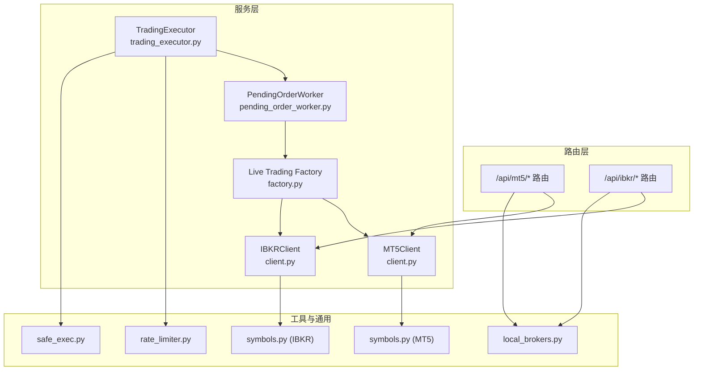
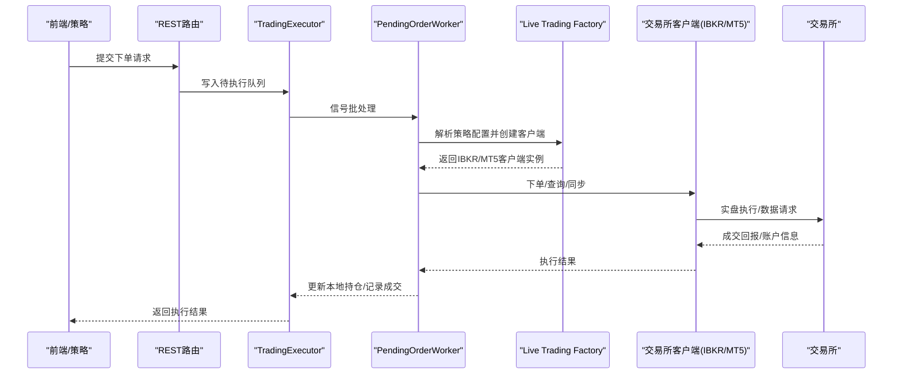
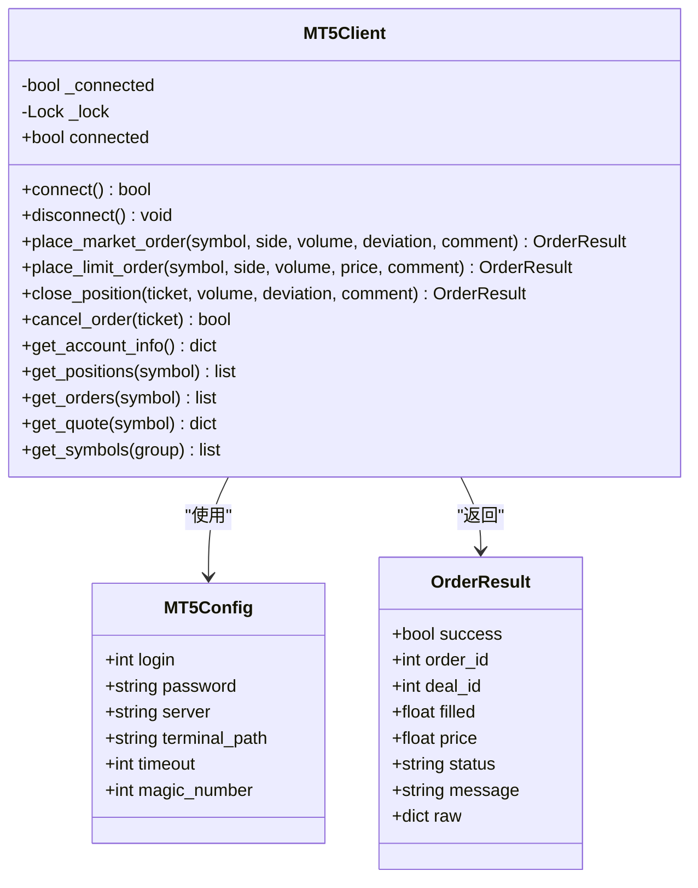
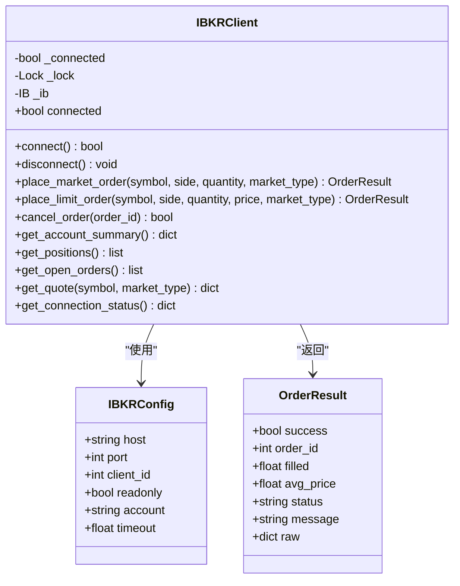
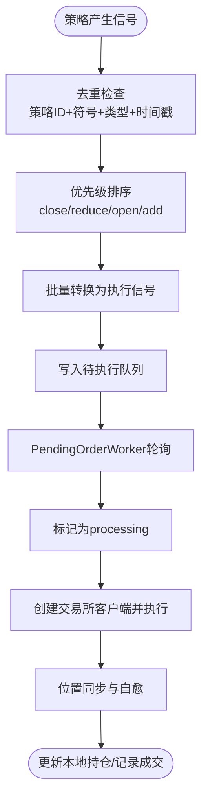
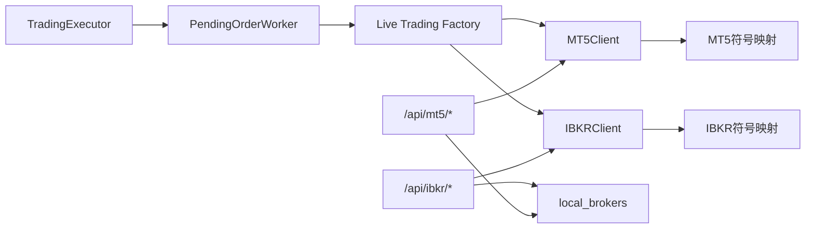

# 高级交易集成

<cite>
**本文档引用的文件**
- [backend_api_python/app/services/mt5_trading/client.py](file://backend_api_python/app/services/mt5_trading/client.py)
- [backend_api_python/app/services/ibkr_trading/client.py](file://backend_api_python/app/services/ibkr_trading/client.py)
- [backend_api_python/app/routers/mt5.py](file://backend_api_python/app/routers/mt5.py)
- [backend_api_python/app/routers/ibkr.py](file://backend_api_python/app/routers/ibkr.py)
- [backend_api_python/app/services/live_trading/factory.py](file://backend_api_python/app/services/live_trading/factory.py)
- [backend_api_python/app/services/mt5_trading/symbols.py](file://backend_api_python/app/services/mt5_trading/symbols.py)
- [backend_api_python/app/services/ibkr_trading/symbols.py](file://backend_api_python/app/services/ibkr_trading/symbols.py)
- [backend_api_python/app/utils/local_brokers.py](file://backend_api_python/app/utils/local_brokers.py)
- [backend_api_python/app/services/pending_order_worker.py](file://backend_api_python/app/services/pending_order_worker.py)
- [backend_api_python/app/services/trading_executor.py](file://backend_api_python/app/services/trading_executor.py)
- [backend_api_python/app/data_sources/rate_limiter.py](file://backend_api_python/app/data_sources/rate_limiter.py)
- [backend_api_python/app/utils/safe_exec.py](file://backend_api_python/app/utils/safe_exec.py)
- [docs/MT5_TRADING_GUIDE_EN.md](file://docs/MT5_TRADING_GUIDE_EN.md)
</cite>

## 目录
1. [简介](#简介)
2. [项目结构](#项目结构)
3. [核心组件](#核心组件)
4. [架构总览](#架构总览)
5. [详细组件分析](#详细组件分析)
6. [依赖关系分析](#依赖关系分析)
7. [性能考虑](#性能考虑)
8. [故障排除指南](#故障排除指南)
9. [结论](#结论)
10. [附录](#附录)

## 简介
本文件面向QuantDinger的高级交易集成功能，系统化阐述与MetaTrader 5（MT5）及Interactive Brokers（IBKR）等复杂交易系统的集成架构与实现细节。内容覆盖多交易所支持、订单路由与执行算法、实时数据订阅、批量下单与条件单、API认证与连接管理、错误处理与可靠性保障、性能优化与延迟控制、以及跨平台兼容与协议适配等主题。

## 项目结构
QuantDinger后端采用分层设计：
- 服务层：MT5与IBKR专用交易客户端、直连交易所工厂、挂单执行与位置同步工作器、交易执行器
- 路由层：REST API封装MT5与IBKR操作
- 工具与通用能力：本地桌面Broker开关、重试与超时保护、符号映射与解析

图示来源
- [backend_api_python/app/routers/mt5.py:1-439](file://backend_api_python/app/routers/mt5.py#L1-L439)
- [backend_api_python/app/routers/ibkr.py:1-383](file://backend_api_python/app/routers/ibkr.py#L1-L383)
- [backend_api_python/app/services/mt5_trading/client.py:1-858](file://backend_api_python/app/services/mt5_trading/client.py#L1-L858)
- [backend_api_python/app/services/ibkr_trading/client.py:1-555](file://backend_api_python/app/services/ibkr_trading/client.py#L1-L555)
- [backend_api_python/app/services/live_trading/factory.py:1-441](file://backend_api_python/app/services/live_trading/factory.py#L1-L441)
- [backend_api_python/app/services/pending_order_worker.py:1-800](file://backend_api_python/app/services/pending_order_worker.py#L1-L800)
- [backend_api_python/app/services/trading_executor.py:1-800](file://backend_api_python/app/services/trading_executor.py#L1-L800)
- [backend_api_python/app/utils/local_brokers.py:1-27](file://backend_api_python/app/utils/local_brokers.py#L1-L27)
- [backend_api_python/app/data_sources/rate_limiter.py:198-234](file://backend_api_python/app/data_sources/rate_limiter.py#L198-L234)
- [backend_api_python/app/utils/safe_exec.py:109-147](file://backend_api_python/app/utils/safe_exec.py#L109-L147)
- [backend_api_python/app/services/mt5_trading/symbols.py:1-145](file://backend_api_python/app/services/mt5_trading/symbols.py#L1-L145)
- [backend_api_python/app/services/ibkr_trading/symbols.py:1-62](file://backend_api_python/app/services/ibkr_trading/symbols.py#L1-L62)

章节来源
- [backend_api_python/app/routers/mt5.py:1-439](file://backend_api_python/app/routers/mt5.py#L1-L439)
- [backend_api_python/app/routers/ibkr.py:1-383](file://backend_api_python/app/routers/ibkr.py#L1-L383)
- [backend_api_python/app/services/mt5_trading/client.py:1-858](file://backend_api_python/app/services/mt5_trading/client.py#L1-L858)
- [backend_api_python/app/services/ibkr_trading/client.py:1-555](file://backend_api_python/app/services/ibkr_trading/client.py#L1-L555)
- [backend_api_python/app/services/live_trading/factory.py:1-441](file://backend_api_python/app/services/live_trading/factory.py#L1-L441)
- [backend_api_python/app/utils/local_brokers.py:1-27](file://backend_api_python/app/utils/local_brokers.py#L1-L27)

## 核心组件
- MT5Client：封装MetaTrader5 Python库，提供账户查询、订单提交、挂单管理、行情获取等功能，具备连接状态检测与自动重连保护
- IBKRClient：封装ib_insync库，提供账户摘要、持仓、挂单、报价等查询与下单能力，支持事件循环管理与异步特性
- Live Trading Factory：集中式交易所客户端工厂，按exchange_id选择具体实现，支持IBKR与MT5直连客户端创建
- PendingOrderWorker：轮询待执行订单队列，按策略配置创建对应交易所客户端并执行下单，同时进行位置同步与自愈
- TradingExecutor：策略信号生成与执行编排，负责去重、优先级排序、批量信号转换与执行
- 符号映射：MT5与IBKR符号规范化与解析，保证跨系统一致性
- 本地Broker开关：通过环境变量控制是否允许本地桌面Broker（IBKR TWS/IB Gateway、MT5终端）接入

章节来源
- [backend_api_python/app/services/mt5_trading/client.py:62-858](file://backend_api_python/app/services/mt5_trading/client.py#L62-L858)
- [backend_api_python/app/services/ibkr_trading/client.py:78-555](file://backend_api_python/app/services/ibkr_trading/client.py#L78-L555)
- [backend_api_python/app/services/live_trading/factory.py:126-441](file://backend_api_python/app/services/live_trading/factory.py#L126-L441)
- [backend_api_python/app/services/pending_order_worker.py:52-800](file://backend_api_python/app/services/pending_order_worker.py#L52-L800)
- [backend_api_python/app/services/trading_executor.py:37-800](file://backend_api_python/app/services/trading_executor.py#L37-L800)
- [backend_api_python/app/services/mt5_trading/symbols.py:33-145](file://backend_api_python/app/services/mt5_trading/symbols.py#L33-L145)
- [backend_api_python/app/services/ibkr_trading/symbols.py:10-62](file://backend_api_python/app/services/ibkr_trading/symbols.py#L10-L62)
- [backend_api_python/app/utils/local_brokers.py:14-27](file://backend_api_python/app/utils/local_brokers.py#L14-L27)

## 架构总览
QuantDinger的高级交易集成采用“策略信号 → 待执行队列 → 执行器 → 交易所客户端 → 实盘执行”的流水线架构。工厂根据策略配置动态创建IBKR或MT5客户端，执行器负责信号去重与批量转换，工作器负责订单投递与位置同步，路由层提供REST接口。

图示来源
- [backend_api_python/app/routers/mt5.py:256-332](file://backend_api_python/app/routers/mt5.py#L256-L332)
- [backend_api_python/app/routers/ibkr.py:228-312](file://backend_api_python/app/routers/ibkr.py#L228-L312)
- [backend_api_python/app/services/trading_executor.py:1464-1487](file://backend_api_python/app/services/trading_executor.py#L1464-L1487)
- [backend_api_python/app/services/pending_order_worker.py:107-121](file://backend_api_python/app/services/pending_order_worker.py#L107-L121)
- [backend_api_python/app/services/live_trading/factory.py:126-285](file://backend_api_python/app/services/live_trading/factory.py#L126-L285)

## 详细组件分析

### MT5 集成组件分析
MT5Client提供完整的外汇交易能力，包括账户信息、持仓、挂单、报价、市价/限价/止损止盈委托、平仓与撤单等。其核心特性：
- 连接管理：延迟导入MetaTrader5库，支持初始化参数（登录、密码、服务器、终端路径、超时）
- 订单执行：依据市场属性自动选择成交模式（IOC/FOK/返回），体积校验与步进对齐，符号可见性处理
- 实时数据：报价获取、符号枚举、账户信息查询
- 线程安全：内部锁保护连接状态与操作序列

图示来源
- [backend_api_python/app/services/mt5_trading/client.py:38-314](file://backend_api_python/app/services/mt5_trading/client.py#L38-L314)

章节来源
- [backend_api_python/app/services/mt5_trading/client.py:62-858](file://backend_api_python/app/services/mt5_trading/client.py#L62-L858)
- [backend_api_python/app/services/mt5_trading/symbols.py:33-145](file://backend_api_python/app/services/mt5_trading/symbols.py#L33-L145)
- [backend_api_python/app/routers/mt5.py:52-439](file://backend_api_python/app/routers/mt5.py#L52-L439)
- [docs/MT5_TRADING_GUIDE_EN.md:1-276](file://docs/MT5_TRADING_GUIDE_EN.md#L1-L276)

### IBKR 集成组件分析
IBKRClient基于ib_insync，提供股票类资产的下单与查询能力。关键点：
- 异步事件循环：自动检测并创建事件循环，满足ib_insync要求
- 合约构建与资格验证：标准化系统符号到IB合约格式，支持SMART路由
- 订单类型：市价/限价委托，支持取消
- 数据订阅：一次性报价请求与取消

图示来源
- [backend_api_python/app/services/ibkr_trading/client.py:55-272](file://backend_api_python/app/services/ibkr_trading/client.py#L55-L272)

章节来源
- [backend_api_python/app/services/ibkr_trading/client.py:78-555](file://backend_api_python/app/services/ibkr_trading/client.py#L78-L555)
- [backend_api_python/app/services/ibkr_trading/symbols.py:10-62](file://backend_api_python/app/services/ibkr_trading/symbols.py#L10-L62)
- [backend_api_python/app/routers/ibkr.py:31-383](file://backend_api_python/app/routers/ibkr.py#L31-L383)

### 订单路由与执行算法
- 策略信号去重：按策略ID、符号、信号类型与时间戳去重，避免同一K线重复下单
- 信号优先级：关闭/减仓优先于开仓/加仓，确保风险控制
- 批量信号转换：将脚本生成的订单转换为具体信号类型（开多/加多/平多/减多等）
- 待执行队列：PendingOrderWorker周期性拉取并标记处理，支持过期回收与位置同步

图示来源
- [backend_api_python/app/services/trading_executor.py:241-290](file://backend_api_python/app/services/trading_executor.py#L241-L290)
- [backend_api_python/app/services/trading_executor.py:1464-1487](file://backend_api_python/app/services/trading_executor.py#L1464-L1487)
- [backend_api_python/app/services/pending_order_worker.py:99-121](file://backend_api_python/app/services/pending_order_worker.py#L99-L121)

章节来源
- [backend_api_python/app/services/trading_executor.py:186-234](file://backend_api_python/app/services/trading_executor.py#L186-L234)
- [backend_api_python/app/services/pending_order_worker.py:138-751](file://backend_api_python/app/services/pending_order_worker.py#L138-L751)

### 多交易所支持与协议适配
Live Trading Factory根据exchange_id选择具体实现，支持IBKR与MT5直连客户端创建，并在运行时延迟导入以避免非必要依赖：
- IBKR：通过配置host/port/clientId/account创建客户端并立即连接
- MT5：校验市场类别（仅外汇）、解析登录参数并连接终端

章节来源
- [backend_api_python/app/services/live_trading/factory.py:288-421](file://backend_api_python/app/services/live_trading/factory.py#L288-L421)

### 实时数据订阅与批量下单
- MT5：通过MT5Client.get_quote获取一次性的报价快照
- IBKR：通过IBKRClient.get_quote请求市场数据并取消订阅，适合低频查询
- 批量下单：PendingOrderWorker按批次处理待执行队列，减少频繁连接/断开带来的开销

章节来源
- [backend_api_python/app/services/mt5_trading/client.py:721-762](file://backend_api_python/app/services/mt5_trading/client.py#L721-L762)
- [backend_api_python/app/services/ibkr_trading/client.py:467-510](file://backend_api_python/app/services/ibkr_trading/client.py#L467-L510)
- [backend_api_python/app/services/pending_order_worker.py:52-98](file://backend_api_python/app/services/pending_order_worker.py#L52-L98)

### 条件单与订单路由
- MT5：支持挂单（限价/止损止盈）与IOC/FOK/返回等成交模式，依据市场属性自动选择
- IBKR：支持市价/限价委托，通过SMART路由优化流动性
- 路由：工厂根据策略配置选择IBKR或MT5客户端，确保订单在正确市场执行

章节来源
- [backend_api_python/app/services/mt5_trading/client.py:316-443](file://backend_api_python/app/services/mt5_trading/client.py#L316-L443)
- [backend_api_python/app/services/ibkr_trading/client.py:208-338](file://backend_api_python/app/services/ibkr_trading/client.py#L208-L338)
- [backend_api_python/app/services/live_trading/factory.py:288-347](file://backend_api_python/app/services/live_trading/factory.py#L288-L347)

## 依赖关系分析
- 路由层依赖服务层：MT5与IBKR路由分别调用对应客户端
- 执行链路：TradingExecutor → PendingOrderWorker → Live Trading Factory → 交易所客户端
- 符号映射：MT5与IBKR符号模块独立，分别处理不同市场的命名规范
- 环境控制：local_brokers.py通过环境变量控制本地桌面Broker接入

图示来源
- [backend_api_python/app/routers/mt5.py:19-47](file://backend_api_python/app/routers/mt5.py#L19-L47)
- [backend_api_python/app/routers/ibkr.py:10-26](file://backend_api_python/app/routers/ibkr.py#L10-L26)
- [backend_api_python/app/services/pending_order_worker.py:19-47](file://backend_api_python/app/services/pending_order_worker.py#L19-L47)
- [backend_api_python/app/utils/local_brokers.py:14-27](file://backend_api_python/app/utils/local_brokers.py#L14-L27)

章节来源
- [backend_api_python/app/routers/mt5.py:1-439](file://backend_api_python/app/routers/mt5.py#L1-L439)
- [backend_api_python/app/routers/ibkr.py:1-383](file://backend_api_python/app/routers/ibkr.py#L1-L383)
- [backend_api_python/app/services/pending_order_worker.py:1-800](file://backend_api_python/app/services/pending_order_worker.py#L1-L800)

## 性能考虑
- 连接复用与延迟导入：MT5与IBKR客户端均采用延迟导入，避免非必要依赖；工厂按需创建客户端
- 批量处理：PendingOrderWorker按批次处理待执行队列，降低连接/断开频率
- 位置同步：定期最佳努力同步，避免“幽灵持仓”，减少人工干预
- 超时与重试：策略执行与外部调用采用超时保护与指数回退重试，提升稳定性
- 线程与资源：策略执行器限制线程数量，记录资源状态，避免OOM与线程耗尽

章节来源
- [backend_api_python/app/services/pending_order_worker.py:52-98](file://backend_api_python/app/services/pending_order_worker.py#L52-L98)
- [backend_api_python/app/data_sources/rate_limiter.py:198-234](file://backend_api_python/app/data_sources/rate_limiter.py#L198-L234)
- [backend_api_python/app/utils/safe_exec.py:109-147](file://backend_api_python/app/utils/safe_exec.py#L109-L147)
- [backend_api_python/app/services/trading_executor.py:405-455](file://backend_api_python/app/services/trading_executor.py#L405-L455)

## 故障排除指南
- MT5连接失败
  - 确认Windows环境与MT5终端运行
  - 检查登录、密码、服务器配置
  - 参考文档中的常见问题与解决建议
- IBKR连接失败
  - 确认TWS/Gateway运行与clientId唯一性
  - 检查readonly设置与账户权限
- 本地Broker限制
  - 云部署默认禁止本地Broker接入，可通过环境变量调整
- 位置不同步
  - 启用位置同步并检查交易所返回数据
  - 对于致命认证/权限错误，系统会自动停止策略以避免持续失败

章节来源
- [docs/MT5_TRADING_GUIDE_EN.md:251-276](file://docs/MT5_TRADING_GUIDE_EN.md#L251-L276)
- [backend_api_python/app/utils/local_brokers.py:14-27](file://backend_api_python/app/utils/local_brokers.py#L14-L27)
- [backend_api_python/app/services/pending_order_worker.py:261-298](file://backend_api_python/app/services/pending_order_worker.py#L261-L298)
- [backend_api_python/app/services/pending_order_worker.py:710-748](file://backend_api_python/app/services/pending_order_worker.py#L710-L748)

## 结论
QuantDinger的高级交易集成功能通过清晰的服务分层与工厂化设计，实现了MT5与IBKR的稳定集成。结合策略执行器的信号去重与优先级控制、工作器的位置同步与自愈机制，以及路由层的REST封装，形成了高可靠、可扩展且易于维护的交易执行体系。配合超时与重试、线程限制等性能与可靠性措施，能够在复杂多变的市场环境中保持稳定表现。

## 附录
- MT5部署与连接要点：参见官方指南，强调Windows环境与MT5终端的本地可达性
- 符号映射：MT5与IBKR符号规范化，确保跨系统一致性
- 环境变量：ALLOW_LOCAL_DESKTOP_BROKERS控制本地Broker接入

章节来源
- [docs/MT5_TRADING_GUIDE_EN.md:25-96](file://docs/MT5_TRADING_GUIDE_EN.md#L25-L96)
- [backend_api_python/app/services/mt5_trading/symbols.py:33-92](file://backend_api_python/app/services/mt5_trading/symbols.py#L33-L92)
- [backend_api_python/app/services/ibkr_trading/symbols.py:10-47](file://backend_api_python/app/services/ibkr_trading/symbols.py#L10-L47)
- [backend_api_python/app/utils/local_brokers.py:14-27](file://backend_api_python/app/utils/local_brokers.py#L14-L27)