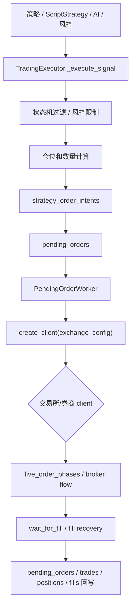
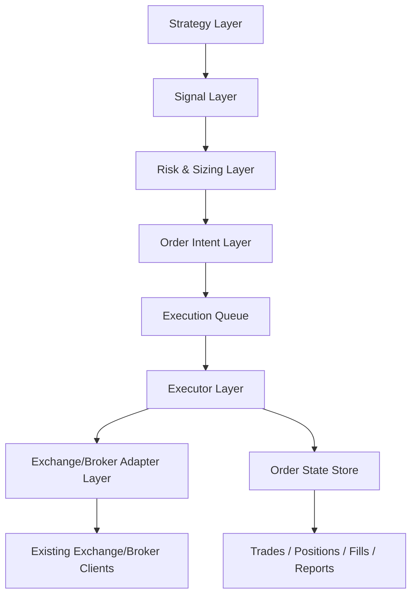
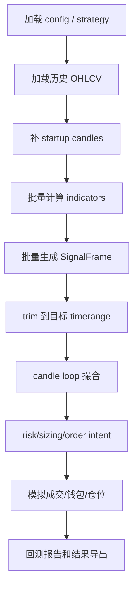
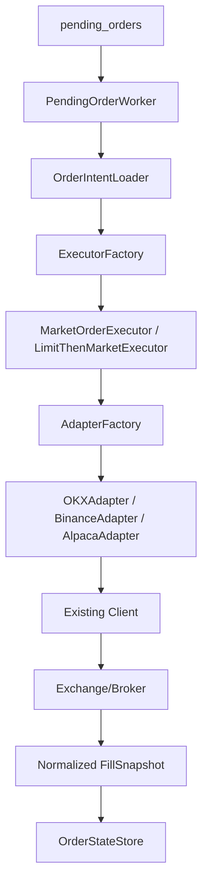
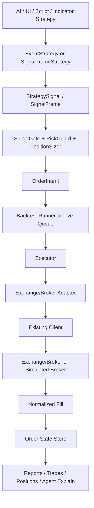

# QuantDinger V2：策略、回测、实盘执行一体化改造方案

> 状态：V2 主路径改造记录。本文档融合了 QuantDinger 当前代码现状、Hummingbot 的执行层思路、Freqtrade 的策略与回测工程化思路，并记录当前已经落地的运行时契约。

## 1. 总结

QuantDinger 当前已经具备一个正确的雏形：

```text
策略/AI/风控产生信号 -> TradingExecutor 过滤和算仓位 -> pending_orders 入队 -> PendingOrderWorker 执行 -> 交易所/券商成交 -> 回写成交和仓位
```

现在要做的不是推倒重来，而是把这套雏形升级成更稳定的 V2：

- 策略层借鉴 Freqtrade：提供标准化策略契约、SignalFrame、向量化回测、未来函数检查、策略加载器。
- 执行层借鉴 Hummingbot：提供 adapter、executor、controller/orchestrator，把交易所差异收到适配器里。
- 保留 QuantDinger 现有优势：AI Agent、ScriptStrategy、`pending_orders`、多交易所 client、实盘 position sync、fill recovery。

一句话：  
V2 要把 QuantDinger 从“能跑的交易系统”升级成“策略、回测、实盘、AI Agent 都走同一套订单语言和执行状态机的交易操作系统”。当前内部运行时只接受 `open_*`、`close_*`、`add_*`、`reduce_*` 这套 canonical signal，不再静默兼容旧别名。

## 2. 当前 QuantDinger 框架分析

### 2.1 当前信号来源

当前系统的信号主要来自四类入口：

1. 指标策略和策略主循环  
   `TradingExecutor` 每个 tick 获取价格、判断条件、过滤重复信号，然后调用 `_execute_signal(...)`。

2. ScriptStrategy  
   `StrategyScriptContext` 暴露了事件式 API：
   - `ctx.buy(...)` / `ctx.sell(...)`
   - `ctx.open_long(...)` / `ctx.close_long(...)`
   - `ctx.open_short(...)` / `ctx.close_short(...)`
   - `ctx.add_long(...)` / `ctx.reduce_long(...)`
   - `ctx.basket(side)` 分层篮子订单

3. 风控触发  
   止损、止盈、移动止损等会生成 `close_*_stop`、`close_*_profit`、`close_*_trailing`。

4. AI 决策  
   旧的执行层 entry AI filter 已删除。后续 AI 决策由策略显式调用统一运行时服务，不允许执行层根据遗留配置暗中拦截开仓。

### 2.2 当前执行链路

核心文件：

- `quantdinger_backend/backend_api_python/app/services/trading_executor.py`
- `quantdinger_backend/backend_api_python/app/services/pending_order_worker.py`
- `quantdinger_backend/backend_api_python/app/services/live_trading/factory.py`
- `quantdinger_backend/backend_api_python/app/services/live_trading/execution.py`
- `quantdinger_backend/backend_api_python/app/services/pending_orders/live_order_phases.py`
- `quantdinger_backend/backend_api_python/app/services/pending_orders/fill_records.py`

当前链路：



### 2.3 当前优点

- 已经有统一信号语言：`open_long`、`close_long`、`open_short`、`close_short`、`add_*`、`reduce_*`。
- 已经有 `pending_orders` 队列，live 模式不是策略线程直接打交易所。
- 已经有 runtime 表：`strategy_runs`、`strategy_order_intents`、`strategy_order_fills`、`strategy_baskets`。
- 已经支持多交易所/券商：OKX、Binance、Bitget、Bybit、Gate、HTX、Kraken、Coinbase、IBKR、Alpaca。
- 已经有 position sync、reduce-only 数量修正、spot sizing、fill recovery。

### 2.4 当前痛点

1. `TradingExecutor` 职责过重  
   它同时负责策略循环、信号过滤、风控、sizing、入队、signal 模拟成交、日志通知。

2. 交易所差异泄漏到公共执行层  
   `live_order_phases.py` 和 `PendingOrderWorker` 中大量使用 `isinstance(client, OkxClient/BinanceFuturesClient/...)` 分支。

3. 订单状态还没有完全统一  
   当前状态散落在 `pending_orders.status`、`strategy_order_intents.status`、`strategy_order_fills`、`qd_strategy_trades`、`qd_strategy_positions` 和交易所真实订单状态中。

4. broker 和 crypto 流程不对称  
   IBKR/Alpaca 在 `PendingOrderWorker` 里走独立方法，和 crypto 的 limit/market phase 不统一。

5. 策略接口不够统一  
   ScriptStrategy 很灵活，但指标型策略、AI 生成策略、回测策略、实盘策略之间还没有一个像 Freqtrade 那样清晰的标准契约。

6. 回测和实盘仍有割裂  
   当前实盘侧已经比较完整，但回测侧还需要加强“同一策略接口、同一信号语言、同一风控和 sizing 解释”。

## 3. 外部项目给我们的启发

### 3.1 Hummingbot 值得学什么

Hummingbot 对我们最有价值的是执行层架构：

- Connector：把交易所差异收进连接器。
- Executor：把订单执行算法独立出来，比如 market、limit、TWAP、position executor。
- Controller/Strategy V2：策略不直接处理交易所细节，而是产生执行动作。
- Orchestrator：统一管理 executor 生命周期。

我们不建议直接引入 Hummingbot 作为内核，因为它会带来运行模型、配置模型、依赖和部署方式的大迁移。更适合借鉴它的思想：

```text
OrderIntent -> Executor -> ExchangeAdapter -> ExchangeClient
```

### 3.2 Freqtrade 值得学什么

Freqtrade 对我们最有价值的是策略和回测工程化：

1. 标准策略接口  
   策略继承 `IStrategy`，实现：
   - `populate_indicators(dataframe, metadata)`
   - `populate_entry_trend(dataframe, metadata)`
   - `populate_exit_trend(dataframe, metadata)`

2. DataFrame 信号列  
   策略不直接下单，而是在 K 线 DataFrame 上生成：
   - `enter_long`
   - `exit_long`
   - `enter_short`
   - `exit_short`
   - `enter_tag`
   - `exit_tag`

3. 回测两阶段  
   先批量计算指标和信号，再进入 candle loop 撮合。这样兼顾 pandas 写策略的便利和回测性能。

4. 历史数据工程化  
   支持 feather/parquet/json，独立 data handler，支持数据下载、增量更新、不同 timeframe。

5. 回测结果可诊断  
   不只是收益率，还有 pair breakdown、enter tag、exit reason、left open trades、summary metrics、signals export。

6. 防未来函数  
   它强调回测时 `populate_*` 会一次拿到完整历史，因此策略要用 `shift()`，不能用未来数据；并提供 lookahead/recursive analysis。

这些非常适合补强 QuantDinger 的回测和策略规范。

### 3.3 Qlib、LEAN、vectorbt、bt 值得学什么

这些项目对 V2/V3 的启发主要在研究和组合层：

- Qlib：值得学习因子、数据集、模型预测、组合回测的研究流水线。
- QuantConnect LEAN：值得学习 Universe、Alpha、Portfolio Construction、Risk、Execution 的分层。
- vectorbt：值得学习矩阵化信号、批量参数实验和高速研究回测。
- bt：值得学习组合再平衡 API，例如选择标的、设置权重、执行 rebalance。
- Alphalens / Riskfolio / PyPortfolioOpt：后续可用于因子评估和组合优化。

这些能力仍不应全部塞进核心执行器。V2 先统一了“策略信号、回测、实盘执行、订单状态”；在此基础上，组合策略主链已经作为独立运行时交付，研究优化能力继续渐进实现。

### 3.4 V2 与 V3 的边界

当前状态：

- V2 单标的执行主链保持稳定。
- 组合策略使用独立 `PortfolioContext`，不把多标的语义塞进 CTA `on_bar`。
- Universe、Factor、TargetWeights、RebalancePlan、组合回测和组合部署首版已经落地。

原因：

- 截面策略需要多标的数据对齐、universe、因子矩阵、目标权重、组合净值、调仓记录、组合归因，工作量大于单标的策略升级。
- 当前最紧急的是统一单标的策略、回测和实盘执行语义，减少后续维护成本。
- 如果 V2 现在强上截面策略，很容易造成回测、实盘、UI、市场审核四条线同时扩张，主线变慢。

订单意图层的组合字段已从预留状态转为实际使用：

```text
SignalFrame
  -> StrategySignal
  -> OrderIntent
  -> TargetPosition / TargetExposure 预留字段
  -> Executor
  -> Adapter
```

V2 可以支持“多 symbol 批量跑单标的策略”和“多 symbol 回测统计”，但这不是截面策略。真正的截面策略定义为：

```text
Universe
  -> Factor Matrix
  -> Cross-sectional Ranking
  -> Target Portfolio / Target Weights
  -> Rebalance Plan
  -> Portfolio Backtest / Portfolio Live
```

这条链路放到 V3。

## 4. V2 总体架构

V2 分成六层：



### 4.1 Strategy Layer

保留两种策略形态：

1. EventStrategy  
   当前 ScriptStrategy 的升级版，适合 AI 生成策略、复杂状态机、网格/马丁/篮子类策略。

   示例：

   ```python
   ctx.open_long(amount=100, reason="breakout")
   ctx.close_long(reason="take_profit")
   ```

2. SignalFrameStrategy  
   借鉴 Freqtrade，适合指标策略、高速回测、多币种筛选。

   示例：

   ```python
   def populate_indicators(df, metadata):
       df["rsi"] = ta.RSI(df)
       return df

   def populate_signals(df, metadata):
       df.loc[df["rsi"] < 30, "enter_long"] = 1
       df.loc[df["rsi"] > 70, "exit_long"] = 1
       return df
   ```

EventStrategy 和 SignalFrameStrategy 最终都输出统一信号。

### 4.2 Signal Layer

新增标准 `SignalFrame` / `StrategySignal`。

推荐字段：

```text
timestamp
strategy_id
strategy_run_id
symbol
market_type
open_long
close_long
open_short
close_short
add_long
add_short
reduce_long
reduce_short
signal_type
amount
quote_amount
price_hint
confidence
reason
enter_tag
exit_tag
source
metadata
```

运行时不再静默转换 `enter_*` / `exit_*` 旧别名。后续无论策略来自 UI、AI、脚本、指标、Webhook，都必须在进入核心运行时之前显式归一化成 canonical signal。

### 4.3 Risk & Sizing Layer

从 `TradingExecutor` 拆出来：

- `SignalGate`：状态机、去重、spot short 拒绝。
- `RiskGuard`：最大持仓、最大日亏损、只允许白名单 symbol、账户风险。
- `PositionSizer`：entry pct、固定 notional、脚本 base qty、quote amount、杠杆。
- AI 决策只允许策略显式调用 `ctx.ai.evaluate()` / `ctx.ask_ai()`；旧的隐式开仓过滤器已删除。回测中 AI 决策明确跳过并记录诊断，实盘中按模型配置、调用预算、缓存、计费和审计执行。

目标是让回测和实盘用同一套解释，不要回测一套 sizing、实盘另一套 sizing。

### 4.4 Order Intent Layer

所有信号最终转换为 `OrderIntent`：

```text
OrderIntent
- strategy_id
- strategy_run_id
- symbol
- market_type
- side: buy/sell
- position_side: long/short/empty
- reduce_only
- order_type: market/limit
- quantity
- quote_amount / notional
- limit_price
- leverage
- margin_mode
- client_order_id
- idempotency_key
- source
- payload
```

`strategy_order_intents` 作为业务意图表继续保留。

组合策略已经实际使用的字段：

```text
- target_weight
- target_notional
- target_position_qty
- rebalance_group_id
- portfolio_id
- universe_id
```

V2 中这些字段只作为模型设计预留或兼容字段，不要求 UI 暴露，也不要求回测中心生成组合调仓。

### 4.5 Execution Queue

继续保留 `pending_orders`。

定位：

- `strategy_order_intents`：我要做什么。
- `pending_orders`：这个意图进入执行队列了。
- `strategy_order_fills`：真实成交明细。
- `qd_strategy_trades`：策略交易流水。
- `qd_strategy_positions`：本地策略仓位快照。

### 4.6 Executor Layer

借鉴 Hummingbot，引入执行器：

1. `MarketOrderExecutor`
2. `LimitThenMarketExecutor`
3. `PositionExecutor`
4. `BasketExecutor`
5. 未来可扩展 `TWAPExecutor`

执行器只处理执行算法，不关心 OKX、Binance、Alpaca 的参数细节。

### 4.7 Exchange/Broker Adapter Layer

新增 adapter，把交易所差异收口：

```text
ExchangeOrderAdapter
- normalize_symbol(intent)
- validate_intent(intent)
- prepare_order(intent)
- place_market_order(intent)
- place_limit_order(intent)
- cancel_order(...)
- wait_for_fill(...)
- query_position(...)
- normalize_error(...)
```

公共执行层不再写：

```text
if isinstance(client, OkxClient):
if isinstance(client, BinanceFuturesClient):
```

这些判断迁移到 adapter factory。

## 5. V2 回测设计

### 5.1 回测目标

回测 V2 要做到：

- 同一套策略接口可用于 backtest/signal/live。
- 同一套 signal 到 order intent 的转换。
- 同一套 sizing/risk 逻辑。
- 支持多 symbol、多 timeframe、startup candles。
- 支持费用、滑点、杠杆、spot/swap、short、止损、止盈、移动止损。
- 输出可诊断报告，而不只是净值曲线。

### 5.2 回测流水线

借鉴 Freqtrade：



### 5.3 SignalFrame 回测模式

对指标策略：

1. 对每个 symbol 加载 DataFrame。
2. 调 `populate_indicators(...)`。
3. 调 `populate_signals(...)`。
4. 输出 `enter_long/exit_long/enter_short/exit_short`。
5. 回测器按 candle 时间推进。

交易假设：

- 默认只用已完成 K 线。
- 信号在 candle close 产生。
- 订单默认在下一根 candle open 成交。
- 如启用 detail timeframe，则在主 K 线内用更小周期模拟止损/止盈/出场。

### 5.4 EventStrategy 回测模式

对当前 `ctx.open_long(...)` 这类脚本：

1. 每根 candle 构造 `ctx`。
2. 执行 `on_bar(ctx, bar)`。
3. `ctx` 收集事件式订单动作。
4. 转成标准 `StrategySignal`。
5. 进入同一套 risk/sizing/order intent/backtest broker。

### 5.5 回测数据层

建议新增或统一：

```text
MarketDataStore
- load_ohlcv(symbol, timeframe, timerange)
- load_trades(symbol, timerange)
- list_available_data()
- download_missing_data()
- convert_format()
```

支持格式：

- feather：默认，速度和体积平衡。
- parquet：适合分析和大数据工具。
- json/json.gz：兼容和可读性。

### 5.6 回测防未来函数

必须加入：

- SignalFrame 策略禁止使用未完成 candle。
- 文档明确要求使用 `shift()` 访问上一根 K 线。
- 提供 lookahead check：把数据截断后重复跑策略，对比同一时间点信号是否变化。
- 提供 recursive check：检测指标值是否受完整数据长度影响而漂移。

这个对 AI 生成策略尤其重要。

### 5.7 回测报告

借鉴 Freqtrade，建议报告至少包括：

- 总收益、年化、最大回撤、夏普、胜率、盈亏比。
- 每个 symbol 的交易统计。
- enter_tag 统计。
- exit_reason 统计。
- rejected signals。
- left open trades。
- 每日/每周/月度 breakdown。
- 手续费和滑点统计。
- signal export。
- trade export。
- equity curve。

## 6. V2 实盘执行设计

实盘沿用当前 `pending_orders + PendingOrderWorker`，但内部重构：



### 6.1 统一订单状态

目标状态机：

```text
intent_created
queued
processing
submitted
partially_filled
filled
cancelled
rejected
failed
deferred
```

状态归属：

- intent 状态写 `strategy_order_intents`。
- 队列任务状态写 `pending_orders`。
- 成交写 `strategy_order_fills`。
- 策略流水写 `qd_strategy_trades`。
- 仓位写 `qd_strategy_positions`。

### 6.2 每个交易所到底哪里不一样

交易所差异确实存在，主要包括：

- symbol 格式：`BTC/USDT`、`BTCUSDT`、`BTC-USDT-SWAP`、`BTC_USDT`。
- 市场类型：spot、swap、futures、stock、crypto broker。
- 下单参数：OKX 的 `tdMode/posSide`，Bitget 的 `productType/marginCoin/holdSide`，Binance spot 的 `quoteOrderQty`。
- 数量单位：base qty、quote amount、contract size。
- 精度规则：tick size、lot size、min qty、min notional、contract value。
- 仓位方向：one-way、hedge、long/short leg。
- 成交查询：有的立刻返回 fill，有的需要 poll，有的要 recovery。
- broker 差异：IBKR/Alpaca 的订单模型和 crypto REST 不同。

V2 的目标不是消灭差异，而是让差异只存在于 adapter。

## 7. AI Agent 在 V2 中的位置

AI Agent 不应直接调用交易所 client。Agent 只能调用工具层：

- `preview_order(intent)`：预览订单、资金占用、最小下单量、风险。
- `create_order_intent(...)`：创建订单意图。
- `enqueue_order(intent_id)`：入队。
- `cancel_pending_order(order_id)`：取消未执行任务。
- `get_positions(...)`：读取仓位。
- `run_backtest(strategy_id, params)`：发起回测。
- `explain_backtest(result_id)`：解释回测结果。

必须有：

- 用户授权。
- live 开关。
- dry-run 优先。
- 审计日志。
- 风控不可绕过。

## 8. V2 开发计划

### 8.1 V2 目标

V2 的目标不是一次性做完所有量化平台能力，而是完成三个地基：

1. 策略信号标准化  
   让 ScriptStrategy、指标策略、AI 生成策略、Webhook 信号最终都落到统一的 `StrategySignal` / `OrderIntent`。

2. 回测与实盘语义统一  
   同一份策略、同一套 sizing/risk、同一种订单意图，在 backtest、signal、live 中尽量用一致解释。

3. 执行层可扩展  
   通过 executor 和 adapter 把交易所差异收口，给后续 TWAP、Basket、Portfolio Rebalance 留位置。

组合扩展当前已交付核心计算与执行链、专属组合结果、仅通知持仓回执以及主要市场交易日历。以下能力仍不属于“已完成”：系统股票池历史成分供应、基准/归因、对冲与借券、组合优化器和生产容量验证。

### 8.2 Phase 0：现状梳理与安全基线

状态：已完成。

任务：

- 更新本文档，明确 V2/V3 边界。
- 梳理当前从策略信号到成交回写的完整链路。
- 梳理 `TradingExecutor`、`pending_orders`、`strategy_order_intents`、`strategy_order_fills`、`qd_strategy_positions` 的字段关系。
- 清理过期说明，例如 `PendingOrderWorker` 顶部仍写 live not implemented。
- V2 主路径直接成为后端运行时主路径，不再以旧路径 fallback 为目标。

验收：

- 团队能讲清楚当前链路和 V2 目标链路。
- 后端全量测试覆盖通过后，新路径作为默认实盘执行主路径。

### 8.3 Phase 1：标准信号层

状态：已完成。

任务：

- 新增 `StrategySignal` / `SignalFrame` 数据模型。
- 统一信号动作：运行时只接受 `open_long`、`close_long`、`open_short`、`close_short`、`add_*`、`reduce_*`。
- 当前 ScriptStrategy 输出直接生成 canonical intent，不再依赖 `action=buy/sell` 的运行时猜测。
- 增加 signal validation：symbol、market type、side、position side、amount、reason、tag。
- 预留 `portfolio_id`、`rebalance_group_id`、`target_weight` 字段，但 V2 不使用。

验收：

- 当前 ScriptStrategy 行为不变。
- 一个最小 SignalFrameStrategy 可以生成标准 signal。
- signal validation 能拒绝明显非法信号。

### 8.4 Phase 2：单标的回测 V2 MVP

状态：已完成主路径。

任务：

- 新增或统一 `BacktestDataStore`。
- 新增 `SignalFrameBacktestRunner`。
- 支持 startup candles。
- 支持 fee、slippage、next-open fill。
- 先支持 market order 模拟。
- 输出 signals、trades、fills、summary。
- 报告支持 symbol breakdown、enter_tag、exit_reason、rejected signals。

验收：

- RSI / Bollinger 示例策略可以完整回测。
- 回测结果可以被前端现有回测中心读取。
- 同一策略在 signal mode 和 backtest mode 的信号解释一致。

### 8.5 Phase 3：Risk 与 Sizing 拆分

状态：已完成核心抽取。

任务：

- 从 `TradingExecutor` 拆出 `SignalGate`。
- 拆出 `PositionSizer`。
- 拆出 `OrderIntentBuilder`。
- `RiskGuard` 的账户级风险控制继续作为后续增强项接入 pipeline。
- 拆出 `SignalModeFillSimulator`。
- 保留当前 `_execute_signal(...)` 作为编排入口，先不大改外部调用。

验收：

- `_execute_signal(...)` 明显变薄。
- 原有策略行为不变。
- sizing、reduce-only、spot short 拒绝和显式 AI 决策契约有单测覆盖。

### 8.6 Phase 4：OrderIntent 与队列统一

状态：已完成主路径。

任务：

- 固化 `OrderIntent` 字段契约。
- 明确 `strategy_order_intents` 与 `pending_orders` 的状态边界。
- 加 idempotency key，避免重复入队和重复下单。
- 统一 intent 状态：created、queued、processing、submitted、filled、cancelled、rejected、failed。
- 保留 `pending_orders`，但主路径已经收束为 `StrategySignal -> OrderIntent -> pending_orders -> Executor -> Adapter`。

验收：

- 同一个信号重复触发不会重复下单。
- dashboard 能追踪 intent 到 pending order 到 fill。
- PendingOrderWorker 继续负责队列和持久化，但下单算法通过 executor / adapter 执行。

### 8.7 Phase 5：Adapter 外壳

状态：已完成主路径。

任务：

- 新增 `live_trading/adapters/base.py`。
- 新增 `OKXAdapter`、`BinanceAdapter`。
- adapter 复用现有 client，不重写 REST。
- 把 symbol、market type、qty、price、precision、error normalization 收进 adapter。
- Worker 主下单路径通过 `LiveOrderPhaseAdapter` 包住现有交易所 client 差异。

验收：

- 现有交易所 client 差异收口到 adapter 包装层。
- 旧 worker 内联下单 phase 不再作为主路径。
- 公共执行层不再新增交易所专属 `isinstance` 分支。

### 8.8 Phase 6：Executor 层

状态：已完成主路径。

任务：

- 新增 `MarketOrderExecutor`，市价单提交后等待标准化 fill snapshot。
- 新增 `LimitThenMarketExecutor`，限价部分成交后取消剩余并用市价补单。
- 统一 `FillSnapshot`。
- 统一 `OrderExecutionResult`。
- 把 `live_order_phases.py` 中的交易所分支逐步迁移到 adapter。
- 保留 fill recovery。

验收：

- OKX/Binance 的 market order 和 limit-first + market tail 行为不退化。
- 订单生命周期在日志和数据库中可追踪。
- fill recovery 仍有效。

### 8.9 Phase 7：回测增强

任务：

- detail timeframe 模拟止损、止盈、移动止损。
- futures funding / mark price 预留或最小支持。
- lookahead analysis。
- recursive analysis。
- 参数优化基础版。
- 回测结果缓存。

验收：

- 回测结果可复现。
- AI 生成策略能被自动检测常见未来函数问题。
- 回测报告足够支撑市场发布审核。

### 8.10 Phase 8：AI Agent 工具层接入

任务：

- Agent 工具只接 order intent、backtest、report，不接交易所 client。
- 加授权、审计、dry-run、live confirmation。
- 接入 V2 回测报告解释。
- Agent 创建 live intent 前必须走 preview 和 risk guard。

验收：

- Agent 可以生成策略、跑回测、解释结果、创建订单意图。
- live 订单必须经过风控和用户授权。
- Agent 不能绕过 V2 执行链路直接碰交易所。

### 8.11 组合扩展的生产入口条件

当前核心代码已启动实现；达到生产可用还必须满足：

- V2 单标的策略回测和实盘语义稳定。
- `StrategySignal -> OrderIntent -> Executor -> Adapter` 链路稳定。
- 回测中心能稳定展示 signals、trades、fills、summary。
- 数据层能可靠批量加载多 symbol OHLCV。
- 因子库至少完成独立查询、预览和代码片段能力。

已新增的核心对象：

- Universe 管理。
- Factor Matrix。
- Cross-sectional Ranking。
- TargetPortfolio / TargetWeights。
- RebalancePlan。
- Portfolio Backtest Broker。
- Portfolio Analytics。
- 组合调仓实盘路径。

仍需完成的生产门槛：

- 系统股票池供应任务及点时历史成分覆盖率告警。
- 交易所日历、节假日、提前收市和数据就绪判定。
- 组合基准、收益归因、行业与因子暴露结果页。
- 仅通知模式的人工成交/持仓回填与差异对账。
- 对冲、借券、保证金、融资成本和多腿原子性控制。
- 大股票池数据缓存、任务队列、限流和故障恢复压测。

## 9. 首批实现建议

建议第一轮不要碰太大：

1. 先加 `SignalFrame` 模型。
2. 写一个 `SignalFrameStrategy` 示例。
3. 做最小回测 runner：OHLCV -> indicators -> signals -> next-open fill -> report。
4. 同时加 OKX/Binance adapter 外壳，但先不完全替换旧实盘路径。
5. 给 V2 加 feature flag。

这样能同时验证 Freqtrade 的策略/回测思路和 Hummingbot 的 adapter/executor 思路，但不会一次性影响当前实盘。

## 10. 不建议做的事

- 不建议直接把 Hummingbot 或 Freqtrade 嵌进 QuantDinger。
- 不建议一次性重写所有交易所。
- 不建议让策略代码知道交易所参数。
- 不建议让 AI Agent 直接碰真实交易所 client。
- 不建议回测和实盘继续各解释一套仓位规则。

## 11. 需要确认的决策

1. V2 第一阶段是否先只支持 crypto？  
   建议：先 OKX + Binance，Alpaca/IBKR 保持旧路径。

2. 策略层是否同时保留 EventStrategy 和 SignalFrameStrategy？  
   建议：保留。前者适合 AI/状态机，后者适合指标/高速回测。

3. 回测成交假设是否采用 Freqtrade 风格？  
   建议：默认信号在 candle close 产生，下一根 candle open 成交；高级模式再支持 detail timeframe。

4. 是否保留 `pending_orders`？  
   建议：保留。它已经接 dashboard、worker、runtime intent。

5. 是否所有 V2 实盘路径必须灰度？  
   当前决策：不再按灰度旧路径推进，V2 作为主路径；上线前通过全量测试和关键交易所小额实盘验证控制风险。

## 12. 最终目标

最终 QuantDinger V2 应该长这样：



这套结构能做到：

- 策略写法更规范。
- 回测更快、更可信、更可诊断。
- 实盘交易所差异更集中。
- AI Agent 有安全边界。
- 当前已有代码可以渐进迁移，不需要推倒重来。
